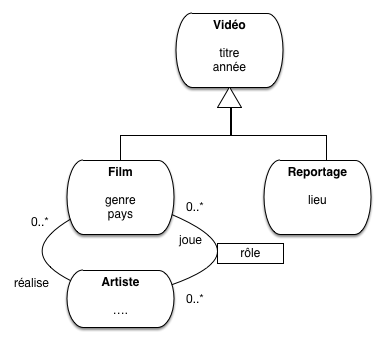
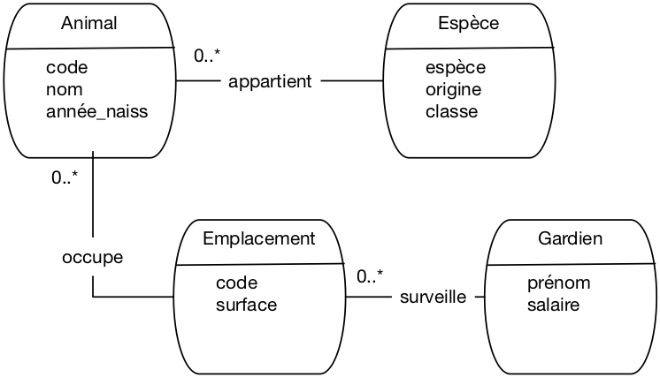

Ce chapitre est consacré la démarche de *conception* d\'une base
relationnelle. L\'objectif de cette conception est de parvenir à un
schéma *normalisé* représentant correctement le domaine applicatif à
conserver en base de données.

La notion de normalisation a été introduite dans le chapitre
`chap-modrel`{.interpreted-text role="ref"}. Elle s\'appuie sur les
notions de dépendances fonctionnelles et de clés. On peut, à l\'aide de
ces notions, caractériser des formes dites \"normales\". Peut-on aller
plus loin et déterminer comment obtenir une forme normale en partant
d\'un ensemble global d\'attributs liés par des dépendances
fonctionnelles? La première session étudie cette question. Comprendre la
normalisation est essentiel pour produire des schémas corrects, viables
sur le long terme.

La détermination des clés, des attributs, de leurs dépendances, relève
d\'une phase de conception. La méthode pratique la plus utilisée est de
produire une notation *entité / association*. Elle ne présente pas de
difficulté technique mais on constate en pratique qu\'elle demande une
certaine expérience parce qu\'on est confronté à un besoin applicatif
pas toujours bien défini, qu\'il est difficile de transcrire dans un
modèle formel. Les sessions suivantes présentent cette approche et des
exemples commentés.

S1: La normalisation
====================

::: {.admonition}
Supports complémentaires:

-   [Diapositives: la
    normalisation](http://sql.bdpedia.fr/files/slnorm.pdf)
-   [Vidéo sur la
    normalisation](https://mdcvideos.cnam.fr/videos/?video=MEDIA180915113944573)
:::

Etant donné un schéma et ses dépendances fonctionnelles, nous savons
déterminer s\'il est normalisé. Peut-on aller plus loin et produire
*automatiquement* un schéma normalisé à partir de l\'ensemble des
attributs et de leurs contraintes (les DFs)?

La décomposition d\'un schéma
-----------------------------

Regardons d\'abord le principe avec un exemple illustrant la
normalisation d\'un schéma relationnel par un processus de décomposition
progressif. On veut représenter l\'organisation d\'un ensemble
d\'immeubles locatifs en appartements, et décrire les informations
relatives aux propriétaires des immeubles et aux occupants de chaque
appartement. Voici un premier schéma de relation :

``` {.sql}
Appart(idAppart, surface, idImmeuble, nbEtages, dateConstruction)
```

Voici les dépendances fonctionnelles. La première montre que la clé est
`idAppart`: tous les autres attributs en dépendent.

$$idAppart \to  surface, idImmeuble, nbEtages, dateConstruction$$

La seconde représente le fait que l\'identifiant de l\'immeuble
détermine fonctionnellement le nombre d\'étages et la date de
construction.

> $$idImmeuble \to nbEtages, dateConstruction$$

Cette relation est-elle normalisée? Non, car la seconde DF montre une
dépendance dont la partie gauche n\'est pas la clé, `idAppart`. En
pratique, une telle relation dupliquerait le nombre d\'étages et la date
de construction autant de fois qu\'il y a d\'appartements dans un
immeuble.

Une idée naturelle est de prendre les dépendances fonctionnnelles
minimales et directes:

$$idAppart \to  surface, idImmeuble$$

et

> $$idImmeuble \to nbEtages, dateConstruction$$

On peut alors créer une table pour chacune. On obtient une décomposition
en deux relations :

``` {.javascript}
Appart(idAppart, surface, idImmeuble)
Immeuble (idImmeuble, nbEtages, dateConstruction)
```

On n\'a pas perdu d\'information: connaissant `idAppart`, je connais
`idImmeuble`, et connaissant `idImmeuble` je connais les attributs de
l\'immeuble: je suis donc en mesure de reconstituer l\'information
initiale. En revanche, j\'ai bien éliminé les redondances: les
propriétés de l\'immeuble ne seront énoncées qu\'une seule fois.

Supposons maintenant qu\'un immeuble puisse être détenu par plusieurs
propriétaires, et considérons la seconde relation suivante,:

``` {.sql}
Proprietaire(idAppart, idPersonne, quotePart)
```

Est-elle normalisée ? Oui car l\'unique dépendance fonctionnelle est

$$idAppart, idPersonne \to  quotePart$$

Un peu de réflexion suffit à se convaincre que ni l\'appartement, ni le
propriétaire ne déterminent à eux seuls la quote-part. Seule
l\'association des deux permet de donner un sens à cette information, et
la clé est donc le couple `(idAppart, idPersonne)`. Maintenant
considérons l\'ajout du nom et du prénom du propriétaire dans la
relation.

``` {.sql}
Propriétaire(idAppart, idPersonne, prénom, nom, quotePart)
```

La dépendance fonctionnelle $idPersonne \to prénom, nom$ indique que
cette relation n\'est pas normalisée. En appliquant la même
décomposition que précédemment, on obtient le bon schéma :

``` {.javascript}
Propriétaire(idAppart, idPersonne, quotePart)
Personne(idPersonne, prénom, nom)
```

Voyons pour finir le cas des occupants d\'un appartement, avec la
relation suivante.

``` {.sql}
Occupant(idPersonne, nom, prénom, idAppart, surface)
```

On mélange clairement des informations sur les personnes, et d\'autres
sur les appartements. Plus précisément, la clé est la paire
`(idPersonne, idAppart)`, mais on a les dépendances suivantes :

> -   $idPersonne \to prénom, nom$
> -   $idAppart \to surface$

Un premier réflexe pourrait être de décomposer en deux relations
`Personne(idPersonne, prénom, nom)` et `Appart (idAppart, surface)`.
Toutes deux sont normalisées, mais on perd alors une information
importante, et même essentielle : le fait que telle personne occupe tel
appartement. Cette information est représentée par la clé
`(idPersonne, idAppart)`. On la préserve en créant une relation
`Occupant (idPersonne, idAppart)`. D\'où le schéma final :

``` {.javascript}
Immeuble (idImmeuble, nbEtages, dateConstruction)
Proprietaire(idAppart, idPersonne, quotePart)
Personne (idPersonne, prénom, nom)
Appart (idAppart, surface, idImmeuble)
Occupant (idPersonne, idAppart)
```

Ce schéma, obtenu par décompositions successives, présente la double
propriété

> -   de ne pas avoir perdu d\'information par rapport à la version
>     initiale;
> -   de ne contenir que des relations normalisées.

::: {.important}
::: {.title}
Important
:::

L\'absence de perte d\'information est une notion qui est survolée ici
mais qui est de fait essentielle. Maintenant que nous connaissons SQL,
elle est facile à comprendre: l\'opération inverse de la décomposition
est la *jointure*, effectuée entre la clé primaire d\'une table et la
clé étrangère référençant cette table. Cette opération reconstitue les
données *avant* décomposition, et elle est tellement *naturelle* qu\'il
existe un opérateur algébrique de ce nom, par exemple:

``` {.sql}
select *
from Appart natural join Immeuble
```

La décomposition d\'une table $T$ en plusieurs tables
$T_1, T_2, \cdots, T_n$ est sans perte d\'information quand on peut
reconstituer $T$ avec des jointures
$T_1  \Join T_2  \Join \cdots \Join T_n$.
:::

Et voilà. C\'est cohérent, simple et élégant.

Algorithme de normalisation
---------------------------

Voici en résumé la procédure de normalisation par décomposition.

::: {.admonition}
Algorithme de normalisation

On part d\'un schéma de relation $R$, et on suppose donné l\'ensemble
des dépendances fonctionnelles minimales et directes sur $R$.

On détermine alors les clés de $R$, et on applique la décomposition:

> -   Pour chaque DF minimale et directe $X \to A_1, \cdots A_n$ on crée
>     une relation $(X, A_1, \cdots A_n)$ de clé $X$
> -   Pour chaque clé $C$ non représentée dans une des relations
>     précédentes, on crée une relation $(C)$ de clé $C$.
>
> On obtient un schéma de base de données normalisé et sans perte
> d\'information.
:::

Nous disposons donc d\'une approche algorithmique pour obtenir un schéma
normalisé à partir d\'un ensemble initial d\'attributs. Cette approche
est fondamentalement instructive sur l\'objectif à atteindre et la
méthode conceptuelle pour y parvenir.

Elle est malheureusement difficilement utilisable telle quelle à cause
d\'une difficulté rencontrée en pratique: l\'absence ou la rareté de
dépendances fonctionnelles \"naturelles\". Celles présentes dans notre
schéma ont été artificiellement créées par ajout d\'identifiants pour
les immeubles, les occupants et les appartements. Dans la vraie vie, de
tels identifiants n\'existent pas si l\'on n\'a pas au préalable
déterminé les \"entités\" présentes dans le schéma: *Immeuble*,
*Occupant*, et *Appartement*. En d\'autres termes, l\'exemple qui
précède s\'appuie sur une forme de connaissance préalable qui guide à
l\'avance la décomposition.

La normalisation doit donc être intégrée à une approche plus globale qui
\"injecte\" des dépendances fonctionnelles dans un schéma par
identification préalable des entités (les appartements, les immeubles)
et des contraintes qu\'elles imposent. Le schéma est alors obtenu par
application de l\'algorithme.

Une approche globale
--------------------

Reprenons notre table des films pour nous confronter à une situation
réaliste. Rappelons les quelques attributs considérés.

``` {.sql}
(titre, année, prénomMes, nomMES, annéeNaiss)
```

La triste réalité est qu\'on ne trouve aucune dépendance fonctionnelle
dans cet ensemble d\'attributs. Le titre d\'un film ne détermine rien
puisqu\'il y a évidemment des films différents avec le même titre,
Eventuellement, la paire [(titre, année)]{.title-ref} pourrait
déterminer de manière univoque un film, mais un peu de réflexion suffit
à se convaincre qu\'il est très possible de trouver deux films
différents avec le même titre la même année. Et ainsi de suite: le nom
du réalisateur ou même la paire [(prénom, nom)]{.title-ref} sont des
candidats très fragiles pour définir des dépendances fonctionnelles. En
fait, on constate qu\'il est très rare en pratique de trouver des DFs
\"naturelles\" sur lesquelles on peut solidement s\'appuyer pour définir
un schéma.

Il nous faut donc une démarche préalable consistant à créer
*artificiellement* des DFs parmi les ensembles d\'attributs. La
connaissance des identifiants d\'appartement, d\'immeuble et de personne
dans notre exemple précédent correspondait à une telle pré-conception:
tous les attributs de, respectivement, *Immeuble*, *Appartement* et
*Personne*, dépendent fonctionnellement, par construction, de leurs
identifiants respectifs, ajoutés au schéma.

Comment trouve-t-on ces identifiants? Par une démarche consistant à:

> -   déterminer les \"entités\" (immeuble, personne, appartement, ou
>     film et réalisateur) pertinents pour l\'application;
> -   définir une méthode *d\'identification* de chaque entité; en
>     pratique on recourt à la définition d\'un *identifiant* artificiel
>     (il n\'a aucun rôle descriptif) qui permet d\'une part de
>     s\'assurer qu\'une même \"entité\" est représentée une seule fois,
>     d\'autre part de référencer une entité par son identifiant.
> -   définir les liens entre les entités.

Voici une illustration informelle de la méthode, que nous reprendrons
ensuite de manière plus détailée avec la notation Entité/association.

Commençons par les deux premières étapes. Quelles sont nos entités ? On
va décider (il y a dans le processus de conception une part de choix,
c\'est sa fragilité) que nous avons des entités `Film` et des entités
`Réalisateur`. Cela revient à ajouter des identifiants `idFilm` et
`idRéalisateur` dans le schéma.

``` {.sql}
(idFilm, titre, année, idRéalisateur, prénom, nom, annéeNaiss)
```

avec les dépendances directes et minimales suivantes:

$$idFilm \to titre, année, idRéalisateur$$

et

$$idRéalisateur \to prénom, nom, annéeNaiss$$

::: {.important}
::: {.title}
Important
:::

Le choix de l\'identifiant est un sujet délicat. On peut arguer en effet
que l\'identifiant devrait être recherché dans les attributs existants,
au lieu d\'en créer un artificiellement. Pour des raisons qui tiennent à
la rareté/fragilité des DFs \"naturelles\", la création de
l\'identifiant artificiel est la seule réellement applicable et
satisfaisante dans tous les cas.
:::

À partir de là, il reste à appliquer l\'algorithme de normalisation. On
obtient une table `Film (idFilm, titre, année, idRéalisateur)` avec une
clé primaire et une clé étrangère, et une table
`Réalisateur (idRéalisateur, nom, prénom, annéeeNaiss)`.

::: {.important}
::: {.title}
Important
:::

Il faut veiller à ce que les schémas obtenus soient normalisés. C\'est
le cas ici puisque les seules DF sont celles issues de l\'identifiant.
:::

Voici un exemple pour la table des réalisateurs:

  -------------------------------
  idRéalisateur   titre   année
  --------------- ------- -------

  -------------------------------

Et pour la table des Films:

  ----------------------------------------
  idFilm   titre   année   idRéalisateur
  -------- ------- ------- ---------------

  ----------------------------------------

::: {.note}
::: {.title}
Note
:::

La valeur d\'un identifiant est locale à une table. On ne peut pas
trouver deux fois la même valeur d\'identifiant dans une même table,
mais rien n\'interdit qu\'elle soit présente dans deux tables
différentes. On aurait donc pu \"numéroter\" les réalisateurs 1, 2, 3,
\..., comme pour les films. Ici, nous leur avons donné des identifiants
101, 102, \..., pour clarifier les explications.
:::

Cette représentation est correcte. Il n\'y a pas de redondance des
attributs descriptifs, donc toute mise à jour affecte l\'unique
occurrence de la donnée à modifier. D\'autre part, on peut détruire un
film sans affecter les informations sur le réalisateur. La décomposition
n\'a pas pour contrepartie une perte d\'information puisque
l\'information initiale (autrement dit, *avant* la décomposition en deux
tables) peut être reconstituée intégralement. En prenant un film, on
obtient l\'identifiant de son metteur en scène, et cette identifiant
permet de trouver *l\'unique* ligne dans la table des réalisateurs qui
contient toutes les informations sur ce metteur en scène. Ce processus
de reconstruction de l\'information, dispersée dans plusieurs tables,
peut s\'exprimer avec la jointure.

Tout est dit. En maîtrisant la normalisation relationnelle et
l\'interrogation relationnelle, vous maîtrisez les deux méthodes
fondamentales pour la création de bases de données.

Quiz
----

::: {.eqt}
conc1-1

Si on me donne un ensemble de dépendances fonctionnelles, est-il
possible d'obtenir un schéma relationnel normalisé

A)  `I`{.interpreted-text role="eqt"} Non, il manque des informations
B)  `C`{.interpreted-text role="eqt"} Oui, en appliquant l'algorithme de
    normalisation
C)  `I`{.interpreted-text role="eqt"} Cela dépend, il faut étudier au
    cas par cas
:::

::: {.eqt}
conc1-2

La décomposition consiste à répartir le contenu d\'une table initiale en
plusieurs tables. Qu\'est-ce qu\'une décomposition sans perte
d\'information (SPI)

A)  `I`{.interpreted-text role="eqt"} Une décomposition dans laquelle on
    n\'a oublié aucun attribut
B)  `C`{.interpreted-text role="eqt"} Une décomposition dont la table
    initiale peut être reconstruite par des jointures
C)  `I`{.interpreted-text role="eqt"} Une décomposition dans laquelle au
    moins une des tables contient toutes les clés.
:::

::: {.eqt}
conc1-3

Supposons que l\'on décide qu\'il ne peut y avoir qu\'un propriétaire
pour un appartement, autrement dit une DF $idAppart \to idPersonne$.
Quelles affirmations sont vraies ?

A)  `I`{.interpreted-text role="eqt"} Il devient inutile de décomposer
    la relation `Propriétaire`
B)  `C`{.interpreted-text role="eqt"} Nous n\'avons plus besoin de table
    `Propriétaire`, car l\'identifiant du propriétaire devient un
    attribut de `Appart`
C)  `I`{.interpreted-text role="eqt"} Cela n\'entraîne aucun changement
:::

::: {.eqt}
conc1-4

La seconde règle de l\'algorithme de normalisation crée une relation
pour les clés `C` non représentées. Quelle explication de cette règle
vous semble correcte?

A)  `I`{.interpreted-text role="eqt"} Ces clés représentent des objets
    ou concepts oubliés par la conception
B)  `I`{.interpreted-text role="eqt"} Parce qu\'à chaque clé correspond
    une relation, et réciproquement
C)  `C`{.interpreted-text role="eqt"} Cette règle permet de représenter
    un concept, un objet ou un lien sans attribut descriptif, et donc
    sans dépendance fonctionnelle
:::

::: {.eqt}
conc1-5

Que se passe-t-il si on a des dépendances A -\> B, C, D et D -\> A, B, C
?

A)  `I`{.interpreted-text role="eqt"} On crée deux relations, l'une avec
    clé A, l'autre avec clé D
B)  `I`{.interpreted-text role="eqt"} On crée une relation avec deux
    clés primaires
C)  `C`{.interpreted-text role="eqt"} On crée une relation et on choisit
    A ou D comme clé primaire
:::

::: {.eqt}
conc1-6

Que se passe-t-il si on a une relation ABCD et des dépendances A -\> B
et C -\> D ?

A)  `I`{.interpreted-text role="eqt"} On crée une relation ABCD de clé
    AC
B)  `C`{.interpreted-text role="eqt"} On crée trois relations AB, CD et
    AC, de clés respectives A, C et AC
C)  `I`{.interpreted-text role="eqt"} On crée deux relations AB et CD,
    de clés respectives A et C
:::

S2: Le modèle Entité-Association
================================

::: {.admonition}
Supports complémentaires:

-   [Diapositives: le modèle entité /
    association](http://sql.bdpedia.fr/files/slea.pdf)
-   [Vidéo sur le modèle entité /
    association](https://mdcvideos.cnam.fr/videos/?video=MEDIA180915114054654)
:::

Cette session présente une méthode complète pour aboutir à un schéma
relationnel normalisé. Complète ne veut pas dire infaillible: *aucune*
méthode ne produit automatiquement un résultat correct, puisqu\'elle
repose sur un processus d\'analyse et d\'identification des entités dont
rien ne peut garantir la validité par rapport à un besoin souvent
insuffisamment précis.

Le modèle Entité/Association (E/A) propose essentiellement une notation
pour soutenir la démarche de conception de schéma présentée
précédemment. La notation E/A a pour caractéristiques d\'être simple et
suffisamment puissante pour modéliser des structures relationnelles. De
plus, elle repose sur une représentation graphique qui facilite sa
compréhension.

Le schéma de la base *Films*
----------------------------

La présentation qui suit est délibérement axée sur l\'utilité du modèle
E/A dans le cadre de la conception d\'une base de données. Ajoutons
qu\'il ne s\'agit pas directement de *concevoir* un schéma E/A (voir un
cours sur les systèmes d\'information), mais d\'être capable de le
comprendre et de l\'interpréter. Nous reprenons l\'exemple d\'une base
de données décrivant des films, avec leur metteur en scène et leurs
acteurs, ainsi que les cinémas où passent ces films. Nous supposerons
également que cette base de données est accessible sur le Web et que des
internautes peuvent noter les films qu\'ils ont vus.

La méthode permet de distinguer les *entités* qui constituent la base de
données, et les *associations* entre ces entités. Un schéma E/A décrit
l\'application visée, c\'est-à-dire une *abstraction* d\'un domaine
d\'étude, pertinente relativement aux objectifs visés. Rappelons qu\'une
abstraction consiste à choisir certains aspects de la réalité perçue (et
donc à éliminer les autres). Cette sélection se fait en fonction de
certains *besoins*, qui doivent être précisément définis, et rélève
d\'une démarche d\'analyse qui n\'est pas abordée ici.

> Le schéma E/A des films

Par exemple, pour notre base de données *Films*, on n\'a pas besoin de
stocker dans la base de données l\'intégralité des informations
relatives à un internaute, ou à un film. Seules comptent celles qui sont
importantes pour l\'application. Voici le schéma décrivant cete base de
données *Films* (figure `ea-films`{.interpreted-text role="numref"}).
Sans entrer dans les détails pour l\'instant, on distingue

> -   des *entités*, représentées par des rectangles, ici *Film*,
>     *Artiste*, *Internaute* et *Pays* ;
> -   des *associations* entre entités représentées par des liens entre
>     ces rectangles. Ici on a représenté par exemple le fait qu\'un
>     artiste *joue* dans des films, qu\'un internaute *note* des films,
>     etc.

Chaque entité est caractérisée par un ensemble d\'attributs, parmi
lesquels un ou plusieurs forment l\'identifiant unique (en gras). Il est
essentiel de dire ce qui caractérise de manière unique une entité, de
manière à éviter la redondance d\'information. Comme nous l\'avons
préconisé précédemment, un attribut non-descriptif a été ajouté à chaque
entité, indépendamment des attributs \"descriptifs\". Nous l\'avons
appelé **id** pour *Film* et *Artiste*, **code** pour le pays. Le nom de
l\'attribut-identifiant est peu important, même si la convention **id**
est très répandue.

Seule exception: les internautes sont identifiés par un de leurs
attributs descriptifs, leur adresse de courrier électronique. Même s\'il
s\'agit en apparence d\'un choix raisonnable (unicité de l\'email pour
identifier une personne), ce cas nous permettra d\'illustrer les
problèmes qui peuvent quand même se poser.

Les associations sont caractérisées par des *cardinalités*. La notation
0..\* sur le lien *Réalise*, du côté de l\'entité *Film*, signifie
qu\'un artiste peut réaliser plusieurs films, ou aucun. La notation 0..1
du côté *Artiste* signifie en revanche qu\'un film ne peut être réalisé
que par au plus un artiste. En revanche dans l\'association *Donne une
note*, un internaute peut noter plusieurs films, et un film peut être
noté par plusieurs internautes, ce qui justifie l\'a présence de 0..\*
aux deux extrêmités de l\'association.

Le choix des cardinalités est *essentiel*. Ce choix est aussi parfois
discutable, et constitue donc l\'un des aspects les plus délicats de la
modélisation. Reprenons l\'exemple de l\'association *Réalise*. En
indiquant qu\'un film est réalisé par *un seul* metteur en scène, on
s\'interdit les \-- pas si rares \-- situations où un film est réalisé
par plusieurs personnes. Il ne sera donc pas possible de représenter
dans la base de données une telle situation. Tout est ici question de
choix et de compromis : est-on prêt en l\'occurrence à accepter une
structure plus complexe (avec 0..\* de chaque côté) pour l\'association
*Réalise*, pour prendre en compte un nombre minime de cas ?

Les cardinalités sont notées par deux chiffres. Le chiffre de droite est
la *cardinalité maximale*, qui vaut en général 1 ou \*. Le chiffre de
gauche est la cardinalité minimale. Par exemple la notation 0..1 entre
*Artiste* et *Film* indique qu\'on s\'autorise à ne pas connaître le
metteur en scène d\'un film. Attention : cela ne signifie pas que ce
metteur en scène n\'existe pas. Une base de données, telle qu\'elle est
décrite par un schéma E/A, ne prétend pas donner une vision exhaustive
de la réalité. On ne doit surtout pas chercher à *tout* représenter,
mais s\'assurer de la prise en compte des besoins de l\'application.

La notation 1..1 entre *Film* et *Pays* indique au contraire que l\'on
doit toujours connaître le pays producteur d\'un film. On devra donc
interdire le stockage dans la base d\'un film sans son pays.

Les cardinalités minimales sont moins importantes que les cardinalités
maximales, car elles ont un impact limité sur la structure de la base de
données et peuvent plus facilement être remises en cause après coup. Il
faut bien être conscient de plus qu\'elles ne représentent qu\'un choix
de conception, souvent discutable. Dans la notation UML que nous
présentons ici, il existe des notations abrégées qui donnent des valeurs
implicites aux cardinalités minimales :

> -   La notation \* est équivalente à 0..\* ;
> -   la notation 1 est équivalente à 1..1 .

Outre les propriétés déjà évoquées (simplicité, clarté de lecture),
évidentes sur ce schéma, on peut noter aussi que la modélisation
conceptuelle est totalement indépendante de tout choix d\'implantation.
Le schéma de la figure `ea-films`{.interpreted-text role="ref"} ne
spécifie aucun système en particulier. Il n\'est pas non plus question
de type ou de structure de données, d\'algorithme, de langage, etc. En
principe, il s\'agit donc de la partie la plus stable d\'une
application. Le fait de se débarrasser à ce stade de la plupart des
considérations techniques permet de se concentrer sur l\'essentiel : que
veut-on stocker dans la base ?

Une des principales difficultés dans le maniement des schémas E/A est
que la qualité du résultat ne peut s\'évaluer que par rapport à une
demande qui est difficilement formalisable. Il est donc souvent
difficile de mesurer (en fonction de quels critères et quelle métrique
?) l\'adéquation du résultat au besoin. Peut-on affirmer par exemple que
:

> -   *toutes* les informations nécessaires sont représentées ?
> -   qu\'un film ne sera *jamais* réalisé par plus d\'un artiste ?

Il faut faire des choix, en connaissance de cause, en sachant toutefois
qu\'il est toujours possible de faire évoluer une base de données, quand
cette évolution n\'implique pas de restructuration trop importante. Pour
reprendre les exemples ci-dessus, il est facile d\'ajouter des
informations pour décrire un film ou un internaute ; il serait beaucoup
plus difficile de modifier la base pour qu\'un film passe de un, et un
seul, réalisateur, à plusieurs. Quant à changer l\'identifiant de la
table *Internaute*, c\'est une des évolutions les plus complexes à
réaliser. Les cardinalités et le choix des clés font vraiment partie des
aspects décisifs des choix de conception.

Entités, attributs et identifiants
----------------------------------

Il est difficile de donner une définition très précise des entités. Les
points essentiels sont résumés par la définition ci-dessous.

::: {.admonition}
Définition: Entités

On désigne par *entité* toute unité d\'information *identifiable* et
*pertinente* pour l\'application.
:::

La notion d\'unité d\'information correspond au fait qu\'une entité ne
peut pas se décomposer sans perte de sens. Comme nous l\'avons vu
précédemment, *l\'identité* est primordiale. C\'est elle qui permet de
distinguer les entités les unes des autres, et donc de dire qu\'une
information est redondante ou qu\'elle ne l\'est pas. Il est
indispensable de prévoir un moyen technique pour pouvoir effectuer cette
distinction entre entités au niveau de la base de données : on parle
*d\'identifiant* ou (dans un contexte de base de données) de *clé*.
Reportez-vous au chapitre `chap-modrel`{.interpreted-text role="ref"}
pour une définition précise de cette notion.

La pertinence est également importante : on ne doit prendre en compte
que les informations nécessaires pour satisfaire les besoins. Par
exemple :

> -   le film *Impitoyable* ;
> -   l\'acteur *Clint Eastwood* ;

sont des entités pour la base *Films*.

La première étape d\'une conception consiste à identifier les entités
utiles. On peut souvent le faire en considérant quelques cas
particuliers. La deuxième est de regrouper les entités en ensembles : en
général on ne s\'intéresse pas à un individu particulier mais à des
groupes. Par exemple il est clair que les films et les acteurs
constituent des ensembles distincts d\'entités. Qu\'en est-il de
l\'ensemble des réalisateurs et de l\'ensemble des acteurs ? Doit-on les
distinguer ou les assembler ? Il est certainement préférable de les
assembler, puisque des acteurs peuvent aussi être réalisateurs.

**Attributs**

Les entités sont caractérisées par des *attributs* (ou *propriétés*): le
titre (du film), le nom (de l\'acteur), sa date de naissance,
l\'adresse, etc. Le choix des attributs relève de la même démarche
d\'abstraction qui a dicté la sélection des entités : il n\'est pas
nécéssaire de donner exhaustivement tous les attributs d\'une entité. On
ne garde que ceux utiles pour l\'application.

Un attribut est désigné par un *nom* et prend sa valeur dans un domaine
comme les entiers, les chaînes de caractères, les dates, etc.

Un attribut peut prendre une valeur et une seule. On dit que les
attributs sont *atomiques*. Il s\'agit d\'une restriction importante
puisqu\'on s\'interdit, par exemple, de définir un attribut *téléphones*
d\'une entité *Personne*, prenant pour valeur *les* numéros de téléphone
d\'une personne. Cette restricion est l\'une des limites du modèle
relationnel, qui mène à la multiplication des tables par le mécanisme de
normalisation dérit en début de chapitre. Pour notre exemple, il
faudrait par exemple définir une table dédiée aux numéros de téléphone
et associée aux personnes.

::: {.note}
::: {.title}
Note
:::

Certaines méthodes admettent l\'introduction de constructions plus
complexes :

-   les *attributs multivalués* sont constitués d\'un *ensemble* de
    valeurs prises dans un même domaine ; une telle construction permet
    de résoudre le problème des numéros de téléphones multiples ;
-   les *attributs composés* sont constitués par agrégation d\'autres
    atributs ; un attribut *adresse* peut par exemple être décrit comme
    l\'agrégation d\'un code postal, d\'un numéro de rue, d\'un nom de
    rue et d\'un nom de ville.

Cette modélisation dans le modèle conceptuel (E/A) doit pouvoir être
transposée dans la base de données. Certains systèmes relationnels
(PostgreSQL par exemple) autorisent des attributs complexes. Une autre
solution est de recourir à d\'autres modèles, semi-structurés ou objets.
:::

Nous nous en tiendrons pour l\'instant aux attributs atomiques qui, au
moins dans le contexte d\'une modélisation orientée vers un SGBD
relationnel, sont suffisants.

Types d\'entités
----------------

Il est maintenant possible de décrire un peu plus précisément les
entités par leur *type*.

::: {.admonition}
Définition: Type d\'entité

Le type d\'une entité est composé des éléments suivants :

> -   son nom ;
> -   la liste de ses attributs avec, \-- optionnellement \--le domaine
>     où l\'attribut prend ses valeurs : les entiers, les chaînes de
>     caractères ;
> -   l\'indication du (ou des) attribut(s) permettant d\'identifier
>     l\'entité : ils constituent la *clé*.
:::

On dit qu\'une entité *e* est une *instance* de son type *E*. Enfin, un
ensemble d\'entités $\{e_1, e_2, \ldots e_n\}$, instances d\'un même
type $E$ est une *extension* de $E$.

Rappelons maintenant la notion de clé, pratiquement identique à celle
énoncée pour les schémas relationnels.

::: {.admonition}
Définition: clé

Soit $E$ un type d\'entité et $A$ l\'ensemble des attributs de $E$. Une
*clé* de $E$ est un sous-ensemble *minimal* de $A$ permettant
d\'identifier de manière unique une entité parmi n\'importe quelle
extension de $E$.
:::

Prenons quelques exemples pour illustrer cette définition. Un internaute
est caractérisé par plusieurs attributs : son email, son nom, son
prénom, la région où il habite. L\'adresse mail constitue une clé
naturelle puisqu\'on ne trouve pas, en principe, deux internautes ayant
la même adresse électronique. En revanche l\'identification par le nom
seul paraît impossible puisqu\'on constituerait facilement un ensemble
contenant deux internautes avec le même nom. On pourrait penser à
utiliser la paire `(nom,prénom)`, mais il faut utiliser avec modération
l\'utilisation d\'identifiants composés de plusieurs attributs. Quoique
possible, elle peut poser des problèmes de performance et complique les
manipulations par SQL.

Il est possible d\'avoir plusieurs clés candidates pour un même ensemble
d\'entités. Dans ce cas on en choisit une comme *clé principale* (ou
primaire), et les autres comme clés secondaires. Le choix de la clé
(primaire) est déterminant pour la qualité du schéma de la base de
données. Les caractéristiques d\'une bonne clé primaire sont les
suivantes :

> -   elle désigne sans ambiguité une et une seule entité dans toute
>     extension;
> -   sa valeur est connue pour toute entité ;
> -   on ne doit jamais avoir besoin de la modifier ;
> -   enfin, pour des raisons de performance, sa taille de stockage doit
>     être la plus petite possible.

Il est très difficile de trouver un ensemble d\'attributs satisfaisant
ces propriétés parmi les attributs descriptifs d\'une entité.
Considérons l\'exemple des films. Le choix du titre pour identifier un
film serait incorrect puisqu\'on aura affaire un jour ou l\'autre à deux
films ayant le même titre. Même en combinant le titre avec un autre
attribut (par exemple l\'année), il est difficile de garantir
l\'unicité.

Le choix de l\'adresse électronique (email) pour un internaute semble
respecter ces conditions, du moins la première (unicité). Mais peut-on
vraiment garantir que l\'email sera connu au moment de la création de
l\'entité? De plus, il semble clair que cette adresse peut changer, ce
qui va poser de gros problèmes puisque la clé, comme nous le verrons,
sert à référencer une entité. Changer l\'identifiant de l\'entité
implique donc de changer *aussi* toutes les références. La conclusion
s\'impose: ce choix d\'identifiant est un mauvais choix, il posera à
terme des problèmes pratiques.

Insistons: la seule solution saine et générique consiste à créer un
identifiant artificiel, indépendant de tout autre attribut. On peut
ainsi ajouter dans le type d\'entité *Film* un attribut `id`,
corespondant à un numéro séquentiel qui sera incrémenté au fur et à
mesure des insertions. Ce choix est de fait le meilleur, dès lors qu\'un
attribut ne respecte pas les conditions ci-dessus (autrement dit,
toujours). Il satisfait ces conditions: on peut toujours lui attribuer
une valeur, il ne sera jamais nécessaire de la modifier, et elle a une
représentation compacte.

On représente graphiquement un type d\'entité comme sur la
`entite`{.interpreted-text role="numref"} qui donne l\'exemple des types
*Internaute* et *Film*. L\'attribut (ou les attributs s\'il y en a
plusieurs) formant la clé sont en gras.

> Représentation des types d\'entité

Il est important de bien distinguer *types d\'entités* et *entités*. La
distinction est la même qu\'entre entre *type* et *valeur* dans un
langage de programmation, ou *schéma* et *base* dans un SGBD.

Associations binaires
---------------------

La représentation (et le stockage) d\'entités indépendantes les unes des
autres est de peu d\'utilité. On va maintenant décrire les *relations*
(ou *associations*) entre des ensembles d\'entités.

::: {.admonition}
Définition: association

Une association binaire entre les ensembles d\'entités $E_1$ et $E_2$
est un ensemble de couples $(e_1, e_2)$, avec $e_1 \in E_1$ et
$e_2 \in E_2$.
:::

C\'est la notion classique, ensembliste, de relation. On emploie plutôt
le terme d\'association pour éviter toute confusion avec le modèle
relationnel. Une bonne manière d\'interpréter une association entre des
ensembles d\'entités est de faire un petit graphe où on prend quelques
exemples, les plus généraux possibles.

> Association entre deux ensembles

Prenons l\'exemple de l\'association représentant le fait qu\'un
réalisateur met en scène des films. Sur le graphe de la
`graphe-ea`{.interpreted-text role="numref"} on remarque que :

> -   certains réalisateurs mettent en scène plusieurs films ;
> -   inversement, un film est mis en scène par au plus un réalisateur.

La recherche des situations les plus générales possibles vise à
s\'assurer que les deux caractéristiques ci-dessus sont vraies dans tout
les cas. Bien entendu on peut trouver *x* % des cas où un film a
plusieurs réalisateurs, mais la question se pose alors : doit-on
modifier la structure de notre base, pour *x* % des cas. Ici, on a
décidé que non. Encore une fois on ne cherche pas à représenter la
réalité dans toute sa complexité, mais seulement la partie de cette
réalité que l\'on veut stocker dans la base de données.

Ces caractéristiques sont essentielles dans la description d\'une
association entre des ensembles d\'entités.

Les cardinalités maximales sont plus importantes que les cardinalités
minimales ou, plus précisément, elles s\'avèrent beaucoup plus
difficiles à remettre en cause une fois que le schéma de la base est
constitué. On décrit donc souvent une association de manière abrégée en
omettant les cardinalités minimales. La notation *\** en UML, est
l\'abréviation de *0..\**, et *1* est l\'abréviation de *1..1*. On
caractérise également une association de manière concise en donnant les
cardinalités maximales aux deux extrêmités, par exemple *1:\**
(association de un à plusieurs) ou *\*:\** (association de plusieurs à
plusieurs).

Les cardinalités minimales sont parfois désignées par le terme
*contraintes de participation*. La valeur 0 indique qu\'une entité peut
ne pas participer à l\'association, et la valeur 1 qu\'elle doit y
participer.

Insistons sur le point suivant : *les cardinalités n\'expriment pas une
vérité absolue, mais des choix de conception*. Elles ne peuvent être
déclarés valides que relativement à un besoin. Plus ce besoin sera
exprimé précisément, et plus il sera possible d\'appécier la qualité du
modèle.

Il existe plusieurs manières de noter une association entre types
d\'entités. Nous utilisons ici la notation de la méthode UML. En France,
on utilise aussi couramment \-- de moins en moins \-- la notation de la
méthode MERISE que nous ne présenterons pas ici.

> Représentation de l\'association

Dans la notation UML, on indique les cardinalités aux deux extrêmités
d\'un lien d\'association entre deux types d\'entités $T_A$ et $T_B$.
Les cardinalités pour $T_A$ sont placées à l\'extrémité du lien allant
de $T_A$ à $T_B$ et les cardinalités pour $T_B$ sont l\'extrémité du
lien allant de $T_B$ à $T_A$.

Pour l\'association entre *Réalisateur* et *Film*, cela donne
l\'association de la `assoc`{.interpreted-text role="numref"}. Cette
association se lit *Un réalisateur réalise zéro, un ou plusieurs films*,
mais on pourrait tout aussi bien utiliser la forme passive avec comme
intitulé de l\'association *Est réalisé par* et une lecture *Un film est
réalisé par au plus un réalisateur*. Le seul critère à privilégier dans
ce choix des termes est la clarté de la représentation.

Prenons maintenant l\'exemple de l\'association *(Acteur, Film)*
représentant le fait qu\'un acteur joue dans un film. Un graphe basé sur
quelques exemples est donné dans la `graphe-ea2`{.interpreted-text
role="numref"}. On constate tout d\'abord qu\'un acteur peut jouer dans
plusieurs films, et que dans un film on trouve plusieurs acteurs. Mieux
: Clint Eastwood, qui apparaissait déjà en tant que metteur en scène,
est maintenant également acteur, et dans le même film.

> Association *(Acteur,Film)*

Cette dernière constatation mène à la conclusion qu\'il vaut mieux
regrouper les acteurs et les réalisateurs dans un même ensemble, désigné
par le terme plus général \"Artiste\". On obtient le schéma de la
`assoc2`{.interpreted-text role="numref"}, avec les deux associations
représentant les deux types de lien possible entre un artiste et un film
: il peut jouer dans le film, ou le réaliser. Ce \"ou\" n\'est pas
exclusif : Eastwood joue dans *Impitoyable*, qu\'il a aussi réalisé.

> Association entre *Artiste* et *Film*

Dans le cas d\'associations avec des cardinalités multiples de chaque
côté, on peut avoir des attributs qui ne peuvent être affectés qu\'à
l\'association elle-même. Par exemple l\'association *Joue* a pour
attribut le rôle tenu par l\'acteur dans le film
(`assoc2`{.interpreted-text role="numref"}).

Rappelons qu\'un attribut ne peut prendre qu\'une et une seule valeur.
Clairement, on ne peut associer `rôle` ni à *Acteur* puisqu\'il a autant
de valeurs possibles qu\'il y a de films dans lesquels cet acteur a
joué, ni à *Film*, la réciproque étant vraie également. Seules les
associations ayant des cardinalités multiples de chaque côté peuvent
porter des attributs.

Quelle est la clé d\'une association ? Si l\'on s\'en tient à la
définition, une association est un *ensemble* de couples, et il ne peut
donc y avoir deux fois le même couple (parce qu\'on ne trouve pas deux
fois le même élément dans un ensemble). On a donc :

::: {.admonition}
Définition: Clé d\'une association

La clé d\'une association (binaire) entre un type d\'entité $E_1$ et un
type d\'entité $E_2$ est la paire constituée de la clé $c_1$ de $E_1$ et
de la clé $c_2$ de $E_2$.
:::

Cette contrainte est parfois trop contraignante car on souhaite
autoriser deux entités à être liées plus d\'une fois dans une
association.

> Association entre *Internaute* et *Film*

Prenons le cas de l\'association entre *Internaute* et *Film*
(`assoc-internaute`{.interpreted-text role="numref"}). Elle est
identifiée par la paire `(idFilm, email)`. Imaginons par exemple qu\'un
internaute soit amené à noter à plusieurs reprises un film, et que l\'on
souhaite conserver l\'historique de ces notations successives. Avec une
association binaire entre *Internaute* et *Film*, c\'est impossible : on
ne peut définir qu\'un seul lien entre un film donné et un internaute
donné.

Le problème est qu\'il n\'existe pas de moyen pour distinguer des liens
multiples entre deux mêmes entités. Dans ce type de situation, on peut
considérer que l\'association est porteuse de trop sens et qu\'il vaut
mieux la *réifier* sous la forme d\'une entité.

::: {.note}
::: {.title}
Note
:::

La réification consiste à transformer en un objet réel et autonome une
idée ou un concept. Ici, le concept d\'association entre deux entités
est réifié en lui donnant le statut d\'entité, avec pour principale
conséquence l\'attribution d\'un identifiant autonome. Cela signifie
qu\'une telle entité pourrait, en principe, exister indépendamment des
entités de l\'association initiale. Quelques précautions s\'imposent,
mais en pratique, c\'est une option tout à fait valable.

réification de l\'association entre *Internaute* et *Film*
:::

La `assoc-reifiee`{.interpreted-text role="numref"} montre le modèle
obtenu en transformant l\'association *Note* en entité *Notation*. Notez
soigneusement les caractéristiques de cette transformation:

> -   chaque note a maintenant un identifiant propre, `id`
> -   une entité *Note* est liée par une association \"plusieurs à un\"
>     respectivement à un film et à un internaute; cela reflète
>     l\'origine de cette entité, représentant un lien entre une paire
>     d\'entités (Film, Internaute).
> -   Nous avons mis une contrainte de participation forte (1..1) pour
>     ces associations, afin de conserver l\'idée qu\'une note ne
>     saurait exister sans que l\'on connaisse le film d\'une part,
>     l\'internaute d\'autre part.

Le choix de réifier ou non une association plusieurs-plusieurs relève du
jugement. Dès qu\'une association porte beaucoup d\'information et des
contraintes un peu complexes, il est sans doute préférable de la
transformer en entité.

::: {.note}
::: {.title}
Note
:::

Certains outils de conception ne permettent que les associations
un-à-plusieurs, ce qui impose de fait de réifier les associations
plusieurs-plusieurs.
:::

Quiz
----

::: {.eqt}
conc2-0

Si A est lié à B par une association plusieurs-à-un, alors

A)  `I`{.interpreted-text role="eqt"} Une entité de type A peut être
    associée à plusieurs entités de type B
B)  `I`{.interpreted-text role="eqt"} Une entité de type B peut être
    associée à une seule entité de type A
C)  `C`{.interpreted-text role="eqt"} Une entité de type A peut être
    associée à une seule entité de type B
:::

::: {.eqt}
conc2-1

L\'adresse électronique est choisie comme identifiant pour les
internautes. Parmi les inconvénients de ce choix ci-dessous, lequel vous
semble le plus pertinent?

A)  `I`{.interpreted-text role="eqt"} Il se peut que l\'on ne connaisse
    pas l\'adresse d\'un internaute
B)  `C`{.interpreted-text role="eqt"} Un internaute peut changer
    d\'adresse électronique, ce qui est compliqué à gérer
C)  `I`{.interpreted-text role="eqt"} Un internaute peut ne pas avoir
    d\'adresse électronique
:::

::: {.eqt}
conc2-2

Si on choisit comme identifiant un numéro séquentiel, faut-il toujours
le nommer `id` ?

A)  `C`{.interpreted-text role="eqt"} Non
B)  `I`{.interpreted-text role="eqt"} Oui
:::

::: {.eqt}
conc2-3

Quelle propriété des attributs descriptifs est-elle essentielle ?

A)  `I`{.interpreted-text role="eqt"} Ils sont toujours de type \"chaîne
    de caractères\"
B)  `C`{.interpreted-text role="eqt"} Ils ne prennent qu\'une seule
    valeur pour chaque entité
C)  `I`{.interpreted-text role="eqt"} On connaît toujours leur valeur,
    pour chaque entité
:::

::: {.eqt}
conc2-4

\"Jouer un rôle\" est une association plusieurs-plusieurs avec des
cardinalités \"0..\*\". Cela signifie:

A)  `I`{.interpreted-text role="eqt"} Qu\'on peut connaître un rôle sans
    connaître l\'acteur et / ou le film
B)  `I`{.interpreted-text role="eqt"} Qu\'il peut y avoir plusieurs
    rôles joués par le même acteur dans le même film
C)  `C`{.interpreted-text role="eqt"} Qu\'un acteur peut jouer plusieurs
    rôles mais dans des films différents
:::

::: {.eqt}
conc2-5

Si je trouve dans ma base un film sans aucun rôle, quelle est la bonne
interpétation?

A)  `I`{.interpreted-text role="eqt"} C\'est un film sans acteur ou
    actrice, par exemple un dessin animé
B)  `C`{.interpreted-text role="eqt"} Pour une raison X ou Y, ce film a
    été inséré sans rôle, même s\'il en a réellement, dans la vraie vie
C)  `I`{.interpreted-text role="eqt"} J\'ai fait une erreur de
    modélisation
:::

::: {.eqt}
conc2-6

Supposons que je décide de réifier l\'association \"Joue un rôle\" avec
une entité `Rôle`. Quelle différence cela implique-t-il?

A)  `I`{.interpreted-text role="eqt"} On ne peut toujours pas avoir un
    même acteur jouant deux rôles dans un même film
B)  `I`{.interpreted-text role="eqt"} Plusieurs acteurs peuvent jouer le
    même rôle
C)  `C`{.interpreted-text role="eqt"} Un rôle existe maintenant en tant
    qu\'entité et a donc un identifiant propre
:::

S3: Concepts avancés
====================

::: {.admonition}
Supports complémentaires:

-   [Diapositives: concepts avancés de
    modélisation](http://sql.bdpedia.fr/files/slea-avance.pdf)
-   [Vidéo sur les concepts avancés de modélisation /
    association](https://mdcvideos.cnam.fr/videos/?video=MEDIA180915114146979)
:::

Cette session présente quelques extensions courantes aux principes de
base du modèle entité-association.

Entités faibles
---------------

Jusqu\'à présent nous avons considéré le cas d\'entités *indépendantes*
les unes des autres. Chaque entité, disposant de son propre identifiant,
pouvait être considérée isolément. Il existe des cas où une entité ne
peut exister qu\'en étroite association avec une autre, et est
identifiée relativement à cette autre entité. On parle alors *d\'entité
faible*.

Prenons l\'exemple d\'un cinéma, et de ses salles. On peut considérer
chaque salle comme une entité, dotée d\'attributs comme la capacité,
l\'équipement en son Dolby, ou autre. Il est diffcilement imaginable de
représenter une salle sans qu\'elle soit rattachée à son cinéma. C\'est
en effet au niveau du cinéma que l\'on va trouver quelques informations
générales comme l\'adresse de la salle.

> Modélisations possibles du lien Cinéma-Salle

Il est possible de représenter le lien en un cinéma et ses salles par
une association classique, comme le montre la `faible`{.interpreted-text
role="numref"}.a. La cardinalité 1..1 force la participation d\'une
salle à un lien d\'association avec un et un seul cinéma. Cette
représentation est correcte, mais présente un (léger) inconvénient : on
doit créer un identifiant artificiel `id` pour le type d\'entité
*Salle*, et numéroter toutes les salles, *indépendamment du cinéma
auquel elles sont rattachées*.

On peut considérer qu\'il est plus naturel de numéroter les salles par
un numéro interne à chaque cinéma. La clé d\'identification d\'une salle
est alors constituée de deux parties:

> -   la clé de *Cinéma*, qui indique dans quel cinéma se trouve la
>     salle ;
> -   le numéro de la salle au sein du cinéma.

En d\'autres termes, l\'entité *Salle* ne dispose pas d\'une
identification absolue, mais d\'une identification *relative* à une
autre entité. Bien entendu cela force la salle a toujours être associée
à un et un seul cinéma.

La représentation graphique des entités faibles avec UML est illustrée
dans la `faible`{.interpreted-text role="numref"}.b. La salle est
associée au cinéma avec une association qualifiée par l\'attribut `no`
qui sert de discriminant pour distinguer les salles au sein d\'un même
cinéma. Noter que la cardinalité du côté *Cinéma* est implicitement
1..1.

L\'introduction d\'entités faibles est un subtilité qui permet de
capturer une caractéristique intéressante du modèle. Elle n\'est pas une
nécessité absolue puisqu\'on peut très bien utiliser une association
classique. La principale différence est que, dans le cas d\'une entité
faible, on obtient une identification composée qui peut être plus
pratique à gérer, et peut également rendre plus faciles certaines
requêtes. On touche ici à la liberté de choix qui est laissée, sur bien
des aspects, à un \"modeleur\" de base de données, et qui nécessite de
s\'appuyer sur une expérience robuste pour apprécier les conséquences de
telle ou telle décision.

La présence d\'un type d\'entité faible $B$ associé à un type d\'entité
$A$ implique également des contraintes fortes sur les créations,
modifications et destructions des instances de $A$ car on doit toujours
s\'assurer que la contrainte est valide. Concrètement, en prenant
l\'exemple de *Salle* et de *Cinéma*, on doit mettre en place les
mécanismes suivants :

> -   quand on insère une salle dans la base, on doit toujours
>     l\'associer à un cinéma ;
> -   quand un cinéma est détruit, on doit aussi détruire toutes ses
>     salles ;
> -   quand on modifie la clé d\'un cinéma, il faut répercuter la
>     modification sur toutes ses salles (mais il est préférable de ne
>     jamais avoir à modifier une clé).

Réfléchissez bien à ces mécanismes pour apprécier le sucroît de
contraintes apporté par des variantes des associations. Parmi les
impacts qui en découlent, et pour respecter les règles de
destruction/création énoncées, on doit mettre en place une stratégie.
Nous verrons que les SGBD relationnels nous permettent de spécifier de
telles stratégies.

Associations généralisées
-------------------------

On peut envisager des associations entre plus de deux entités, mais
elles sont plus difficiles à comprendre, et surtout la signification des
cardinalités devient beaucoup plus ambigue. Prenonsl\'exemple d\'une
association permettant de représenter la projection de certains films
dans des salles. Une association plusieurs-à-plusieurs entre *Film* et
*Salle* semble à priori faire l\'affaire, mais dans ce cas
l\'identifiant de chaque lien est la paire constituée
`(idFilm, idSalle)`. Cela interdit de projeter plusieurs fois le même
film dans la même salle, ce qui pour le coup est inacceptable.

Il faut donc introduire une information supplémentaire, par exemple
l\'horaire, et définir association ternaire entre les types d\'entités
*Film*, *Salle* et *Horaire*. On obtient la
`assoc-tern`{.interpreted-text role="numref"}.

> Association ternaire représentant les séances

On tombe alors dans plusieurs complications. Tout d\'abord les
cardinalités sont, implicitement, 0..\*. Il n\'est pas possible de dire
qu\'une entité ne participe qu\'une fois à l\'association. Il est vrai
que, d\'une part la situation se présente rarement, d\'autre part cette
limitation est due à la notation UML qui place les cardinalités à
l\'extrémité opposée d\'une entité.

Plus problématique en revanche est la détermination de la clé.
Qu\'est-ce qui identifie un lien entre trois entités ? En principe, la
clé est le triplet constitué des clés respectives de la salle, du film
et de l\'horaire constituant le lien. On aurait donc le $n$-uplet
*\[nomCinéma, noSalle, idFilm, idHoraire\]*. Une telle clé ne permet pas
d\'imposer certaines contraintes comme, par exemple, le fait que dans
une salle, pour un horaire donné, il n\'y a qu\'un seul film.

Ajouter une telle contrainte, c\'est signifier que la clé de
l\'association est en fait constitué de *\[nomCinéma, noSalle,
idHoraire\]*. C\'est donc un sous-ensemble de la concaténation des clés,
ce qui semble rompre avec la définition donnée précédemment. Inutile de
développer plus: les associations de degré supérieur à deux sont
difficiles à manipuler et à interpréter. Il est *toujours* possible
d\'utiliser le mécanisme de réification déjà énoncé et de remplacer
cette association par un type d\'entité. Pour cela on suit la règle
suivante :

::: {.admonition}
Règle de réification

Soit $A$ une association entre les types d\'entité
$\{E_1, E_2, \ldots, E_n\}$. La transformation de $A$ en type d\'entité
$E_A$ s\'effectue en deux étapes :

> -   On attribue un identifiant autonome à $E_A$.
> -   On crée une association $A_i$ de type \'(0..n):(1..1)\' entre
>     $E_A$ et chacun des $E_i$.
>
> Chaque instance de $E_A$ doit impérativement être associée à une
> instance (et une seule) de chacun des $E_i$. Cette contrainte de
> participation (le \"1..1\") est héritée du fait que l\'association
> initiale ne pouvait exister que comme lien créé entre les entités
> participantes.
:::

L\'association précédente peut être transformée en un type d\'entité
*Séance*. On lui attribue un identifiant `idSéance`, et des associations
\'(0..n):(1..1)\' avec *Film*, *Horaire* et *Salle*. Pour chaque séance,
on doit impérativement connaître le fillm, la salle et l\'horaire. On
obtient le schéma de la `seance`{.interpreted-text role="numref"}.

> L\'association *Séance* transformée en entité

On peut ensuite ajouter des contraintes supplémentaires, indépendantes
de la clé, pour dire par exemple qu\'il ne peut y avoir qu\'un film dans
une salle pour un horaire. Nous étudierons ces contraintes dans le
prochaine chapitre.

Spécialisation
--------------

La modélisation UML est basée sur le modèle orienté-objet dont l\'un des
principaux concepts est *la spécialisation*. On est ici au point le plus
divergent des représentations relationnelle et orienté-objet, puisque la
spécialisation n'existe pas dans la première, alors qu'il est au cœur
des modélisations avancées dans la seconde.

Il n'est pas très fréquent d'avoir à gérer une situation impliquant de
la spé&cialisation dans une base de données. Un cas sans doute plus
courant est celui où on effectue la modélisation objet d'une application
dont on souhaite rendre les données persistantes.

::: {.note}
::: {.title}
Note
:::

Cette partie présente des notions assez avancées qui sont introduites
pour des raisons de complétude mais peuvent sans trop de dommage être
ignorées dans un premier temps.
:::

Voici quelques brèves indications, en prenant comme exemple illustratif
le cas très simple d\'un raffinement de notre modèle de données. La
notion plus générale de *vidéo* est introduite, et un film devient un
cas particulier de vidéo. Un autre cas particulier est le *reportage*,
ce qui donne donc le modèle de la `heritage`{.interpreted-text
role="numref"}. Au niveau de la super-classe, on trouve le titre et
l\'année. Un film se distingue par l\'association à des acteurs et un
metteur en scène; un reportage en revanche a un lieu de tournage et une
date.

::: {#heritage}
{.align-center
width="50.0%"}
:::

Le type d\'entité *Vidéo* factorise les propriétés commune à toutes les
vidéos, quel que soit leur type particulier (film, ou reportage, ou
dessin animé, ou n\'importe quoi d\'autre). Au niveau de chaque
sous-type, on trouve les propriétés particulières, par exemple
l\'association avec les acteurs pour un film (qui n\'a pas de sens pour
un reportage ou un dessin animé).

La particularité de cette modélisation est qu\'une entité (par exemple
un film) voit sa représentation éclatée selon deux types d\'entité, cas
que nous n\'avons pas encore rencontré.

Bilan
-----

Le modèle E/A est l\'outil universellement utilisé pour modéliser une
base de données. Il présente malheureusement plusieurs limitations, qui
découlent du fait que beaucoup de choix de conceptions plus ou moins
équivalents peuvent découler d\'une même spécification, et que la
spécification elle-même est dans la plupart du cas informelle et sujette
à interprétation.

Un autre inconvénient du modèle E/A reste sa pauvreté : il est difficile
d\'exprimer des contraintes d\'intégrité, des structures complexes.
Beaucoup d\'extensions ont été proposées, mais la conception de schéma
reste en partie matière de bon sens et d\'expérience. On essaie en
général :

> -   de se ramener à des associations entre 2 entités : au-delà, on a
>     probablement intérêt a transformer l\'association en entité ;
> -   d\'éviter toute redondance : une information doit se trouver en un
>     seul endroit ;
> -   enfin \-- et surtout \-- de privilégier la simplicité et la
>     lisibilité, notamment en ne représentant que ce qui est
>     strictement nécessaire.

La mise au point d\'un modèle engage fortement la suite d\'un projet de
développement de base de données. Elle doit s\'appuyer sur des personnes
expérimentées, sur l\'écoute des prescripteurs, et sur un processus par
itération qui identifie les ambiguités et cherche à les résoudre en
précisant le besoin correspondant.

Dans le cadre des bases de données, le modèle E/A est utilisé dans la
phase de conception. Il permet de spécifier tout ce qui est nécessaire
pour construire un schéma de base de données normalisé, comme expliqué
dans la prochaine session.

Quiz
----

::: {.eqt}
conc3-1

Dans notre base des voyageurs, quelles sont d\'après vous les entités
faibles?

A)  `C`{.interpreted-text role="eqt"} Les activités
B)  `I`{.interpreted-text role="eqt"} Les séjours
C)  `I`{.interpreted-text role="eqt"} Aucune
:::

::: {.eqt}
conc3-2

Dans notre base des immeubles, quelle entité aurait-on pu modéliser
comme \"faible\"?

A)  `I`{.interpreted-text role="eqt"} Les immeubles
B)  `C`{.interpreted-text role="eqt"} Les appartements
C)  `I`{.interpreted-text role="eqt"} Les propriétaires
:::

::: {.eqt}
conc3-3

Dans notre base des voyageurs, quelle entité réifiée aurait pu être
modélisée avec une association ternaire?

A)  `I`{.interpreted-text role="eqt"} Les activités
B)  `C`{.interpreted-text role="eqt"} Les séjours
C)  `I`{.interpreted-text role="eqt"} Les voyageurs
:::

::: {.eqt}
conc3-4

Dans notre base des voyageurs, quelle entité vous semble la plus
susceptible de donner lieu à une modélisation par spécialisation?

A)  `I`{.interpreted-text role="eqt"} Les voyageurs, en créant une
    sous-classe par pays
B)  `I`{.interpreted-text role="eqt"} Les séjours, en créant une
    sous-classe par période
C)  `C`{.interpreted-text role="eqt"} Les logements, en créant une
    sous-classe par type
:::

S4: Du schéma E/A au schéma relationnel
=======================================

::: {.admonition}
Supports complémentaires:

-   [Diapositives: de la modélisation EA au schéma
    relationnel](http://sql.bdpedia.fr/files/slpassage.pdf)
-   [Vidéo sur le passage de la modélisation EA au schéma relationnel /
    association](https://mdcvideos.cnam.fr/videos/?video=MEDIA180915114241378)
:::

La création d\'un schéma de base de données est simple une fois que le
schéma entité/association est finalisé. Il suffit d\'appliquer
l\'algorithme de normalisation vu en début de chapitre. Cette session
est essentiellement une illustration de cet algorithme appliqué à la
base de films, agrémentée d\'une discussion sur quelques cas
particuliers.

Application de la normalisation
-------------------------------

Pour rappel, voici le schéma E/A de la base des films
(`films2`{.interpreted-text role="numref"}), discuté précédemment.

> Le schéma E/A des films

Ce schéma donne toutes les informations nécessaires pour appliquer
l\'algorithme de normalisation vu en début de chapitre.

> -   Chaque entité définit une dépendance fonctionnelle minimale et
>     directe de l\'identifiant vers l\'ensemble des attributs. On a par
>     exemple pour l\'entité `Film`:
>
>     $$idFilm \to titre, année, genre, résumé$$
>
> -   Chaque association plusieurs-à-un correspond à une dépendance
>     fonctionnelle minimale et directe entre l\'identifiant de la
>     première entité et l\'identifiant de la seconde. Par exemple,
>     l\'association \"Réalise\" entre `Film` et `Artiste`\` définit la
>     DF:
>
>     $$idFilm \to idArtiste$$
>
>     On peut donc ajouter `idArtiste` à la liste des attributs
>     dépendants de `idFilm`.
>
> -   Enfin chaque association (binaire) plusieurs-à-plusieurs
>     correspond à une dépendance fonctionnelle minimale et directe
>     entre l\'identifiant de l\'association (qui est la paire des
>     identifiants provenant des entités liées par l\'association) et
>     les attributs propres à l\'association.
>
>     Par exemple, l\'association `Joue` définit la DF
>
>     $$(idFilm, idArtiste) \to rôle$$

::: {.important}
::: {.title}
Important
:::

Si une association plusieurs-à-plusieurs n\'a pas d\'attribut propre, il
faut quand même penser à créer une relation avec la clé de
l\'association (autrement dit la paire des identifiants d\'entité) pour
conserver l\'information sur les liens entre ces entités.

Exemple: la `vu-film`{.interpreted-text role="numref"} montre une
association plusieurs-plusieurs entre `Film` et `Internaute`, sans
attribut propre. Il ne faut pas oublier dans ce cas de créer une table
`Vu(idFilm, email)` constituée simplement de la clé. Elle représente le
lien entre un film et un internaute.

L\'association \"Un internaute a vu un film\"
:::

Et c\'est tout. En appliquant l\'algorithme de normalisation à ces DF,
on obtient le schéma normalisé suivant:

> -   Film (**idFilm**, titre, année, genre, résumé, *idArtiste*,
>     *codePays*)
> -   Artiste (**idArtiste**, nom, prénom, annéeNaissance)
> -   Pays (**code**, nom, langue)
> -   Role (**idFilm, idActeur**, nomRôle)
> -   Notation (**email, idFilm**, note)

Les clés primaires sont en gras: ce sont les identifiants des entités ou
des associations plusieurs-à-plusieurs.

Les attributs qui proviennent d\'une DF définie par une association,
comme par exemple $idFilm \to idArtiste$, sont en italiques pour
indiquer leur statut particulier: ils servent de référence à une entité
representée par un autre nuplet. Ces attributs sont les *clé étrangères*
de notre schéma.

Comment nommer la clé étrangère? Ici nous avons adopté une convention
simple en concaténant `id` et le nom de la table référencée. On peut
souvent faire mieux. Par exemple, dans le schéma de la table *Film*, le
rôle précis tenu par l\'artiste référencé dans l\'association n\'est pas
induit par le nom `idArtiste`. L\'artiste dans *Film* a un rôle de
metteur en scène, mais il pourrait tout aussi bien s\'agir du décorateur
ou de l\'accessoiriste: rien dans le nom de l\'attribut ne le précise

On peut donner un nom plus explicite à l\'attribut. Il n\'est pas du
tout obligatoire en fait que les attributs constituant une clé étrangère
aient le même nom que ceux de le clé primaire auxquels ils se réfèrent.
Voici le schéma de la table *Film*, dans lequel la clé étrangère pour le
metteur en scène est nommée `idRéalisateur`.

> -   Film (**idFilm**, titre, année, genre, résumé, *idRéalisateur*,
>     *codePays*)

Le schéma E/A nous fournit donc une sorte de résumé des spécifications
suffisantes pour un schéma normalisé. Il n\'y a pas grand chose de plus
à savoir. Ce qui suit donne une illustration des caractéristiques de la
base obtenue, et quelques détails secondaires mais pratiques.

Illustration avec la base des films
-----------------------------------

Les tables ci-dessous montrent un exemple de la représentation des
associations entre *Film* et *Artiste* d\'une part, *Film* et *Pays*
d\'autre part (on a omis le résumé du film).

  ---------------------------
  id   nom   prénom   année
  ---- ----- -------- -------

  ---------------------------

Noter que l\'on ne peut avoir qu\'un artiste dont l\'`id` est 102 dans
la table *Artiste*, puisque l\'attribut `idArtiste` ne peut prendre
qu\'une valeur. Cela correspond à la contrainte, identifiée pendant la
conception et modélisée dans le schéma E/A de la
`films2`{.interpreted-text role="numref"}, qu\'un film n\'a qu\'un seul
réalisateur.

En revanche rien n\'empêche cet artiste 102 de figurer plusieurs fois
dans la colonne `idRéalisateur` de la table *Film* puisqu\'il n\'y a
aucune contrainte d\'unicité sur cet attribut. On a donc bien
l\'équivalent de l\'association un à plusieurs élaborée dans le schéma
E/A.

Et voici la table des films. Remarquez que chaque valeur de la colonne
`idRéalisateur` est l\'identifiant d\'un artiste.

  -------------------------------------------------------
  id   titre   année   genre   idRéalisateur   codePays
  ---- ------- ------- ------- --------------- ----------

  -------------------------------------------------------

::: {.note}
::: {.title}
Note
:::

Les valeurs des clés primaires et étrangères sont complètement
indépendantes l\'une de l\'autre. Nous avons identifié les films en
partant de 1 et les artistes en partant de 101 pour des raisons de
clarté, mais en pratique rien n\'empêche de trouver une ligne comme:

(63, Gravity, 2014, SF, 63, USA)

Il n\'y a pas d\'ambiguité: le premier \'63\' est l\'identifiant du
film, le second est l\'identifiant du réalisateur.
:::

Et voici, pour compléter, la table des pays.

  --------------------------------------------------------------------------------
  code                 nom                                                langue
  -------------------- -------------------------------------------------- --------

  --------------------------------------------------------------------------------

Pour bien comprendre le mécanisme de representation des entités et
associations grâce aux clés primaires et étrangères, examinons les
tables suivantes montrant un exemple de représentation de *Rôle*. On
peut constater le mécanisme de référence unique obtenu grâce aux clés
des tables. Chaque rôle correspond à un unique acteur et à un unique
film. De plus on ne peut pas trouver deux fois la même paire
`(idFilm, idActeur)` dans cette table (c\'est un choix de conception qui
découle du schéma E/A sur lequel nous nous basons). En revanche un même
acteur peut figurer plusieurs fois (mais pas associé au même film),
ainsi qu\'un même film (mais pas associé au même acteur).

Voici tout d\'abord la table des films.

  -------------------------------------------------------
  id   titre   année   genre   idRéalisateur   codePays
  ---- ------- ------- ------- --------------- ----------

  -------------------------------------------------------

Puis la table des artistes.

  ---------------------------
  id   nom   prénom   année
  ---- ----- -------- -------

  ---------------------------

En voici la table des rôles, qui consiste ensentiellement en
identifiants établissant des liens avec les deux tables précédentes. À
vous de les décrypter pour comprendre comment toute l\'information est
représentée, et conforme aux choix de conception issus du schéma E/A.
Que peut-on dire de l\'artiste 130 par exemple? Peut-on savoir dans
quels films joue Gene Hackman? Qui a mis en scène *Impitoyable*?

  -----------------------------------------------------------------------
  idFilm          idArtiste       nomRôle
  --------------- --------------- ---------------------------------------
  20              130             William Munny

  20              131             Little Bill

  21              131             Bril

  21              133             Robert Dean
  -----------------------------------------------------------------------

On peut donc remarquer que chaque partie de la clé de la table *Rôle*
est elle-même une clé étrangère qui fait référence à une ligne dans une
autre table:

> -   l\'attribut `idFilm` fait référence à une ligne de la table *Film*
>     (un film);
> -   l\'attribut `idActeur` fait référence à une ligne de la table
>     *Artiste* (un acteur);

Le même principe de référencement et d\'identification des tables
s\'applique à la table *Notation*. Il faut bien noter que, par choix de
conception, on a interdit qu\'un internaute puisse noter plusieurs fois
le même film, de même qu\'un acteur ne peut pas jouer plusieurs fois
dans un même film. Ces contraintes ne constituent pas des limitations,
mais des décisions prises au moment de la conception sur ce qui est
autorisé, et sur ce qui ne l\'est pas.

Associations avec type d\'entité faible
---------------------------------------

Une entité faible est toujours identifiée par rapport à une autre
entité. C\'est le cas par exemple de l\'association entre *Cinéma* et
*Salle* (voir session précédente). Cette association est de type \"un à
plusieurs\" car l\'entité faible (une salle) est liée à une seule autre
entité (un cinéma) alors que, en revanche, un cinéma peut être lié à
plusieurs salles.

Le passage à un schéma relationnel est donc identique à celui d\'une
association 1-*n* classique. On utilise un mécanisme de clé étrangère
pour référencer l\'entité forte dans l\'entité faible. La seule nuance
est que la clé étrangère est une partie de l\'identifiant de l\'entité
faible.

Regardons notre exemple pour bien comprendre. Voici le schéma obtenu
pour représenter l\'association entre les types d\'entité *Cinéma* et
*Salle*.

> -   Cinéma (**id**, nom, numéro, rue, ville)
> -   Salle (**idCinéma, no**, capacité)

On note que l\'identifiant d\'une salle est constitué de l\'identifiant
du cinéma et d\'un numéro complémentaire permettant de distinguer les
salles au sein d\'un même cinéma. Mais l\'identifiant du cinéma dans
*Salle* est *aussi* une clé étrangère référençant une ligne de la table
*Cinéma*. En d\'autres termes, la clé étrangère est une partie de la clé
primaire.

Cette modélisation simplifie l\'attribution de l\'identifiant à une
nouvelle entité *Salle* puisqu\'il suffit de reprendre l\'identifiant du
composé (le cinéma) et de numéroter les composants (les salles)
relativement au composé. Il ne s\'agit pas d\'une différence vraiment
fondamentale avec les associations *1-n* mais elle peut clarifier le
schéma.

Spécialisation
--------------

::: {.note}
::: {.title}
Note
:::

La spécialisation est une notion avancée dont la représentation en
relationnel n\'est pas immédiate. Vous pouvez omettre d\'étudier cette
partie dans un premier temps.
:::

Pour obtenir un schéma relationnel représentant la spécialisation, il
faut trouver un contournement. Voici les trois solutions possibles pour
notre spécialisation Vidéo-Film-Reportage. Aucune n\'est idéale et vous
trouverez toujours quelqu\'un pour argumenter en faveur de l\'une ou
l\'autre. Le mieux est de vous faire votre propre opinion (je vous donne
la mienne un peu plus loin).

> -   *Une table pour chaque classe*. C\'est la solution la plus
>     directe, menant pour notre exemple à créer des tables *Vidéo*,
>     *Film* et *Reportage*. Remarque très importante: on doit
>     *dupliquer* dans la table d\'une sous-classe les attributs
>     persistants de la super-classe. Le titre et l\'année doivent donc
>     être dupliqués dans, respectivement, *Film* et *Reportage*. Cela
>     donne des tables indépendantes, chaque objet étant complètement
>     représenté par une seule ligne.
>
>     Remarque annexe: si on considère que *Vidéo* est une classe
>     abstraite qui ne peut être instanciée directement, on ne crée pas
>     de table *Vidéo*.
>
> -   *Une seule table pour toute la hiérarchie d\'héritage*. On
>     créerait donc une table *Vidéo*, et on y placerait tous les
>     attributs persistants de *toutes* les sous-classes. La table
>     *Vidéo* aurait donc un attribut *id\_realisateur* (venant de
>     *Film*), et un attribut *lieu* (venant de *Reportage*).
>
>     Les instances de *Vidéo*, *Film* et *Reportage* sont dans ce cas
>     toutes stockées dans la même table *Vidéo*, ce qui nécessite
>     l\'ajout d\'un attribut, dit *discriminateur*, pour savoir à
>     quelle classe précise correspondent les données stockées dans une
>     ligne de la table. L\'inconvénient évident, surtout en cas de
>     hiérarchie complexe, est d\'obtenir une table fourre-tout
>     contenant des données difficilement compréhensibles.
>
> -   Enfin, la troisième solution est un mixte des deux précédentes,
>     consistant à créer une table par classe (donc, trois tables pour
>     notre exemple), tout en gardant la spécialisation propre au modèle
>     d\'héritage: chaque table ne contient que les attributs venant de
>     la classe à laquelle elle correspond, et une *jointure* permet de
>     reconstituer l\'information complète.
>
>     Par exemple: un film serait représenté partiellement (pour le
>     titre et l\'année) dans la table *Vidéo*, et partiellement (pour
>     les données qui lui sont spécifiques, comme *id\_realisateur*)
>     dans la table *Film*.

Aucune solution n\'est totalement satisfaisante, pour les raisons
indiquées ci-dessus. Voici une petite discussion donnant mon avis
personnel.

La duplication introduite par la première solution semble source de
problèmes à terme, et je ne la recommande vraiment pas. Tout changement
dans la super-classe devrait être répliqué dans toutes les sous-classes,
ce qui donne un schéma douteux et peu contrôlable.

Tout placer dans une même table se défend, et présente l\'avantage de
meilleures performances puisqu\'il n\'y a pas de jointure à effectuer.
On risque de se retrouver en revanche avec une table dont la structure
est peu compréhensible.

Enfin la troisième solution (table reflétant exactement chaque classe de
la hiérarchie, avec jointure(s) pour reconstituer l\'information) est la
plus séduisante intellectuellement (de mon point de vue). Il n\'y a pas
de redondance, et il est facile d\'ajouter de nouvelles sous-classes.
L\'inconvénient principal est la nécessité d\'effectuer autant de
jointures qu\'il existe de niveaux dans la hiérarchie des classes pour
reconstituer un objet.

Nous aurons alors les trois tables suivantes:

> -   `Video (id_video, titre, annee)`
> -   `Film (id_video,  genre, pays, id_realisateur)`
> -   `Reportage(id_video, lieu)`

Nous avons nommé les identifiants `id_video` pour mettre en évidence une
contrainte qui n\'apparaît pas clairement dans ce schéma (mais qui est
spécificiable en SQL): *comme un même objet est représenté dans les
lignes de plusieurs tables, son identifiant est une valeur de clé
primaire commune à ces lignes*.

Un exemple étant plus parlant que de longs discours, voici comment nous
représentons deux objets *vidéos*, dont l\'un est un un film et l\'autre
un reportage.

  -----------------------------------------------------------------------
  id\_video         titre                               année
  ----------------- ----------------------------------- -----------------
  1                 Gravity                             2013

  2                 Messner, profession alpiniste       2014
  -----------------------------------------------------------------------

  : La table `Vidéo`

Rien n\'indique dans cette table est la catégorie particulière des
objets représentés. C\'est conforme à l\'approche objet: selon le point
de vue on peut très bien se contenter de voir les objets comme instances
de la super-classe. De fait, *Gravity* et *Messner* sont toutes deux des
vidéos.

Voici maintenant la table *Film*, contenant la partie de la description
de *Gravity* spécifique à sa nature de film.

  ---------------------------------------------------------------------------------
  id\_video       genre                           pays            id\_realisateur
  --------------- ------------------------------- --------------- -----------------
  1               Science-fiction                 USA             59

  ---------------------------------------------------------------------------------

  : La table `Film`

Notez que l\'identifiant de *Gravity* (la valeur de `id_video`) est le
*même* que pour la ligne contenant le titre et l\'année dans *Vidéo*.
C\'est logique puisqu\'il s\'agit du même objet. Dans *Film*, `id_video`
est *à la fois* la clé primaire, et une clé étrangère référençant une
ligne de la table *Video*. On voit facilement quelle requête SQL permet
de reconstituer l\'ensemble des informations de l\'objet.

``` {.sql}
select * from Video as v, FilmV as f 
where v.id_video=f.id_video
and titre='Gravity'
```

Dans le même esprit, voici la table *Reportage*.

  -----------------------------------------------------------------------
  id\_video                           lieu
  ----------------------------------- -----------------------------------
  2                                   Tyroll du sud

  -----------------------------------------------------------------------

  : La table `Reportage`

En résumé, avec cette approche, l\'information relative à un même objet
est donc éparpillée entre différentes tables. Comme souligné ci-dessus,
cela mène à une particularité originale: la clé primaire d\'une table
pour une sous-classe est *aussi* clé étrangère référençant une ligne
dans la table représentant la super-classe.

Quiz
----

::: {.eqt}
conc4-1

Comment définiriez-vous la notion de clé étrangère?

A)  `I`{.interpreted-text role="eqt"} C\'est l\'identifiant de l\'entité
    `A` dans une association plusieurs-à-un `A -> B`
B)  `I`{.interpreted-text role="eqt"} C\'est l\'identifiant d\'une
    association
C)  `C`{.interpreted-text role="eqt"} C\'est l\'identifiant de l\'entité
    `B` dans une association plusieurs-à-un `A -> B`
:::

::: {.eqt}
conc4-2

Comment doit-on nommer une clé étrangère?

A)  `I`{.interpreted-text role="eqt"} Avec le même nom que la clé
    primaire référencée, pour permettre une jointure naturelle
B)  `C`{.interpreted-text role="eqt"} Le nommage est libre
C)  `I`{.interpreted-text role="eqt"} On lui donne le nom de
    l\'association
:::

::: {.eqt}
conc4-3

À quelles clés s\'applique la contrainte d\'unicité?

A)  `I`{.interpreted-text role="eqt"} À la clé primaire et aux clés
    étrangères
B)  `I`{.interpreted-text role="eqt"} Aux clés étrangères
C)  `C`{.interpreted-text role="eqt"} À la clé primaire
:::

::: {.eqt}
conc4-4

Qu\'est-ce qui caractérise la clé d\'une relation issue d\'une
association plusieurs-plusieurs

A)  `C`{.interpreted-text role="eqt"} Chaque attribut de cette clé est
    également une clé étrangère
B)  `I`{.interpreted-text role="eqt"} La contrainte d\'unicité
    s\'applique à chaque attribut de cette clé
C)  `I`{.interpreted-text role="eqt"} Rien de spécial
:::

::: {.eqt}
conc4-5

Si j\'avais choisi de réifier l\'entité `Rôle`, en lui donnant un
identifiant propre, que devient la clé `(idFilm, idActeur)`?

A)  `I`{.interpreted-text role="eqt"} Elle disparaît
B)  `I`{.interpreted-text role="eqt"} Elle devient toujours une clé
    secondaire
C)  `C`{.interpreted-text role="eqt"} C\'est un choix à faire par le
    concepteur
:::

::: {.eqt}
conc4-6

Qu\'est-ce qui caractérise la clé d\'une entité faible

A)  `I`{.interpreted-text role="eqt"} Rien de spécial
B)  `C`{.interpreted-text role="eqt"} L\'un des attributs est une clé
    étrangère
C)  `I`{.interpreted-text role="eqt"} La contrainte d\'unicité
    s\'applique uniquement à L\'attribut discriminant
:::

S5: Un peu de rétro-ingénierie
==============================

::: {.admonition}
Supports complémentaires:

-   [Diapositives:
    rétroingénierie](http://sql.bdpedia.fr/files/slretroing.pdf)
-   [Vidéo sur la rétro
    ingénierie](https://mdcvideos.cnam.fr/videos/?video=MEDIA190905090639945)
:::

Pour bien comprendre le rapport entre un schéma entité-association et le
schéma relationnel équivalent, il est intéressant de faire le chemin à
l\'envers, en partant d\'un schéma relationnel connu et en
reconstruisant la modélisation entité-association. Cette courte section
présente cette démarche de *rétro-ingénierie* sur un de nos exemples.

Quelle conception pour la base des immeubles?
---------------------------------------------

Reprenons le schéma de la base des immeubles et cherchons à comprendre
comment il est conçu. Ce schéma (relationnel) est le suivant.

> -   Immeuble (**id**, nom, adresse)
> -   Appart (**id** , no , surface , niveau , *idImmeuble*)
> -   Personne (**id**, prénom , nom , profession , *idAppart*)
> -   Propriétaire (**idPersonne , idAppart**, quotePart)

Pour déterminer le schéma E/A, commençons par trouver les types
d\'entité. Une entité se caractérise par un identifiant qui lui est
propre et la rend indépendante. Trois types d\'entité apparaissent
clairement sur notre schéma: les immeubles, les appartements et les
personnes.

Il reste donc la table *Propriétaire* dont l\'identifiant est une paire
constituée de l\'identifiant d\'un immeuble et de l\'identifiant d\'une
personne. Cette structure de clé est caractéristique d\'une association
plusieurs-plusieurs entre les types *Immeuble* et *Personne*.

Finalement, nous savons que les associations plusieurs-un sont
représentés dans le schéma relationnel par les clés étrangères. Un
appartement est donc lié à un immeuble, une personne à un appartement.
Celles de la table *Propriétaire* ont déjà été prises en compte
puisqu\'elles font partie de la représentation des associations
plusieurs-plusieurs. On obtient donc le schéma de la
`ea-immeubles`{.interpreted-text role="numref"}.

> Le schéma E/A des immeubles après rétro-conception

Avec entités faibles
--------------------

On pourrait, à partir de là, se poser des questions sur les choix de
conception. Une possibilité intéressante en l\'occurrence est
d\'envisager de modéliser les appartements par entité faible. Un
appartement est en effet une entité qui est très fortement liée à son
immeuble, et on peut très bien envisager un appartement comme un
*composant* d\'un immeuble, en l\'identifiant relativement à cet
immeuble. Le schéma E/A devient alors celui de la
`ea-immeubles-faible`{.interpreted-text role="numref"}.

> Le schéma E/A des immeubles avec entité faible

L\'impact sur le schéma relationnel est limité, mais quand même
significatif. La clé de la table *Appart* devient une paire
*(idImmeuble, no)*, et les clés étrangères changent également. On
obtient le schéma suivant.

> -   Immeuble (**id**, nom, adresse)
> -   Appart (**idImmeuble, no**, surface , niveau)
> -   Personne (**id**, prénom, nom , profession , *idImmeuble, no*)
> -   Propriété (**idPersonne, idImmeuble, no**, quotePart)

Il est important de noter que ce changement amènerait à modifier
également les requêtes SQL des applications existantes. *Tout changement
affectant une clé a un impact sur l\'ensemble du système
d\'information*. D\'où l\'intérêt (et même l\'impératif) de bien
réfléchir avant de valider une conception.

Avec réification
----------------

On pourrait aussi réifier l\'association plusieurs-plusieurs pour une
faire un type d\'entité *Propriétaire*. Le schéma entité-association est
donné par la `ea-immeubles-reifie`{.interpreted-text role="numref"}.

> Le schéma E/A des immeubles avec réification

L\'impact principal est le changement de la clé de la table
*Propriétaire* qui devient un identifiant propre. Voici le schéma
relationnel.

> -   Immeuble (**id**, nom, adresse)
> -   Appart (**idImmeuble, no** , surface , niveau)
> -   Personne (**id**, prénom , nom , profession , *idImmeuble, no*)
> -   Propriété (**id**, *idPersonne* , *idImmeuble, no*, quotePart)

Une conséquence importante est que la contrainte d\'unicité sur le
triplet *(idImmeuble, no, idPersonne)* disparaît. On pourrait donc avoir
plusieurs nuplets pour la même personne avec le même immeuble. Dans ce
cas précis, cela ne semble pas souhaitable et on peut alors déclarer que
ce triplet *(idImmeuble, no, idPersonne)* est une clé candidate et lui
associer une contrainte d\'unicité (nous verrons ultérieurement
comment). On peut aussi en conclure que la réification n\'apporte rien
en l\'occurrence et conserver la modélisation initiale.

Voici un petit échantillon des choix à effectuer pour concevoir une base
de données viable à long terme!

Exercices
=========

Note: vous pouvez produire des diagrammes assez facilement avec
<https://www.lucidchart.com>

> ::: {#medical}
> {.align-center width="60.0%"}
> :::
>
> On vous donne un schéma E/A (`medical`{.interpreted-text
> role="numref"}) représentant des visites dans un centre médical.
> Répondez aux questions suivantes *en fonction des caractéristiques de
> ce schéma* (autrement dit, indiquez si la situation décrite est
> représentable avec ce schéma, indépendamment de sa vraissemblance).
>
> > -   Un patient peut-il effectuer plusieurs consultations?
> > -   Un médecin peut-il recevoir plusieurs patients dans la même
> >     consultation?
> > -   Peut-on prescrire plusieurs médicaments dans une même
> >     consultation?
> > -   Deux médecins différents peuvent-ils prescrire le même
> >     médicament?
> > -   Un patient peut-il voir deux médecins dans la même consultation?
> > -   Existe-t-il une posibilité de réifier une des associations, si
> >     oui laquelle?
> > -   Un médecin peut sans doute être également un patient, et
> >     vice-versa. Que devient le schéma avec cette hypothèse?
>
> ::: {.ifconfig}
> concexos in (\'public\')
>
> ::: {.admonition}
> Correction
>
> Réponses:
>
> > -   Bien sûr, 0..\* pour l\'association Assiste
> > -   Non (un patient par consultation).
> > -   Oui.
> > -   Oui, pas de rapport direct entre un médecin et une consultation,
> >     donc pas de contrainte.
> > -   Non, un médecin par consultation
> > -   Entre Consultation et Médicament, on pourrait créer un type
> >     d\'entité Prescription avec comme attribut le nombre de prises
> >     de médicament.
> > -   Il faut unifier les types d\'entité Médecin et Pqtient,
> >     attribuer une clé unique `id` et déclarer `noSS` et `matricule`
> >     comme clés secondaires.
> :::
> :::
>
> Voici le schéma E/A (`quotidien`{.interpreted-text role="numref"}) du
> système d\'information (très simplifié) d\'un quotidien.
>
> ::: {#quotidien}
> {.align-center width="60.0%"}
> :::
>
> Répondez aux questions suivantes, en fonction des caractéristiques du
> modèle.
>
> -   Un article peut-il être rédigé par plusieurs journalistes?
> -   Un article peut-il être publié plusieurs fois?
> -   Peut-il y avoir plusieurs articles sur le même sujet dans le même
>     numéro?
> -   Connaissant un article, est-ce que je connais le journal dans
>     lequel il est paru?
> -   Un journaliste peut-il travailler pour deux journaux en même
>     temps?
> -   Voyez-vous une entité faible? Comment justifieriez-vous ce choix?
>
> ::: {.ifconfig}
> concexos in (\'public\')
>
> ::: {.admonition}
> Correction
>
> Réponses:
>
> > -   Non, pas d\'après le modèle
> > -   Non, pas d\'après le modèle
> > -   Oui, pas de lien direct, donc pas de contrainte
> > -   Oui, par transitivité d\'Article vers Numéro puis de Numéro vers
> >     Journal
> > -   Oui, aucune contrainte sur la période de collaboration (qui
> >     n\'est d\'ailleurs pas représentée)
> > -   Le numéro d\'un journal est une entité faible, ce qui semble
> >     censé: un numéro est indissociable du journal qui le publie.
> :::
> :::
>
> Voici (`media`{.interpreted-text role="numref"}) le début d\'un schéma
> E/A pour la gestion d\'une médiathèque. La spécification des besoins
> est la suivante: un disque est constitué d\'un ensemble de plages.
> Chaque plage contient un oeuvre et une seule, mais une œuvre peut
> s\'étendre sur plusieurs plages (par exemple une symphonie en 4
> mouvements). De plus, pour chaque plage, on connaît les interprètes.
>
> ::: {#media}
> {.align-center
> width="90.0%"}
> :::
>
> Répondez aux questions suivantes
>
> > -   Complétez le modèle de la `media`{.interpreted-text
> >     role="numref"} en ajoutant les cardinalités.
> > -   On suppose que chaque interprète utilise un instrument (voix,
> >     piano, guitare, etc) et un seul sur une plage. Où placer
> >     l\'attribut \"Instrument\" dans le modèle précédent?
> > -   Transformez l\'association \"Joue\" dans la
> >     `media`{.interpreted-text role="numref"} en entité
> >     (réification). Donnez le nouveau modèle, sans oublier les
> >     cardinalités.
> > -   Introduisez maintenant un entité Auteur (d\'une œuvre) dans le
> >     schéma. Une œuvre peut avoir plusieurs auteurs.
>
> ::: {.ifconfig}
> concexos in (\'public\')
>
> ::: {.admonition}
> Correction
>
> La `media-sol`{.interpreted-text role="numref"} montre la première
> étape avec les cardinalités et l\'instrument. Ma solution présente ce
> qui semble le plus vraisonnable. Vous avez trouvé autre chose? Si
> c\'est défendable, personne ne peut dire que vous avez tort, à
> condition que vous sachiez défendre et expliquer vos choix.
>
> ::: {#media-sol}
> {.align-center
> width="90.0%"}
> :::
>
> La `media-sol2`{.interpreted-text role="numref"} donne la solution
> complète. La nouvelle entité Contribution est liée à un interprète et
> une plage, ce qui préserve la signification initiale de
> l\'association. On a généralisé l\'entité Interprète en Personne, ce
> qui présente de multiples avantages. Une personne peut être
> interprète, mais aussi auteur ou produtcteur.
>
> ::: {#media-sol2}
> {.align-center
> width="90.0%"}
> :::
> :::
> :::
>
> Reprenons le schéma de la `medical`{.interpreted-text role="numref"}.
> Nous allons appliquer l\'algorithme de normalisation.
>
> -   Indiquez toutes les dépendances fonctionnelles définies par ce
>     schéma
> -   En déduire le schéma des relations, en mettant en valeur clés
>     primaires et clés étrangères
>
> ::: {.ifconfig}
> concexos in (\'public\')
>
> ::: {.admonition}
> Correction
>
> Pas besoin d\'être malin ici, il faut juste être soigneux (d\'ailleurs
> un ordinateur saurait le faire).
>
> > -   $codeMédicament \to libellé$
> > -   $matricule \to nom$
> > -   $noSS \to nom$
> > -   $noConsultation \to date$
> > -   $noConsultation \to matricule$
> > -   $noConsultation \to noSS$
> > -   $codeMédicament, noConsultation \to nbPrises$
>
> On applique donc l\'algorithme:
>
> > -   Médecin (**matricule**, nom)
> > -   Patient (**noSS**, nom)
> > -   Médicament (**codeMédicament**, libellé)
> > -   Consultation (**no**, *matricule*, *noSS*, date)
> > -   Prescription(**codeMédicament, noConsultation**, nbPrises)
> :::
> :::
>
> Donner le schéma relationnel pour le modèle de la médiathèque (partez
> du modèle initial, celui de la `media`{.interpreted-text
> role="numref"} ou, mieux, de votre modèle final.
>
> ::: {.ifconfig}
> concexos in (\'public\')
>
> ::: {.admonition}
> Correction
>
> Attention à l\'entité faible, avec son identifiant composé.
>
> -   Personne (**id**, prénom, nom)
> -   Disque (**id**, titre, année, *idProducteur*)
> -   Oeuvre (**id**, titre, année)
> -   Plage (**idDisque**, **no**, durée, *idOeuvre*,
>     dateEnregistrement)
> -   Contribution (**id**, *idPersonne*, instrument, *idDisque,
>     noPlage*)
> -   AuteurOeuvre (**idPersonne, idOeuvre**)
> :::
> :::
>
> Vous connaissez maintenant par cœur le schéma de la base des
> voyageurs. Saurez-vous trouver, par inversion de l\'algorithme de
> normalisation, le schéma E/A dont il est issu?
>
> ::: {.ifconfig}
> concexos in (\'public\')
>
> ::: {.admonition}
> Correction
>
> Au départ, Séjour était probablement une association
> plusieurs-plusieurs. Notez que Activité est une entité faible, ce qui
> peut se déduire de la structure de son identifiant, constitué en
> partie de l\'identifiant d\'une autre entité.
>
> ::: {#schema-voyageurs-mieux}
> {.align-center
> width="60.0%"}
> :::
>
> Puis le concepteur s\'est sans doute rendu compte qu\'un même voyageur
> ne pouvait visiter un même logement qu\'une seule fois, et a décidé de
> réifier l\'association Séjour, ce qui lève cette contrainte.
>
> ::: {#association-sejour-reifiee}
> {.align-center
> width="80.0%"}
> :::
> :::
> :::

Atelier: étude du cas \"Zoo\": le schéma normalisé
==================================================

Nous reprenons l\'étude du schéma \"Zoo\" vu dans le chapitre
`chap-modrel`{.interpreted-text role="ref"}. Maintenant, on va chercher
un schéma correct.

> -   Donner une décomposition en troisième forme normale.
>
> -   Quelles sont, dans la décomposition, les clés primaires et
>     étrangères.
>
> -   Quel serait le schéma E/A correspondant?
>
> -   Est-il encore possible d\'avoir les anomalies constatées dans la
>     table initiale?
>
> -   Pour conclure, vous pouvez (optionnel) installer un outil de
>     conception comme le *MySql workbench*
>     (<https://www.mysql.com/fr/products/workbench/>) et saisir votre
>     schéma entité association avec le module *Entity relationship
>     diagram* (voir `mysqlworkbench`{.interpreted-text role="numref"}).
>     À partir de là vous pouvez tout paramétrer et engendrer
>     automatiquement le schéma de la base.
>
>     ::: {#mysqlworkbench}
>     {.align-center
>     width="80.0%"}
>     :::
>
> > ::: {.ifconfig}
> > concexos in (\'public\')
> >
> > ::: {.admonition}
> > Correction
> >
> > Voici les relations issues de la normalisation
> >
> > > -   Animal (**idAnimal**, nom, année\_naissance, *espèce*,
> > >     *codeEmplacement*)
> > > -   Emplacement (**codeEmplacement**, surface, *prénomGardien*)
> > > -   Gardien (**prénom**, salaire)
> > > -   Espèce (**espèce**, origine, classe)
> >
> > Les clés primaires sont en gras. Il faudrait améliorer certaines
> > choses, notamment en identifiant les gaerdiens autrement que par
> > leur prénom\... Les clés étrangères sont en italiques.
> >
> > Les DF nous disent que la paire (nom, espèce) est une clé candidate
> > pour la relation Animal. On la définit comme clé secondaire, la clé
> > primaire étant le code de l\'animal.
> >
> > Le schéma de la base est donné par la `schema-zoo`{.interpreted-text
> > role="numref"}. Vous noterez qu\'on ne représente pas dans le schéma
> > les clés étrangères puisque qu\'elle sont remplacées par les
> > associations.
> >
> > ::: {#schema-zoo}
> > {.align-center
> > width="90.0%"}
> > :::
> > :::
> > :::

Atelier collectif: concevons le système d\'information d\'un hôpital
====================================================================

À faire en groupe: proposer le modèle conceptuel d\'une base de données
permettant à un hôpital de gérer l\'admission de ses patients, leur
prise en charge par des médecins, leur placement dans une chambre, les
examens qui leur sont prescrits, etc. Pas de spécification particulière:
les besoins sont à exprimer en groupe, et la solution aux besoins
s\'élabore par consensus.

Vous pouvez utiliser un outil comme Mysqlworkbench, ou travailler sur
papier ou au tableau. À la fin, il faut disposer d\'un schéma
relationnel correct: en troisième forme normale, et correspondant aux
besoins.
