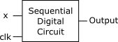

::: {.eqt}
TOPIC-SUBTOPIC-eqt\_1

**Question 1** A digital circuit needs to manipulate a set with 65536
elements. How many bits do you need to encode these elements with binary
logic?

A)  `I`{.interpreted-text role="eqt"} 15
B)  `C`{.interpreted-text role="eqt"} 16
C)  `I`{.interpreted-text role="eqt"} 65536
D)  `I`{.interpreted-text role="eqt"} It cannot be decided with the
    given information
:::

::: {.eqt}
TOPIC-SUBTOPIC-eqt\_2

**Question 2** Consider the following sequential digital circuit.

{.align-center}

When in evaluation time, the output simply takes the same value of the
input. The clock is in high level at times 2-3, 4-5 and 6-7 time units
(thus, low at times 1-2, 3-4, and 5-6). If the input is high at times
2-3, 4-5 and 6-7, what is the value of the output?

A)  `I`{.interpreted-text role="eqt"} It changes from high to low
    following the clock
B)  `C`{.interpreted-text role="eqt"} It stays high all the time
C)  `I`{.interpreted-text role="eqt"} It stays low all the time
D)  `I`{.interpreted-text role="eqt"} There is not enough information to
    answer the question.
:::

::: {.eqt}
TOPIC-SUBTOPIC-eqt\_3

**Question 3** You are given two sets, one with 12 elements and another
one with 35 elements. You need to encode both sets, but the number of
bits to choose for each encoding **must be the same**. How many bits
would you end up using?

A)  `I`{.interpreted-text role="eqt"} 35 bits because it is the set with
    the largest number of elements.
B)  `I`{.interpreted-text role="eqt"} 12 bits because it s the set with
    the smallest number of elements.
C)  `I`{.interpreted-text role="eqt"} 4 bits because is the minimum
    number of bits needed to encode the first set.
D)  `C`{.interpreted-text role="eqt"} None of the above
:::

::: {.eqt}
TOPIC-SUBTOPIC-eqt\_4

**Question 4** The following numbers

$$336, 351$$

would be correct numbers in bases 7, 8 and 9.

A)  `C`{.interpreted-text role="eqt"} True
B)  `I`{.interpreted-text role="eqt"} False
:::

::: {.eqt}
TOPIC-SUBTOPIC-eqt\_5

**Question 5** In general, the higher the base, the more compact the
number representation (that is, less digits are required).

A)  `C`{.interpreted-text role="eqt"} True
B)  `I`{.interpreted-text role="eqt"} False
:::
