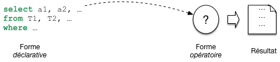
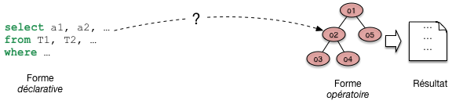
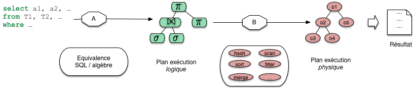
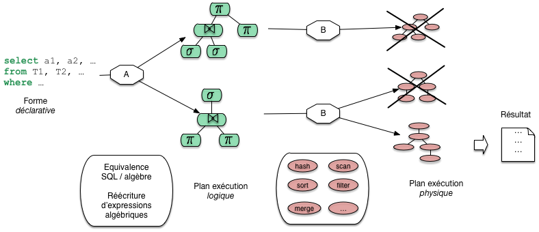

.. _chap-alg:

#######################
SQL, langage algébrique
#######################

Le second langage étudié dans ce cours est *l'algèbre relationnelle*. Elle consiste
en un ensemble d'opérations qui permettent de manipuler
des *relations*, considérées comme des ensembles de nuplets : on peut ainsi 
faire *l'union* ou la *différence* de deux relations, *sélectionner*
une partie des nuplets  la relation, effectuer des *produits
cartésiens* ou des *projections*, etc. 

On peut voir l'algèbre relationnelle comme un
langage de programmation très simple qui permet d'exprimer des requêtes 
sur une base de données  relationnelle. C'est donc plus une approche d'informaticien 
que de logicien. Elle correspond moins naturellement à la manière dont on *pense*
une requête. 
À l'origine, le langage SQL était d'ailleurs entièrement construit sur la logique
mathématique, comme nous l'avons vu dans le chapitre :ref:`chap-calcul`, à l'exception
de l'union et de l'intersection. L'algèbre n'était utilisée que comme un moyen de décrire
les opérations à effectuer pour évaluer une requête.
Petit à petit, les évolutions de la norme 
SQL ont introduit dans le langage les opérateurs de l'algèbre.
Il est maintenant possible de les retrouver tous et d'exprimer toutes les requêtes
(plus ou moins facilement) avec cette approche. C'est ce que nous étudions dans ce chapitre.

.. note:: La base utilisée comme exemple dans ce chapitre est celle 
   de nos intrépides voyageurs, présentée dans le chapitre :ref:`chap-modrel`. 

*******************************
S1: Les opérateurs de l'algèbre
*******************************

.. admonition::  Supports complémentaires:

    * `Diapositives: les opérateurs de l'algèbre <http://sql.bdpedia.fr/files/slalgops.pdf>`_
    * `Vidéo sur les opérateurs de l'algèbre <https://mdcvideos.cnam.fr/videos/?video=MEDIA180905163750567>`_ 

L'algèbre se compose d'un ensemble d'opérateurs, parmi
lesquels 6 sont nécessaires et suffisants et permettent
de définir les autres par composition. 
Une propriété fondamentale de chaque opérateur est qu'il prend une ou deux relations 
en entrée, et produit une relation en sortie. Cette propriété (dite de *clôture*) permet
de *composer* des opérateurs : on peut appliquer une sélection au résultat d'un produit cartésien,
puis une projection au résultat de la sélection, et
ainsi de suite. En fait on peut construire
des *expressions algébriques* arbitrairement complexes
qui permettent d'effectuer toutes les requêtes relationnelles
à l'aide d'un petit nombre d'opérations de base.

Ces opérations sont  donc:

  * La sélection, dénotée :math:`\sigma` 
  * La projection, dénotée :math:`\pi` 
  * Le renommage, dénoté :math:`\rho` 
  * Le produit cartésien, dénoté :math:`\times` 
  * L'union, :math:`\cup` 
  * La différence, :math:`-`

Les trois premiers sont des opérateurs *unaires* (ils prennent en entrée une seule relation) et les autres
sont des opérateurs *binaires*. À partir de ces opérateurs
il est possible d'en définir d'autres, et notamment
la *jointure*, :math:`\Join`, qui est la composition
d'un produit cartésien et d'une sélection. C'est une opération essentielle, nous lui consacrons
la prochaine session.

Ces opérateurs sont maintenant présentés tour à tour.

La projection, :math:`\pi`
==========================

La projection :math:`\pi_{A_1, A_2, \ldots,A_k}(R)` s'applique à une relation
:math:`R`, et construit une relation contenant tous les nuplets de :math:`R`,
dans lesquels seuls les attributs :math:`A_1, A_2, \ldots A_k` sont conservés. 
La requête suivante construit une relation avec le nom des logements et leur lieu.

.. math:: 

     \pi_{nom, lieu}(Logement) 

On obtient le résultat suivant, après suppression
des colonnes ``id``, ``capacité`` et ``type`` :

..  csv-table::
    :header: nom, lieu

    Causses , Cévennes
    Génépi  , Alpes
    U Pinzutu   , Corse
    Tabriz  , Bretagne

En SQL, le projection s'exprime avec le ``select`` suivi de la liste des
attributs à projeter.

.. code-block:: sql

    select nom, lieu
    from Logement

C'est un habillage syntaxique direct de la projection. 

Si on souhaite
conserver tous les attributs, on peut éviter d'en énumérer la liste en la remplaçant
par ``*``. 

.. code-block:: sql

    select *
    from Logement

.. note::  En algèbre cette requête est tout simplement l'identité: :math:`R`
       

La sélection, :math:`\sigma`
============================

La sélection :math:`\sigma_F(R)` s'applique à une relation, :math:`R`, et
extrait de cette relation les nuplets qui satisfont
un critère de sélection, :math:`F`. Ce critère peut être :

  - La comparaison entre un attribut de la relation, :math:`A`,
    et une constante :math:`a`. Cette comparaison s'écrit
    :math:`A \Theta a`, où :math:`\Theta` appartient
    à :math:`\{=, <, >, \leq, \geq\}`.
  - La comparaison entre deux attributs :math:`A_1` et :math:`A_2`, 
    qui s'écrit :math:`A_1 \Theta A_2` avec les mêmes
    opérateurs de comparaison que précédemment.

Premier exemple : exprimer la requête qui donne
tous les logements en Corse. 

.. math:: 

    \sigma_{lieu='Corse'}(Logement) 

On obtient donc le résultat :

..   csv-table::
    :header: code, nom, capacité, type, lieu

    pi  , U Pinzutu , 10    , Gîte  , Corse
    
La sélection a pour effet de supprimer des nuplets, mais
chaque nuplet garde l'ensemble de ses attributs. Il ne peut pas
y avoir de problème de doublon (pourquoi?) et il ne faut donc surtout
par appliquer un ``distinct``.

En SQL, les critères de sélection sont exprimés par la clause ``where``. 

.. code-block:: sql

    select * 
    from Logement
    where lieu = 'Corse'
    
Les chaînes de caractères doivent impérativement être encadrées par
des  apostrophes simples, sinon le système ne verrait pas
la différence avec un nom d'attribut. Ce n'est pas
le cas pour les numériques, car aucun nom d'attribut ne peut commencer par un chiffre.

.. code-block:: sql

    select * 
    from Logement
    where capacité = 134

.. note:: Vous noterez que SQL appelle ``select`` la projection, et ``where``
   la sélection, ce qui est pour le moins infortuné. Dans des
   langages modernes comme XQuery (pour les modèles basés sur XML) le, ``select`` 
   est remplacé par ``return``. En ce qui concerne SQL, la question a donné lieu
   (il y a longtemps) à des débats mais il était déjà trop tard pour changer. 

Le produit cartésien, :math:`\times`
====================================

Le premier opérateur binaire, et le plus utilisé,
est le produit cartésien, :math:`\times`. Le
produit cartésien entre deux relations :math:`R` et :math:`S`
se note :math:`R \times S`, et permet de créer
une nouvelle relation où chaque nuplet de :math:`R` est associé
à chaque nuplet de :math:`S`.

Voici deux relations, la première, :math:`R`, contient
   
.. csv-table:: 
    :header:   "A", "B"
    :widths:  5, 5

    a, b
    x, y

et la seconde, :math:`S`, contient :

.. csv-table:: 
    :header:   "C", "D"
    :widths:  5, 5

    c, d
    u, v
    x, y
    

Et voici le résultat de :math:`R \times S` :

.. csv-table:: 
    :header:  "A", "B", "C", "D"
    :widths:  5, 5, 5, 5

      a, b, c, d   
      a, b, u, v 
      a, b, x, y 
      x, y, c, d   
      x, y, u, v 
      x, y, x, y 

Le nombre de nuplets dans le résultat est exactement
:math:`|R| \times |S|` (:math:`|R|` dénote le nombre de nuplets dans
la relation :math:`R`).

En lui-même, le produit cartésien ne présente 
pas un grand intérêt puisqu'il associe aveuglément
chaque nuplet de :math:`R` à chaque nuplet de :math:`S`. Il ne prend
vraiment son sens qu'associé à l'opération
de sélection, ce qui permet d'exprimer des *jointures*,
opération fondamentale qui sera détaillée plus loin.

En SQL, le produit cartésien est un opérateur ``cross join``
intégré à la clause ``from``.

.. code-block:: sql

    select * 
    from R cross join S

C'est la première fois que nous rencontrons une expression à l'intérieur
du ``from`` en lieu et place de la simple énumération par une virgule. Il y a une logique
certaine à ce choix: dans la mesure où ``R cross join S`` définit une  nouvelle relation,
la requête SQL peut être vue comme une requête sur cette seule relation, et nous sommes ramenés
au cas le plus simple.

Comme illustration  de ce principe, 
voici le résultat du produit cartésien :math:`Logement \times Activité`
(en supprimant l'attribut ``description`` pour gagner de la place).

..  csv-table::
    :header: code, nom, capacité, type, lieu, codeLogement, codeActivité
    :widths:  5, 15, 5, 8, 15,  10, 5

    ca  , Causses   , 45    , Auberge   , Cévennes  , ca    , Randonnée
    ge  , Génépi    , 134   , Hôtel , Alpes , ca    , Randonnée
    pi  , U Pinzutu , 10    , Gîte  , Corse , ca    , Randonnée
    ta  , Tabriz    , 34    , Hôtel , Bretagne  , ca    , Randonnée
    ca  , Causses   , 45    , Auberge   , Cévennes  , ge    , Piscine
    ge  , Génépi    , 134   , Hôtel , Alpes , ge    , Piscine
    pi  , U Pinzutu , 10    , Gîte  , Corse , ge    , Piscine
    ta  , Tabriz    , 34    , Hôtel , Bretagne  , ge    , Piscine
    ca  , Causses   , 45    , Auberge   , Cévennes  , ge    , Ski
    ge  , Génépi    , 134   , Hôtel , Alpes , ge    , Ski
    pi  , U Pinzutu , 10    , Gîte  , Corse , ge    , Ski
    ta  , Tabriz    , 34    , Hôtel , Bretagne  , ge    , Ski
    ca  , Causses   , 45    , Auberge   , Cévennes  , pi    , Plongée
    ge  , Génépi    , 134   , Hôtel , Alpes , pi    , Plongée
    pi  , U Pinzutu , 10    , Gîte  , Corse , pi    , Plongée
    ta  , Tabriz    , 34    , Hôtel , Bretagne  , pi    , Plongée
    ca  , Causses   , 45    , Auberge   , Cévennes  , pi    , Voile
    ge  , Génépi    , 134   , Hôtel , Alpes , pi    , Voile
    pi  , U Pinzutu , 10    , Gîte  , Corse , pi    , Voile
    ta  , Tabriz    , 34    , Hôtel , Bretagne  , pi    , Voile

C'est une relation (tout est relation en relationnel) et on peut bien imaginer interroger cette relation comme
n'importe quelle autre. C'est exactement ce que fait la requête SQL suivante. 

.. code-block:: sql

    select * 
    from Logement cross join Activité
    
Jusqu'à présent,
le ``from`` ne contenait que des relations "*basées*" (c'es-à-dire stockées dans la base). Maintenant,
on a placé une relation *calculée*. Le principe reste le même.
Rappelons que l'algèbre est un langage *clos*: il s'applique à des relations et produit
une relation en sortie. Il est donc possible d'appliquer à nouveau des opérateurs
à cette relation-résultat. C'est ainsi que l'on construit des expressions,
comme nous allons le voir dans la session suivante. 
Nous retrouverons une autre application de cette propriété extrêmement
utile quand nous étudierons les vues (chapitre :ref:`chap-ddl`).

Renommage
=========

Quand les schémas des relations :math:`R` et :math:`S` sont
complètement distincts, il n'y a pas 
d'ambiguité sur la provenance des colonnes
dans le résultat. Par exemple on sait que les
valeurs de la colonne :math:`A` dans :math:`R \times S` viennent
de la relation :math:`R`. Il peut arriver (il arrive
de fait très souvent) que les deux relations
aient des attributs qui ont le même nom. On
doit alors se donner les moyens de distinguer
l'origine des colonnes dans la relation résultat
en donnant un nom distinct à chaque attribut.

Voici par exemple une relation :math:`T` qui a les mêmes
noms d'attributs que :math:`R`. 

.. csv-table:: 
    :header:  "A", "B"
    :widths:  5, 5
    
    m, n
    o, p
    

Le schéma du
résultat du produit cartésien :math:`R \times T`
a pour schéma :math:`(A, B, A, B)` et présente
donc des ambiguités, avec les colonnes :math:`A` et
`B` en double.

La première solution pour lever l'ambiguité 
est d'adopter une convention par laquelle chaque attribut est préfixé par le nom
de la relation d'où il provient. Le
résultat de :math:`R \times T` devient alors :

.. csv-table:: 
    :header:  "R.A", "R.B", "T.A", "T.B"
    :widths:  5, 5, 5, 5

      a, b, m, n   
      a, b, o, p 
      x, y, m, n   
      x, y, o, p 

Cette convention pose quelques problèmes quand on crée des expressions complexes.
Il existe une seconde possibilité, plus générale, pour résoudre
les conflits de noms : le *renommage*. Il
s'agit d'un opérateur particulier, dénoté :math:`\rho`,
qui permet de renommer un ou plusieurs attributs d'une relation. 
L'expression :math:`\rho_{A \to C,B \to D}(T)` permet ainsi
de renommer :math:`A` en :math:`C` et :math:`B` en :math:`D` dans la relation
:math:`T`. Le produit cartésien

.. math:: 

     R \times \rho_{A\to C,B \to D}(T)  

ne présente alors plus d'ambiguités. Le
renommage est une solution très générale, mais
asez lourde à utiliser 

Il est tout à fait possible de faire le produit cartésien
d'une relation avec elle-même. Dans ce cas le renommage
où l'utilisation d'un préfixe distinctif est impératif.
Voici par exemple le résultat de :math:`R \times R`, dans
lequel on préfixe par :math:`R1` et :math:`R2` respectivement
les attributs venant de chacune des opérandes.

.. csv-table:: 
    :header:  "R1.A", "R1.B", "R1.A", "R2.B"
    :widths:  5, 5, 5, 5
    
      a, b, a, b   
      a, b, x, y 
      x, y, a, b   
      x, y, x, y 

En SQL, le renommage est obtenu avec le mot-clé ``as``. Il peut s'appliquer
soit à la relation, soit aux attributs (ou bien même aux deux). 
Le résultat suivant est donc obtenu
avec la requête:

.. code-block:: sql

    select *
    from R as R1 cross join R as R2

On obtient une relation de schéma ``(R1.A, R1.B, R1.A, R2.B)``, avec des
noms d'attribut qui ne sont en principe pas acceptés par la norme SQL. Il reste à spécifier 
ces noms en ajoutant dans ``as``  dans la clause de projection.

.. code-block:: sql

    select R1.a as premier_a, R1.b as premier_b, R2.a as second_a, R2.b as second_b
    from R as R1 cross R as R2

Ce qui donnera donc le résultat:

.. csv-table:: 
    :header:  "premier_a", "premier_b", "second_a", "second_b"
    :widths:  5, 5, 5, 5
    
      a, b, a, b   
      a, b, x, y 
      x, y, a, b   
      x, y, x, y 

Sur notre schéma, le renommage s'impose par exemple si on effectue le produit cartésien entre
``Voyageur`` et ``Séjour``  car l'attribut ``idVoyageur`` apparaît dans les deux tables.
Essayez la requête:

.. code-block:: sql

    select Voyageur.idVoyageur, Séjour.idVoyageur
    from Voyageur cross join Séjour

Elle vous renverra une erreur comme *Encountered duplicate field name: 'idVoyageur'*. Il faut nommer
explicitement les attributs pour lever l'ambiguité.

.. code-block:: sql

    select Voyageur.idVoyageur as idV1, Séjour.idVoyageur as idV2
    from Voyageur cross join Séjour
    
    
L'union, :math:`\cup`
=====================

Il existe deux autres opérateurs binaires, qui sont à la fois plus simples et moins fréquemment
utilisés. 

Le premier est l'union.  L'expression :math:`R \cup S`  crée une 
relation comprenant tous les nuplets existant dans 
l'une ou l'autre des relations :math:`R` et :math:`S`. 
Il existe une condition impérative : *les
deux relations doivent avoir le même schéma*,
c'est-à-dire même nombre d'attributs, mêmes noms
et mêmes types.

L'union des relations  :math:`R(A,B)` et :math:`S(C,D)`
données en exemple ci-dessus est donc 
interdite (on ne saurait pas comment nommer
les attributs dans le résultat). En 
revanche, en posant :math:`S' = \rho_{C\to A,D\to B}(S)`,
il devient possible de calculer :math:`R \cup S'`,
avec le résultat suivant :

.. csv-table:: 
    :header:  "A", "B"
    :widths:  5, 5
    
      a, b  
      x, y  
      c, d   
      u, v  

Comme pour la projection, il faut penser à éviter les doublons.
Donc le nuplet ``(x,y)`` qui existe à la fois
dans :math:`R` et dans :math:`S'` ne figure
qu'une seule fois dans le résultat.

L'union est un des opérateurs qui existe dans SQL depuis l'origine.  La requête suivante
effectue l'union des lieux de la table ``Logement`` et des régions de la table ``Voyageur``. 
Pour unifier les schémas, on a projeté sur cet unique attribut, et on a effectué un renommage.

.. code-block:: sql

     select lieu from Logement
       union
     select région as lieu from Voyageur

On obtient le résultat suivant. 

..  csv-table::
    :header: lieu

    Cévennes
    Alpes
    Corse
    Bretagne
    Auvergne
    Tibet

Notez que certains noms comme "Corse" apparaîssent deux fois: vous savez 
maintenant comment éliminer les doublons avec SQL.

La différence, :math:`-`
========================

Comme l'union, la différence s'applique à deux relations
qui ont le même schéma. L'expression :math:`R -S` a alors
pour résultat tous les nuplets de :math:`R` qui ne sont pas dans :math:`S`.

Voici la différence de :math:`R` et :math:`S'`, 
les deux relations étant définies comme
précédemment.

.. csv-table:: 
    :header:  "A", "B"
    :widths:  5, 5
    
      a, b  

En SQL, la différence est obtenue avec ``except``.

.. code-block:: sql

     select A, B from R
        except 
     select C as A, D as B from S
      
La différence est le seul opérateur algébrique qui permet d'exprimer
des requêtes comportant une négation (on veut "*rejeter*"
quelque chose, on "*ne veut pas*" des nuplets ayant telle
propriété).  La contrainte d'identité des schémas rend
cet opérateur très peu pratique à utiliser, et on lui préfère
le plus souvent la construction logique du SQL "déclaratif", ``not exists``.  

.. note:: L'opérateur ``except`` n'est même pas proposé par certains systèmes comme MYSQL. 

Quiz
====

.. eqt:: alg1-1

    Que signifie la propriété dite "de clôture" pour l'algèbre relationnelle
   
    A) :eqt:`I`  Que les opérateurs permettent de calculer par transitivité tous les nuplets
       accessibles à partir d'un nuplet particulier?
    #) :eqt:`C`  Que l'entrée et la sortie des opérateurs appartient à un même ensemble,
       celui des relations, et que les calculs restent donc dans une monde "clos"?
    #) :eqt:`I` Qu'aucun opérateur ne peut se définir en fonction des autres

.. eqt:: alg1-2

    Pourquoi ne peut-il pas y avoir de doublon dans le résultat d'une sélection
    (appliquée à une relation en première forme normale)
   
    A) :eqt:`I`  Parce que la formule de sélection définit une clé pour la relation résultat
    #) :eqt:`I`  Parce que la sélection élimine les doublons
    #) :eqt:`C` S'il n'y a pas de doublon en entrée (1FN), à plus forte
       raison il n'y en a pas en sortie puisque la sélection ne fait qu'éliminer
       des nuplets

.. eqt:: alg1-3

    Quelle est la condition pour appliquer un produit cartésien?

    A) :eqt:`I` Les relations doivent avoir le même schéma
    #) :eqt:`C`  Les relations doivent avoir des schémas distincts, sans
       nom d'attribut commun
    #) :eqt:`I` Les relations ont le  même nombre de nuplets

.. eqt:: alg1-4

    Quelle est la condition pour appliquer une différence

    A) :eqt:`C` Les relations doivent avoir le même schéma
    #) :eqt:`I`  Les relations doivent avoir des schémas distincts, sans
       nom d'attribut commun
    #) :eqt:`I` Les relations ont le  même nombre de nuplets

.. eqt:: alg1-5

    Prenons deux relations :math:`R` et :math:`S`, de même schéma. Quelle
    est l'expression qui calcule leur intersection?

    A) :eqt:`C` :math:`R - (R - S)`
    #) :eqt:`I` :math:`((R  \cup S) - S) - R)`
    #) :eqt:`I` :math:`((R  \times S) - S) - R)`

.. eqt:: alg1-6

    Supposons que :math:`R`  a 12 nuplets et :math:`S`  4. Les deux relations
    ont des schémas distincts. Quelle phrase est correcte ?
    
    A) :eqt:`I`  :math:`R \times S` a  16 nuplets
    #) :eqt:`I`   :math:`R \times S` a  12 nuplets
    #) :eqt:`C`  :math:`R \times S` a  48 nuplets
    #)  :eqt:`I` :math:`R \times S` a 4 nuplets

***************
S2: la jointure
***************

.. admonition::  Supports complémentaires:

    * `Diapositives: la jointure algébrique <http://sql.bdpedia.fr/files/sljointure.pdf>`_
    * `Vidéo sur la jointure algébrique <https://mdcvideos.cnam.fr/videos/?video=MEDIA180905163857374>`_ 

Toutes les requêtes exprimables avec l'algèbre relationnelle peuvent se construire avec les
6 opérateurs présentés ci-dessus. En principe,
on pourrait donc s'en contenter. En pratique, il
existe d'autres opérations, très couramment
utilisées, qui peuvent se contruire par composition
des opérations de base. La plus importante est la jointure.

L'opérateur :math:`\Join`
=========================

Afin de comprendre l'intérêt de cet opérateur, regardons
le produit cartésien :math:`\rm{Logement} \times \rm{Activité}`,
dont le résultat est rappelé ci-dessous.

..  csv-table::
    :header: code, nom, capacité, type, lieu, codeLogement, codeActivité
    :widths:  5, 15, 5, 8, 15,  10, 5

    ca  , Causses   , 45    , Auberge   , Cévennes  , ca    , Randonnée
    ge  , Génépi    , 134   , Hôtel , Alpes , ca    , Randonnée
    pi  , U Pinzutu , 10    , Gîte  , Corse , ca    , Randonnée
    ta  , Tabriz    , 34    , Hôtel , Bretagne  , ca    , Randonnée
    ca  , Causses   , 45    , Auberge   , Cévennes  , ge    , Piscine
    ge  , Génépi    , 134   , Hôtel , Alpes , ge    , Piscine
    pi  , U Pinzutu , 10    , Gîte  , Corse , ge    , Piscine
    ta  , Tabriz    , 34    , Hôtel , Bretagne  , ge    , Piscine
    ca  , Causses   , 45    , Auberge   , Cévennes  , ge    , Ski
    ge  , Génépi    , 134   , Hôtel , Alpes , ge    , Ski
    pi  , U Pinzutu , 10    , Gîte  , Corse , ge    , Ski
    ta  , Tabriz    , 34    , Hôtel , Bretagne  , ge    , Ski
    ca  , Causses   , 45    , Auberge   , Cévennes  , pi    , Plongée
    ge  , Génépi    , 134   , Hôtel , Alpes , pi    , Plongée
    pi  , U Pinzutu , 10    , Gîte  , Corse , pi    , Plongée
    ta  , Tabriz    , 34    , Hôtel , Bretagne  , pi    , Plongée
    ca  , Causses   , 45    , Auberge   , Cévennes  , pi    , Voile
    ge  , Génépi    , 134   , Hôtel , Alpes , pi    , Voile
    pi  , U Pinzutu , 10    , Gîte  , Corse , pi    , Voile
    ta  , Tabriz    , 34    , Hôtel , Bretagne  , pi    , Voile

Si vous regardez attentivement cette relation, vous noterez que
le résultat  comprend manifestement
un grand nombre de nuplets qui ne nous intéressent
pas. C'est le cas de toutes les lignes pour lesquelles le ``code`` (provenant
de la table ``Logement``) et le ``codeLogement``  (provenant de la table ``Activité``)
sont distincts.  Cela ne présente pas beaucoup de sens (à priori) de
rapprocher des informations sur l'hôtel Génépi, dans les Alpes,
avec l'activité de plongée en Corse. 

.. note:: Il est bien sûr arbitraire de dire qu'un résultat "n'a pas
   de sens" ou "ne présente aucun intérêt". Nous nous plaçons ici dans
   un contexte où l'on cherche à reconstruire une information
   sur certaines entités du monde réel, dont la description a été distribuée
   dans plusieurs tables par la normalisation. C'est l'utilisation sans doute
   la plus courante de SQL.
   
Si, en revanche, on considère le produit cartésien
comme un *résultat intermédiaire*, on voit
qu'il permet d'associer des nuplets initialement
répartis dans des tables distinctes. Sur notre exemple, on rapproche les informations générales
sur un logement et la liste des activités de ce logement.

La sélection qui effectue une rapprochement pertinent est celle qui ne conserve
que les nuplets partageant la même valeur pour les attributs ``code`` 
et ``codeLogement``, soit:

.. math:: 
   
     \sigma_{code=codeLogement}(\rm{Logement} \times \rm{Activité}) 

Prenez bien le temps de méditer  cette opération de sélection: nous ne voulons
conserver que les nuplets de :math:`\rm{Logement} \times \rm{Activité}` pour lesquelles
l'identifiant du logement (provenant de ``Logement``) est identique à celui provenant 
de ``Activité``. En regardant le produit cartésien ci-dessous, vous devriez pouvoir
vous convaincre que cela revient à conserver les nuplets qui ont un sens: chacune
contient des informations sur un logement et sur une activité dans ce *même* logement.

On obtient le résultat ci-dessous.

..  csv-table::
    :header: code, nom, capacité, type, lieu, codeLogement, codeActivité

    ca  , Causses   , 45    , Auberge   , Cévennes  , ca    , Randonnée
    ge  , Génépi    , 134   , Hôtel , Alpes , ge    , Piscine
    ge  , Génépi    , 134   , Hôtel , Alpes , ge    , Ski
    pi  , U Pinzutu , 10    , Gîte  , Corse , pi    , Plongée
    pi  , U Pinzutu , 10    , Gîte  , Corse , pi    , Voile

On a donc effectué une *composition* de deux
opérations (un produit cartésien, une sélection)
afin de rapprocher des informations réparties dans
plusieurs relations, mais ayant des liens entre elles (toutes
les informations dans un nuplet du résultat sont relatives
à un seul logement). Cette opération
est une *jointure*, que l'on peut directement,
et simplement, noter :

.. math:: 

     \rm{Logement} \Join_{code=codeLogement} \rm{Activité} 

La jointure consiste donc à rapprocher les nuplets de deux
relations pour lesquelles les
valeurs d'un (ou plusieurs) attributs sont identiques.
De fait, dans la plupart  des cas, ces attributs communs
sont (1) la clé primaire de l'une des relations
et (2) la clé étrangère dans l'autre relation.
Dans l'exemple ci-dessus, c'est le cas pour ``code`` (clé primaire
de *Logement*) et ``codeLogement`` (clé étrangère dans *Activité*).

.. note:: Le logement Tabriz, qui ne propose pas d'activité,
   n'apparaît pas dans le résultat de la jointure. C'est normal
   et conforme à la définition que nous avons donnée, mais peut
   parfois apparaître comme une contrainte. Nous verrons dans le chapitre final sur SQL
   que ce dernier propose une variante, la *jointure externe*, qui
   permet de la contourner.
   
La notation de la jointure, :math:`R \Join_F S`, est un racourci pour :math:`\sigma_F(R \times S)`.

.. note:: Le critère de rapprochement, :math:`F`, peut être
   n'importe quelle opération de comparaison liant un attribut
   de :math:`R` à un attribut de :math:`S`. En pratique, on emploie peu
   les :math:`\not=` ou '`<`' qui sont difficiles à interpréter,
   et on effectue des égalités.
 
   Si on n'exprime pas de critère de rapprochement, la
   jointure est équivalente à un produit cartésien.

Initialement, SQL ne proposait pour effectuer la jointure que la version
déclarative. 

.. code-block:: sql

    select *
    from Logement as l, Activité as a
    where l.code=a.codeLogement

En 1992, la révision de la norme a introduit l'opérateur algébrique qui,
comme le produit cartésien, et pour les mêmes raisons, prend place dans le ``from``.

.. code-block:: sql

    select *
    from Logement join Activité on (code=codeLogement)

Il s'agit donc d'une manière alternative  *d'exprimer* une jointure. Laquelle est la meilleure?
Aucune, puisque toutes les deux ne sont que des spécifications, et n'imposent en aucun cas au système
une méthode particulière d'exécution. Il est d'ailleurs exclu pour un système d'appliquer
aveuglément la définition de la jointure et
d'effectuer un produit cartésien, puis une sélection, car il existe des 
algorithmes d'évaluation bien plus efficaces. 

Résolution des ambiguités
=========================

Il faut être attentif aux ambiguités dans le nommage des attributs 
qui peut survenir dans la jointure au même titre que dans le
produit cartésien. Les solutions à employer sont
les mêmes : on préfixe par le nom
de la relation ou par un synonyme, ou bien on
renomme des attributs avant d'effectuer la jointure. 

Supposons que l'on veuille obtenir les voyageurs et les séjours qu'ils ont effectués. La jointure
s'exprime en principe comme suit:

.. code-block:: sql

    select *
    from Voyageur join Séjour on (idVoyageur=idVoyageur)

Le système renvoie une erreur:
La clause de jointure ``on (idVoyageur=idVoyageur)`` est clairement
ambigüe. Pour MySQL, le message est par exemple *Column 'idVoyageur' in on clause is ambiguous*. 
Nouvelle tentative:

.. code-block:: sql

    select *
    from Voyageur join Séjour on (Voyageur.idVoyageur=Séjour.idVoyageur)

Nouveau message d'erreur (cette fois, sous MySQL: *Encountered duplicate field name: 'idVoyageur'*). 
La liste des noms d'attribut dans le nuplet-résultat obtenu avec ``select *`` comprend
encore deux fois ``idVoyageur``. 

Première solution: on renomme les attributs du nuplet résultat. Cela suppose d'énumérer
tous les attributs.

.. code-block:: sql

    select V.idVoyageur as idV1, V.nom, S.idVoyageur as idV2, début, fin
    from Voyageur as V join Séjour as S  on (V.idVoyageur=S.idVoyageur)

Cette première solution consiste à effectuer un renommage *après* la jointure. 
Une autre solution est d'effectuer le renommage *avant* la jointure.

.. code-block:: sql

    select *
    from (select idVoyageur as idV1, nom from Voyageur) as V 
                   join 
         (select idVoyageur as idV2, début, fin from Séjour) as S  
               on (V.idV1=S.idV2)
               
En algèbre, la requête ci-dessus correspond à l'expression suivante:

.. math::

     (\rho_{idVoyageur \to idV1} (\pi_{idVoyageur, nom}Voyageur) \Join_{idV1=idV2} \rho_{idVoyageur \to idV2} (\pi_{idVoyageur, début, fin}Séjour))
     
On voit que le ``from`` commence à contenir des expressions de plus en plus complexes. Dans 
ses premières versions,
SQL ne permettait pas des constructions algébriques dans le ``from``, ce qui avait l'avantage d'éviter
des constructions qui ressemblent de plus en plus à de la programmation. Rappelons qu'il existe
une syntaxe alternative à la requête ci-dessus, dans la forme déclarative de SQL étudiée
au chapitre précédent.

.. code-block:: sql

    select V.idVoyageur as idV1, V.nom, S.idVoyageur as idV2, début, fin
    from Voyageur as V, Séjour as S
    where V.idVoyageur= S.idVoyageur
    
Bref, vous commencez à avoir l'embarras du choix. 

.. admonition:: La jointure dite "naturelle"

    Il reste à vrai dire, avec SQL, un troisième choix, la jointure dite "naturelle". Elle s'applique
    uniquement quand les attributs de jointure ont des noms identiques dans les deux tables. C'est
    le cas ici, (l'attribut de jointure est ``idVoyageur``, que ce soit dans ``Logement`` ou dans ``Séjour``). La jointure
    naturelle s'effectue alors automatiquement sur ces attributs communs, et ne conserve
    que l'un des attributs dans le résultat, ce qui élimine l'ambiguité. La syntaxe devient
    alors très simple.

    .. code-block:: sql

         select *
         from Voyageur as V natural join Séjour

Si les attributs de jointures sont nommés différemment, la jointure naturelle devient plus délicate
à utiliser puisqu'il faut au préalable effectuer des renommages pour faire coïncider les 
noms des attributs à comparer.

À partir de là, vous savez comment effectuer plusieurs jointures. Un exemple devrait suffire:
supposons que l'on veuille les noms des voyageurs et les noms des logements qu'ils ont visités.
La requête algébrique devient un peu compliquée. On va s'autoriser une construction en plusieurs
étapes.

Tout d'abord on effectue un renommage sur la table ``Voyageur`` pour éviter
les futures ambiguités.

.. math::
 
    V2 := \rho_{idVoyageur\to idV, nom \to nomVoyageur} (Voyageur)

Opération semblable sur les logements.

.. math::
 
    L2 := \rho_{nom \to nomLogement} (Logement)

Et finalement, voici la requête algébrique complète, utilisant ``V2`` et ``L2``.

.. math:: 

     \pi_{nomVoyageur, nomLogement} (\rm{L2}) \Join_{code=codeLogement} \rm{Séjour}) \Join_{idVoyageur=idV} V2)

En SQL, il faut tout écrire avec une seule requête. Allons-y

.. code-block:: sql

    select nomVoyageur, nomLogement
    from ( (select idVoyageur as idV, nom as nomVoyageur from Voyageur) as V
                     join 
                Séjour as S on idV=idVoyageur)
                 join
             (select code, nom as nomLogement from Logement) as L
                 on codeLogement = code

Ce n'est pas très lisible... Pour comparaison, la version déclarative de ces jointures.

.. code-block:: sql

    select V.nom as nomVoyageur, L.nom as nomLogement
    from   Voyageur as V, Séjour as S, Logement as L
    where  V.idVoyageur = S.idVoyageur
    and    S.codelogement = L. code

À vous de voir quel style (ou mélange des styles) vous souhaitez adopter.

Quiz
====

.. eqt:: alg2-1

    Voici trois requêtes SQL sur la base des films
    
    .. code-block:: sql

        select titre, nom
        from   Film cross join Artiste
        where   idRéalisateur = idArtiste

    .. code-block:: sql

        select titre, nom
        from   Film  join Artiste on  (idRéalisateur = idArtiste)

    .. code-block:: sql

        select titre, nom
        from   Film as f, Artiste as a
        where f.idRéalisateur = a.idArtiste

    Quelle affirmation est fausse?

    A) :eqt:`C` La première est incorrecte car elle mélange l'approche déclarative
       et l'approche algébrique
    #) :eqt:`I`  La seconde est équivalente à la première
    #) :eqt:`I` Elles sont toutes équivalentes

.. eqt:: alg2-2

    Voici une requête SQL sur la base des logements

    .. code-block:: sql

        select  idSéjour, codeLogement, codeActivité
        from   Séjour join Activité on (codeLogement=codeLogement)

    Cette requête est incorrecte syntaxiquement à cause des problèmes 
    d'ambiguités de ``codeLogement``.
    
    Quelle reformulation, parmi les suivantes, est incorrecte?
    
    A) :eqt:`C` En préfixant les attributs par le nom des tables dans le ``from``.
        
       .. code-block:: sql

           select  idSéjour, codeLogement, codeActivité
           from   Séjour join Activité on (Séjour.codeLogement=Activité.codeLogement)
    #) :eqt:`I` En utilisant des synonymes
        
       .. code-block:: sql

           select  idSéjour, S.codeLogement, codeActivité
           from   Séjour as S join Activité as A on (S.codeLogement=A.codeLogement)
    #) :eqt:`I` En utilisant la jointure naturelle
        
       .. code-block:: sql

           select  idSéjour, codeLogement, codeActivité
           from   Séjour natural join Activité
    #) :eqt:`I` En renommant avant la jointure
        
       .. code-block:: sql

           select  idSéjour, codeLogement, codeActivité
           from   (select idSéjour, codeLogement from Séjour) as S
                join 
                  (select codeActivité, codeLogement as codeL from Activité) as A
                on (codeLogement = codeL)

.. eqt:: alg2-3 

    Je veux utiliser la jointure naturelle pour joindre la table
    des logements et celle des activités. Les attributs de jointure
    ont des noms différents, et je dois donc appliquer un renommage. Quelle
    version est correcte?

    A) :eqt:`I` En renommant dans la clause ``select``

        .. code-block:: sql

            select  L.codeLogement as codeL, A.codeLogement as codeL, codeActivité
            from   Logement as L natural join Activité as A

    #) :eqt:`C` En renommant dans la clause ``from``

        .. code-block:: sql

            select  code, codeActivité
            from   (select * from Logement) as L  
                  natural join 
                  (select codeLogement as code, codeActivité from Activité) as A

.. eqt:: alg2-4

    Que calcule la jointure naturelle si les schémas sont totalement distincts (aucun
    nom d'attribut en commun)?

    A) :eqt:`I` Une union
    #) :eqt:`C` Un produit cartésien
    #) :eqt:`I` Une intersection

.. eqt:: alg2-5

    Que calcule la jointure naturelle si les schémas sont identiques?

    A) :eqt:`I` Une union
    #) :eqt:`I` Un produit cartésien
    #) :eqt:`C` Une intersection

***************************
S3: Expressions algébriques
***************************

.. admonition::  Supports complémentaires:

    * `Diapositives: expressions algébriques <http://sql.bdpedia.fr/files/slexpressions.pdf>`_
    * `Vidéo sur les expressions algébriques <https://mdcvideos.cnam.fr/videos/?video=MEDIA180905163943904>`_ 

Cette section est consacrée à l'expression
de requêtes algébriques complexes impliquant plusieurs
opérateurs. On utilise
la *composition* des opérations, rendue possible
par le fait que tout opérateur produit en sortie
une relation sur laquelle on peut appliquer à nouveau
des opérateurs.

.. note:: Les expressions sont seulement données dans la forme concise de l'algèbre. 
   La syntaxe SQL équivalente est à faire à titre d'exercices (et à tester sur notre site). 
   
Sélection généralisée
=====================

Regardons d'abord comment on peut généraliser les
critères de sélection de l'opérateur :math:`\sigma`. 
Jusqu'à présent on a vu comment sélectionner
des nuplets satisfaisant *un* critère de sélection,
par exemple : "les logements de type 'Hôtel'". Maintenant supposons
que l'on veuille retrouver les hôtels dont la capacité est supérieure à 100. On peut
exprimer cette requête par une composition :

.. math:: 

     \sigma_{capacité>100}(\sigma_{type='Hôtel'}(Logement)) 

Ce qui revient à pouvoir exprimer une sélection avec une
*conjonction* de critères. La requête précédente
est donc équivalente à celle ci-dessous, où le
:math:`\land`  dénote le 'et'.

.. math:: 

     \sigma_{capacité>100 \land type='Hôtel'}(Logement) 

La composition de plusieurs sélections revient à 
exprimer une conjonction de critères de recherche. 
De même la composition de la sélection et de l'union
permet d'exprimer la *disjonction*. Voici la requête
qui recherche les logements qui sont en Corse, *ou*
dont la capacité est supérieure à 100.

.. math:: 
  
    \sigma_{capacité>100}(Logement) \cup \sigma_{lieu='Corse'}(Logement) 

Ce qui permet de s'autoriser la syntaxe suivante, où le
':math:`\lor`' dénote le 'ou'.

.. math:: 

     \sigma_{capacité>100\ \lor\  lieu='Corse'}(Logement) 

Enfin la *différence* permet d'exprimer la *négation*
et "d'éliminer" des nuplets. Par exemple, voici la requête
qui sélectionne les logements dont la capacité est 
supérieure à 200 mais qui ne sont *pas* aux Antilles.

.. math:: 

    \sigma_{capacité>100}(Logement) - \sigma_{lieu='Corse'}(Logement) 
  
Cette requête est équivalente à une sélection
où on s'autorise l'opérateur ':math:`\not=`' :

.. math:: 

     \sigma_{capacité>100 \land lieu \not='Corse'}(Logement) 

.. important:: Attention avec les requêtes comprenant une négation, dont
   l'interprétation est parfois subtile. D'une manière générale, l'utilisation
   du ':math:`\not=`' *n'est pas* équivalente à l'utilisation de la différence, l'exemple
   précédent étant une exception.
   Voir la prochaine section.
   
En résumé, les opérateurs d'union et de différence
permettent de définir une sélection :math:`\sigma_F`
où le critère :math:`F` est une expression booléenne quelconque. Attention
cependant : si toute sélection avec un 'ou'
peut s'exprimer par une union, l'inverse n'est pas vrai
(exercice).

Requêtes conjonctives
=====================

Les requêtes dites *conjonctives* constituent l'essentiel des
requêtes courantes. Intuitivement, il s'agit de toutes
les recherches qui s'expriment avec des 'et', par opposition
à celles qui impliquent des 'ou' ou des 'not'. Dans
l'algèbre, ces requêtes sont toutes celles qui
peuvent s'écrire avec seulement trois opérateurs :
:math:`\pi`, :math:`\sigma`, 
:math:`\times` (et donc, indirectement, :math:`\Join`).

Les plus simples sont celles où on n'utilise que :math:`\pi`
et :math:`\sigma`. En voici quelques exemples.

  * Nom des logements en Corse :  
  
    :math:`\pi_{nom}(\sigma_{lieu='Corse'}(Logement))`

  * Code des logements où l'on pratique la voile.
       
    :math:`\pi_{codeLogement}(\sigma_{codeActivité='Voile'}(Activité))`

  * Nom et prénom des clients corses
          
    :math:`\pi_{nom,prénom}(\sigma_{région='Corse'}(Voyageur))`

Des requêtes légèrement plus complexes - et extrêmement
utiles - sont celles qui impliquent la jointure. On doit utiliser
la jointure dès que les attributs nécessaires
pour évaluer une requête sont réparties dans au moins
deux relations. Ces "attributs nécessaires" peuvent être :

  * Soit des attributs qui figurent dans le résultat ;
  * Soit des attributs sur lesquels on exprime un critère de sélection.

Considérons par exemple la requête suivante : "Donner le nom et le lieu des logements où l'on
pratique la voile". Une analyse très simple suffit pour
constater que l'on a besoin des attributs ``lieu`` et ``nom`` qui
apparaîssent dans la relation ``Logement``, et de ``codeActivité``
qui apparaît dans ``Activité``.

Donc il faut faire une jointure, de manière à rapprocher
les nuplets de ``Logement`` et de ``Activité``. Il reste donc à
déterminer le (ou les) attribut(s) sur lesquels se fait ce
rapprochement. Ici, comme dans la plupart des cas, la jointure
permet de "recalculer" l'association
entre les relations ``Logement`` et *Activité*. Elle s'effectue
donc par appariement de la clé primaire d'une part (dans ``Logement``), de la clé étrangère 
d'autre part. 

.. math:: 

      \pi_{nom,lieu}(Logement \Join_{code=codeLogement} (\sigma_{codeActivité='Voile'}(\text{Activité})) )

En pratique, la grande majorité des opérations de jointure s'effectue
sur des attributs qui sont clé primaire dans une relation,
et clé étrangère dans l'autre. Il ne s'agit
pas d'une règle absolue, mais elle résulte du fait 
que la jointure permet le plus souvent
de reconstituer le lien entre des informations
qui sont naturellement associées (comme un logement
et ses activités, ou un logement et ses clients), mais
qui ont été réparties dans plusieurs relations au
moment de la conception de la base. Voir le chapitre :ref:`chap-ea` à ce sujet.
  
Voici quelques autres exemples qui illustrent cet état de fait :

  * Nom des clients qui sont allés à Tabriz (en supposant connu le code, ``ta``, de cet hôtel) :
  
    .. math::
       
       \pi_{nom} (\text{Voyageur} \Join_{idVoyageur=idVoyageur} \sigma_{codeLogement='ta'} (\text{Séjour}))

  * Quels lieux a visité le client 30 :
    
    .. math::
    
        \pi_{lieu} (\sigma_{idVoyageur=30} (\text{Séjour}) \Join_{codeLogement=code} (\text{Logement})) 
 
  * Nom des clients qui ont eu l'occasion de faire de la voile :
 
    .. math::
    
         \pi_{nom} (\texttt{Voyageur} \Join_{idVoyageur=idVoyageur} (\texttt{Séjour} \Join_{codeLogement=codeLogement} \sigma_{codeActivité='Voile'}(\texttt{Activité})))

    ..  note:: Pour simplifier un peu l'expression, on a considéré ci-dessus que l'ambiguité 
        sur l'attribut de jointure ``idVoyageur`` était effacée par la projection finale
        sur ``nom``. En toute rigueur, la relation obtenue par 
        
        .. math::
           
              \texttt{Voyageur} \Join_{idVoyageur=idVoyageur} (\texttt{Séjour} \Join_{codeLogement=codeLogement} \sigma_{codeActivité='Voile'}(\texttt{Activité}))
              
        comporte des noms d'attributs doublés auxquels il faudrait appliquer un renommage.
        
La dernière requête comprend deux jointures, portant à chaque fois sur des 
clés primaires et/ou étrangères. Encore
une fois ce sont les clés qui définissent les liens entre les relations, et 
elle servent donc naturellement de support à l'expression des requêtes.

Voici maintenant un exemple qui montre que cette
règle n'est pas systématique. On veut exprimer
la requête  qui recherche les noms des clients qui sont partis 
en vacances dans leur lieu de résidence, ainsi que le nom
de ce lieu.

Ici on  a besoin des informations réparties dans les relations
*Logement*, *Séjour* et 
*Voyageur*. Voici l'expression algébrique :

.. math:: 

    \pi_{nom, lieu} (\text{Voyageur} \Join_{idVoyageur=idVoyageur \land région=lieu} (\text{Séjour} \Join_{codeLogement=code} \text{Logement})) 

Les jointures avec la relation ``Séjour`` se font sur les
couples (clé primaire, clé étrangère), mais on
a en plus un critère de rapprochement relatif à
l'attribut ``lieu`` de ``Voyageur`` et de ``Logement``. 

Requêtes avec :math:`\cup` et :math:`-`
=======================================

Pour finir, voici quelques exemples de requêtes impliquant
les deux opérateurs :math:`\cup` et :math:`-`. Leur utilisation
est moins fréquente, mais elle peut s'avérer absolument
nécessaire puisque ni l'un ni l'autre ne peuvent s'exprimer
à l'aide des trois opérateurs "conjonctifs" étudiés
précédemment. En particulier, la différence permet
d'exprimer toutes les requêtes où figure une négation :
on veut sélectionner des données qui *ne* satisfont
*pas* telle propriété, ou tous les "untels" *sauf*
les 'x' et les 'y', etc. 

Illustration concrète sur la base de données avec la
requête suivante : quels sont les codes des logements qui *ne* proposent *pas*
de voile ?

.. math:: 

     \pi_{code}(\text{Logement}) - \pi_{codeLogement}(\sigma_{codeActivité='Voile'}(\text{Activité})) 

Comme le suggère cet exemple, la démarche générale pour
construire une requête du type "Tous les :math:`O` qui ne
satisfont pas la propriété :math:`p`" est la suivante :

  * Construire une première requête :math:`A` qui sélectionne
    tous les :math:`O`.
  * Construire une deuxième requête :math:`B`  qui
    sélectionne tous les :math:`O`  *qui satisfont* :math:`p`.
  * Finalement, faire :math:`A - B`.

Les requêtes :math:`A` et :math:`B` peuvent bien entendu être arbitrairement 
complexes et mettre en œuvre des jointures, des sélections,
etc. La seule contrainte est que le résultat de :math:`A` et de :math:`B` 
comprenne le même nombre d'attributs (et, en théorie, les mêmes noms, mais
on peut s'affranchir de cette contrainte).

.. important:: Attention à ne pas considérer que l'utilisation du comparateur
   :math:`\not=` est équivalent à la différence. La requête suivante par
   exemple *ne donne pas* les logements qui ne proposent pas de voile 
   
   .. math:: 

      \pi_{codeLogement}(\sigma_{codeActivité\ \not=\ 'Voile'}(\text{Activité})) 
   
   Pas convaincu(e)? Réfléchissez un peu plus, faites le calcul concret. C'est l'un
   de pièges à éviter.
   
Voici quelques exemples complémentaires qui illustrent ce principe.

  * Régions où il y a des clients, mais pas de logement.

    .. math::
     
      \pi_{région} (\text{Voyageur}) - \pi_{région}(\rho_{lieu \to région} (\text{Logement})) 

  * Identifiant des logements qui n'ont pas reçu de client tibétain.

    .. math:: 
    
        \pi_{code}(\text{Logement}) -
        \pi_{codeLogement} (\text{Séjour} \Join_{idVoyageur=idVoyageur} \sigma_{région='Tibet'} (\text{Voyageur})) 

  * Id des clients qui ne sont pas allés en Corse.

    .. math:: 
    
        \pi_{idVoyageur}(\text{Voyageur}) - \pi_{idVoyageur}(\sigma_{lieu='Corse'}(\text{Logement}) 
        \Join_{code=codeLogement} \text{Séjour}) 

La dernière requête  construit l'ensemble des ``idVoyageur`` pour les
clients qui ne sont pas allés en Corse. Pour obtenir
le nom de ces clients, il suffit d'ajouter une jointure (exercice).

Complément d'un ensemble
========================

La différence peut être employée pour calculer le
*complément* d'un ensemble. Prenons l'exemple
suivant : on veut les ids des clients *et* les logements
où ils ne sont pas allés. En d'autres termes, parmi
toutes les associations Voyageur/Logement possibles, on
veut justement celles qui *ne sont pas* représentées
dans la base !

C'est un des rares cas où le produit cartésien seul est utile :
il permet justement de constituer "toutes les associations possibles".
Il reste ensuite à en soustraire celles qui sont dans la
base avec l'opérateur :math:`-`.

.. math:: 

    (\pi_{idVoyageur}(\text{Voyageur}) \times \pi_{code}(\text{Logement})) - \pi_{idVoyageur, codeLogement} (\text{Séjour}) 
 
Quantification universelle
==========================

Enfin la différence est nécessaire pour les requêtes
qui font appel à la quantification universelle : celles où
l'on demande par exemple qu'une propriété soit
*toujours* vraie. À priori, on ne voit
pas pourquoi la différence peut être utile
dans de tels cas. Cela résulte simplement de l'équivalence
suivante : une propriété est vraie pour
*tous* les éléments d'un ensemble si
et seulement si *il n'existe pas* un élément
de cet ensemble pour lequel la propriété est *fausse*. La quantification
universelle s'exprime par une double négation.

En pratique, on se ramène toujours à la seconde forme
pour exprimer des requêtes. Prenons un exemple : quels sont les 
clients dont *tous* les séjours ont eu lieu en Corse? On 
l'exprime également par 'quels sont clients pour
lesquels *il n'existe pas* de séjour dans un lieu 
qui soit différent de la  Corse. Ce qui donne l'expression suivante :

.. math:: 
    
    \pi_{idVoyageur} (\text{Séjour})  - \pi_{idVoyageur}(\sigma_{lieu \not='Corse'}(\text{Séjour})) 

Pour finir, voici une des requêtes les plus complexes, la
*division*. L'énoncé (en français) est simple,
mais l'expression algébrique ne l'est pas du tout. L'exemple
est le suivant : on veut les ids des clients qui sont allés
dans *tous* les logements.

Traduit avec (double) négation, cela
donne : les ids des clients tels *qu'il n'existe pas*
de logement où ils *ne soient pas*  allés. Ce qui donne l'expression algébrique
suivante :

.. math:: 

    \pi_{idVoyageur}(\text{Voyageur}) - \pi_{idVoyageur} ((\pi_{idVoyageur}(\text{Voyageur}) \times \pi_{code}(\text{Logement}))
     - \pi_{idVoyageur, idLogement} (\text{Séjour})) 

Explication: on réutilise l'expression donnant les clients et les
logements où ils ne sont pas allés (voir plus haut) :

.. math::

    \pi_{idVoyageur}(\text{Voyageur}) \times \pi_{code}(\text{Logement}))   - \pi_{idVoyageur, idLogement} (\text{Séjour})
    
On obtient un ensemble :math:`B`. Il reste à prendre tous les clients,
sauf ceux qui sont dans :math:`B`. 

.. math:: 

    \pi_{idVoyageur}(\text{Voyageur}) - B 

Ce type
de requête est rare (heureusement) mais illustre la capacité
de l'algèbre à exprimer par de simples manipulations
ensemblistes des opérations complexes.

Quiz
====

.. eqt:: alg3-1

    Supposons que nous ayons une requête :math:`\pi_U(\sigma_C(E))`. Est-ce que nous pouvons la 
    réécrire en :math:`\sigma_C(\pi_U(E))` pour obtenir une requête équivalente 
    (qui calcule toujours le même résultat) ?
 
    A) :eqt:`I` Oui, toujours
    #) :eqt:`I` Oui si la condition C est de la forme attribut = valeur et non si c’est attribut = attribut
    #) :eqt:`C` Non parce que :math:`\sigma_C(\pi_U(E))`  les conditions
       dans :math:`C` peuvent porter sur des attributs qui ne sont pas dans :math:`U`
    #) :eqt:`I` Non parce qu’il est possible que les deux requêtes donnent des résultats différents

.. eqt:: alg3-2
   
    Parmi les expressions algébriques suivantes, lesquelles
    peuvent se réécrire avec une simple sélection dans laquelle on autorise le 'ou' logique?
 
    A)  :eqt:`C` :math:`\sigma_{X=3}(R)  \cup \sigma_{Y=2} (R) )`
    #)  :eqt:`I` :math:`\sigma_{X=3}(R)  \cup \sigma_{Y=2} (S) )`
    #)  :eqt:`I` :math:`\sigma_{X=3}(R)  \cup \sigma_{X=3} (S) )`

.. eqt:: alg3-3
   
    Voici une expression algébrique :math:`\sigma_F(R)`  avec une sélection complexe
    
    .. math::
        
            F = ( A=1 \lor B = 2 ) \land  not (A=D ).

    Quelle réécriture  avec des sélections élémentaires est-elle correcte?

    A)  :eqt:`I` :math:`(\sigma_{A=1} (\sigma_{B=2} (R) )) - \sigma_{A=D} (R)`
    #)  :eqt:`I` :math:`(\sigma_{A=1} (R) - \sigma_{A=D} (R) ) \cup \sigma_{B=2} (R) )`
    #)  :eqt:`C` :math:`(\sigma_{A=1} (R) \cup \sigma_{B=2} (R) ) - \sigma_{A=D} (R)`

.. eqt:: alg3-4
   
    Voici une table :math:`R`.
    
    .. csv-table:: 
        :header:  "A",  "B", "C", "D"
        :widths: 4, 4, 4, 4

        1 ,  0 ,  1,   2
        4 ,  1,   2,   2
        6,   0,   6,   3
        7,   1,   1,  3
        1,   0,   1,   1
        1,   1,   1,   1

    Et la condition :
    
    .. math::
        
            F = ( A=1 \lor A=B ) \land ( not ( B=2 \land C=D )  \land A=D ).

    Combien de nuplets :math:`\sigma_F(R)` contient-il ?

    A)  :eqt:`I` 0
    #)  :eqt:`I` 1
    #)  :eqt:`C` 2
    #)  :eqt:`I` 3
    #)  :eqt:`I` 4
    #)  :eqt:`I` 5

.. eqt:: alg3-5

    Vous demandez la liste des voyageurs qui ne sont pas allés en Corse. On vous propose la requête suivante:
    
    .. math:: 
    
        \pi_{idVoyageur}(\sigma_{lieu \not= 'Corse'}(\text{Logement}) \Join_{code=codeLogement} \text{Séjour}) 

    Est-elle correcte?
    
    A)  :eqt:`I` Oui, car un voyageur sélectionné par cette requête n'est pas allé en Corse, et répond
        donc au critère voulu.
    #)  :eqt:`C` Non, car un voyageur sélectionné par cette requête est allé ailleurs qu'en Corse,
        ce qui ne prouve pas qu'il n'y est pas allé pour un autre séjour

******************************************
S4: Complément: évaluation et optimisation
******************************************

Ce complément  introduit la manière dont  un SGBD analyse,
optimise et exécute une requête. Il est présenté dans le but de vous donner
un aperçu de l'utilité de l'algèbre dans un contexte d'exécution de requêtes,
mais ne fait pas partie du contenu du cours soumis à examen.

.. admonition::  Supports complémentaires:

    * `Diapositives: introduction à l'optimisation <http://sys.bdpedia.fr/files/slintrooptim.pdf>`_
    * `Vidéo d'introduction à l'optimisation <http://avc.cnam.fr/univ-r_av/avc/courseaccess?id=2857>`_

SQL étant un langage *déclaratif*
dans lequel on n'indique ni les algorithmes à appliquer, ni les
chemins d'accès aux données, le système a toute latitude pour
déterminer ces derniers et les combiner de manière à obtenir les
meilleures performances. 

Nous avons une requête, exprimée en SQL, soumise au système. Comme vous le savez, 
SQL permet de déclarer un besoin, mais ne dit pas comment calculer le résultat. C'est au système de produire une forme operatoire, 
un programme, pour effectuer ce calcul. Notez que cette approche a un double avantage. Pour l'utilisateur, elle permet de ne pas 
se soucier d'algorithmique d'exécution. Pour le système elle laisse la liberté du choix de la meilleure méthode. C'est 
ce qui fonde l'optimisation, la liberté de déterminer la manière de répondre a un besoin.

.. _exec-optim-1:

   
   Les requêtes SQL sont *déclaratives*
   
   
En base de données, le programme qui évalue une requête a une forme très particulière. On l'appelle plan d'exécution. 
Il a la forme d'un arbre constitue d'opérateurs qui échangent des données. Chaque opérateur effectue une tache précise et 
restreinte: transformation, filtrage, combinaisons diverses. Comme nous le verrons, un petit nombre d'opérateurs suffit a évaluer 
des requêtes, même très complexes. Cela permet au système de construire très rapidement, a la volée, un plan et de commencer a 
l'exécuter. La question suivante est d'étudier comment le système passe de la requête au plan.

.. _exec-optim-2:

   
   De la requête SQL au plan d'exécution.
   
   
Le passage de SQL a un plan s'effectue en deux étapes, que j'appellerai a et b. Dans l'étape a on tire partie de l'équivalence 
entre SQL, ou une grande partie de SQL, avec l'algèbre. Pour toute requêtes on peut donc produire une expression de l'algèbre. 
Et ici on trouve déjà une forme opérationnelle, qui nous dit quelles opérations effectuer.  Nous l'appellerons plan d'execution 
logique. Une expression de l'algèbre peut se représenter comme un arbre, et nous sommes déjà proche d'un n plan d'exécution. Il 
reste assez abstrait.

.. _exec-optim-3:

   
   Les deux phases de l'optimisation
   
Ce n'est pas tout a fait suffisant. Dans l'étape b le système va choisir des opérateurs particulière, en fonction d'un 
contexte spécifique. Ce peut être là présence ou non d'index, la taille des tables, la mémoire disponible. Cette étape b donne 
un plan d'exécution physique, applicable au contexte.

Reste la question de l'optimisation. Il faut ici élargir le schéma: a étape, a ou b, plusieurs options sont possibles. Pour l'étape 
a, c'est la possibilité d'obtenir plusieurs expressions équivalentes. La figure montre par exemple deux combinaisons possibles 
issues de la même requête sql. Pour l'étape les options sont liées au choix de l'algorithmique, des opérateurs as exécuter.

.. _exec-optim-4:

   
   Processus général d'optimisation et d'évaluation
   
   
Cette figure nous donne la perspective générale de cette partie du cours. Nous allons étudier les opérateurs, les plans 
d'exécution, les transformations depuis une requête SQL, et quelques critères de choix pour l'optimisation.

*********
Exercices
*********

Pour varier les exemples, nous utilisons la base (fictive et simplifiée bien entendu)
d'un syndic de gestion d'immeuble. Voici son schéma

   - Immeuble (**id**, nom, adresse)
   - Appart (**id** , no , surface , niveau , *idImmeuble*)
   - Personne (**id**, prénom , nom  , profession , *idAppart*)
   - Propriétaire (**idPersonne , idAppart**, quotePart)

Ce schéma et cette base sont fournis respectivement dans les scripts
`SchemaImmeuble.sql <http://sql.bdpedia.fr/files/SchemaImmeubles.sql>`_  et
`BaseImmeuble.sql <http://sql.bdpedia.fr/files/BaseImmeubles.sql>`_. Vous pouvez les installer
localement si vous le souhaitez. La base est également disponible 
*via* notre interface
en ligne si vous
souhaitez effectuer réellement les requêtes proposées parallèlement à votre
lecture.

**La table Immeuble**

Voici le contenu de la table *Immeuble*.

.. csv-table:: 
   :header:  "id",  "nom", "adresse"
   :widths: 4, 15, 20

   1 , Koudalou , 3 rue des Martyrs 
   2 , Barabas , 2 allée du Grand Turc 
 
**La table Appart**

Voici le contenu de la table *Appart*.

.. csv-table:: 
   :header: "id", no, surface, niveau, idImmeuble 
   :widths: 4, 4, 5, 5, 8
   
   100 , 1  , 150 , 14 , 1
   101 , 34  , 50 , 15 , 1
   102 , 51  , 200 , 2 , 1
   103 , 52  , 50 , 5  , 1
   104 , 43  , 75 , 3  , 1
   200 , 1  , 150 , 0 , 2
   201 , 2  , 250 , 1 , 2
   202 , 3 , 250 , 2 , 2 
 
**La table Personne**

Voici le contenu de la table *Personne*.

.. csv-table:: 
   :header:  id , prénom , nom  , profession , idAppart  
   :widths: 4, 10, 10, 10, 4
   
   1 ,  , Prof ,  Enseignant , 202
   2 , Alice , Grincheux  , Cadre , 103
   3 , Léonie  , Atchoum , Stagiaire , 100
   4 , Barnabé , Simplet  , Acteur , 102  
   5 , Alphonsine , Joyeux  , Rentier , 201  
   6 , Brandon , Timide  , Rentier , 104  
   7 , Don-Jean , Dormeur  , Musicien , 200  

**La table Propriétaire**

Voici le contenu de la table *Propriétaire*.

.. csv-table:: 
   :header:  idPersonne , idAppart, quotePart
   :widths: 4, 4, 4
     
   1 , 100  , 33   
   5 , 100  , 67   
   1 , 101  , 100   
   5 , 102  , 100   
   1 , 202  , 100   
   5 , 201  , 100   
   2 , 103 , 100   

.. _Ex-alg-1:
.. admonition:: Exercice `Ex-alg-1`_: encore les doublons

    Soit deux relations ``R(idR, A, B, C, ...)``   et ``S(idS, U, V, W, ..)`` 
    avec pour clés primaires ``idR`` et ``idS``. On veut montrer que le ``distinct`` est-il toujours 
    inutile après un produit cartésien :math:`R \times S`.
    
       - Montrer l'unicité de la paire constituée des identifiants dans :math:`R \times S`.
       - En déduire la propriété cherchée

     .. ifconfig:: algebre in ('public')

        .. admonition:: Correction

            Prenons deux nuplets de :math:`R \times S`, :math:`u` et  :math:`v` et montrons qu'on ne
            peut pas avoir  :math:`u.idR = v.idR` **et**  :math:`u.idS = v.idS`. Par construction, :math:`u`
            provient de l'association de deux nuplets :math:`(r, s)` et :math:`v` 
            provient de l'association de deux nuplets :math:`(r', s')`, avec :math:`r != r'` 
            **ou**  :math:`s != s'`. 
            
            Prenons le premier cas (:math:`r != r'`). Alors :math:`r.idR != r'.idR`
            puisque :math:`idR` est la clé primaire, et on ne peut pas avoir 
            :math:`u.idR = v.idR` **et**  :math:`u.idS = v.idS`. Même raisonnement pour le second cas,
            
            On en déduit que tous les nuplets de :math:`R \times S` diffèrent deux à deux sur 
            de la paire :math:`(idR, idS)` et qu'il ne peut pas y avoir de doublons.
            
            

.. _Ex-alg-2:
.. admonition:: Exercice `Ex-alg-2`_: du SQL déclaratif à l'expression algébrique

    Un SGBD relationnel reçoit une requête SQL, en principe sous forme déclarative,
    et la traduit alors en expression algébrique, qui donne les opérations à effectuer.
    À vous de faire le travail: donnez les expressions algébriques équivalentes aux requêtes 
    SQL ci-dessous.
    
    Vous n'avez pas droit aux conjonctions ou disjonctions dans la formule de sélection.
    Utilisez la composition et l'union. 
    
    .. code-block:: sql

        select t.code, t.nom, t.type
        from Logement as t
        where t.lieu = 'Corse'

        select t.code, t.nom
        from Logement as t
        where t.type = 'Hôtel' and (t.lieu = 'Alpes' or t.capacité >= 100)

       select l.code, l.nom
       from Logement as l, Activité as a
       where l.code = a.codeLogement
       and   a.codeActivité = 'Ski'

       select distinct l1.nom as nom1, l2.nom as nom2
       from Logement as l1, Logement as l2
       where l1.type = l2.type

       select distinct v.prénom, v.nom
       from Voyageur as v
       where exists (select ''
              from Séjour as s, Logement as l
              where v. idVoyageur=s.idVoyageur
              and   s.codeLogement = l .code
              and   l.lieu = 'Alpes')

       select distinct l.nom
       from Logement as l
       where not exists (select ''
                 from Activité as a
                 where l.code = a.codeLogement
                 and a.codeActivité = 'Ski')

    .. ifconfig:: algebre in ('public')

        .. admonition:: Correction

            - :math:`\pi_{code,nom,type} (\sigma_{lieu='Corse'} (Logement))` 
            - :math:`\pi_{code,nom} (\sigma_{lieu='Alpes'} (\sigma_{type='Hotel'} (Logement))) \cup \pi_{code,nom} (\sigma_{capacite\geq 100} (\sigma_{type='Hotel'} (Logement)))` 
            - :math:`\pi_{code,nom} (Logement \Join_{code=codeLogement} \sigma_{codeActivit\acute{e}='Ski'} (Activit\acute{e}))` 
            - :math:`\pi_{nom1, nom2} (\rho_{nom \to nom1,type \to type1 } (Logement) \Join_{type1=type2} \rho_{nom \to nom2, type \to type2} (Logement)))` 
            - :math:`\pi_{pr\acute{e}nom,nom} ( (Voyageur \Join_{idVoyageur=idVoyageur} S\acute{e}jour) \Join_{code=codeLogement} \sigma_{lieu='Alpes'} (Logement))` 
            - :math:`\pi_{nom} (Logement) -  (\pi_{nom} (Logement \Join_{code=codeLogement} \sigma_{codeActivit\acute{e}='Ski'} (Activit\acute{e}))` 
            
            

.. _Ex-alg-3:
.. admonition:: Exercice `Ex-alg-3`_: de l'algèbre à SQL algébrique

   L'atelier consiste à étudier un ensemble de requêtes algébriques,
   à exprimer leur signification en bon français, et 
   à donner leur formulation en SQL, *forme algébrique*. 

   .. note:: Le ``except`` n'existant pas dans MySQL, vous pouvez
      exprimer la différence en SQL avec ``no exists`` comme nous l'avons
      vu dans le chapitre précédent.
    
   Vous pouvez alors
   effectuer cette requête en ligne et vérifier le résultat.

   .. note:: Pour simplifier un peu les expressions, on considère ci-dessous que 
      dans la syntaxe :math:`R \Join_{A=B} S`, ``A`` est toujours un attribut de ``R``
      et ``B``  un attribut de ``S``. Une requête comme :math:`R \Join_{id=id} S`
      ne présente donc pas d'ambiguité.

   Voici donc la liste des expressions algébriques à exprimer en SQL (forme algébrique).

     - :math:`\pi_{nom,profession}(Personne)`
     - :math:`\pi_{idImmeuble,id}(\sigma_{surface > 150}(Appart))`
     - :math:`\sigma_{no = niveau}(Appart)`
     - :math:`\pi_{nom,no,surface}(Immeuble \Join_{id=idImmeuble} Appart)`
     - :math:`\pi_{nom,no,surface}(Appart \Join_{id=idAppart} Personne)`
     - :math:`\pi_{nom, idAppart}(Propriétaire \Join_{idPersonne=id \land idAppart=idAppart}  Personne))`
     - :math:`\pi_{nom, nomI,no,surface}(\rho_{id\to idI, nom \to nomI} (Immeuble) \Join_{idI=idImmeuble} (Appart \Join_{id=idAppart} Personne))`
     - :math:`\rho_{id \to idAppart} (\pi_{id} (Appart)) - \pi_{idAppart}(Personne)`

   .. ifconfig:: algTP1 in ('public')

      .. admonition:: Correction

        .. code-block:: sql

            select  nom, profession from Personne
            
            select id, idImmeuble from Appart where surface > 150
            select * from Appart where niveau = no
            
            select nom, no, surface 
            from Immeuble join Appart  on (Immeuble.id=idImmeuble)
            
            select nom, no, surface 
            from Personne join Appart  on (idAppart=Appart.id)

            select nom, P1.idAppart from Propriétaire as P1 join Personne as P2
                on (idPersonne=id and P1.idAppart = P2.idAppart)

            select nom, nomI, no, surface 
            from (select id as idI, nom as nomI from Immeuble) as Imm
                    join (Personne join Appart  on (idAppart=Appart.id)) 
                 on (idI=idImmeuble)
                
            select id as id Appart from Appart
            except
            select idAppart from Personne

.. _Ex-alg-4:
.. admonition:: Exercice `Ex-alg-4`_: expressions algébriques

   Exprimez les requêtes suivantes, en algèbre relationnelle. Vous avez 
   le droit de décomposer une expression complexe en plusieurs
   étapes, en donnant un nom à chaque étape. 

   Par exemple: je cherche
   le  nom de l'occupant de l'appartement numéro 51 dans le Koudalou.

   Je dois interroger la table Personne (occupant), Appart (numéro 51)
   et Immeuble (le Koudalou). Voici une décomposition détaillée.

   Tout d'abord je sélectionne le Koudalou, dans une relation temporaire ``K``. 

   .. math::

      K := \rho_{id \to idI} (\pi_{id} (\sigma_{nom=Koudalou} (Immeuble) ))
      
   Je prends ensuite l'appartement 51 par jointure entre ``Appart`` et ``K``.
   J'en profite pour ne conserver, par projection, que
   les attributs qui m'intéressent, avec parfois un renommage, afin d'éviter
   de futures ambiguités. 

   .. math::

      A51 := \rho_{id \to id51, surface} (Appart \Join_{idImmeuble=idI} K)

   Il reste à joindre ``A51`` avec la table ``Personne``.

   .. math::

         \pi_{nom, surface} (Personne \Join_{idAppart=id51} A51)

   En assemblant le tout on aurait l'expression complète. Si vous essayez
   d'exprimer cela en SQL, avec les opérateurs ensemblistes, vous devriez
   être convaincus que la forme déclarative est beaucoup plus claire
   et économique.

   **Requêtes**

   - Qui habite le Koudalou? Vous pouvez décomposer en

     - Les appartements du Koudalou (identifiant)
     - Occupants de ces appartements 

   - Profession des occupants d'un appartement de plus de 100 m2
   - Nom des immeubles ayant un appartement de plus de 150 m2.
   - Qui sont les propriétaires de l'appartement de Atchoum?
   - Dans quels immeubles habite un acteur?
   - Qui habite un appartement de moins de 70 m2
   - Qui est, au moins partiellement, propriétaire de l'appartement qu'il occupe?
   - Qui occupe un appartement possédé par Prof
   - Qui n'est pas propriétaire?
   - Paires de personnes habitant, dans le même immeuble, un
     appartement de même superficie.
   - Dans quels immeubles ne trouve-t-on aucun musicien?
   - Qui possède un appartement sans l'occuper?

   Si vous avez des soucis pour utiliser les lettres grecques, il est possible de les noter en toutes lettres:
   PI, RHO, SIGMA, CROSS, JOIN, UNION, MINUS.

   .. ifconfig:: algTP2 in ('public')

      
      - Appartements du Koudalou 
      
        .. math:: A := \pi_{idAppart} (Appart \Join_{idImmeuble=id} \sigma_{nom='Koudalou'}(Immeuble))
         
      - Occupants de ces appartements
      
         .. math:: \pi_{nom} (Personne \Join_{idAppart=idAppart} A)
        
      - Profession des occupants d'un appartement de plus de 100 m2, On décompose:
   
         - Appartements de plus de 100 m2 
         
           .. math:: A := \pi_{idAppart} (\sigma_{capacit\acute{e}>=100}(Appart))

         - Profession des occupants 
          
           .. math:: \pi_{profession} (Personne \Join_{idAppart=idAppart} A)

      - Nom des immeubles ayant un appartement de plus de 150 m2. Toujours en décomposant
      
          - Appartements de plus de 150 m2 
           
            .. math:: A := \pi_{idAppart} (\sigma_{capacit\acute{e}=>150}(Appart))

          - Nom de l'immeuble 
           
            .. math:: \pi_{nom} (Immeuble \Join_{id=idImmeuble} A)

      - Propriétaires de l'appartement de Atchoum.
   
        - Atchoum et son appartement
        
          .. math:: A := \pi_{nomProp, idAppart}(\sigma_{nom='Atchoum'}(Personne))

        -  Propriétaires de cet appartement 
        
           .. math:: B := \pi_{idPersonne} (A \Join_{idAppart=idAppart} Propri\acute{e}taire)
           
        -  Noms des propriétaires
        
           .. math:: \pi_{nom} (B \Join_{idPersonne=id} Personne)

      - Dans quels immeubles habite un acteur
      
        - Les appartements des acteurs
        
          .. math:: A := \pi_{idImmeuble} (\sigma_{profession='Acteur'}(Personne) \Join_{idAppart=id} Appart)
        - Les immeubles de ces appartements
        
          .. math:: \pi_{nom} (Immeuble\Join_{id=idImmeuble} A)
         
      - Qui est, au moins partiellement, propriétaire de l'appartement qu'il occupe?  

        - Les appartements et leurs occupants
        
          .. math:: A := \pi_{idAppart, idPersonne, nom} (\rho_{id \to idPersonne} (Personne))
          
        - Les appartements et leurs propriétaires
        
          .. math:: B := \pi_{idAppart, idPersonne} (Propri\acute{e}taire)

        - Ceux qui sont à la fois occupants et propriétaires
        
          .. math:: \pi_{nom} (A \Join_{idAppart =idAppart \land idPersonne=idPersonne} B)

      - Qui occupe un appartement possédé par Prof
      
        - Les appartements et leurs occupants: on reprend la A ci-dessus.
        - Les appartements possédés par Prof
        
          .. math:: B := \pi_{idAppart} (Propri\acute{e}taire \Join_{idPersonne=id} \sigma_{nom='Prof'} (Personne))

        - Final: 
        
          .. math:: \pi_{nom} (A \Join_{idAppart=idAppart} B)

      - Qui n'est pas propriétaire?
      
        - Toutes les personnes
        
          .. math:: A := \pi_{idPersonne, nom} (\rho_{id \to idPersonne} (Personne))
          
        - Tous les propriétaires
        
          .. math:: B := \pi_{idPersonne, nom} (Propri\acute{e}taire \Join_{idPersonne=id} Personne)

        - Toutes les personnes sauf les propriétaires
          
          .. math:: A - B
      
 
      - Paires de personnes habitant, dans le même immeuble, un    appartement de même superficie.
     
        - Les appartements de même superficie dans le même immeuble: 
        
          .. math::
          
             A := \pi_{id1, id2} (\rho_{id \to id1} (Appart) \Join_{idImmeuble=idImmeuble \land surface = surface \land id1 \not= id2} \rho_{id \to id2} (Appart))
             
          Note: on demande que les id d'appartements soient différents pour éviter d'associer un appartement
          avec lui-même.
        
        - Les occupants de ces appartements
      
          .. math::
        
              \pi_{nom1, nom2}  (\rho_{nom \to nom1}  (Personne) \Join_{idAppart=id1} A \Join_{id2 =idAppart}  \rho_{nom \to nom2}  (Personne))

      - Dans quels immeubles ne trouve-t-on aucun musicien?
 
        - Les immeubles avec un musicien
        
          .. math::
          
             A := \pi_{nom} (\pi_{nom, idAppart} (Immeuble \Join_{id=idImmeuble} Appart) \Join_{idAppart=idAppart} (\pi_{idAppart} (\sigma_{profession='musicien'} (Personne))))
 
        - Les immeubles sauf les précédents
        
          .. math:: \pi_{nom} (Immeuble) - A
         
       - Qui possède un appartement sans l'occuper?  On prend propriétaires moins les occupants: 
        
         .. math::
          
             \pi_{idPersonne, idAppart} (Propri\acute{e}taire) - \rho_{id\to idPersonne} (\pi_{id, idAppart} (Personne)))
             

.. _Ex-alg-5:
.. admonition:: Exercice `Ex-alg-5`_: réécriture d'expressions algébriques équivalentes

    On dispose de deux tables :math:`T_1(A,B,C)` et :math:`T_2(D,E,F)`. Donnez une  expression algébrique équivalente 
    à la suivante, dans laquelle on utilise la jointure mais pas le  produit cartésien, et 
    où les sélections s'appliquent directement aux tables. 
    
    .. math::

        \sigma_{A=C \land C > D \land E =F} (T_1 \times T_2)

   .. ifconfig:: algTP2 in ('public')

        .. math::

             \sigma_{A=C} (T_1)  \Join_{C > D}  \sigma_{A=C} (T_2)

