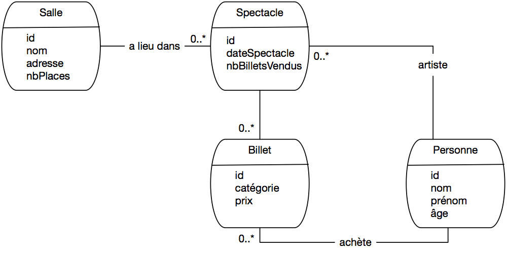
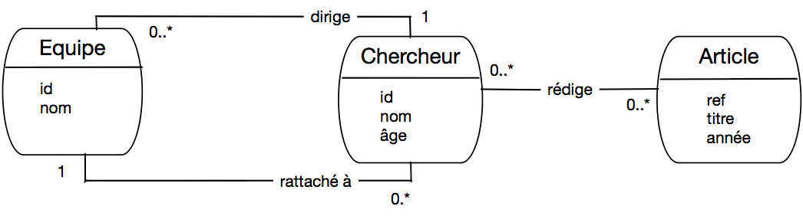
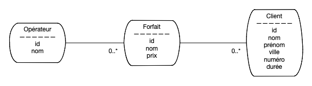

.. _chap-annales:

###################
Annales des examens
###################

**************************
Examen blanc, janvier 2019
**************************

Le schéma de base de données suivant sera utilisé pour l'ensemble du
sujet. Il permet de gérer une plateforme de vente de billets de spectacles en ligne :

  - Personne(id, nom, prénom, age)
  - Salle(id, nom, adresse, nbPlaces)
  - Spectacle (id, idArtiste, idSalle, dateSpectacle, nbBilletsVendus)
  - Billet (id, idSpectateur, idSpectacle, catégorie, prix)

Notez que les artistes et les spectateurs sont des personnes. Tous les attributs **id**
sont des clés primaires, ceux commençant par **id** sont des clés étrangères.

Conception (5 points)
===================== 

 - Donnez le modèle entité / association correspondant au schéma de notre base.
 - Pensez-vous qu'une association a été réifiée? Si oui, laquelle?
 - Donnez la commande de création de la table ``Spectacle``
 - On veut qu'un même spectateur puisse avoir au plus un billet pour un spectacle.  
   Quelle dépendance fonctionnelle cela ajoute-t-il? Que proposez-vous pour en tenir compte dans le schéma?
  

SQL  (6 points)
===============

**Question de cours**. Deux requêtes syntaxiquement différentes sont équivalentes si

  - Elles peuvent donner le même résultat
  - Elles donnent toujours le même résultat, quelle que soit la base

Indiquez la bonne réponse.
   

Donnez les expressions SQL des requêtes suivantes
   
  - Noms des artistes âgés d'au moins 70 ans qui ont donné au 
    moins un spectacle dans la salle 'Bercy' 
  - Donnez le nom des artistes, des salles où ils se sont produits, 
    triés sur le nombre de billets vendus
  - Quelles personnes n'ont jamais acheté de billet?
  - Donnez la liste des spectateurs ayant acheté au moins 10 billets,
    affichez le nom, le nombre de billets et le prix total.

Algèbre (5 points)
==================

Voici 3 relations.

    .. csv-table:: 
        :header:  "A",  "B", "C", "D"
        :widths: 4, 4, 4, 4

        1 ,  0 ,  1,   2
        4 ,  1,   2,   2
        6,   2,   6,   3
        7,   1,   1,  3
        1,   0,   1,   1
        1,   1,   1,   1

Relation R

    .. csv-table:: 
        :header:  "A",  "B", "E"
        :widths: 4, 4, 4

        1, 0, 2
        4, 1, 2
        1, 0, 7
        8, 6, 6

Relation S

    .. csv-table:: 
        :header:  "A",  "B", "E"
        :widths: 4, 4, 4

        1, 0, 2
        4, 2, 2
        1, 0, 7
        8, 6, 5
        8, 5, 6

Relation T

  - Pour quelle requête le résultat contient-il plus d’un nuplet?  Attention: souvenez-vous que l'opérateur
    de projection élimine les doublons.

      #.  :math:`\pi_{A,C} (\sigma_{B=0}(R))`
      #. :math:`\pi_{A,C} (\sigma_{D=0}(R))`
      #. :math:`\pi_{A,C} (\sigma_{B=0}(R) \cup \sigma_{D=0}(R))`
      #.  :math:`\pi_{A,C} (\sigma_{A=C}(R)`

  - Combien de nuplets retourne la requête :math:`\pi_{A,B,E} (S \Join_{A=A \land B=B} R)`?

       #. 2
       #. 3
       #. 4
       #. 5

  - Combien de nuplets retourne la requête :math:`R \Join_{A=A \land B=B} (S \cup T)`?

       #. 3
       #. 5
       #. 7
       #. 9

  - Donnez l'expression algébrique pour la requête "Noms et prénoms des spectateurs qui ont 
    acheté au moins une fois un billet de plus de 500 euros."
  - Donnez l'expression algébrique pour la requête "Id des personnes qui ne sont pas des artistes"

Transactions (4 points)
=======================

On prend le schéma donné au début de l'examen.
      
  - **Question de cours**. Quel est le principal inconvénient du mode ``serializable``?

       #. Le système ne peut exécuter qu’une transaction à la fois
       #. Certaines transactions sont mises en attente avant de pouvoir finir
       #. Certaines transactions sont rejetées par le système

    Indiquez la bonne réponse
   
  - Exprimez au moins un critère de cohérence de cette base 
 

  - On écrit une procédure de réservation d'un billet pour un spectacle.

    .. code-block:: python

         Reserver (v_idSpectateur, v_idSpectacle, v_categorie,v_ prix)
           # Requête SQL de mise à jour du spectacle
           requêteA
           # Requête SQL d'insertion du billet
          requêteB
         
Donnez les deux requêtes SQL, indiquez l'emplacement du ``commit``
et justifiez-les brièvement.

Correction de l'examen
======================

Conception
----------

Le schéma E/A est donné dans la :numref:`examen_blanc_2019`. Notez que l'on ne représente pas
les clés étrangères comme attributs des entités: les clés étrangères sont le mécanisme *du modèle 
relationnel* pour représenter les liens entre entités. Dans le *modele EA*, ces liens sont
des associations, et il serait donc redondant de faire figure également les clés étrangères 

Le nommage des assocations et des attributs est libre, l'important est de privilégier la clarté
et la précision, notamment pour les associations.

.. _examen_blanc_2019:

   
      Le schéma E/A après rétro-conception

Le type d'entité ``Billet`` est issu d'une réification d'une association plusieurs-plusieurs. La principale
différence est que les billets ont maintenant leur identifiant propre, alors que l'association plusieurs-plusieurs
est identifiée par la paire (idSpectacle, idPersonne).

Voici la commande de création de la salle. On a choisi de mettre ``not null`` partout 
pour maximiser la qualité de la base, ce sont des contraintes que l'on peut facilement
lever si nécessaire.

.. code-block:: sql

    create table Spectacle (id integer not null,
           idArtiste integer not null,
           idSalle integer not null,
           dateSpectacle date not null,
           nbBilletsVendus integer not null,
           primary key (id),
           foreign key (idArtiste) references Personne (id),
           foreign key (idSalle) references Salle (id)
           )
           

Dans le schéma relationnel proposé,
il est possible d'avoir plusieurs billets (avec des identifiants distincts)
pour le même spectacle et le même spectateur. C'est un effet de la réification: on a perdu
la contrainte d'unicité sur la paire (idSpectacle, idPersonne).

On peut se poser la question d'ajouter ou non cette contrainte. Si oui, alors 
(idSpectacle, idSpectateur) devient une clé secondaire, que l'on déclare avec
la clause ``unique`` dans la commande de création de la table ``Billet``.

.. code-block:: sql

    create table Billet (id integer not null,
           idSpectacle integer not null,
           idSpectateur integer not null,
           catégorie varchar(4) not null,
           prix float non null,
           primary key (id),
           unique (idSpectacle, idSpectateur),
           foreign key (idSpectacle) references Spectacle (id),
           foreign key (idSpectateur) references Personne (id)
           )

SQL
---

Deux requêtes sont  équivalentes si elles donnent toujours le même résultat, quelle que soit la base.

.. code-block:: sql

    select p.nom
    from Personne as p, Spectacle s, Salle l
    where p.id = s.idArtiste and s.idSalle = l.id 
    and l.nom = 'Bercy' and p.age >= 70

.. code-block:: sql

     select p.nom as nomArtiste, s.nom as nomSalle, sp.nbBilletsVendus
     from Peronne as p, Spectacle as sp, Salle as s
     where p.id = sp.idArtiste
     and sp.idSalle = s.id
     order by sp.nbBilletsVendus

.. code-block:: sql

    select prénom, nom
    from Personne as p
    where not exists (select '' from Billet where idSpectateur = p.id)

.. code-block:: sql

    select p.nom, count(*), sum(prix)
    from Personne as p, Billet as b
    where p.id = b.idSpectateur
    group by p.id, p.nom
    having count(*) >= 10

Algèbre
-------

  - La requête 4 renvoie 2 nuplets: (1,1) et (6,6)
  - La requête renvoie 3 nuplets: (1,0,2), (1,0,7) et (4,1,2)
  - La requête renvoie également 3 nuplets
  - :math:`\pi_{nom, prenom}(Personne \underset{id=idSpectateur}{\bowtie} \sigma_{prix > 500}(BILLET))`
  - :math:`\pi_{id}(Personne) - \pi_{idArtiste} (Spectacle)`

Transactions
------------

Le mode sérialisable entraîne des rejets de transactions.

Le nombre de billets vendus (``nbBilletsVendus`` dans ``Spectacle``) pour un spectacle est égal au nombre
de lignes dans ``Billet`` pour ce même spectacle.

Autre possibilité: pas plus de billets vendus que de places dans la salle.

Un ``update`` de ``Spectacle`` pour incrémenter ``nbBilletsVendus``,

.. code-block:: sql

     update Spectacle set nbBilletsVendus=nbBilletsVendus+1 where idSpectacle=v_idSpectacle
     
et un ``insert`` dans ``Billet``. 

.. code-block:: sql

     insert into Billet (id, idSpectateur, idSpectacle, catégorie, prix)
     value (1234, v_idSpectateur, v_idSpectacle, v_catégorie, v_prix)

Le ``commit`` vient à la fin car c'est seulement à ce moment
que la base est à nouveau dans un état cohérent. 

****************************
Examen session 2, avril 2019
****************************

Soit la base de données suivante permettant de gérer un championnat de football.

  - Stade(**id**, ville, nom, nbPlaces, prixBillet)
  - Equipe(**id**, pays, siteWeb, entraîneur)
  - Joueur(**id**, *idEquipe*, nom, prénom, âge)
  - Match(**id**, *idStade*, dateMatch, *idEquipe1*, *idEquipe2*, scoreEquipe1, scoreEquipe2, nbBilletsVendus)
  - But(**idJoueur, idMatch, minute**, penalty)

Tous les attributs **en gras** sont des clés primaires, ceux *en italiques* sont des clés étrangères. Notez
qu'une clé étrangère peut faire partie d'une clé primaire.

Chaque pays a une seule équipe en compétition. Une ville peut avoir plusieurs stades. 
L'attribut ``But.penalty`` vaut VRAI si le but a été marqué suite a un penalty (coup de pied de réparation) ou 
FAUX dans le cas contraire. Le nom de l'entraîneur d'une équipe est donné par l'attribut ``Equipe(entraîneur)``. 

Conception (6 points)
=====================

Etudions la conception de cette base en répondant aux questions suivantes.

 - Avec ce schéma, une équipe peut-elle jouer contre elle-même? Expliquez.
 - Avec ce schéma, un joueur peut-il marquer un but dans un match auquel
   son équipe ne participe pas? Expliquez.
 - Est-il possible de savoir dans quelle ville a été marqué chaque but? Expliquez.
 - Donnez le schéma entité-association correspondant aux relations ``Match``, ``Equipe``, ``Stade``.
 - Donnez la commande SQL de création de la table ``Match``.
 - Citer au moins une clé *candidate* autre que la clé primaire  parmi les attributs des tables (bien lire l'énoncé). 
   Quel serait l'impact si on la choisissait comme clé primaire?
 - Un de vos collègues propose de modéliser un but comme une association plusieurs-plusieurs
   entre un joueur et un match. Cela vous semble-t-il une bonne idée? Cela correspond-il 
   au schéma relationnel de notre base?
   
SQL (8 points)
==============

Exprimez les requêtes suivantes en SQL.
 
 - Noms des joueurs âgés de plus de 30 ans qui ont 
   marqué un but dans la première minute de jeu. 
 - Noms des joueurs français qui n'ont marqué aucun but
 - Le prix du billet le plus cher
 - Donnez le nom des entraineurs avec le nombre de buts marqués par leur équipe
 - Donnez le nom des joueurs ayant marqué un but dans un match auquel leur équipe
   ne participe pas.  
 - Les noms des joueurs français qui ont marqué un but lors d'un match entre la France et la Suisse 
   joué à Lille. Attention:  dans la table ``Match``
   la France peut être l'équipe 1 ou l'équipe 2. Il faut
   construire la requête qui correspond aux deux cas.

Algèbre (3 points)
==================

 - Donnez l'expression algébrique de la première requête SQL (section précédente)
 - Donnez l'expression algébrique pour la seconde requête (les joueurs français qui ne marquent pas)
 - Donnez la requête SQL correspondant à l'expression algébrique suivante et expliquez le sens de cette requête

.. math::

      \pi_{idMatch}(But \Join_{idMatch=id} \sigma_{scoreEquipe1=0 \land scoreEquipe2=0}(Match))

Programmation et transactions (3 points)
========================================

  - Parmi les phrases suivantes, lesquelles vous semblent exprimer une contrainte de *cohérence* correcte sur la base de données?

     - Pour chaque match nul, je dois trouver autant de lignes associées au match dans la table ``But`` pour l'équipe 1 et pour l'équipe 2.
     - Quand j'insère une ligne dans la table ``But`` pour l'équipe 1, je dois effectuer également une insertion pour l'équipe 2 dans la table ``But``.
     - Si je trouve une ligne dans la table ``Match`` avec ``id=x``, ``scoreEquipe1=y`` et ``scoreEquipe2=z``, alors je dois trouver ``y+z`` lignes dans la table ``But`` avec ``idMatch=x``.
  
   - Voici un programme en pseudo-code simplifié à exécuter chaque fois qu'un but est marqué dans un match, par un joueur et au bénéfice de la première équipe. Les '\#' marquent des commentaires.

     .. code-block:: bash

         function marquer_but_eq1 (imatch, ijoueur, min, peno)
            startTransaction
            # A
            select scoreEquipe1 into :scoreE where idMatch = :imatch
            #B
            update Match set scoreEquipe1 = :scoreE + 1 where idMatch = :imatch
            # C
            insert into But (idMatch, idJoueur, minute, penalty)
            values (:idMatch, :ijoueur, :min, :peno)
            # D

Où faut-il selon-vous ajouter un ordre ``commit``?

   - Juste après ``B`` et ``C``
   - Juste après ``A``
   - Juste après ``D``

Justifiez votre réponse.
  
Supposons que je lance deux exécutions de  ``marquer_but_eq1`` en même temps.
Dans quel scénario l'exécution imbriquée amène-t-elle une incohérence?

Corrigé
=======

Conception
----------

  - Oui, la base permet de représenter un but marqué dans un match opposant deux équipes
    dont aucune n'est celle du joueur.
  - Oui, par transitivité :math:`But \to Match`, :math:`Match \to Stade`  et :math:`Stade \to Ville`.
  - Schéma

    .. code-block:: sql

         CREATE TABLE Match(
                id NUMBER(10), 
               idStade NUMBER(10), 
               dateMatch DATE, 
               idEquipe1 NUMBER(10), 
               idEquipe2 NUMBER(10), 
               scoreEquipe1 NUMBER(10), 
               scoreEquipe2 NUMBER(10),
               PRIMARY key (id),
               foreign key (idStade) REFERENCES Stade(id),
               foreign key (idEquipe1) REFERENCES Equipe(id),
               foreign key (idEquipe2) REFERENCES Equipe(id)
         );

  - Le pays est clé candidate pour l'équipe. Il faudrait alors l'utiliser comme clé étrangère 
    partout.

SQL
---

.. code-block:: sql

     select nom 
     from Joueur as j, But as b
     where j.id = b.idJoueur and j.age > 30 and b.minute = 1;

     select nom 
     from Joueur as j, Equipe as e
     where j.idEquipe = e.id 
     and e.pays = 'France' 
     and j.id not IN (select idJoueur from But);

     select prixBillet 
     from Stade as s1
     where not exists (select ''
                from Stade as s2
                where s2.prixBillet > s1.prixBillet);

     select entraineur, count(*)
     from Equipe as e, Joueur as j, But as b
     where e.id=j.idEquipe
     and b.idJoueur = j.id
     group by e.id, e.entraineur;

     select prénom, nom
     from Match as m, Joueur as j, But as b
     where e.id=j.idEquipe
     and b.idJoueur = j.id
     and m.id = b.idMatch
     and e.id != m.idEquipe1
     and e.id != e.idEquipe2

Il faut soit Match.equipe1='France', soit  Match.equipe2='France'. 

.. code-block:: sql

   select j.nom
   from Match m, Equipe e1, Equipe e2, Joueur j, Stade s, But b
   where m.idEquipe1 = e1.id 
   and m.idEquipe2 = e2
   and ((e1.pays = 'France' id and e2.pays='Suisse' and e1.id = j.idEquipe)
         or
     (e2.pays = 'France' id and e1.pays='Suisse' and e2.id = j.idEquipe))
   and m.idStade = s.id 
   and s.ville = 'Lille' 
   and b.idJoueur = j.id 
   and b.idMatch = m.id )

Algèbre
-------

.. math::

     \pi_{nom}(\sigma_{age > 30} (Joueur) \underset{id=idJoueur}{\bowtie} \sigma_{minute = 1}(But) )

Joueurs français:

.. math::

     A = \sigma_{pays='France'}(Joueur\;j) \underset{j.idEquipe = e.id}{\bowtie} Equipe\;e)

Joueurs français qui ont marqué au moins un but :

.. math::

     B = \sigma_{pays='France'}(But\;b \underset{b.idJoueur = j.id}{\bowtie} Joueur\;j) \underset{j.idEquipe = e.id}{\bowtie} Equipe\;e)

Résultat:

.. math::

    Resultat := A - B

Les matchs nuls 0-0 pour lequel il existe quand même un but.

.. code-block:: sql

   select idMatch
   from But as b, Match as m
   where b.idMatch=m.id
   and m.scoreEquipe1=0 
   and m.scoreEquipe2=0
   

******************************************
Examen session 1, présentiel, juillet 2019
******************************************

.. _examen-pres1-2019:

   
      Un laboratoire d'informatique

On cherche à modéliser un laboratoire d'informatique afin de pouvoir gérer 
ses équipes, ses chercheurs et leurs publications (articles).
L'analyse donne le schéma  entité/association de la :numref:`examen-pres1-2019`. 
À partir de cette analyse, quelqu'un propose le schéma 
relationnel suivant, dans lequel les clés primaires sont en gras
(à vous de trouver les clés étrangères):

  - Equipe (**id**, nom, idDirecteur)
  - Chercheur (**id**, nom, âge, idEquipe)
  - Article (**réf**, titre, année)
  - Rédige (**idChercheur**, réfArticle)

Conception (6 points)
=====================

  - Ce schéma relationnel représente-t-il correctement le modèle conceptuel de la :numref:`examen-pres1-2019`? 
    Vérifiez les clés primaires et étrangères et proposez éventuellement des corrections.
  - On veut ajouter la position d'un chercheur dans l'ordre des auteurs pour un article. Où
    placer cette information, dans le modèle entité association et dans le modèle relationnel?
  - Un article peut-il être rédigé par des chercheurs
    appartenant à des équipes différentes (justifiez)?
  - Un chercheur peut-il diriger une équipe à laquelle il n'est pas rattaché (justifiez)?
  - Donnez les commandes ``create table``  pour les tables ``Chercheur``, ``Article`` et ``Rédige``
    (en tenant compte des corrections éventuelles de la question 1).

    .. ifconfig:: correctionlabo in ('public')

      .. admonition:: Correction

         - La clé de ``Rédige`` doit comprendre ``réfArticle`` en plus de ``idAuteur``
         - On ajoute la position dans l'association ``Rédige`` (et dans la table correspondante).
         - Oui, pas de restriction dans le schéma
         - Oui, pas de restriction dans le schéma
         - Standard. Exemple pour la relation ``Rédige``:
                  
           .. code-block:: sql

              create table Redige (idAuteur    int not null,
                     réfArticle  varchar (10) not null,
                     primary key (idAuteur, réfArticle),
                     foreign key (idAuteur) references Chercheur(id),
                     foreign key (réfArticle) references Article(id));

SQL (8 points)
==============

Exprimez les requêtes suivantes en SQL.

  - Noms des chercheurs de l'équipe nommée ``Vertigo``
  - Titre des articles parus depuis 2015 dont l'un au moins des auteurs appartient à l'équipe ``ROC``
  - Quels articles n'ont pas d'auteur?
  - Titre des articles parus depuis 2015 dont tous les auteurs appartiennent à l'équipe ``ROC`` (aide: 
    la quantification universelle se remplace par la quantification existentielle et la négation)
  - Nom des chercheurs qui dirigent une équipe à laquelle ils n'appartiennent pas
  - Nom des chercheurs qui dirigent plus d'une équipe.

    .. ifconfig:: correctionlabo in ('public')

      .. admonition:: Correction

        .. code-block:: sql 
        
            select c.nom as nomChercheur
            from Chercheur as c, Equipe as e
            where  e.nom='Vertigo' and c.idEquipe=e.id

        .. code-block:: sql

               select distinct titre
               from article as a, chercheur as c, equipe as e, redige as r
               where a.ref = r.efarticle
               and r.idchercheur=c.id
               and c.idequipe=e.id
               and a.annee >= 2015
               and e.nom = 'ROC '

        .. code-block:: sql
         
            select a.titre 
            from Article as a
            where  no exists (select 'x' 
                              from Rédige where réfArticle=a.réf)

           select a.titre 
            from Article as a
            where   a.réf not in (select réfArticle
                              from Rédige)

        .. code-block:: sql

               select titre
               from article as a
               where a.annee >= 2015
               and not exists (select '' from Redige as r, Chercheur as c, Equipe as e
                               where r.refArticle = a.ref and c.id=r.idAuteur
                               and e.id=c.idEquipe and not (e.nom = 'ROC'))

        .. code-block:: sql

               select c.nom as nomChercheur
               from Chercheur as c, Equipe as e
               where  e.idDirecteur = c.id
               and e.id <> c.idequipe

        .. code-block:: sql

              select c.id as idChercheur, c.nom as nomChercheur, count(*) as nbEquipes
               from chercheur as c, equipe as e
               where e.idDirecteur=c.id
               group by c.id, c.nom
               having count(*) >1

              select e.idDirecteur, count(*) as nbEquipes
               from Equipe as e
               group by e.idDirecteur
               having count(*) >1

Algèbre (3 points)
==================

  - Donnez l'expression algébrique pour les deux premières requêtes SQL (section précédente)
  - Donnez la requête SQL correspondant à l'expression algébrique suivante et expliquez-en le sens.

    .. math::
          
          \pi_{id} (Chercheur) - \pi_{idChercheur} (R\acute{e}dige)

   
  .. ifconfig:: correctionlabo in ('public')  

      .. admonition:: Correction
         
          - :math:`\pi_{nom}(\pi_{id} (\sigma_{nom = 'Vertigo'} (Equipe)) \underset{id=idEquipe}{\bowtie} Chercheur )`
          - :math:`\pi_{titre} ( (  (\sigma_{annee \geq 2015} (Article) \underset{ref=refArticle}{\bowtie} Redige) \underset{idChercheur=id}{\bowtie} Chercheur ) \underset{idEauipe=id}{\bowtie} \sigma_{nom = 'ROC'} Equipe)`
          - L'expression recherche les chercheurs qui n'ont rien publié.

            .. code-block:: sql

                  select id
                  from Chercheur 
                  where id not in (select idChercheur from Rédige)

Valeurs nulles (2 pts)
======================

Le tableau suivant montre une instance de ``Article``. Les cellules
blanches indiquent des valeurs inconnues.

.. csv-table:: 
   :header: réf, titre, année
   :widths: 4, 4, 4

     AR243, Les ordinateurs pensent-ils?, 2018 
     AR254, Money for nothing,
     AR20,  , 2010

Donnez le résultat des requêtes suivantes:

.. code-block:: sql

      select réf from Article where année > 2015;

      select réf from Article where année <= 2015;

      select réf from Article where annee > 0 or titre is not null;
      
      select réf from Article where (année < 2015 or année IS null) 
          and titre like `%`

.. ifconfig:: correctionlabo in ('public')

      .. admonition:: Correction

            - AR243
            - AR20
            - AR243, AR254, AR20
            - AR254

Transactions (1 pt)
===================

Soit deux transactions concurrentes  :math:`T_1` et  :math:`T_2`. Quelle(s) affirmation(s), parmi les suivantes, est (sont) vraie(s) 
dans un système transactionnel assurant les propriétés ACID
en isolation complète.

  - Si :math:`T_2`  débute après :math:`T_1`, :math:`T_1`  ne voit jamais les  mises à jour de :math:`T_2`.
  - :math:`T_1`  ne voit pas ses propres mises à jour tant qu'elle n'a pas validé.
  - Si :math:`T_2`  débute après :math:`T_1`, :math:`T_1`  ne voit les  mises à jour de :math:`T_2` qu'après  que :math:`T_2` a effectué un ``commit``.
  - Si  :math:`T_1`  et :math:`T_2` veulent modifier le même nuplet, cela déclenche un interblocage (``deadlock``).

.. ifconfig:: correctionlabo in ('public')

      .. admonition:: Correction

          Seule la première affirmation est vraie

********************************************
Examen session 2, présentiel, septembre 2020
********************************************

Voici une partie de la base de données utilisée pour gérer des œuvres
dans un musée:
 
  - Oeuvre(**idOeuvre**, nom, idPropriétaire, idAuteur)
  - Personne(**idPersonne**, nom, prénom)
  - Expertise(**idExpertise**, idOeuvre, idExpert,  valeur)

Les auteurs, les propriétaires et les experts sont des personnes bien entendu. 
Les clés primaires sont en gras,
les clés primaires ne sont pas explicitement indiquées.

Schéma relationnel (6 points)
=============================

  - Pour chaque table, donner les dépendances fonctionnelles liant les clés 
    primaires et clés étrangères (1 point)
  - En déduire les associations de type  
    *plusieurs à 1* du schéma Entité/Association correspondant à ce schéma 
    relationnel (1 point)
  - Donner ce schéma Entité/Association complet (1 point)
  - Donner des commandes SQL permettant de créer les tables
    ``Oeuvre``  et ``Personne``  (1 point) 
  - J'ajoute la contrainte *Un expert ne peut évaluer une œuvre qu'une 
    seule fois*. Quelle est la dépendance fonctionnelle correspondante
    et quel changement du schéma relationnel proposez-vous?  (1 point) 
  - Ce schéma permet-il de représenter le fait qu'une personne peut être à la fois  
    propriétaire et auteur d'une
    même  œuvre? Argumentez votre réponse. (1 point) 

.. ifconfig:: correctionoeuvre in ('public')

     .. admonition:: Correction

        #. Dépendances entre clés primaires et clés étrangères :
    
          - Dans ``Oeuvre``: :math:`idOeuvre \to idAuteur` et :math:`idOeuvre \to idProprietaire`
          - Dans ``Expertise``: :math:`idExpertise \to idOeuvre` et :math:`idExpertise \to idExpert`

        #. Chaque DF correspond à une association plusieurs à 1 (cf l'algorithme de normalisation). 
           On a donc ce type d'association entre Oeuvre et Personne, avec la sémantique "Auteur",
           entre Oeuvre et Personne une seconde fois mais avec la sémantique "Propriétaire",
           entre Expertise et Oeuvre et entre Expertise et Personne.
        #. Le schéma EA se déduit immédiatement de ce qui précède. Il n'y a pas d'association
           plusieurs à plusieurs.
        #. 
          .. code-block:: sql

              CREATE TABLE Personne (
                 idPersonne INTEGER NOT NULL,
               nom VARCHAR NOT NULL,
                prénom VARCHAR NOT NULL,
                PRIMARY KEY (idPersonne)
                );
   
            CREATE TABLE Oeuvre (
                idOeuvre INTEGER NOT NULL,
                nom VARCHAR,
                idAuteur INTEGER NOT NULL,
                idPropriétaire INTEGER NOT NULL,
                PRIMARY KEY (idOeuvre),
                FOREIGN KEY (idAuteur) REFERENCES Personne (idPersonne) 
                FOREIGN KEY (idPropriétaire) REFERENCES Personne (idPersonne) 
                );
        #. On a donc la nouvelle dépendance :math:`(idExpert, idOeuvre) \to valeur`. 
           Du coup la table Expertise
           n'est plus en 3FN. Un changement possible est que ``(idExpert, idOeuvre)`` devienne la clé
           de Expertise. 
        #. Oui, rien n'empêche  idAuteur et idPropriétaire d'être égaux dans la table Oeuvre

SQL (7 points)
==============

  - Donner le nom du propriétaire et le nom de l'auteur pour l'œuvre dont l'identifiant est 'fg65'.
  - Donner les noms des œuvres expertisées par  leur propriétaire
  -  Donner les noms et prénoms des propriétaires d'une œuvre qui n'ont jamais effectué d'expertise.
  - Donner les œuvres et le nom des personnes qui n'en sont ni propriétaire, ni auteur.
  - Donner les noms et prénoms des personnes qui sont à la fois auteur, propriétaire et expert (mais pas forcément
    de la même œuvre). 
  - Pour chaque œuvre donnez la moyenne des valeurs estimées par les experts.
  - Donnez le nombre d'expertises pour les œuvres dont la valeur maximale estimée est de 10 000 Euros

.. ifconfig:: correctionoeuvre in ('public')

     .. admonition:: Correction

        .. code-block:: sql

             select p1.nom as nomAuteur, p2.nom as nomPropriétaire
             from Oeuvre as o, Personne as p1, Personne as p2
            where idOeuvre='fg65'
            and p.idAuteur=p1.idPersonne
            and p.idPropriétaire = p2.idPersonne;

         select p1.nom as nomAuteur, p2.nom as nomPropriétaire
         from Oeuvre as o, Expertise as e
         where o.idOeuvre=e.idOeuvre
         and o.idPropriétaire = e.idPersonne

         select  p.nom, p.prénom
         from Oeuvre as o, Personne as p
         where p.idPropriétaire = p.idPersonne
         and p.idPersonne not in (select idExpert from Expertise)

         select  o.nom as nomOeuvre, p.nom as nomPersonne
         from Oeuvre as o, Personne as p
         where o.idPropriétaire != p.idPersonne
         and   o.idAuteur != p.idPersonne

         select  distinct p.nom
         from  Personne as p, Oeuvre as o1, Oeuvre as o2, Expertise as e
         where o1.idPropriétaire = p.idPersonne
         and    o2.idAuteur = p.idPersonne
         and   e.idExpert = p.idPersonne 

         select  o.nom, avg(valeur)
         from  Oeuvre as o, Expertise as e
         where o.idOeuvre = e.idOeuvre
         group by o.idOeuvre, o.nom

         select  o.nom, count(*)
         from  Oeuvre as o, Expertise as e
         where o.idOeuvre = e.idOeuvre
         group by o.idOeuvre, o.nom
         having max(valeur) <= 10000

Un peu de logique (3 points)
============================

On dispose de deux prédicats :math:`Auteur(x)` et :math:`Prop(x)` qui sont vrais si,
respectivement, :math:`x` est auteur ou :math:`x` est propriétaire.

  - Quelle formule exprime la condition "Soit :math:`x`  est propriétaire, soit :math:`x` est auteur mais pas les deux"
  - Quelle est la négation de l'énoncé : "Soit :math:`x` est propriétaire, soit :math:`x` est auteur"
  - Comment exprimer l'énoncé suivant sans implication: "Si :math:`x` est auteur, alors :math:`x` n'est pas propriétaire"
    (utiliser uniquement les connecteurs de SQL: and, or et not).

.. ifconfig:: correctionoeuvre in ('public')

     .. admonition:: Correction
  
         - :math:`Auteur(x) \lor Prop(x) \land \neg (Auteur(x) \land Prop(x))`
         - :math:`\neg Auteur(x) \land \neg Prop(x)`
         - :math:`L'implication :math:`p \to q` est équivalente à :math:`\neg p \lor q`.
           Donc en SQL on écrirait cette formule : :math:`not(Auteur(x)) \lor Prop(x)`

Algèbre (2 points)
==================

On dispose de deux tables :math:`T_1(A,B,C)` et 
:math:`T_2(D,E,F)`. Donnez une  expression algébrique équivalente 
à la suivante, avec les contraintes suivantes: on peut utiliser  la jointure mais 
pas le  produit cartésien, et 
une sélection doit s'apppliquer directement à une table. 

.. math::

     \sigma_{A=C \land C > B \land E =F} (T_1 \times T_2)

.. ifconfig:: correctionoeuvre in ('public')

     .. admonition:: Correction
    
        .. math::
        
             \sigma_{A=C \land C > B} (T_1) \Join \sigma_{A=C \land E > F}(T_2)$$

Transactions (2 points)
=======================

On dispose d'une table :math:`T (id, valeur)`. 
Initialement toutes les valeurs sont différentes. 
Voici une procédure qui échange les valeurs de 2 nuplets.

.. code-block:: sql

     create or replace procedure Echange (id1 INT, id2 INT) AS
        -- Déclaration des variables
            val1, val2 integer;
        begin
            -- On recherche la valeur de id1 et de id2
            select valeur into val1 from T where id = id1
            select valeur into val2 from T where id = id2

            -- On échange les valeurs
            update T SET valeur = val1 where id = id2
            update T SET valeur = val2 where id = id1

         end;

On est en mode ``Autocommit``: un ``commit`` a lieu après chaque requête SQL. Expliquez
dans quel scénario l'exécution concurrente de deux procédures d'échange peut aboutir
à ce que deux nuplets aient la même valeur.

.. ifconfig:: correctionoeuvre in ('public')

     .. admonition:: Correction
 
        La première procédure s'exécute jusqu'à la fin du premier UPDATE. Un ``commit`` automatique
        a lieu: les deux nuplets sont alors égaux. Si la seconde procédure commence alors, elle trouvera
        une base avec deux nuplets égaux, ce qui ne devrait jamais arriver avec nos hypothèses en mode sérialisable.

************************************
Examen session 1, FOAD, janvier 2022
************************************

Le schéma de base de données suivant sera utilisé pour l'ensemble du
sujet. Il permet de gérer les souscriptions pour un ensemble
d'opérateurs de téléphonie mobile. Ce schéma sera nommé **schéma final**
par la suite.

 - Opérateur (**id**, nom)
 - Forfait (**id**, nom, idOpérateur, prix)
 - Client(**id**, nom, prénom, ville)
 - Souscription(**idClient, idForfait**, durée, numéro)
 - Résiliation (id, dateResiliation, portabilité, idNouvelleSouscription)

L'attribut *durée* est un entier positif exprimant le nombre de mois d'engagement.
les clés étrangères ne sont pas indiquées.

Conception (8 points)
=====================

La :numref:`forfait_telephone` montre une modélisation initiale de la
base par un schéma entité association.

.. _forfait_telephone:

   
      Modélisation initiale de la base

Questions: 

 - Donnez la liste des dépendances fonctionnelles définies par ce schéma initial (1 pt)
 - Donnez le schéma relationnel correspondant à la :numref:`forfait_telephone`,
   sous forme simplifiée (Nom de table, liste des attributs 
   en encadrant les clés primaires et en soulignant les clés étrangères) (1 pt)
 - Quelles sont les différences entre le schéma initial et le schéma final ? À quelle(s)
   évolution(s) des choix de modélisation ce changement correspond-t-il (2 pts) ?
 - Dessinez le schéma final sous forme entité-association. Quelles dépendances fonctionnelles ont changé
   par rapport au schéma initial ? (1 pt)
 - Dans le schéma final, une réification serait-elle possible? Quels changements impliquerait-elle ? (1 pt)?
 - Donnez les commandes ``create table`` pour le schéma final (2 pts)

.. ifconfig:: soloperateur in ('public')

     .. admonition:: Correction

		.. _forfait_telephone_final:
		.. figure:: ../../figures/forfait_telephone_final.png
			:width: 80%
			:align: center
		
			Modélisation finale de la base

		- Chaque entité définit une DF de la clé vers les attributs, et chaque association plusieurs-un
		  définit une DF entre les clées. Donc : :math:`idOpérateur \to nom` ; 
		  :math:`idForfait \to nom, prix, idOpérateur` ; 
		  :math:`idClient \to  nom, prénom, ville, numéro, durée, idForfait`
		- Schéma relationnel :

			- Opérateur (**id**, nom)
			- Forfait (**id**, nom, *idOpérateur*, prix)
			- Client(**id**, nom, prénom, ville, durée, numéro, *idForfait*)

		- Dans le schéma initial, un client peut prendre un seul forfait, d'où
		  la DF :math:`idClient \to idForfait`. Dans le schéma final un client peut prendre
		  plusieurs forfaits (mais pas plusieurs fois le même), avec donc plusieurs numéros.
		- Voir :numref:`forfait_telephone_final`. Une nouvelle  clé est définie par
		  l'association plusieurs-plusieurs, avec la DF :math:`idClient, idForfait \to durée, numéro`
		- En réifiant l'association  plusieurs-plusieurs, on attribuerait un identifiant propre
		  à la souscription, et un même client pourrait prendre plusieurs fois le même forfait,
		  ce qui n'est pas possible dans le schéma final. Dans une "vraie" base, ce serait sans
		  doute souhaitable.
		- Classique. La table ``Souscription` est typique d'une association plusieurs-plusieurs.

		.. code-block:: sql 

			create table Souscription
 			  (idClient integer not null,
			    idForfait varchar not null,
			    durée integer not null,
			    numéro integer not null,
			     primary key(idClient, idForfait),
			     foreign key (idClient) references Client (id),
			     foreign key (idForfait) references Forfait (id));

SQL (7 points)
==============

Exprimez en SQL les requêtes suivantes **sur le schéma final, 
donné dans l'énoncé de l'examen.**
 
 - Nom et prénom des clients qui ont souscrit un forfait avec engagement de plus de 24 mois.

   .. ifconfig:: soloperateur in ('public')

     .. admonition:: Correction

		.. code-block:: sql
		
			select c.nom, c.prenom
			from Client as c, Souscription as s
			where s.idClient = c.id and s.duree > 24;

 - Existe-t-il deux clients qui auraient le même numéro de téléphone pour le même forfait ?
   Donnez leurs noms et prénoms (des .clients)

  .. ifconfig:: soloperateur in ('public')

     .. admonition:: Correction

		.. code-block:: sql

			select nom, c.prenom
			from Client as c1, Souscription as s1,
			      Client as c2, Souscription as s2
			where c1.id = s1.idClient,
			and c2.id = s2.idClient
			and s1.idForfait = s2.idForfait
			and c1.numéro = c2.numéro

 - Noms des clients qui ont un forfait nommé 
   ``Audace`` et un autre nommé ``Privilège`

  .. ifconfig:: soloperateur in ('public')

     .. admonition:: Correction

		.. code-block:: sql
		
			select nom, c.prenom
			from Client as c, Souscription as s1, Souscription as s2,
			       Forfait as f1, Forfait as f2
			where c.id = s1.idClient,
			and c.id = s2.idClient
			and s1.idForfait = f1.idForfait
			and s2.idForfait = f2.idForfait
			and f1.nom='Audace' and f2.nom='Privilège'

 - Quels clients n'ont pas souscrit de forfait ?
 
   .. ifconfig:: soloperateur in ('public')

     .. admonition:: Correction
     
		.. code-block:: sql

			select c.nom, c.prenom
			from Client as c
			where not exists
			    (select * from Souscription as s
			         where c.id = s.idClient)

 - Quels opérateurs n'ont pas de client à Lyon ?

   .. ifconfig:: soloperateur in ('public')

     .. admonition:: Correction
     
		.. code-block:: sql

			select o.nom
			from Opérateur as o
			where not exists
			    (select * from Forfait as f, Souscription as s, Client as c
			         where o.id=f.idOpérateur
			         and   f.id=s.idForfait
			         and   s.idClient=c.id
			         and  c.ville='Lyon')

 - Donnez le nombre de souscriptions pour chaque forfait de l'opérateur ``Violet``.

   .. ifconfig:: soloperateur in ('public')

     .. admonition:: Correction
     
		.. code-block:: sql

			select f.nom, count(*) as nbSouscriptions
			from Opérateur as o, Forfait as f, Souscription as s
			where o.id=f.idOpérateur
			and   f.id=s.idForfait
			and   o.nom='Violet'
			group by f.id, f.nom

 - Quels clients ont deux souscriptions  ou plus ? Donnez le nombre de souscriptions.

   .. ifconfig:: soloperateur in ('public')

     .. admonition:: Correction
     
		.. code-block:: sql

			select c.nom, c.prénom, count(*) as nbSouscriptions
			from Client as c, Souscription as s
			where c.id=s.idClient
			group by c.id, c.nom
			having count(*) > 1

Algèbre relationnelle (3 pts)
=============================

 -  Expliquez ce que fait la requête algébrique suivante, et donnez une expression 
    SQL équivalente
    
    .. math:: 

   	    \pi_{nom, prenom}(\sigma_{ville='Paris'}(Client) \underset{id=idClient}{\bowtie} (\sigma_{duree > 24}(Souscription) \underset{idForfait=id}{\bowtie} \sigma_{nom='\rm{Audace}'} (Forfait))

 - Même question pour l'expression suivante
 
   .. math:: 
   
	  \pi_{c.id, c.nom, c.prenom} (Client) - \pi_{c.id, c.nom, c.prenom} (Client \underset{c.id=s.idClient}{\bowtie} \sigma_{duree \geq 48} (Souscription))

   .. ifconfig:: soloperateur in ('public')

     .. admonition:: Correction
 
 			Les clients qui n'ont pas de souscription supérieure à 48 mois.

 - Voici une expression SQL ``algébrique''
 
   .. code-block:: sql 

		select c.nom, c.prénom
		from (Client as c join Souscription as s on c.id=s.idClient)
	        join (select * from Forfait as f where nom= 'Audace')
                 on s.idForfait = f.id
                 
   Donnez une expression SQL "déclarative" équivalente, et sans requête imbriquée.

   .. ifconfig:: soloperateur in ('public')

     .. admonition:: Correction
 
    	.. code-block:: sql 

		select c.nom, c.prénom
		from Client as, Souscription as s, Forfait as f
		where c.id=s.idClient
		and f.nom= 'Audace'
		and s.idForfait = f.id
           

Jointure externe (2 pts)
========================

Que renvoie la requête suivante ?

.. code-block:: sql 

	select c.nom, c.prénom, f.nom
	from (Client as c outer join (Souscription as s join Forfait as f
                                     on s.idForfait=f.id)
            on c.id = s.idClient
	where ville= 'Nantes'

.. ifconfig:: soloperateur in ('public')

     .. admonition:: Correction

		On obtient tous les clients de Nantes, et leurs forfaits. Si un client n'a aucun forfait, une ligne
		est produite quand même, avec le nom du forfait à ``null``.

