.. _chap-etudecas:

Voici une étude de cas qui va nous permettre de récapituler à peu près tout
le contenu de ce cours. Nous étudions la mise en œuvre d'une base de données
destinée à soutenir une application  de messagerie (extrêmement simplifiée bien entendu).
Même réduite aux fonctionnalités de base, cette étude mobilise une bonne partie
des connaissances que vous devriez avoir assimilées. Vous pouvez vous contenter de lire
le chapitre pour vérifier votre compréhension. Il est sans doute également profitable
d'essayer d'appliquer les commandes et scripts présentés.

################
Une étude de cas
################

Imaginons donc que l'on nous demande de concevoir et d'implanter un système
de messagerie, à intégrer par exemple dans une application web ou mobile, 
afin de permettre aux utilisateurs de communiquer entre eux. Nous allons suivre la démarche
complète consistant à analyser le besoin, à en déduire un schéma de données adapté,
à alimenter et interroger la base, et enfin à réaliser quelques programmes
en nous posant, au passage, quelques questions relatives aux aspects transactionnels
ou aux problèmes d'ingénierie posés par la réalisation d'applications liées à une base de données.

**************************************
S1: Expression des besoins, conception
**************************************

.. admonition::  Supports complémentaires:

    * `Diapositives: conception <http://sql.bdpedia.fr/files/slcas-conception.pdf>`_
    * `Vidéo sur la conception <https://mediaserver.cnam.fr/videos/messagerie-conception/>`_ 

Dans un premier temps, il faut toujours essayer de clarifier les besoins. Dans la vie réelle,
cela implique beaucoup de réunions, et d'allers-retours entre la rédaction
de documents de spécification et la confrontation de ces spécifications aux
réactions des futurs utilisateurs. La mise en place d'une base de données est une entreprise délicate
car elle engage à long terme. Les tables d'une base sont comme les fondations d'une maison: il
est difficile de les remettre en cause une fois que tout est en place, sans avoir
à revoir du même coup tous les programmes et toutes les interfaces qui accèdent à la base.

Voici quelques exemples de besoins, exprimés de la manière la plus claire possible, et orientés
vers les aspects-clé de la conception (notamment la détermination des entités, de leurs
liens et des cardinalités de participation). 

  - "Je veux qu'un utilisateur puisse envoyer un message à un autre"
  - "Je veux qu'il puisse envoyer à *plusieurs* autres"
  - "Je veux savoir qui a envoyé, qui a reçu, quel message"
  - "Je veux pouvoir répondre à un message en le citant"

Ce n'est que le début. On nous demandera sans doute de pouvoir envoyer des fichiers,
de pouvoir choisir le mode d'envoi d'un message (destinataire principal, copie, copie cachée, etc.),
de formatter le message ou pas, etc

On va s'en tenir là, et commencer à élaborer un schéma entité-association. En première approche,
on obtient celui de la :numref:`ea-messagerie-1`. 

.. _ea-messagerie-1:
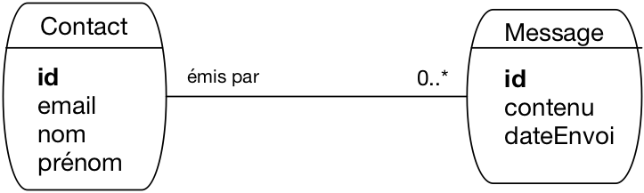
   
      Le schéma de notre messagerie, première approche

Il faut *nommer* les entités, définir leur *identifiant*
et les *cardinalités* des associations. Ici, nous avons une première ébauche
qui semble raisonnable. Nous représentons des entités qui émettent des messages.
On aurait pu nommer ces entités "Personne" mais cela aurait semblé exclure
la possibilité de laisser une *application* envoyer des messages (c'est le genre de point
à clarifier lors de la prochaine réunion). On a donc choisi d'utiliser le terme
plus neutre de "Contact".

Même si ces aspects  terminologiques peuvent sembler mineurs, ils impactent
la compréhension du schéma et peuvent donc mener à des malentendus. Il est donc important 
d'être le plus précis possible.

Le schéma montre qu'un contact peut envoyer plusieurs messages, mais qu'un message
n'est envoyé que par un seul contact. Il manque sans doute les destinataires du message.
On les ajoute donc dans le schéma de la :numref:`ea-messagerie-2`.

.. _ea-messagerie-2:
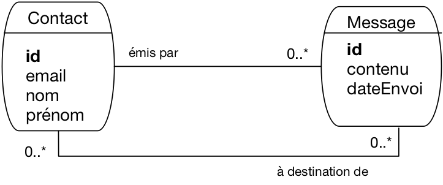
   
      Le schéma de notre messagerie, avec les destinataires

Ici, on a considéré qu'un message peut être envoyé à plusieurs contacts (cela fait
effectivement partie des besoins exprimés, voir ci-dessus). Un contact peut
évidemment recevoir plusieurs messages. Nous avons donc une première association
plusieurs-plusieurs. On pourrait la réifier en une entité nommée, par
exemple "Envoi". On pourrait aussi qualifier l'association avec des attributs propres: le mode d'envoi
par exemple serait à placer comme caractéristique de l'association, et pas du message 
car un même message peut être envoyé dans des modes différents en fonction du destinataire.
Une des attributs possible de l'association est d'ailleurs la date d'envoi: actuellement
elle qualifie le message, ce qui implique qu'un message est envoyé *à la même date*
à tous les destinataires. C'est peut-être (sans doute) trop restrictif. 

On voit que,
même sur un cas aussi simple, la conception impose de se poser beaucoup de questions.
Il faut y répondre en connaissance de cause:
la conception, c'est un ensemble de choix qui doivent être explicites et informés.

Il nous reste à prendre en compte le fait que l'on puisse répondre à un message. 
On a choisi de représenter de manière générale le fait qu'un message peut 
être le successeur d'un autre, ce qui a l'avantage de permettre la gestion
du cas des renvois et des transferts. On obtient le schéma de la :numref:`ea-messagerie`,
avec une association réflexive sur les messages.

 
.. _ea-messagerie:
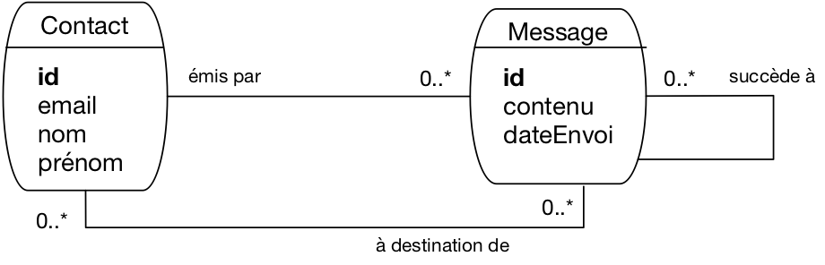
   
      Le schéma complet de notre messagerie

Un schéma peut donc avoir plusieurs successeurs (on peut y répondre plusieurs fois)
mais un seul prédécesseur (on ne répond qu'à un seul message). 
On va s'en tenir là pour notre étude.

À ce stade il n'est pas inutile d'essayer de construire  un exemple 
des données que nous allons pouvoir représenter avec cette modélisation
(une "instance" du modèle).
C'est ce que montre par exemple la :numref:`instance-messagerie`.

.. _instance-messagerie:
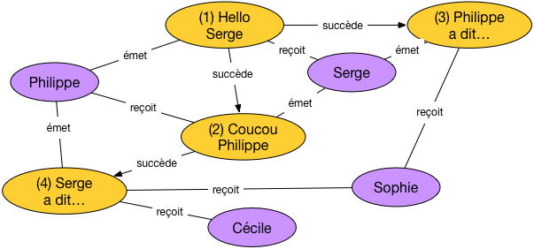
   
      Une instance (petite mais représentative)  de notre messagerie

Sur cet exemple nous avons quatre contacts et quatre messages. Tous les cas
envisagés sont représentés:

 - un contact peut émettre plusieurs messages (c'est le cas pour Serge ou Philippe)
 - un contact peut aussi recevoir plusieurs messages (cas de Sophie)
 - un message peut être envoyé à plusieurs destinataires (cas
   du message 4, "Serge a dit...", transmis à Sophie et Cécile)
 - un message peut être le successeur d'un (unique) autre (messages 2, 3, 4)
   ou non (message 1)
 - un message peut avoir plusieurs successeurs (message 1)
   mais toujours un seul prédécesseur.
   
Prenez le temps de bien comprendre comment les propriétés du modèle
sont représentées sur l'instance. 

Nous en restons là pour notre étude. Cela n'exclut en aucun cas d'étendre
le modèle par la suite (c'est inévitable, car des besoins complémentaires
arrivent toujours). Il est facile

  - d'ajouter des attributs aux entités ou aux associations existantes;
  - d'ajouter de nouvelles entités ou associations.
  
En revanche, il est difficile de revenir sur les choix relatifs aux entités
ou aux associations déjà définies. C'est une très bonne raison pour 
faire appel à toutes les personnes concernées, et leur faire valider
les choix effectués (qui doivent être présentés de manière franche et complète).

Quiz
====

.. eqt:: cas1-1

    Un message peut-il être émis par plusieurs contacts?
    
    A) :eqt:`I` Oui
    #) :eqt:`C` Non

.. eqt:: cas1-2

    Un contact peut-il exister sans avoir émis ou reçu un seul message?
    
    A) :eqt:`C` Oui
    #) :eqt:`I` Non

.. eqt:: cas1-3

    Parmi les attributs ci-dessous, lequel serait possible comme clé ?
    
    A) :eqt:`C` L'email du contact
    #) :eqt:`I` La date d'envoi du message 
    #) :eqt:`I` le contenu du message

.. eqt:: cas1-4

    Un message doit-il avoir le même émetteur que son prédécesseur?
    
    A) :eqt:`C` Non
    #) :eqt:`I` Oui

.. eqt:: cas1-5

    Quel est le nombre maximal d'ancêtres (prédécesseurs du prédécesseur)  d'un message
    
    A) :eqt:`C` Pas de limite
    #) :eqt:`I` Un
    #) :eqt:`I` Autant que de destinataires
    
.. eqt:: cas1-6

    Peut-on savoir si un contact a reçu plusieurs fois le même message?
    
    A) :eqt:`C` Non, à cause de l'identifiant de l'association "à destination"
    #) :eqt:`I` Bien sûr

*********************
S2: schéma de la base
*********************

.. admonition::  Supports complémentaires:

    * `Diapositives: schéma de la base <http://sql.bdpedia.fr/files/slcas-schema.pdf>`_
    * `Vidéo sur le schéma de la base <https://mediaserver.cnam.fr/videos/messagerie-schema/>`_ 

Maintenant, nous sommes prêts à implanter la base en supposant
que le schéma E/A de la :numref:`instance-messagerie` a été validé.
Avec un peu d'expérience, la production des commandes de création
des tables est directe. Prenons une dernière fois le temps d'expliquer
le sens des règles de passage.

.. note:: Pour appliquer les commandes qui suivent, vous
   devez disposer d'un accès à un serveur. Une base doit être créée. Par exemple:
   
   .. code-block:: sql
   
       create database Messagerie
       
   Et vous disposez d'un utilisateur habilité à créer des tables dans cette
   base. Par exemple:
   
   .. code-block:: sql
    
      grant all on Messagerie.* to athénaïs identified by 'motdepasse'

On raisonne en terme de dépendance fonctionnelle. Nous avons tout d'abord
celles définies par les entités.

  - :math:`idContact \to nom, prénom, email`
  - :math:`idMessage \to contenu, dateEnvoi`
  
C'est l'occasion de vérifier une dernière fois que tous les attributs
mentionnés sont atomiques (``email`` par exemple représente
*une seule* adresse électronique, et pas une liste) et qu'il
n'existe pas de dépendance fonctionnelle non explicitée. Ici,
on peut trouver la DF suivante:

  - :math:`email \to idContact, nom, prénom`
  
Elle nous dit que ``email``  est une clé candidate. Il faudra le prendre
en compte au moment de la création du schéma relationnel.

Voici maintenant les dépendances données par les associations.
La première lie un message au contact qui l'a émis. On a donc
une dépendance entre les identifiants des entités.

  - :math:`idMessage \to idContact` 

Un fois acquis que la partie droite est l'identifiant du contact, le nommage
est libre. Il est souvent utile d'introduire dans ce nommage la signification
de l'association représentée. Comme il s'agit ici de *l'émission* d'un
message par un contact, on peut représenter cette DF avec un nommage plus explicite.

  - :math:`idMessage \to idEmetteur` 

La seconde DF  correspond à l'association plusieurs-à-un liant un message
à celui auquel il répond. C'est une association réflexive, et pour le coup
la DF :math:`idMessage \to idMessage` n'aurait pas grand sens. On passe
donc directement à un nommage représentatif de l'association.

  - :math:`idMessage \to idPrédécesseur`

Etant entendu que ``idPrédécesseur``  est l'identifiant d'un contact.
Nous avons les DF, il reste à identifier les clés. Les attributs
``idContact`` et ``idMessage`` sont les clés primaires, ``email``
est une clé secondaire, et nous ne devons pas oublier la clé
définie par l'association plusieurs-plusieurs représentant
l'envoi d'un message. Cette clé est la paire ``(idContact, idMessage)``,
que nous nommerons plus explicitement ``(idDestinataire, idMessage)``.

Voilà, nous appliquons l'algorithme de normalisation qui nous donne
les relations suivantes:

 -  Contact (**idContact**,  nom, prénom, email)
 -  Message (**idMessage**,  contenu, dateEnvoi, *idEmetteur*, *idPrédécesseur*)
 - Envoi (**idDestinataire**, **idMessage**)
 
Les clés primaires sont en gras, les clés étrangères (correspondant aux attributs
issus des associations plusieurs-à-un) en italiques.

Nous sommes prêts à créer les tables. Voici la commande de création de la table ``Contact``.

.. code-block:: sql

    create table Contact (idContact integer not null,
                      nom varchar(30) not null,
                      prénom varchar(30)  not null,
                      email varchar(30) not null,
                      primary key (idContact),
                      unique (email)
                   );  
                   
On note que la clé secondaire ``email`` est indiquée avec la commande ``unique``. Rappelons
pourquoi il semble préférable de ne pas la choisir pour clé primaire: la clé primaire
d'une table est référencée par des clés étrangères dans d'autres tables. Modifier la clé
primaire implique de modifier de manière synchrone les clés étrangères, 
ce qui peut être assez délicat. 

Voici la table des messages, avec ses clés étrangères.

.. code-block:: sql

  create table Message (
      idMessage  integer not null,
      contenu text not null,
      dateEnvoi   datetime,
      idEmetteur int not null,
      idPrédecesseur int,
      primary key (idMessage),
      foreign key (idEmetteur) 
            references Contact(idContact),
      foreign key (idPrédecesseur) 
         references Message(idMessage)
   )

L'attribut ``idEmetteur``, clé étrangère, est déclaré ``not null``, ce qui impose de *toujours*
connaître l'émetteur d'un message. Cette contrainte, dite "de participation" semble ici raisonnable.

En revanche, un message peut ne pas avoir de prédécesseur, et ``idPrédécesseur`` peut
donc être à ``null``, auquel cas la contrainte d'intégrité référentielle ne s'applique pas.
 

Et pour finir, voici la table des envois.

.. code-block:: sql

    create table Envoi ( 
        idDestinataire  integer not null,
        idMessage  integer not null,
        primary key (idDestinataire, idMessage),
        foreign key (idDestinataire) 
               references Contact(idContact),
        foreign key (idMessage) 
               references Message(idMessage)
     )

C'est la structure typique d'une table issue d'une association plusieurs-plusieurs. La
clé est composite, et chacun de ses composants est une clé étrangère. On remarque que la structure de
la clé empêche d'un même message soit envoyé deux fois à un même destinataire (plus précisément:
on ne saurait pas représenter des envois multiples). C'est un choix dont l'origine remonte à la conception E/A. 

Quiz
====

.. eqt:: cas2-1

    Que signifie "contrainte de participation"?
    
    A) :eqt:`C` Dans une association plusieurs-à-un, toute entité côté "plusieurs" doit
       être liée à une entité côté "un"
    #) :eqt:`I` Dans une association plusieurs-à-un, toute entité côté "un" doit
       être liée à une entité côté "plusieurs"
    #) :eqt:`I` Toute entité doit participer à au moins une association

.. eqt:: cas2-2

    Que se passe-t-il si on décide de renommer l'attribut ``idB`` au moment de créer la table ``A`` 
    pour une association ``idA -> idB`` ?
    
    A) :eqt:`C` On ne peut plus effectuer de jointure naturelle
    #) :eqt:`I` La seule jointure possible devient la jointure naturelle
    #) :eqt:`I` La jointure devient impossible

.. eqt:: cas2-3

    Pourquoi n'y a-t-il pas de contrainte ``not null`` pour ``idPrédecesseur`` ?
    
    A) :eqt:`C` Un message peut ne pas avoir de prédécesseur
    #) :eqt:`I` Un message a toujours un prédécesseur, mais ce prédécesseur peut ne pas être dans la base
       au moment de l'insertion
    #) :eqt:`I` Cela permet de représenter le fait qu'un message se succède à lui-même

.. eqt:: cas2-4

    Pourquoi la date d'envoi n'est-elle pas dans ``Envoi``? 
    
    A) :eqt:`C` Parce qu'on a modélisé le fait qu'un message est envoyé simultanément à tous les destinataires
    #) :eqt:`I` C'est clairement une erreur
    #) :eqt:`I` Parce que sinon on aurait plusieurs dates d'envoi pour un message, donc une incohérence

.. eqt:: cas2-5

    Notre schéma autorise-t-il un  message à être son propre prédécesseur?
    
    A) :eqt:`I` Non
    #) :eqt:`C` Oui

.. eqt:: cas2-6

    Notre schéma autorise-t-il deux messages à être leurs prédécesseurs réciproques?
    
    A) :eqt:`I` Non
    #) :eqt:`C` Oui

************
S3: requêtes
************

.. admonition::  Supports complémentaires:

    * `Diapositives: requêtes <http://sql.bdpedia.fr/files/slcas-requetes.pdf>`_
    * `Vidéo sur les requêtes <https://mediaserver.cnam.fr/videos/messagerie-les-requetes/>`_ 

Pour commencer, nous devons peupler la base. Essayons
de créer l'instance illustrée par la :numref:`instance-messagerie`.  Les commandes
qui suivent correspondent aux deux premiers messages, les autres sont laissés 
à titre d'exercice.

Il nous faut d'abord au moins deux contacts.

.. code-block:: sql

     insert into Contact (idContact, prénom, nom,  email)
       values (1, 'Serge', 'A.', 'serge.a@inria.fr');
     insert into Contact (idContact, prénom, nom,  email)
       values (4, 'Philippe', 'R.', 'philippe.r@cnam.fr');

L'insertion du premier message suppose connue l'identifiant de l'emetteur. Ici, c'est Philippe R.,
dont l'identifiant est 4. Les messages eux-mêmes sont (comme les contacts) 
identifiés par un numéro séquentiel.

.. code-block:: sql

    insert into Message (idMessage, contenu, idEmetteur)
    values (1, 'Hello Serge', 4);

Attention, la contrainte d'intégrité référentielle sur la clé étrangère implique 
que l'émetteur (Philippe) doit exister au moment de l'insertion du message. Les insertions
ci-dessus dans un ordre différent entraineraient une erreur.

.. note:: Laisser l'utilisateur fournir lui-même l'identifiant n'est pas du tout pratique. 
   Il faudrait mettre en place un mécanisme de séquence, dont le détail dépend (malheureusement)
   du SGBD. 
   
Et la définition du destinataire.

.. code-block:: sql

     insert into Envoi (idMessage, idDestinataire) values (1, 1);

La date d'envoi n'est pas encore spécifiée (et donc laissée à ``null``) puisque
la création du message dans la base ne signifie pas qu'il a été envoyé.  Ce sera
l'objet des prochaines sessions.

Nous pouvons maintenant insérer le second message, qui est une réponse au premier
et doit donc référencer ce dernier comme prédécesseur. Cela suppose, encore une fois, de connaître
son identifiant.

.. code-block:: sql

    insert into Message (idMessage, contenu, idEmetteur, idPrédecesseur)
    values (2, 'Coucou Philippe', 1, 1);

On voit que la plupart des données fournies sont des identifiants divers, ce qui rend
les insertions par expression directe de requêtes SQL assez pénibles et surtout
sujettes à erreur. Dans le cadre d'une véritable application, ces insertions
se font après saisie via une interface graphique qui réduit considérablement ces
difficultés.

Nous n'avons plus qu'à désigner le destinataire de ce deuxième message.

.. code-block:: sql

     insert into Envoi (idMessage, idDestinataire) 
     values (2, 4);

Bien malin qui, en regardant ce nuplet, pourrait deviner de quoi et de qui on parle. Il s'agit
purement de la définition d'un lien entre un message et un contact.

Voici maintenant quelques exemples de requêtes sur notre base.
Commençons par chercher les messages et leur émetteur.

.. code-block:: sql
     
          select idMessage, contenu, prénom, nom
          from Message as m,  Contact as c
          where m.idEmetteur = c.idContact

Comme souvent, la jointure associe la clé primaire (de ``Contact``) et la clé
étrangère (dans le message). La jointure est l'opération inverse de la normalisation: 
elle regroupe, là où  la normalisation décompose.

On obtient le résultat suivant (en supposant que la base correspond à l'instance
de la :numref:`instance-messagerie`).

..  csv-table::
    :header: idMessage, contenu, prénom, nom

    1   , Hello Serge   , Philippe  , R
    2   , Coucou Philippe   , Serge , A
    3   , Philippe a dit ...    , Serge , A
    4   , Serge a dit ...   , Philippe  , R

Cherchons maintenant les messages et leur prédécesseur.

.. code-block:: sql
   
     select m1.contenu as 'Contenu', m2.contenu as 'Prédecesseur'
     from Message as m1,  Message as m2
     where m1.idPrédecesseur = m2.idMessage
    
Ce qui donne:

..  csv-table::
    :header: Contenu, Prédecesseur

    Coucou Philippe , Hello Serge
    Philippe a dit ...  , Hello Serge
    Serge a dit ... , Coucou Philippe

Quelle est la requête (si elle existe...) qui donnerait la liste complète des
prédécesseurs d'un message? Réflechissez-y, la question est épineuse et fera
l'objet d'un travail complémentaire.

Et voici une requête d'agrégation: on veut tous les messages
envoyés à plus d'un contact.

.. code-block:: sql

     select m.idMessage, contenu, count(*) as 'nbEnvois'
     from Message as m, Envoi as e
     where m.idMessage = e.idMessage
     group by idMessage, contenu
     having nbEnvois > 1

Si une requête est un tant soit peu compliquée et est amenée à être exécutée souvent, ou encore
si le résultat de cette requête est amené à servir de base à des requêtes complémentaires,
on peut envisager de créer une vue.

.. code-block:: sql

     create view EnvoisMultiples as
     select m.idMessage, contenu, count(*) as 'nbEnvois'
     from Message as m, Envoi as e
     where m.idMessage = e.idMessage
     group by idMessage, contenu
     having nbEnvois > 1

Pour finir, un exemple de mise à jour: on veut supprimer les messages 
anciens, disons ceux antérieurs à 2015.

.. code-block:: sql

     delete from Message; where year(dateEnvoi) < 2015

Malheureusement, le système nous informe  qu'il a supprimé tous les messages:

.. code-block:: text

       All messages deleted. Table message is now empty..
       
Que s'est-il passé? Un point virgule mal placé (vérifiez). Est-ce que tout est perdu? Non,
réfléchissez et trouvez le bon réflexe. Cela dit, les mises à jour et destructions
devraient être toujours effectuées dans un cadre très contrôlé, et donc par l'intermédiaire
d'une application.

Quiz
====

.. eqt:: cas3-1

    Voici une tentative d'insertion de deux messages qui sont leurs prédécesseurs réciproques
    
    .. code-block:: sql
    
        insert into Message (idMessage, contenu, idEmetteur, idPrédecesseur)
        values (1, 'Bonjour', 1, 2);
        insert into Message (idMessage, contenu, idEmetteur, idPrédecesseur)
        values (2, 'Bonjour', 2, 1);

    Que va-t-il se passer à votre avis
    
    A) :eqt:`I` La seconde insertion est rejetée car elle n'a pas de sens
    #) :eqt:`C` La première insertion est rejetée à cause d'un problème d'intégrité référentielle
    #) :eqt:`I` Ces insertions ne posent aucun problème

.. eqt:: cas3-2

    Quelle requête donne la liste de tous les prédécesseurs du message 15?
    
    A) :eqt:`I` 

        .. code-block:: sql
    
            select  * from Message
            where idMessage in  (select idPrédecesseur from Message where idMessage = 15)
            
    #) :eqt:`I` 

        .. code-block:: sql
    
            select  * from Message as m1, Message as m2
            where m1.idMessage = 15 and m2.idMessage >= m.idPrédecesseur

    #) :eqt:`C` Cette requête n'existe pas en SQL

.. eqt:: cas3-3

    Quel est le sens de cette requête?
        
    .. code-block:: sql
    
        select  idEmetteur 
        from Message as m, Envoi as e
        where m.idMessage = e.idMessage
        and m.idEmetteur = e.idDestinataire

    A) :eqt:`C` Les contacts qui s'écrivent à eux-mêmes
    #) :eqt:`I` Les contacts qui répondent à leur propre message
    #) :eqt:`I` Les messages renvoyés à leur émetteur

.. eqt:: cas3-4

    La requête suivante est-elle correcte
        
    .. code-block:: sql
    
        select  m1.idMessage, m2.idMessage 
        from Message as m1, Message as m2
        where m1.dateEnvoi = m2.dateEnvoi

    A) :eqt:`I` Non car la date d'envoi peut être à  ``null`` et le résultat dans ce cas est indéfini
    #) :eqt:`I` Non car la jointure doit se faire sur les clés
    #) :eqt:`C` Oui

.. eqt:: cas3-5

    Reprenons la requête qui détruit tous les messages
        
    .. code-block:: sql
    
             delete from Message; where year(dateEnvoi) < 2015

    Quelle est la bonne réaction?
    
    A) :eqt:`C` Un ``rollback`` et tout revient dans l'ordre
    #) :eqt:`I` On arrête le serveur et on récupère une sauvegarde
    #) :eqt:`I` On se déconnecte de la base

.. eqt:: cas3-6

    Reprenons la requête d'agrégation, en retirant ``contenu`` de la clause ``group by``

    .. code-block:: sql

     select m.idMessage, contenu, count(*) as 'nbEnvois'
     from Message as m, Envoi as e
     where m.idMessage = e.idMessage
     group by idMessage
     having nbEnvois > 1

    Que se passe-t-il alors à votre avis?
    
    A) :eqt:`C` Le système retourne une erreur: un attribut absent du ``group by`` ne peut pas être
       affiché sans application d'une fonction d'agrégation
    #) :eqt:`I` Pas de problème car ``idMessage`` est une clé
    #) :eqt:`I` On peut toujours choisir d'appliquer ou non une fonction d'agrégation

**************************
S4: Programmation (Python)
**************************

.. admonition::  Supports complémentaires:

    * `Diapositives: programmation (Python)  <http://sql.bdpedia.fr/files/slcas-python.pdf>`_
    * `Vidéo sur la programmation Python <https://mediaserver.cnam.fr/videos/messagerie-programmation/>`_ 
    * `Un programme Python de lecture des données <http://sql.bdpedia.fr/files/requete_curseur.py>`_ 
    * `Une transaction Python  <http://sql.bdpedia.fr/files/envoi_messages.py>`_ 

Voici maintenant quelques exemples de programmes accédant à notre base de données. 
Nous reprenons notre hypothèse d'une base nommée 
''Messagerie", gérée par un 
SGBD relationnel (disons, ici, MySQL). Notre utilisatrice est Athénaïs: elle va écrire quelques
scripts Python pour exécuter ses requêtes (:numref:`prog-python`).

.. note:: Le choix de Python est principalement motivé par la concision et la simplicité. On trouverait
   à peu près l'équivalent des programmes ci-dessous dans n'importe quel langage (notamment
   en Java,avec l'API JDBC). Par ailleurs,  l'interface
   Python illustrée ici est standard pour tous les SGBD et nos
   scripts fonctionneraient sans doute à peu de chose près avec Postgres ou un autre.

Nos scripts  sont des programmes *clients*, qui peuvent s'exécuter sur
une machine, se connecter par le réseau au serveur de données, auquel ils transmettent
des commandes (principalement des requêtes SQL). Nous sommes dans l'architecture très classique
de la :numref:`prog-python`.

.. _prog-python:
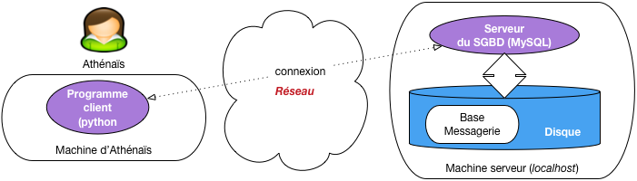

   Architecture d'un programme dialoguant avec un serveur

Un programme de lecture
=======================

Pour établir une connexion, tout programme client doit fournir
au moins 4 paramètres: l'adresse de la machine serveur (une adresse IP, ou le 
nom de la machine), le nom et le mot de passe de l'utilisateur qui se connecte, 
et le nom de la base. On fournit souvent également des options qui règlent
certains détails de communication entre le client et le serveur. Voici donc
la connexion à MySQL avec notre programme Python.

.. code-block:: python

      connexion = pymysql.connect
              ('localhost', 
               'athénaïs', 
               'motdepasse', 
               'Messagerie',
                cursorclass=pymysql.cursors.DictCursor)

Ici, on se connecte à la machine locale sous le compte d'Athénaïs, et on accède
à la base Messagerie. Le dernier paramètre est une option ``cursorClass`` qui
indique que les données (nuplets) retournés par le serveur seront représentés
par des dictionnaires Python. 

.. note:: Un dictionnaire est une structure qui associe
   des clés (les noms des attributs) et des valeurs.  Cette structure
   est bien adaptée à la représentation des nuplets.

Un curseur est créé simplement de la manière suivante:

.. code-block:: python

      curseur = connexion.cursor()
      
Une fois que l'on a créé un curseur, on s'en sert pour exécuter une requête.

.. code-block:: python

     curseur.execute("select * from Contact")

À ce stade, rien n'est récupéré côté client. Le serveur a reçu la requête, a créé
le plan d'exécution et se tient prêt à fournir des données au client dès que ce
dernier les demandera. Comme nous l'avons vu dans le chapitre sur la programmation,
un curseur permet de parcourir le résultat d'une requête. Ici ce résultat est  obtenu globalement avec
la commande ``fetchAll()`` (on pourrait utiliser ``fetchOne()``) pour récupérer les nuplets un par un). 
Le code Python pour parcourir tout le résultat est donc:

.. code-block:: python

     for contact in curseur.fetchall():
        print(contact['prénom'], contact['nom'])

La boucle affecte, à chaque itération, le nuplet courant à la variable ``contact``. 
Cette dernière est donc un dictionnaire dont chaque entrée associe le nom de l'attribut
et sa valeur.

Et voilà. Pour résumer, voici le programme complet, qui est donc 
remarquablement concis.

.. code-block:: python

    import pymysql
    import pymysql.cursors

    connexion = pymysql.connect('localhost', 'athénaïs', 
                         'motdepasse', 'Messagerie',
                         cursorclass=pymysql.cursors.DictCursor)

    curseur = connexion.cursor()
    curseur.execute("select * from Contact")

    for contact in curseur.fetchall():
        print(contact['prénom'], contact['nom'])

Bien entendu, il faudrait ajouter un petit travail d'ingénierie pour ne pas donner
les paramètres de connexion sous forme de constante mais les récupérer dans
un fichier de configuration, et ajouter le traitement des erreurs (traiter par exemple
un refus de connexion).

Une transaction
===============

Notre second exemple montre une transaction qui sélectionne tous les messages non encore envoyés,
les envoie, et marque ces messages en  leur affectant la date d'envoi. Voici le programme
complet, suivi de quelques commentaires.

.. code-block:: python 
   :linenos:

        import pymysql
        import pymysql.cursors
        from datetime import datetime

        connexion = pymysql.connect('localhost', 'athénaïs', 
                         'motdepasse', 'Messagerie',
                         cursorclass=pymysql.cursors.DictCursor)

        # Tous les messages non envoyés
        messages = connexion.cursor()
        messages.execute("select * from Message where dateEnvoi is null")
        for message in messages.fetchall():
            # Marquage du message
            connexion.begin()
            maj = connexion.cursor()
            maj.execute ("Update Message set dateEnvoi='2018-12-31' "
                + "where idMessage=%s", message['idMessage'])

            # Ici on envoie les messages à tous les destinataires
            envois = connexion.cursor()
            envois.execute("select * from Envoi as e, Contact as c "
                   +" where e.idDestinataire=c.idContact "
                   + "and  e.idMessage = %s", message['idMessage'])
            for envoi in envois.fetchall():
                mail (envoi['email'], message['contenu')

            connexion.commit()

Donc, ce programme effectue une boucle sur tous les messages qui n'ont pas
de date d'envoi (lignes 10-12). À chaque itération, le cursor affecte une variable ``message``.

Chaque passage de la boucle donne lieu à une transaction, initiée avec
``connexion.begin()`` et conclue avec ``connexion.commit()``. Cette
transaction effectue en tout et pour tout une seule mise à jour,
celle affectant la date d'envoi au message (il faudrait bien entendu 
trouver la date du jour, et ne pas la mettre "en dur").

Dans la requête ``update`` (lignes 16-17), notez qu'on a séparé la requête SQL et ses paramètres
(ici, l'identifiant du message). Cela évite de construire la requête comme
une chaîne de caractères. 
On ouvre ensuite un second curseur (lignes 20-24), sur les destinataires du message, et on envoie ce dernier.

Une remarque importante: les données traitées (message et destinataires) pourraient
être récupérées en une seule requête SQL par une jointure. Mais le format
du résultat (une table
dans laquelle le message est répété avec chaque destinataire) ne convient 
pas du tout à la structure du programme dont la logique consiste
à récupérer d'abord le message, puis à parcourir les envois, en deux requêtes.
En d'autres termes, dans ce type de programme (très courant), SQL est sous-utilisé.
Nous revenons sur ce point dans la dernière session.

Quiz
====

.. eqt:: cas4-1

    Pour se connecter à un serveur de données par le réseau, faut-il impérativement 
    être sur une machine différente de celle hébergeant le serveur ?
    
    A) :eqt:`I` Oui
    #) :eqt:`C` Non

.. eqt:: cas4-2

    L'exécution d'une requête par le client a-t-ellepour effet  que tous les nuplets
    du résultat sont transférés depuis le serveur?
    
    A) :eqt:`I` Oui
    #) :eqt:`C` Non

.. eqt:: cas4-3

    Dans quel cas vaut-il mieux récupérer les nuplets un par un dans l'application cliente?
    
    A) :eqt:`I` Quand on veut être sûr que personne d'autre ne va les modifier
    #) :eqt:`C` Quand le résultat est très volumineux
    #) :eqt:`I` Quand le réseau est très lent.

.. eqt:: cas4-4

    Que se passe-t-il si j'exécute plusieurs fois de suite le programme d'envoi de messages,
    en supposant que personne d'autre n'accède à la base
    
    A) :eqt:`I` Les messages sont envoyés à chaque fois
    #) :eqt:`C` Les messages sont envoyés la première fois, et rien ne se passe les fois suivantes
    #) :eqt:`I` La date d'envoi est modifiée au fur et à mesure, mais le message n'est pas envoyé

.. eqt:: cas4-5

    Supposons que je change mon programme pour effectuer une seule requête de
    jointure entre ``Message``, ``Envoi`` et ``Contact``, et une seule boucle sur le résultat 
    de cette requête. Qu'est-ce que cela change 
    dans son comportement?
    
    A) :eqt:`I` Rien, puisque les nuplets sélectionnés sont les mêmes
    #) :eqt:`I` Seul le premier destinataire d'un message le reçoit
    #) :eqt:`C` Chaque message est modifié autant de fois qu'il y a de destinataires

.. eqt:: cas4-6

    Que se passe-t-il si le programme plante juste avant le  ``commit()``
    
    A) :eqt:`I` Le message en cours de traitement a bien été envoyé et ne le sera plus
    #) :eqt:`I` Tous les messages seront envoyés à nouveau quand on réexécutera le programme
    #) :eqt:`C` Le message en cours de traitement a bien été envoyé, mais il le sera à nouveau quand on 
       réexécutera le programme

***************************
S5: aspects transactionnels
***************************

.. admonition::  Supports complémentaires:

    * `Diapositives: transactions  <http://sql.bdpedia.fr/files/slcas-transaction.pdf>`_
    * `Vidéo sur les transactions <https://mediaserver.cnam.fr/videos/messagerie-les-transactions/>`_ 

Reprenons le programme transactionnel d'envoi de message. Même sur un
exemple aussi simple, il est utile de se poser quelques questions sur 
ses propriétés dans un environnement sujet aux pannes et à la concurrence.

Une exécution de ce programme  crée une transaction par message. Chaque transaction
lit un message sans date d'envoi dans le curseur, envoie le message, puis
modifie le message dans la base en affectant la date d'envoi. La transaction
se termine par un ``commit``. Que peut-on en déduire, en supposant un environnement
idéal sans panne, où chaque transaction  est la seule à accéder à la base quand elle s'exécute?
Dans un tel cas, il est facile de voir que *chaque message serait envoyé exactement une fois*.
Les choses sont moins plaisantes en pratique, regardons-y de plus près.

Cas d'une panne
===============

Imaginons (pire scénario) une panne *juste avant* le ``commit``, comme illustré
sur la :numref:`transaction-messages-1`. Cette figure montre la phase d'exécution,
suivie de la séquence des transactions au sein desquelles on a mis en valeur
celle affectant le message :math:`M_1`.

.. _transaction-messages-1:
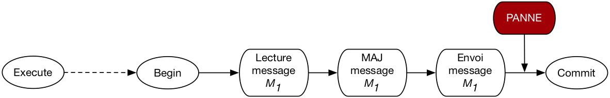

   Cas d'une panne en cours de transaction

Au moment du redémarrage après la  panne, le SGBD va effectuer un ``rollback`` qui affecte la transaction
en cours. Le message reprendra donc son statut initial, sans date d'envoi. 
Il a pourtant été envoyé: l'envoi n'étant pas une opération  de base de données, le SGBD
n'a aucun moyen  de l'annuler (ni même d'ailleurs de savoir quelle action le programme client
a effectuée). C'est donc un premier cas qui viole le comportement
attendu (chaque message envoyé exactement une fois). 

Il faudra relancer le programme en espérant qu'il se déroule sans panne. Cette seconde exécution
ne sélectionnera pas les messages traités par la première exécution *avant* :math:`M_1`
puisque ceux-là ont fait l'objet d'une transaction réussie. Selon le principe de durabilité,
le ``commit``  de ces transactions réussies n'est pas affecté par la panne.

Le curseur est-il impacté par une mise à jour?
==============================================

Passons maintenant aux problèmes potentiels liés à la concurrence. Supposons, dans un
premier scénario, qu'une mise à jour du message :math:`M_1` soit effectuée par une autre transaction
entre l'exécution de la requête et le traitement de :math:`M_1`. La
:numref:`transaction-messages-2` montre l'exécution concurrente de deux exécutions
du programme d'envoi: la première transaction (en vert) modifie le message et effectue
un ``commit`` *avant* la lecture de ce message par la seconde (en orange).

.. _transaction-messages-2:
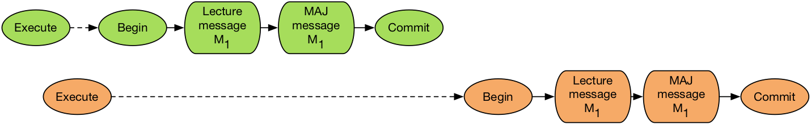

   Cas d'une mise à jour *après* exécution de la requête mais *avant* traitement du message

Question: cette mise à jour sera-t-elle constatée par la lecture de :math:`M_1`? Autrement dit, est-il
possible que l'on constate, au moment de lire ce message dans la transaction
orange, qu'il a déjà une date d'envoi parce qu'il a été modifié par la transaction verte?

On pourrait être tenté de dire "Oui" puisqu'au moment où la transaction orange débute, le message
a été modifié *et* validé. Mais cela voudrait dire qu'un curseur permet d'accéder à des données
qui ne correspondent pas au critère de sélection ! (En l'occurrence, on s'attend à ne recevoir
que des messages sans date d'envoi). Ce serait très incohérent.

En fait, tout se passe comme si le résultat du curseur était un "cliché" pris au moment de l'exécution,
et immuable durant tout la durée de vie du curseur. En d'autres termes, même si le parcours
du résultat prend 1 heure, et qu'entretemps tous les messages ont été modifiés ou détruits, 
le système continuera à fournir *via* le curseur l'image de la base telle qu'elle était au moment
de l'exécution.

En revanche, si on exécutait à nouveau une requête pour lire le message juste avant la modification
de ce dernier, on verrait bien la mise à jour effectuée par la transaction verte. En résumé: 
une requête fournit la version des nuplets effective, soit au moment où la requête est 
exécutée (niveau d'isolation ``read committed``), soit au moment
où la transaction débute (niveau d'isolation ``repeatable read``).

Conséquence: sur le scénario illustré par la :numref:`transaction-messages-2`, on enverra le message
deux fois. Une manière d'éviter ce scénario serait de verrouiller tous les nuplets sélectionnés
au moment de l'exécution, et d'effectuer l'ensemble des mises à jour en une seule transaction. 

Transactions simultanées
========================

Voici un dernier scénario, montrant un exécution simultanée ou quasi-simultanée 
de deux transactions concurrentes affectant le même message (:numref:`transaction-messages-3`).
   
.. _transaction-messages-3:
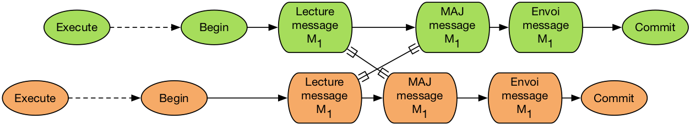

   Exécution concurrente, avec risque de *deadlock*
   
Cette situation est très peu probable, mais pas impossible. Elle correspond au cas-type 
dit "des mises à jour perdues" étudié dans le chapitre sur les transactions. Dans
tous les niveaux d'isolation sauf ``serializable``, le déroulé sera le suivant:

 - chaque transaction lit séparément le message
 - une des transactions, disons la verte, effectue une mise à jour
 - la seconde transaction (orange) tente d'effectuer la mise à jour et est mise en attente;
 - la transaction verte finit par effectuer un ``commit``, ce qui libère la transaction orange:
   le message est envoyé deux fois.

En revanche, en mode ``serializable``, chaque transaction va bloquer l'autre sur le scénario
de la :numref:`transaction-messages-3`. Le système va détecter cet interblocage et rejeter
une des transactions.

La bonne méthode
================

Ce qui précède mène à proposer une version plus sûre d'un programme d'envoi.  

.. code-block:: python
   :linenos:
   
    # Tous les messages non envoyés
    messages = connexion.cursor()
    messages.execute("SET SESSION TRANSACTION ISOLATION LEVEL SERIALIZABLE")

    # Début de la transaction
    connexion.begin()
    messages.execute("select * from Message where dateEnvoi is null")

    for message in messages.fetchall():
        # Marquage du message
        maj = connexion.cursor()
        maj.execute ("Update Message set dateEnvoi='2018-12-31' "
                + "where idMessage=%s", message['idMessage'])

        print ("Envoi du message ...", message['contenu'])

    connexion.commit()

Tout d'abord (ligne 3) on se place en niveau d'isolation sérialisable. 

Puis (ligne 5), on débute la transaction à *l'extérieur* de la boucle du curseur,
et on la termine après la boucle (ligne 17). Cela permet de traiter la requête
du curseur comme partie intégrante de la transaction.

Au moment de l'exécution du curseur, les nuplets sont réservés, et une exécution
simultanée sera mise en attente si elle essaie de traiter les mêmes messages.

Avec cette nouvelle version, la seule cause d'envoi multiple d'un message et l'occurence
d'un panne. Et le problème dans ce cas vient du fait que l'envoi n'est pas une opération
contrôlée par le serveur de données.

Quiz
====

.. eqt:: cas5-1

    Aurait-on pu placer le début et la fin de la transaction à l'extérieur de la boucle
    sur les messages?
    
    A) :eqt:`C` Oui, mais dans ce cas, une panne annulerait les mises à jour de tous les messages
    #) :eqt:`I` Oui, cela n'empêcherait pas que les messages déjà envoyés ne le seront
       pas à nouveau quand on ré-exécute le programme après la panne
    #) :eqt:`I` Non, car la base n'est cohérente que si on valide au niveau de chaque message

.. eqt:: cas5-2

    Supposons qu'une panne survienne pendant la boucle sur les destinataires d'un message ``M``. Que se passe-t-il?
    
    A) :eqt:`I` Au moment où on exécutera à nouveau le programme, les destinataires de  ``M`` 
       qui l'ont déjà reçu seront ignorés.
    #) :eqt:`C` Au moment où on exécutera à nouveau le programme, tous les destinataires
       de  ``M`` recevront le message, qu'ils l'aient déjà reçu ou non
    #) :eqt:`I` Si au moins un destinataire a reçu le message ``M``, il ne sera plus renvoyé à personne 
    
.. eqt:: cas5-3

    Pourquoi, en cas de panne avant le ``commit``, le message est-il envoyé alors
    que la mise à jour est annulée? C'est contraire à l'atomicité?
    
    A) :eqt:`I` Le ``commit`` a été placé au mauvais endroit
    #) :eqt:`I` Le niveau d'isolation n'est pas le bon
    #) :eqt:`C` L'envoi de message n'est pas une opération de base de données, et le système ne peut
       donc pas l'annuler

.. eqt:: cas5-4

    Quelqu'un lance le programme d'envoi de message. Je m'aperçois alors que je regrette 
    d'avoir écrit un des messages et je le détruis immédiatement. Le message sera-t-il envoyé
    ou non?
    
    A) :eqt:`I` Non puisqu'il n'existe plus
    #) :eqt:`C` Oui puisqu'il existait au moment où le programme a effectué la requête de sélection
    #) :eqt:`I` Non car le programme va détecter une incohérence au moment de traiter le message détruit

.. eqt:: cas5-5

    Quelle est la situation qui provoque un interblocage
    
    A) :eqt:`I` Deux curseurs  effectuent la même requête
    #) :eqt:`C` Deux curseurs lisent le même message, avant, chacun, d'essayer de le modifier
    #) :eqt:`I` Deux curseurs traitent l'un après l'autre le même message

*******************************
S6: *mapping* objet-relationnel
*******************************

.. admonition::  Supports complémentaires:

    * `Diapositives: Mapping objet-relationnel  <http://sql.bdpedia.fr/files/slcas-orm.pdf>`_
    * `Vidéo sur le mapping objet-relationnel  <https://mediaserver.cnam.fr/videos/mapping-objet-relationnel/>`_ 

Pour conclure ce cours, voici une discussion sur la méthodologie d'association entre une base de
données relationnelle et un langage de programmation, en supposant de plus que
ce langage est orienté-objet (ce qui est très courant). Nous avons montré comment intégrer des
requêtes SQL dans un langage de programmation, Java (chapitre  :ref:`chapprocedures`), Python
(le présent chapitre), et les mêmes principes s'appliquent à PHP, C#, C++, ou tout autre langage,
objet ou non.

Cette intégration est simple à réaliser mais assez peu satisfaisante en terme d'ingénierie logicielle. 
Commençons par expliquer pourquoi avant de montrer des environnements de développement qui visent à 
éviter le problème, en associant objets et relations, en anglais *object-relationnal mapping* ou ORM.

Quel problème
=============

Le problème est celui de la grande différence enttre deux représentations  (deux modèles) des données

   - dans un langage objet, les données sont sous forme d'objets, autrement dit des petits systèmes
     autonomes dotés de propriétés (les données) dont la structure est parfois complexe,
     étroitement liées à un comportement (les méthodes)
   - dans une base relationnelle, les données sont des nuplets, de structure élémentaire (un dictionnaire
     associant des noms et des valeurs atomiques), sans aucun comportement.
   - dans un langage objet, les objets sont liés les uns aux autres par un référencement physique
     (pointeurs ou équivalent), et une application manipule donc un *graphe d'objets*
   - dans une base relationnelle, les nuplets sont liés par un mécanisme "logiaue" de
     partage de valeurs (clé primaire, clé étrangère) et on manipule des ensembles,
     pas des graphes.
     
Le problème d'une intégration entre un langage de programmation est SQL est donc celui de
la *conversion* d'un modèle à l'autre. Ce n'était pas flagrant sur les quelques
exemples simples que nous avons donnés, mais à l'échelle d'une application
d'envergure, cette conversion devient pénible à coder, elle ne présente aucun intérêt
applicatif, et entraine une perte de productivité peu satisfaisante.

.. note:: Notons au passage que pour éviter ces écarts entre modèles de données,
   on a beaucoup travaillé pendant une période sur les bases objets et pas relationnelles.
   Cette recherche  n’a pas vraiment abouti à des résultats vraiment satisfaisants.

Voici un exemple un peu plus réaliste que ceux présentés jusqu'à présent pour notre
application de messagerie. Dans une approche objet, on modéliserait nos données
par des classes, soit une classe ``Contact`` et une classe ``Message``. Voici
pour commencer la classe ``Contact``, très simple: elle ne contient que des propriétés
et une méthode d'initialisation.

.. code-block:: python

   class Contact:
     def __init__(self,id,prenom,nom,email):
                self.id=id
                self.prenom=prenom
                self.nom=nom
                self.email=email

Et voici comment on effectue la conversion: dans une boucle sur un curseur
récupérant des contacts, on construit un objet de la classe ``Contact``  en lui
passant comme valeurs d'initialisation celles provenant du curseur.

.. code-block:: python

   curseur.execute("select * from Contact")
   for cdict in curseur.fetchall():
      # Conversion du dictionnaire en objet
      cobj = Contact(cdict["idContact"], cdict["prénom"], 
                cdict["nom"], cdict["email"])

C'est la conversion la plus simple possible: elle ne prend qu'une instruction de programmation.
C'est déjà trop dans une optique de productivité optimale: on aimerait que 
le curseur nous donne *directement* l'objet instance de ``Contact``.

Les choses se gâtent avec la classe ``Message``  dont la structure est beaucoup plus complexe.
Voici tout d'abord sa modélisation Python.

.. code-block:: python

   class Message:
       # Emetteur: un objet 'Contact'
      emetteur = Contact(0, "", "", "")
      # Prédecesseur: peut ne pas exister
      predecesseur = None
      # Liste des destinataires = des objets 'Contacts'
      destinataires = []

      # La méthode d'envoi de message
      def envoi(self):
        for dest in self.destinaires:

L'envoi d'un message  prend naturellement la forme d'une méthode de la classe. Envoyer
un message devient alors aussi simple que l'instruction:

.. code-block:: python

     message.envoi()
     
Un message est un nœud dans un graphe d'objet, il est lié à un objet de la classe ``Contact``
(l'émetteur), et aux destinataires (objets de la classe ``Contact`` également).
Pour instancier un objet de la classe ``Message``  à partir de données provenant de la base, il
faut donc:

  - Lire le message et le convertir en objet
  - Lire l'émetteur et  le convertir en objet de la classe ``Contact``
  - Lire tous les destinataires et les convertir en objets de la classe ``Contact``
  
Cela donne beaucoup de code (je vous laisse essayer si vous les souhaitez), d'un intérêt
applicatif nul. De plus, il faudrait idéalement qu'à chaque nuplet d'une table corresponde
un seul objet dans l'application. Avant d'instancier un objet ``Contact`` comme émetteur,
il faudrait vérifier s'il n'a pas déjà été instancié au préalable et le réutiliser. On aurait 
ainsi, pour cet objet, un lien inverse cohérent: la liste des messages qu'il a émis. En fait,
pour l'application objet, les données ont la forme que nous avons déjà illustrées par la
:numref:`instance-messagerie2`.

.. _instance-messagerie2:

   
      Une instance (petite mais représentative)  de notre messagerie

Bref, il faudrait que le graphe soit une image cohérente de la base, conforme
à ce qui illustré par la figure, et ce n'est pas du tout facile à faire.

Quelle solution
===============

Le rôle d’un système ORM est de convertir automatiquement, à la demande, 
la base de données sous forme d’un graphe d’objet. L’ORM s’appuie pour cela sur 
une configuration associant les classes du modèle fonctionnel et le schéma de la base 
de données. L’ORM génère des requêtes SQL qui permettent de matérialiser ce graphe ou 
une partie de ce graphe en fonction des besoins.

La :numref:`mapping-orm` illustre l'architecture d'un système ORM. Il présente à l'application
les données sous la forme d'une graphe d'objets (en haut de la figure). Ce graphe 
est obtenu par production automatique de requêtes SQL et conversion du résultat de ces
requêtes en objets. 

.. _mapping-orm:
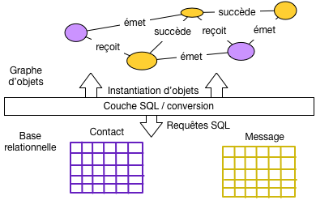
   
      Architecture d'un système ORM

Un système ORM s'appuie sur une configuration qui décrit la correspondance
(le *mapping*) entre une classe et une table. Voici par exemple cette spécification
pour un des systèmes ORM les plus développés, Hibernate.

.. code-block:: java

   @Entity(table="Message")
   public class Message {
      
      @Id
      private Integer id;
  
      @Column
      private String contenu;
  
      @ManyToOne
      private Contact emetteur;
  
      @OneToMany
      private Set<Contact> destinataires ;
    }

Les annotation ``@Entity``, ``@Id``, ``@Column``,
``@ManyToOne``,``@OneToMany``, indiquent au système ORM tout ce qui est nécessaire pour associer
objets et nuplets de la base. Ce même système est alors en mesure de produire les requêtes SQL
et de les soumettre au SGBD via l'interface JDBC, ou l'API Python.

Le gain en terme de productivité est très important. Voici, toujours en Hibernate (la syntaxe
est la plus claire).

.. code-block:: java

   List<Message> resultat =
        session.execute("from Message as m "
                      + " where m.emetteur.prenom = 'Serge'");
                      
   for (Message m : resultat) {
       for (Contact c : m.destinataires) {
           message.envoi (c.email);
       }
   }
   
Notez les deux boucles, la première sur le messages, la seconde sur leurs destinataires. Dans le second
cas, aucune requête n'a été executée explicitement: c'est le système ORM qui s'est chargé automatiquement
de trouver les destinataires du messages et de les présenter sous la forme d'instances 
de la classe `` Contact``.

En résumé, 
les systèmes ORM sont maintenant très utilisés pour les développements d'envergure. Leurs
principes sont tous identiques: 
les accès à la base prennent la forme d'une navigation dans un graphe d'objets et
le système engendre les requêtes SQL pour matérialiser le graphe. La conversion 
entre nuplets de la base et objets de l'application est *automatique*, ce qui
représente un très important gain en productivité de développement. En contrepartie, 
tend à  produire *beaucoup* de requêtes élémentaires là où *une seule*
jointure serait plus efficace. Pour des bases très volumineuses, l'intervention d'un expert
est souvent nécessaire afin de contrôler les requêtes engendrées.

Voici pour cette brève introduction. 
Pour aller plus loin, l'atelier ci-dessous propose un début de développement avec le *framework*
Django. Vous pouvez aussi consulter le cours complet http://orm.bdpedia.fr consacré
à Hibernate.

Quiz
====

.. eqt:: cas5-1

    Quel est le but d'un système ORM ?
    
    A) :eqt:`C` Convertir automatiquement des données relationnelles vers un langage de programmation
    #) :eqt:`I` Améliorer l'efficacité des  accès à la base
    #) :eqt:`I` Faciliter les requêtes: il est plus facile en effet de programmer que d'écrire du SQL

.. eqt:: cas5-2

    Quelle affirmation vous semble correcte?
    
    A) :eqt:`I` Un système ORM accède directement à une base sans requête  SQL 
    #) :eqt:`C` Un système ORM transforme des accès à un graphe d'objet en requêtes SQL
    #) :eqt:`I` Un système ORM communique avec un système non-relationnel

.. eqt:: cas5-3

    Quel est l'inconvénient potentiel d'un système ORM
    
    A) :eqt:`C` Il engendre beaucoup de petites requêtes là où une seule suffirait
    #) :eqt:`I` Il rend plus complexe la programmation
    #) :eqt:`I` Il oblige à connaître à la fois SQL et un langage de programmation

*******************************
Atelier: une application Django
*******************************

Dans cet atelier nous allons débuter la mise en place d'une application de messagerie
avec le *framework* Django, un environnement complet de développement Python,
essentiellement orienté vers le développement d'applications Web. Django
comprend un composant ORM sur lequel nous allons bien sûr nous concentrer.

.. note:: Cet atelier suppose quelques compétences en Python et en programmation objet. 
   Si ce n'est pas  votre cas, contentez-vous de lire (et comprendre) les différentes étapes
   détaillées ci-dessous.

.. admonition::  Supports complémentaires:

    * `Le code de l'application Django <http://sql.bdpedia.fr/files/monappli.zip>`_

Préliminaires
=============

Pour cet atelier vous avez besoin d'un serveur de données relationnel et d'un environnement
Python 3. Il faut de plus installer Django, ce qui est aussi simple que:

.. code-block:: bash
 
     pip3 install django

Vérifier que Django est bien installé.

.. code-block:: bash

    python3
    
      >>> import django
      >>> print(django.__path__)
      >>> print(django.get_version())

Django est installé avec un utilitaire ``django-admin`` qui permet de créer un nouveau projet.
Supposons que ce projet s'appelle ``monappli``.

.. code-block:: bash

     django-admin startproject monappli

Django crée un répertoire ``monappli``  avec le code initial du projet. La :numref:`inidjango`
montre les quelques fichiers et répertoires créés.

.. _inidjango:
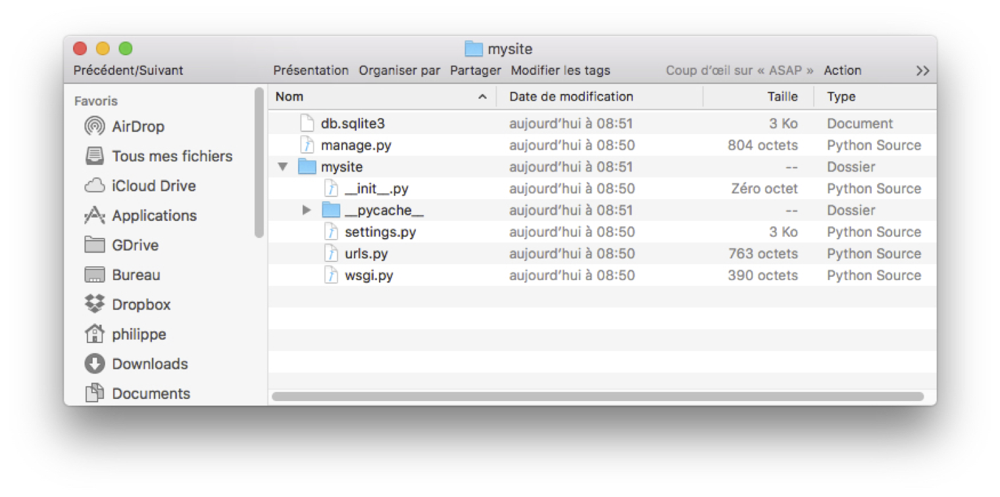

   Le squelettte du projet ``monappli``, créé par Django

Le projet  est déjà opérationnel:
vous pouvez lancer un petit serveur web:

.. code-block:: bash

     cd monappli
     python3 manage.py runserver

Le serveur est en écoute sur le port 8000 de 
votre machine. Vous pouvez accéder à  l'URL http://localhost:8000
avec votre navigateur. Vous devriez obtenir l'affichage de la :numref:`accueilDjango`.

.. _accueilDjango:
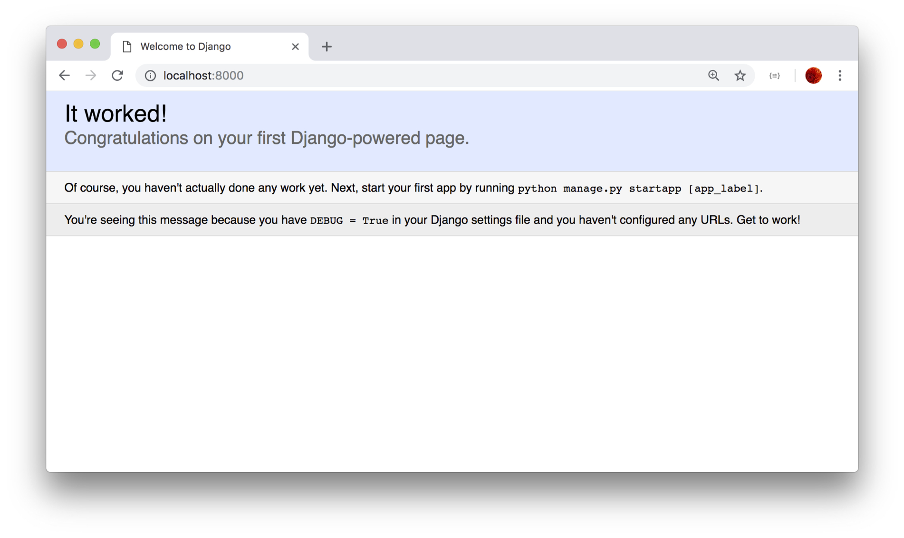

   La première page de l'application
   
Evidemment pour l'instant il n'y a pas grand chose.
À partir de là, on peut travailler sur le projet avec un éditeur
de texte ou (mieux) un IDE comme Eclipse.

L'application ``messagerie``
============================

Un projet Django est un ensemble d'applications.
Au départ, une première application est créée et nommée comme le projet
(donc, pour nous, ``monappli``, cf. :numref:`inidjango`). Elle
contient la configuration. Créons notre première application
avec la commande suivante:

.. code-block:: bash

      python3 manage.py startapp messagerie

Django ajoute un répertoire ``messagerie`` qui vient s'ajouter à celui de l'application
de configuration nommé ``monappli``. On obtient le contenu du projet illustré 
par la :numref:`django-newapp`.

.. _django-newapp:
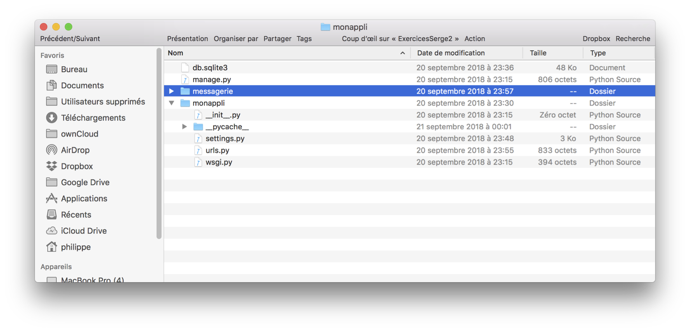

   Nouvelle application

Maintenant, il faut ajouter l'application ``messagerie`` dans la configuration
du projet, contenue dans le fichier ``monappli/monappli/settings.py``.
Editez ce fichier et modifier le tableau ``INSTALLED_APPS`` comme suit.

.. code-block:: python

    INSTALLED_APPS = [
        'django.contrib.admin',
        'django.contrib.auth',
        'django.contrib.contenttypes',
        'django.contrib.sessions',
        'django.contrib.messages',
        'django.contrib.staticfiles',
        "messagerie"
    ]

Tant que nous y sommes, configurons la base de données. Supposons que le système soit MySQL,
sur la machine locale, 
avec la base et l'utilisateur suivant:

.. code-block:: sql

    create database Monappli;
    grant all on Monappli.* to philippe identified by 'motdepasse'

Toujours dans le fichier ``monappli/monappli/settings.py``, reportez ces paramètres
dans ``DATABASES``:

.. code-block:: python

     DATABASES = {
        'default': {
            'ENGINE': 'django.db.backends.mysql',
            'NAME': 'Monappli',
            'USER': 'philippe',
            'PASSWORD': 'motdepasse',
            'HOST': '127.0.0.1',
            'PORT': '3306',
         }
     }

Bien sûr, vous pouvez utiliser un autre système ou d'autres valeurs de paramètres.
Voilà ! Nous sommes prêts à utiliser la couche ORM.

L'ORM de Django: le schéma
==========================

Dans Django, toutes les données sont des objets Python. Quand ces données sont *persistantes*,
on déclare les classes comme des *modèles*, et Django se charge alors de convertir automatiquement
les objets de ces classes en nuplets de la base de données.

.. note:: Pourquoi "modèle"? Parce que Django est basé sur une architecture dite
   MVC, pour Modèle-Vue-Contrôleur. Les "modèles" dans cette architecture sont
   les données persistantes.

Django (son composant ORM) se charge également automatiquement de créer et modifier le schéma
de la base. À chaque ajout, modification, suppression d'une classe-modèle, la commande
suivante crée des commandes SQL d'évolution du schéma (nommée *migration* dans Django).

.. code-block:: bash

    python3 manage.py makemigrations messagerie
    
Les commandes de migration sont stockées dans des fichiers placés dans un sous-répertoire
``migrations``.  On applique alors ces commandes SQL en exécutant:

.. code-block:: bash

    python3 manage.py migrate

Allons-y. Nous allons créer une première classe ``Contact``, que nous plaçons dans le fichier
``monappli/messagerie/models.py``.

.. code-block:: python

    from django.db import models
    
    class Contact(models.Model):
        email = models.CharField(max_length=200)
        prenom = models.CharField(max_length=200)
        nom = models.CharField(max_length=200)
    
        def __str__(self):
            return self.prenom + ' ' + self.nom

        class Meta:
            db_table = 'Contact'

Tous les attributs persistants (ceux qui vont être stockées dans la base)
doivent être d'un type fourni par les modèles Django, ici ``CharField`` qui correspond
à ``varchar``. Notez que l'on ne définit pas de clé primaire: un objet Python
a son propre identifiant, qu'il est inutile de déclarer. En revanche, Django 
va créer automatiquement un identifiant de base de données. Notez également
que l'on peut spécifier le nom de la table associée dans les méta-données de la classe.
Sinon, Django fournira un nom par défaut (c'est le cas pour les attributs, comme nous allons le voir).

Nous avons donc une classe Python classique, enrichie des spécifications permettant de 
faire le lien avec la base de données.
Nous pouvons alors demander à Django de créer la table correspondante. 

.. code-block:: bash

    python3 manage.py makemigrations messagerie

Vous devriez obtenir la réponse suivante:

.. code-block:: text

        Migrations for 'messagerie':
            messagerie/migrations/0001_initial.py:
        - Create model Contact
        
Explication: Django a détecté une nouvelle classe-modèle ``Contact``, et a créé la commande
SQL correspondante dans le fichier ``messagerie/migrations/0001_initial.py``. Pour contrôler
cette requête vous pouvez  demander son affichage:

.. code-block:: bash

    python3  manage.py sqlmigrate messagerie 0001

Ce qui donne l'affichage suivant:

.. code-block:: text

    BEGIN;
    --
    -- Create model Contact
    --
    CREATE TABLE `Contact` (`id` integer AUTO_INCREMENT NOT NULL PRIMARY KEY, 
                                `email` varchar(200) NOT NULL, 
                                `prenom` varchar(200) NOT NULL, 
                                `nom` varchar(200) NOT NULL);
    COMMIT;

Vous pouvez apprécier comment les définitions de la classe objet Python ont été transcrites en commande SQL. En particulier,
une clé primaire a été ajoutée, un entier auto-incrémenté. Il reste à appliquer
cette commande de création:

.. code-block:: bash

    python3 manage.py migrate

À ce stade, vous devriez avoir la table ``Contact`` créée dans votre schéma ``Monappli``: vérifiez! 
C'est peut-être le moment de faire une pause pour bien assimiler ce que nous venons de faire. En résumé:
Django effectue maintenant la correspondance entre la classe Python ``Contact`` et la table ``Contact``
dans MySQL.

Avant de vérifier comment nous pouvons exploiter cette correspondance, passons à la table ``Message``
qui illustre la gestion des liens entre objets (en Python).

.. code-block:: python

    class Message(models.Model):
        emetteur = models.ForeignKey(Contact, on_delete=models.CASCADE, 
                                    related_name='messages_emis')
        contenu = models.TextField()
        date_envoi = models.DateTimeField()
        predecesseur = models.ForeignKey('self', on_delete=models.CASCADE, 
                            null=True, blank=True, related_name='successeurs')

        class Meta:
            db_table = 'Message'
        
        def __str__(self):
            return self.contenu

Les attributs ``emetteur`` et ``predecesseur`` sont de type ``ForeignKey`` et désignent
respectivement un objet de la classe ``Contact``  et un objet de la classe ``Message``
(lien réflexif donc, désigné par ``self``). La valeur de ``related_name`` 
donne le nom d'une association  vu du côté opposé
à celui où elle est définie. Du côté de la classe ``Contact`` par exemple, on peut accéder 
à tous les messages émis par un contact avec un attribut nommé ``messages_emis``. Un exemple
est donné plus loin.

.. note:: Django impose l'ajout d'une clause ``on_delete``: voir le chapitre
   :ref:`chap-ddl`  pour des explications à ce sujet.
    
Créez la spécification de la table avec la commande ``makemigrations``, puis  créez 
la table avec ``migrate``, comme précédemment.

Voilà, nous savons créer et modifier un schéma. 

.. _Ex-django-1:
.. admonition:: Exercice `Ex-django-1`_: finalisez le schéma

    Créez les classes ``Contact``  et ``Message`` comme indiqué ci-dessus. 
    
    Créez ensuite une classe ``Envoi`` pour compléter notre schéma. 

Voyons maintenant (enfin) comment on gère les données.

L'ORM de Django: les données
============================

Django a créé une interface Web d'administration des données! Cette interface
est accessible au super-utilisateur du projet, que nous pouvons créer
avec la commande suivante:

.. code-block:: bash

    python3 manage.py createsuperuser

Entrez un compte super-utilisateur, à votre choix. Il reste à indiquer
que l'on veut engendrer une interface sur nos classes-modèles. Ajoutez
pour cela les lignes suivantes dans ``messagerie/admin.py``.

.. code-block:: python

    from django.contrib import admin

    from .models import Message, Contact

    admin.site.register(Contact)
    admin.site.register(Message)

L'interface d'administration est automatiquement engendrée et gérée par le framework.
Elle est accessible à l'URL http://localhost:8000/admin/. Django vous demande
au préalable de vous connecter avec le compte super-utilisateur créé précédemment:
vous devriez alors obtenir l'affichage de la :numref:`django-admin`.

.. _django-admin:
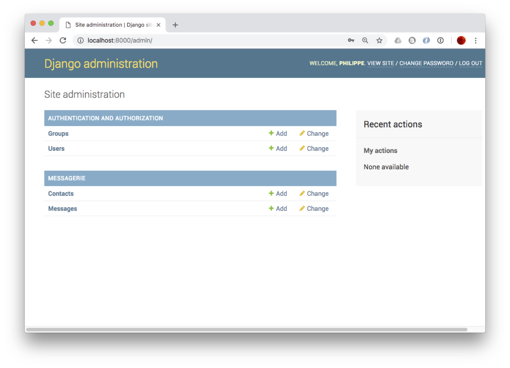

   L'interface d'administration de Django

À vous de jouer:  accédez à l'interface sur les contacts, explorez-là, appréciez
comment, à partir d'une simple correspondance entre la classe objet et la base,
il est possible d'engendrer une application permettant les opérations dites CRUD
(*Create, Read, Update, Delete*). 

.. _Ex-django-2:
.. admonition:: Exercice `Ex-django-2`_: insérez les données

    Utilisez l'interface d'administration pour créez l'instance de
    la :numref:`instance-messagerie`. 

Les vues
========

Et pour finir nous allons utiliser la couche ORM de Django pour naviguer
dans la base de données sans écrire une seule requête SQL (Django s'en charge tout seul).
Dans un modèle MVC, la notion de "vue" correspond à la couche de présentation des données.
Une vue comprend deux parties:

   - une *action*, implantée en Python, qui effectue par exemple des accès à la base de données
     et/ou des traitements
   - un modèle d'affichage (*template*), à ne pas confondre avec de modèle de données.
   

Chaque vue est associée à une adresse Web (une URL). La correspondance entre les vues et
leur URL est indiquée dans des fichiers ``urls.py``. Commencez
par éditer le fichier ``monappli/urls.py`` comme suit:

.. code-block:: python
    
    from django.urls import path, include
    from django.contrib import admin

    urlpatterns = [
        path('admin/', admin.site.urls),
        path('messagerie/', include('messagerie.urls')),
    ]

Puis, éditez le fichier ``monappli/messagerie/urls.py``

.. code-block:: python

    from . import views
    from django.urls import path

    urlpatterns = [
        path('contacts', views.contacts, name='contacts'),
    ]

Cette configuration nous dit que l'URL http://localhost:8000/messagerie/contacts
correspond à la fonction ``contacts()`` des vues de l'application ``messagerie``. 
Ces fonctions sont toujours placées dans le fichier ``messagerie/views.py``.
Placez-y le code suivant pour la fonction ``contacts()``. 

.. code-block:: python

    from django.shortcuts import render
    from .models import Contact, Message

    def contacts(request):
        messages = Contact.objects.all()
        context = {'les_contacts': contacts}
    
        return render(request, 'messagerie/contacts.html', context)

Que fait cette fonction? Elle commence par "charger" tous les messages 
avec l'instruction:

.. code-block:: python

         messages = Message.objects.all()

C'est ici que la couche ORM intervient: cette appel déclenche la requête
SQL suivante

.. code-block:: sql

      select * from Contact

Les nuplets obtenus sont alors *automatiquement* convertis en objets de la
classe ``Contact``. Ces objets sont ensuite transmis au modèle d'affichage
(le "*template*") que voici (à sauvegarder dans ``monappli/messagerie/templates/messagerie/contacts.html``).

.. code-block:: html

   
       <ul>
      
           <li>
                 {{ contact.prenom }}   {{ contact.nom }}
         </li>
      
      </ul>
   
       
Aucun contact.

   

Voilà, oui, je sais, il y a beaucoup de choses qui peuvent sembler obscures. Cela
mérite une lecture soigneuse suivie d'autant de relectures que nécessaire. En tout cas
une fois tout cela complété, vous devriez pouvoir accéder 
à l'URL http://localhost:8000/messagerie/contacts et obtenir l'affichage des contacts
que vous avez entrés, comme sur la :numref:`django-contacts`.

.. _django-contacts:
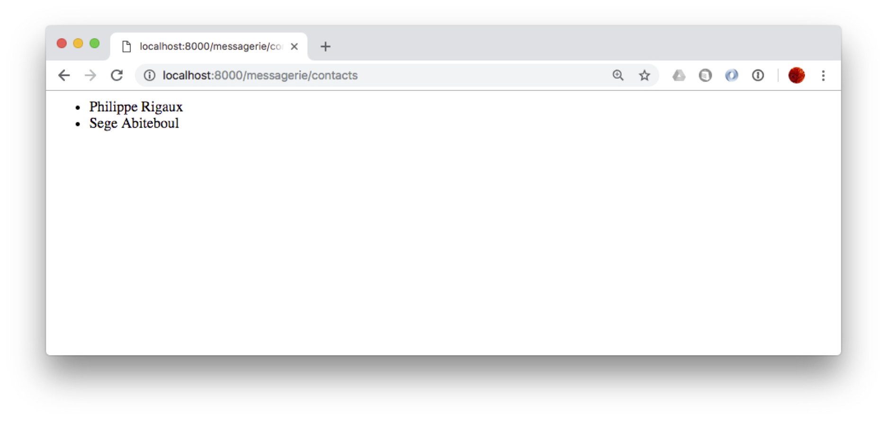

   La liste des contacts, affichés par notre vue

On peut faire la même chose avec les messages bien entendu. Le fichier
``urls.py`` est le suivant:

.. code-block:: python

    from . import views
    from django.urls import path
    
    urlpatterns = [
        path('contacts', views.contacts, name='contacts'),
        path('messages', views.messages, name='messages'),
    ]

La fonction suivante est ajoutée dans ``views.py``:

.. code-block:: python

    def messages(request):
      messages = Message.objects.all()
      context = {'les_messages': messages}
      
      return render(request, 'messagerie/messages.html', context)

Et finalement, voici le *template* 
``monappli/messagerie/templates/messagerie/messages.html``.

.. code-block:: html

   
       <ul>
      
           <li>
            "{{message.contenu}}"" envoyé par 
               {{ message.emetteur.prenom }}   {{ message.emetteur.nom }}
         </li>
      
      </ul>
   
       
Aucun message.

   

Vous remarquez sans doute (ou peut-être) que nous pouvons accéder à l'émetteur du message
avec l'expression ``message.emetteur``. C'est un exemple de *navigation* dans un
modèle objet (passage de l'objet ``Message`` à l'objet ``Contact``) qui correspond
à une jointure en SQL. Cette jointure est automatiquement effectuée par la couche ORM 
de Django. Plus besoin de faire (directement en tout cas) du SQL!

.. _Ex-django-3:
.. admonition:: Exercice `Ex-django-3`_: affichez toutes les données

    Affichez non seulement l'émetteur du message mais la liste des destinataires.
    Aide: dans la classe ``Envoi`` nommez l'association vers les destinataires avec ``related_name``. 
    
    .. code-block:: python
    
                message = models.ForeignKey(Message, related_name='destinataires')

    À partir du message, on obtient alors les destinataires avec l'expression
    ``message.destinataires``. Pour parcourir les destinataires, on écrit donc
    quelque chose comme:
    
    .. code-block:: html
    
          
             # Affichage 
         

    Vous pouvez aussi créer une nouvelle vue qui affiche les contacts avec les messages qu'ils ont envoyés.

***************************
Atelier: votre étude de cas
***************************

Vous devriez maintenant être totalement autonome pour implanter une base de données
d'un niveau de sophistication moyen. C'est ce que vous allez essayer de vérifier
dans cet atelier.

La modélisation initiale
========================

Notre étude porte sur la réalisation d'une application de gestion des treks. Qu'est-ce
qu'un trek? C'est une randonnée sur plusieurs jours, découpées en étapes allant
d'un point d'hébergement (un refuge, un hôtel, un bivouac) à un autre. 
Chaque étape est elle-même constituée de sections décrites par un tracé GPS
et rencontrant un ensemble de point d'intérêts. Enfin, un point d'intérêt est une localisation distinctive sur le parcours : 
un monument (fontaine, église, tombeau), un cours d'eau à traverser, un belvédère,
etc.

Après quelques mois de réunions (parfois houleuses) consacrées à la conception de 
la base, l'équipe chargée du projet est arrivée au schéma E/A de la :numref:`schema-trek`.
Ce sera notre point de départ.

.. _schema-trek:
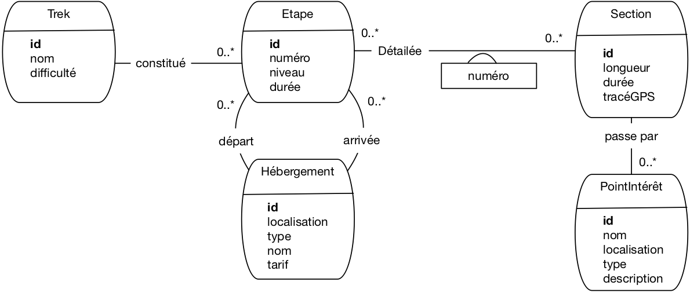

   La modélisation initiale de notre base de treks

Voici quelques explications sur les choix effectués. Un trek est donc constitué
d'étapes numérotées séquentiellement. Pour chaque étape on connaît l'hébergement
de départ et celui d'arrivée. Notez que les concepteurs ont considéré qu'un même hébergement 
pouvait être le départ de plusieurs étapes, voire le départ d'une étape et l'arrivée
d'une autre, ou même le départ et l'arrivée d'une même étape.

Une étape est donc une séquence de sections. Ici, il a finalement été décidé qu'une même
section pouvait être partagée par des étapes distinctes (de treks eux-mêmes
éventuellement distincts). La localisation est en fait une paire d'attributs
(longitude, lattitude) dont les valeurs sont exprimées en coordonnées GPS.
Ca se fait en relationnel. Un problème plus délicat est celui du tracé GPS qui ne semble
pas compatible avec une modélisation relationnelle. Les concepteurs ont donc imaginé
le stocker dans une chaîne de caractères. Cette gestion de 
données géolocalisées  n'est pas très satisfaisante, nous y reviendrons.

Finalement, sur le parcours d'une section on trouve des points d'intérêt.

Quelqu'un a fait remarquer que la durée d'une étape est sans doute la somme des durées 
des sections, et que cela constituait une redondance. Le chef de projet a considéré
que ce n'était pas important.

Tout cela semble à peu près correct. C'est ce que nous appellerons la modélisation 
initiale. Maintenant  à vous de jouer.

Peut-on faire mieux?
====================

Posons-nous des questions sur ce schéma pour savoir si d'autres choix sont possibles, 
et éventuellement meilleurs. 

Entités faibles
---------------

Certains types d'entités vous semblent-ils de bon candidats pour être transformés
en type d'entités faibles? Proposez la solution correspondante, et donnez votre avis
sur l'intérêt de l'évolution.

Associations réifiées
---------------------

Même question, cette fois pour les associations réifiées.

Spécialisation (difficile)
--------------------------

Un œil exercé remarque que les types d'entités *Hébergement* et *PointIntérêt* partagent
des attributs importants comme le nom, la localisation, le type. Et si un hébergement n'était
qu'un point d'intérêt d'un type particulier, se demande cet expert? On pourrait en profiter pour être plus précis sur les types de points
d'intérêt et les attributs spécifiques qui les caractérisent. On pourrait par exemple
détailler les points de ravitaillement avec leurs heures d'ouverture, les sommets avec leur
altitude, les lacs avec leur superficie,...  Que deviendrait alors
la modélisation ? Exercice un peu difficile, mais très instructif! 

Récursion (très difficile)
--------------------------

Le même expert (il coûte cher mais il en vaut la peine) pose la question suivante: existe-t-il
vraiment une différence profonde de nature entre un trek, une étape et une section? N'est-on
pas en train de définir une hiérarchie à trois niveaux pour un même
concept générique de *parcours*  alors qu'un petit effort complémentaire
permettrait de représenter une hiérarchie plus générique, sans limitation de niveau et sans multiplier
des types d'entités proches les uns des autres. Argument fort: on pourrait à l'avenir étendre
l'application à d'autres types de parcours: voies d'escalade, rallye automobiles, courses
de vélo, etc.

Une telle extension de la modélisation passe par une combinaison de concepts avancés: spécialisation
et récursion. À tenter quand tout le reste est maîtrisé. Vraiment difficile mais stimulant.

Une instance-échantillon
========================

Comme pour l'application de messagerie, essayez de dessiner un graphe 'instance montrant quelle
structure aura votre base de données. Prenez un trek de votre choix, 
cherchez la description sur le Web et vérifiez si le schéma permet de 
représenter correctement les informations données sur les sites trouvés en étudiant 
2 ou 3 étapes. 

Si vous n'avez pas d'inspiration, voici une possibilité: deux treks, le GR5 et
le Tour du Mont-Blanc (TMB) partagent une partie de leur parcours. Voici, avec une petite
simplification, de quoi constituer votre échantillon.

  - l'étape 1 du TMB va du chalet de La Balme au refuge Robert Blanc
  - l'étape Alpes-4 du GR5 va des Contamines au Cormet de Roselend
  
Les sections concernées sont: 

  - Section 1: des Contamines au chalet de la Balme
  - Section 2: du chalet de la Balme au Col du Bonhomme
  - Section 3: du Col du Bohomme au refuge des Mottets
  - Section 4: du Col du Bohomme au Cormet de Roselend

L'étape 1 du TMB est constituée des sections 2 et 3, l'étape Alpes-4 du GR5 des sections 
1, 2 et 4.

Quelques points d'intérêts: sur la section 1, on passe par le chalet de Nant Bornant. sur la
section 3, on passe par Ville des Glaciers.
Notez que le chalet de la Balme est hébergement pour le TMB, un point d'intérêt pour le GR5,
d'où l'intérêt sans doute d'unifier les deux concepts par une spécialisation. Sinon, il 
créer le chalet de la Balme comme un hébergement d'une part, un point d'intérêt de l'autre.
Vous voilà confrontés aux soucis typiquesdu concepteur. Si vous ne vous sentez pas à l'aise, 
faites au plus simple.

Représentez le graphe de ces entités conformément au schéma de notre
modélisation. Si vous avez la curiosité de regarder ces parcours sur un site web,
vous trouverez certainement des données qui pourraient être ajoutée
(le dénivellé positif et négatif par exemple). Demandez-vous où les faire figurer.

Le schéma relationnel
=====================

Passons maintenant au schéma relationnel. À partir de la modélisation initiale

  - donnez la liste complète des dépendandes fonctionnelles définies par le schéma
    de la :numref:`schema-trek`
  - appliquez l'algorithme de normalisation pour obtenir le schéma relationnel.
  
Vous pouvez également produire les variantes issues des choix alternatifs de modélisation
(entités faibles, réification) pour méditer sur l'impact de ces choix. Les plus courageux 
pourront produire la modélisation relationnelle correspondant à l'introduction
d'une structure de spécialisation.

Les ``create table``
====================

Produisez les commandes de création de table, en indiquant soigneusement
les clés primaires et étrangère.

Produisez également les commandes d'insertion pour l'instance échantillon.

Idéalement, vous disposez d'un serveur de données installé quelque part, et vous
avez la possibilité de créer le schéma et l'instance. 

Les vues
========

Vous souvenez-vous de la redondance entre la durée d'une étape et celle de ses sections
(la première est en principe la somme des secondes). Cette redondance et source d'anomalies. Par
exemple si je modifie la longueur d'une section suite à un changement d'itinéraire,
je ne devrais pas oublier de reporter cette modification sur les étapes comprenant
cette section.

On pourrait supprimer la durée au niveau de l'étape, mais, d'un autre côté, disposer de la longueur d'une étape est bien pratique pour 
l'interrogation. Il existe une solution qui met tout le monde d'accord: créer
une vue qui va *calculer* la durée d'une étape et prendra donc automatiquement en compte
tout changement sur celle des sections.

Créez cette vue !

Interrogation SQL
=================

Il ne reste plus qu'à exprimer quelques requêtes SQL. Exemples (à adapter à votre instance
échantillon):

  - Afficher les sections qui font partie du TMB
  - Afficher les étapes avec les noms et tarifs de leurs hébergement de départ et d'arrivée
  - Quels points d'intérêts sont partagés entre deux trek différents?
  - Quelles étapes ont plus de deux sections?
  - Paires d'étapes dont l'hébergement d'arrivée de la seconde est l'hébergement
    de départ de la seconde
  - Quelles sections n'ont pas de point d'intérêt
  - Etc.

  
Idéalement toujours, vous pouvez interroger directement votre instance-échantillon.
Pour MySQL par exemple, l'utilitaire phpMyAdmin dispose d'une fenêtre pour entrer
des requêtes SQL et les exécuter.

Et pour aller plus loin
=======================

Reprenons le cas des données géolocalisées. Les représenter en relationnel est très peu
satisfaisant. C'est à peu près acceptable pour une localisation (on donne la lattitude 
et la longitude), mais pour un tracé, ou une surface, ça ne va pas du tout. Le problème
est que ce type de données est associé à des opérations (distance entre deux points,
calcul de longueurs ou d'intersection) qui ne sont pas exprimables en SQL.

Très tôt, l'idée d'enrichir le système de types de SQL avec des *types abstraits de
données* (TAD) a été proposée. Les types géométriques sont des exemples typiques
de TAD extrêmement utiles et ont été introduits, par exemple, dans Postgres.

À vous de creuser la question si cela vous intéresse. Vous pouvez regarder
*PostGIS* (Postgres Geographic Information System) ou les extensions
existant dans d'autres systèmes. Vous sortez des limites du cours et devenez
un véritable expert en bases de données. Bonne route sur ce trek difficile mais exaltant!

