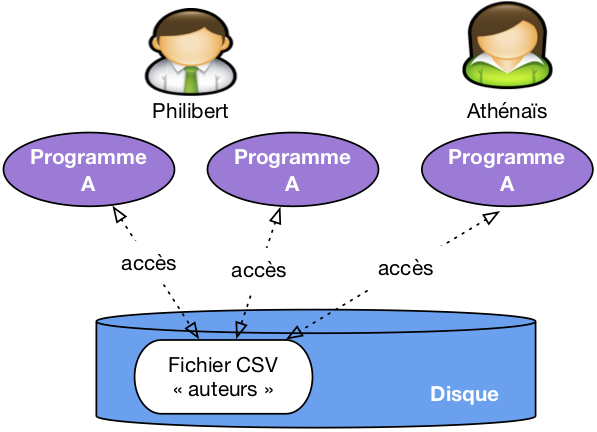
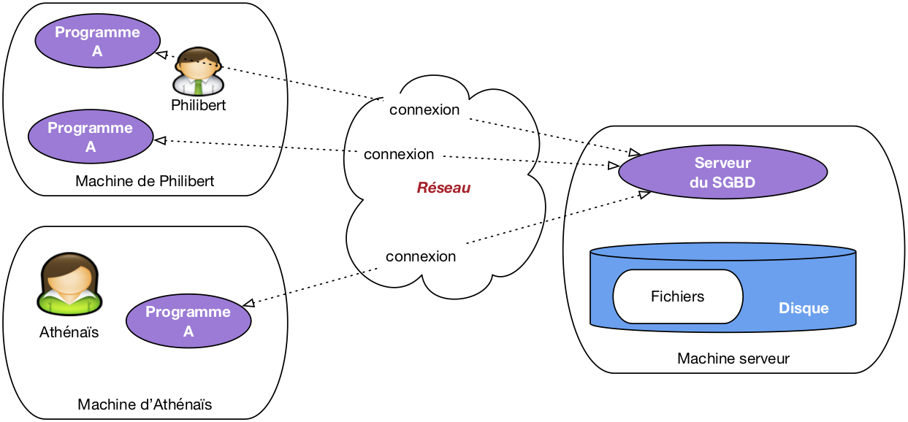
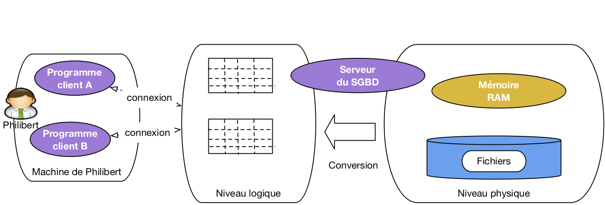
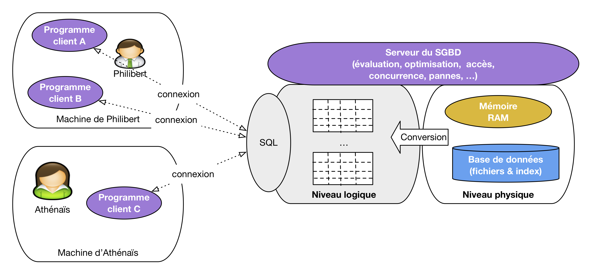

.. _chap-intro:

Le document que vous commencez à lire  fait partie de l'ensemble des 
supports d'apprentissage proposés sur le site http://www.bdpedia.fr. Il constitue,
sous le titre de "Modèles et langages", 
la première partie d'un cours complet consacré aux bases de données relationnelles.

  - La version en ligne du présent support est accessible
    à http://sql.bdpedia.fr, la version imprimable (PDF) est disponible à
    http://sql.bdpedia.fr/files/cbd-sql.pdf, et la version pour liseuse / tablette
    est disponible à
    http://sql.bdpedia.fr/files/cbd-sql.epub (format EPUB).
  - La seconde partie, intitulée "Aspects système", est accessible
    à http://sys.bdpedia.fr (HTML), http://sys.bdpedia.fr/files/cbd-sys.pdf (PDF)
    ou http://sys.bdpedia.fr/files/cbd-sys.epub (EPUB).

Je (Philippe Rigaux, Professeur au Cnam) suis également
l'auteur de deux autres cours, aux contenus proches:

  - Un cours sur les bases de données documentaires et distribuées 
    à http://b3d.bdpedia.fr.
  - Un cours sur les applications avec bases de données à http://orm.bdpedia.fr
  
Reportez-vous à  http://www.bdpedia.fr pour plus d'explications.

.. important:: Ce cours de Philippe Rigaux est mis à disposition selon 
   les termes de la licence Creative Commons Attribution - Pas d’Utilisation Commerciale - 
   Partage dans les Mêmes Conditions 4.0 International. Cf.
   http://creativecommons.org/licenses/by-nc-sa/4.0/.

############
Introduction
############

Ce support de cours s'adresse à tous ceux qui veulent *concevoir*,
*implanter*, *alimenter* et *interroger* une base de données (BD), et intégrer 
cette BD à une application. Dans un contexte académique, il
s'adresse aux étudiants en troisième année de Licence (L3). 
Dans un contexte professionnel, le contenu du cours 
présente tout ce qu'il est nécessaire de maîtriser quand on conçoit 
une BD ou que l'on  développe des applications qui s'appuient sur une BD. Au-delà
de ce public principal, toute personne désirant comprendre les principes, méthodes et 
outils des systèmes de gestion de données trouvera un intérêt à lire les chapitres consacrés
à la conception, à l'interrogation et à la programmation SQL, pour ne citer que les principaux.

************************
Contenu et plan du cours
************************

Le cours est constitué  d'un ensemble de chapitres consacrés
aux principes et à la mise en œuvre de bases de données
*relationnelles*, ainsi qu'à la pratique des Systèmes de Gestion de
Bases de Données (SGBD). Il couvre 
les *modèles et langages* des bases de données, et plus précisément:

   - la notion de *modèle de données* qui amène à structurer une base de manière
     à préserver son intégrité et sa cohérence;
   - la *conception* rigoureuse d'une BD en fonction des besoins d'une application;
   - les *principes* des langages d'interrogation, avec les deux paradigmes
     principaux: *déclaratif* (on décrit ce que l'on veut obtenir sans dire *comment*
     on peut l'obtenir) et *procédural* (on applique une suite d'opérations
     à la base); ces deux paradigmes sont étudiés, en pratique, avec le langage SQL;
   - la *mise en pratique* : définition d'un schéma, droits d'accès, insertions et mises
     à jour;
   - la *programmation* avec une base de données, illustrée avec des langages comme PL/SQL et Python.
   
Le cours comprend trois parties consacrées successivement au modèle relationnel et à l'interrogation de 
bases de données relationnelles, à la conception et à l'implantation d'une base, et 
enfin aux applications s'appuyant sur une base de données avec des éléments de programmation
et une introduction aux transactions.

Ce cours ne présente en revanche pas, ou peu, les connaissances nécessaires
à la gestion et à l'administration d'une BD: stockage, indexation,
évaluation des requêtes, concurrence des accès, reprise sur panne. Ces sujets sont
étudiés en détail dans  la seconde
partie, disponible séparément sur le site  http://sys.bdpedia.fr.

***********************
Apprendre avec ce cours
***********************

Le cours est découpé en *chapitres*, couvrant un sujet bien déterminé, et en *sessions*.
J'essaie  de structurer les sessions pour que les concepts principaux
puissent être présentés dans une vidéo d'à peu près 20 minutes. J'estime que chaque session
demande environ 2 heures de travail personnel (bien sûr, cela dépend également de vous).
Pour assimiler une session vous pouvez combiner les ressources suivantes:

  * La lecture du support en ligne: celui que vous avez sous les yeux, également disponible 
    en PDF ou EPUB. 
  * Le suivi du cours consacré à la session, soit en vidéo, soit en présentiel.
  * La réponse au Quiz proposant des QCM sur les principales notions
    présentées dans la session. Le quiz permet de savoir si vous avez compris:  si vous ne
    savez pas répondre à une question du Quiz, il faut relire le texte, écouter à nouveau
    la vidéo, approfondir. 
  * La pratique avec les travaux pratiques en ligne proposés dans plusieurs chapitres.
  * Et enfin, la réalisation des exercices proposés  en fin de chapitre.

.. note:: Au Cnam, ce cours est proposé dans un environnement de travail Moodle avec forum,
   corrections en lignes, interactions avec l'enseignant.
   
Tout cela constitue autant de manière d'aborder les concepts et techniques présentées. Lisez,
écoutez, pratiquez, recommencez autant de fois que nécessaire jusqu'à ce que vous ayez la conviction 
de maîtriser l'esentiel du sujet abordé. Vous pouvez alors passer à la session suivante.

.. admonition:: Les définitions

    Pour vous aider à identifier l'essentiel, la partie rédigée du cours contient des définitions.
    Une définition n'est pas nécessairement difficile, ou compliquée, mais elle est toujours
    importante. Elle identifie un concept à connaître, et vise à  lever toute ambiguité sur 
    l'interprétation de ce concept (c'est comme ça et pas autrement, "par définition"). Apprenez
    par cœur les définitions, et surtout comprenez-les.

La suite de ce chapitre comprend une unique session avec tout son matériel (vidéos, exercices),
consacrée au positionnement du cours. 

*******************
S1: notions de base
*******************

.. admonition::  Supports complémentaires:

    * `Diapositives: notions de base <http://sql.bdpedia.fr/files/slintro-sql.pdf>`_
    * `Vidéo sur les notions de base <http://mdcvideos.cnam.fr/videos/?video=MEDIA180904065616294>`_ 

Entrons directement dans le vif du sujet avec un premier tour d'horizon
qui va nous permettre de situer les principales notions étudiées dans ce cours. Cette session
présente sans doute beaucoup de concepts dont certains s'éclairciront au fur et à mesure
de l'avancement dans le cours. À lire et relire régulièrement donc.

Données, bases de données et  SGBD
==================================

Nous appellerons *donnée* toute valeur numérisée décrivant de manière élémentaire
un fait, une mesure, une réalité. Ce peut être 
une chaîne de caractères ("bouvier"), un entier (365), une date (12/07/1998).
Cette valeur est toujours associée au contexte permettant de savoir quelle information 
elle représente. Un mot comme "bouvier" par exemple peut désigner, entre autres, 
un gardien de troupeau, un aimable petit insecte, ou le nom d'un écrivain
célèbre.
Il ne prend un peu de sens que si l'on sait l'interpréter. Une donnée se présente toujours
en association avec un contexte interprétatif qui permet de lui donner un sens. 

.. note:: On pourrait établir une distinction (subtile) entre donnée (valeur brute)
   et information (valeur et contexte interprétatif). Pour ne pas compliquer
   inutilement les choses, on va assimiler les deux notions dans ce qui suit.
   
Les données ne tombent pas du ciel, et elles
ne sont pas mises en vrac dans un espace de stockage. Elles sont issues d'un domaine
applicatif, et décrivent des objets, des faits ou des concepts (on parle plus généralement
*d'entités*). On les organise de manière à ce que ces entités soient correctement et uniformément
représentées, ainsi que les liens que ces entités ont les unes avec les autres. Si je prends
par exemple l'énoncé *Nicolas Bouvier est un écrivain suisse auteur du récit de voyage
culte "L'usage du monde" paru en 1963*, je peux en extraire le prénom et le nom d'une personne,
sa nationalité (données décrivant une première entité), et au moins un de ses ouvrages (seconde entité,
décrite par un titre et une année de parution). J'ai de plus une notion d'auteur
qui relie la première à la seconde. Tout cela constitue autant d'informations
indissociables les uns des autres, constituant une ébauche d'une base de données
consacrée aux écrivains et à leurs œuvres. 

La représentation de ces données et leur association
donne à la base une *structure* qui aide à distinguer précisément et sans ambiguité
les informations élémentaires constituant cette base: nom, prénom,  
année de naissance, livre(s) publié(s), etc. 
Une base sans structure n'a aucune utilité. Une base avec une structure
incorrecte ou incomplète est une source d'ennuis infinis. Nous verrons comment la structure
doit être très sérieusement définie pendant la phase de conception.
 
Une *base de données* est un ensemble (potentiellement volumineux, mais pas forcément) 
de telles informations conformes à une structure pré-définie au moment de la conception, avec, de plus, 
une caractéristique essentielle : on souhaite
les mémoriser de manière *persistante*. La persistance désigne la capacité d'une base
à exister indépendamment des applications qui la manipulent, 
ou du système qui l'héberge. On peut arrêter toutes les machines
un soir, et retrouver la base de données le lendemain. Cela implique qu'une base est *toujours* stockée sur un 
support comme les disques magnétiques qui préservent leur contenu même 
en l'absence d'alimentation électrique. 

.. important:: Les supports persistants (disques, SSD) sont très lents 
   par rapport aux capacités d'un processeur et de sa mémoire interne. 
   La nécessité de stocker une base sur un tel  support soulève donc de redoutables
   problèmes de performance, et a mené à la mise au point de techniques très sophistiquées,
   caractéristiques des systèmes de gestion de données. Ces techniques sont étudiées 
   dans le cours consacré aux aspects systèmes.
   
On en arrive donc à la définition suivante:

.. admonition:: Définition (base de données)

   Une base de données est ensemble d'informations structurées mémorisées sur un support *persistant*.

Remarquons qu'une organisation consistant à stocker nos données dans un (ou plusieurs) fichier(s) sur
sur le disque de notre ordinateur personnel peut très bien être considéré
comme conforme à cette définition, sous réserve
qu'elles soient un tant soit peu structurées. Les fichiers produits par votre traitement
de texte préféré par exemple ne font pas l'affaire: on y trouve certes des données, 
mais pas leur association à un contexte interprétatif non ambigu. Ecrire avec ce traitement
de texte une phrase comme "L'usage du monde est un livre de Nicolas Bouvier paru en 1963"
constitue un énoncé trop flou pour qu'un système puisse automatiquement en extraire 
(sans recourir à des techniques très sophistiquées et en partie incertaines) le nom de l'auteur, le titre de son livre,
ou sa date de parution.

Un fichier de base de données a nécessairement une structure qui permet d'une part
de distinguer
les données les unes des autres, et d'autre part de représenter leurs liens. Prenons l'exemple de l'une
des structures les plus simples et les plus répandues, les fichiers CSV. Dans un fichier
CSV, les données élémentaires sont réprésentés par des "champs" délimités par des 
points-virgule. Les champs sont associés les uns aux autres par le simple fait 
d'être placés dans une même ligne. Les lignes en revanche sont
indépendantes les unes des autres. On peut placer autant de lignes que l'on veut dans un
fichier, et même changer leur ordre sans que cela modifie en quoi que ce soit 
l'information représentée.

Voici l'exemple de nos données, représentées en CSV.

.. code-block:: C

      "Bouvier" ; "Nicolas"; "L'usage du monde" ; 1963 

On comprend bien que le premier champ est le nom, le second le prénom, etc. Il paraît donc
cohérent d'ajouter de nouvelles lignes comme:

.. code-block:: C

     "Bouvier"   ; "Nicolas"; "L'usage du monde" ; 1963 
     "Stevenson" ; "Robert-Louis"  ; "Voyage dans les Cévennes avec un âne" ; 1879

On a  donné une structure régulière à nos informations, ce qui va permettre de les interroger
et de les manipuler avec précision. On les stocke dans un fichier sur
disque, et nous sommes donc en cours de constitution d'une véritable *base de données*. 
On peut en fait généraliser ce constat: *une base
de données est toujours un ensemble de fichiers, stockés sur une mémoire externe comme
un disque,  dont le contenu obéit à certaines règles de structuration.*

Peut-on se satisfaire de cette solution et imaginer que nous pouvons construire 
des applications en nous appuyant directement sur des fichiers structurés, par exemple
des fichiers CSV? C'est la méthode illustrée par la :numref:`sans-serveur`.
Dans une telle situation, chaque utilisateur applique des programmes au fichier, pour en extraire des
données, pour les modifier, pour les créer.

.. _sans-serveur:

   
      Une approche simpliste avec accès direct aux fichiers de la base
      
Cette approche n'est pas totalement inenvisageable, mais soulève en pratique de telles
difficultés que *personne* (personne de censé en tout cas) n'a recours à une telle solution.
Voici un petit catalogue de ces difficultés.

   - *Lourdeur d'accès aux données*. En pratique, pour chaque accès, même le plus simple, il faudrait
     écrire un programme adapté à la structure du fichier. La production et la maintenance de 
     tels programmes
     seraient extrêmement coûteuses.
   - *Risques élevés pour l'intégrité et la sécurité*. Si tout programmeur
     peut accéder directement aux fichiers, il est impossible
     de garantir la sécurité et l'intégrité des données. Quelqu'un peut très bien par exemple, en toute
     bonne foi, faire une fausse manœuvre qui rend le fichier illisible.
   - *Pas de contrôle de concurrence*. Dans un environnement
     où plusieurs utilisateurs accèdent aux même fichiers, comme illustré par exemple
     sur la :numref:`sans-serveur`, 
     des problèmes de concurrence d'accès se posent, notammment pour les mises à jour. Comment
     gérer par exemple la situation où deux utilisateurs souhaitent en même temps ajouter une ligne au fichier? 
   - *Performances*. Tant qu'un fichier ne contient que quelques centaines de lignes, on peut
     supposer que les performances ne posent pas de problème, mais que faire quand on atteint
     les Gigaoctets (1,000 Mégaoctets), ou même le Téraoctet (1,000 Gigaoctets)? Maintenir des performances acceptables
     suppose la mise en œuvre d'algorithmes ou de structures de données  
     demandant des compétences très avancées, probablement hors de portée du développeur d'application
     qui a, de toute façon, mieux à faire.

Chacun de ces problèmes soulève de redoutables difficultés techniques. Leur combinaison
nécessite la mise en place de systèmes d'une très grande complexité, capable d'offrir à la fois 
un accès simple, sécurisé, performant au contenu d'une base, et d'accomplir le tour
de force de satisfaire de tels accès pour des dizaines, centaines ou même milliers
d'utilisateurs simultanés, le tout en garantissant l'intégrité de la base même en cas de panne.
De tels systèmes sont appelés *Systèmes de Gestion de Bases de Données*, SGBD en bref. 

.. admonition:: Définition (SGBD)

   Un Système de Gestion de Bases de 
   Données (SGBD) est un système informatique qui assure la gestion de l'ensemble des informations
   stockées dans une base de données. Il prend en charge, notamment, les deux grandes 
   fonctionnalités suivantes:
   
       #. Accès aux fichiers de la base, garantissant leur intégrité, contrôlant les opérations
          concurrentes, optimisant les recherches et mises à jour.
       #. Interactions avec les applications et utilisateurs, grâce à des langages 
          d'interrogation et de manipulation à haut niveau d'abstraction.

Avec un SGBD, les applications n'ont plus *jamais* accès directement aux fichiers, et ne savent
d'ailleurs même pas qu'ils existent, quelle est leur structure et où ils sont situés.
L'architecture classique est celle illustrée par la :numref:`avec-serveur`. Le SGBD apparaît 
sous la forme d'un *serveur*, c'est-à-dire d'un processus informatique prêt à communiquer
avec d'autres (les "clients") via le réseau. Ce serveur est hébergé sur une machine
(la "machine serveur") et est le *seul* à pouvoir accéder aux fichiers contenant les données,
ces fichiers étant le  plus souvent stockés sur le disque de la machine serveur.

.. _avec-serveur:

   
      Architecture classique, avec serveur du SGBD

Les applications utilisateurs, maintenant, accèdent à la base *via* le programme serveur auquel elles 
sont connectés. Elles transmettent des commandes (d'où le nom "d'applications clientes") que le
serveur se charge d'appliquer. Ces applications bénéficient donc des puissants algorithmes
implantés par le SGBD dans son serveur, comme par exemple la capacité à gérer les accès concurrents,
où à satisfaire avec efficacité des recherches portant sur de très grosses bases.

Cette architecture est à peu près universellement adoptée par tous les SGBD de tous les temps
et de toutes les catégories. Les notions suivantes, et le vocabulaire associé,
sont donc très importantes à retenir.

.. admonition:: Définition (architecture client serveur)

    - **Programme serveur**. Un SGBD est instancié sur une machine sous la forme d'un *programme serveur* qui gère 
      une ou plusieurs bases de données, chacune constituée de fichiers stockés sur disque.
      Le programme serveur est seul responsable de tous les accès à une base, et de l'utilisation des
      ressources (mémoire, disques) qui servent de support à ces accès.
   
    - **Clients (programmes)**. Les *programmes (ou applications) clients* se connectent au programme serveur via le réseau, 
      lui transmettent des *requêtes* et recoivent des données en retour. Ils ne disposent 
      d'aucune information directe sur la base.

Modèle et couches d'abstraction
===============================

Le fait que le serveur de données s'interpose entre les fichiers et les programmes clients
a une conséquence extrêmement importante: ces  clients, n'ayant pas
accès aux fichiers, ne voient les données que sous la forme que veut bien leur
présenter le serveur. Ce dernier peut donc choisir le mode de représentation
qui lui semble le plus approprié, la seule condition étant de pouvoir aisément
convertir le format des fichiers vers la représentation "publique".

En d'autres termes, on peut s'abstraire de la complexité et de la lourdeur
des formats de fichiers avec tous leurs détails compliqués de codages, de 
gestion de la mémoire, d'adressage,
et proposer une représentation simple et intuitive aux applications. Une
des propriétés les plus importantes des SGBD est donc la distinction
entre plusieurs *niveaux d'abstraction* pour la réprésentation des données.
Il nous suffira ici de distinguer deux niveaux: le niveau
logique et le niveau physique.

.. admonition:: Définition: Niveau physique, niveau logique

     - Le *niveau physique* est celui du codage des données dans des fichiers
       stockés sur disque.
   
     - Le *niveau logique* est celui de la représentation les données dans des structures
       abstraites, proposées aux applications clientes, obtenues par conversion du niveau physique.

Les structures du niveau logique définissent une *modélisation* des données: on peut
envisager par exemple des structures de graphe, d'arbre, de listes, etc. 
Le *modèle relationnel* se caractérise par une modélisation basée sur 
une seule structure, la table. Cela apporte au modèle une grande simplicité
puisque toutes les données ont la même forme et obéissent aux même contraintes. 
Cela a également quelques 
inconvénients en limitant la complexité des données représentables. Pour la grande majorité
des applications, le modèle relationnel a largement fait la preuve de sa robustesse
et de sa capacité d'adaptation. C'est lui que nous étudions dans l'ensemble du cours.

La :numref:`physique-logique` illustre les niveaux d'abstraction dans l'architecture
d'un système de gestion de données. Les programmes clients ne voient que le niveau
logique, c'est-à-dire des tables si le modèle de données est relationnel (il en existe
d'autres, nous ne les étudions pas ici). Le serveur est en charge du niveau physique,
de la conversion des données vers le niveau logique, et de toute la machinerie
qui permet de faire fonctionner le système: mémoire, disques, algorithmes et structures
de données. Tout cela est, encore une fois, invisible (et c'est tant mieux) pour 
les programmes clients qui peuvent se concentrer sur l'accès à des données
présentées le plus simplement possible.

.. _physique-logique:

   
      Illustration des niveaux logique et physique

Signalons pour finir cette courte présentation que les niveaux sont en grande partie
indépendants, dans le sens où l'on peut modifier complètement l'organisation du niveau 
physique sans avoir besoin de changer qui que ce soit aux applications 
qui accèdent à la base. Cette *indépendance logique-physique* est très précieuse
pour l'administration des bases de données. 

Les langages
============

Un modèle, ce n'est pas seulement une ou plusieurs structures pour représenter
l'information indépendamment de son format de stockage, c'est aussi un ou plusieurs langages
pour interroger et, plus généralement, interagir avec les données (insérer, modifier, détruire, déplacer,
protéger, etc.). Le langage permet de construire les commandes transmises au serveur. 

Le modèle
relationnel s'est construit sur des bases formelles (mathématiques) rigoureuses, ce qui explique en
grande partie sa robustesse et sa stabilité depuis l'essentiel des travaux qui l'ont élaboré,
dans les années 70-80. Deux langages d'interrogation, à la fois différents, complémentaires
et équivalents, ont alors été définis:

  #. Un langage *déclaratif*, basé sur la logique mathématique. 
  #. Un langage *procédural*, et plus précisément *algébrique*, basé sur la théorie des ensembles.
  
Un langage est *déclaratif* quand il permet de spécifier le résultat que l'on veut obtenir, sans se soucier
des opérations nécessaires pour obtenir ce résultat. Un langage algébrique, au contraire,
consiste en un ensemble d'opérations permettant de transformer une ou plusieurs tables en entrée
en une table - le résultat - en sortie.

Ces deux approches sont très différentes. Elles sont cependant parfaitement complémentaires. 
l'approche déclarative permet de se concentrer sur le raisonnement, l'expression de requêtes, et
fournit une définition rigoureuse de leur signification. L'approche algébrique nous donne
une boîte à outil pour calculer les résultats.

Le langage SQL, assemblant les deux approches, a été normalisé sur ces bases. Il est utilisé
depuis les années 1970 dans tous les systèmes relationnels, et il paraît tellement naturel et intuitif
que même des systèmes construits sur une approche non relationnelle tendent à reprendre ses constructions.

Le terme SQL désigne plus qu'un langage d'interrogation, même s'il s'agit de son principal aspect.
La norme couvre également les mises à jour, la définition des tables, les contraintes portant sur les
données, les droits d'accès. SQL est donc le langage à connaître pour interagir
avec un système relationnel.

.. _physique-logique-sql:

   
      L'interface "modèle / langage " d'un système relationnel

La :numref:`physique-logique-sql` étend le schéma précédent en introduisant SQL, qui apparaît
comme le constituant central pour établir une communication entre une application et
un système relationnel. Les parties grisées de cette figure sont celles couvertes par le cours.
Nous allons donc étudier le modèle relationnel (représentation des données sous forme de table),
le langage d'interrogation SQL sous ses deux formes, déclarative et algébrique, et l'interaction
avec ce langage *via* un langage de programmation permettant de développer des applications.

Tout cela consitue à peu près tout ce qu'il est nécessaire de connaître pour concevoir,
implanter, alimenter et interroger une base de données relationnelle, que ce soit directement
ou par l'intermédiaire d'un langage de programmtion. 

Quiz
====

.. eqt:: sql-notions1

   Pourquoi faut-il mettre une base de données dans des fichiers?

   A) :eqt:`I` Parce qu'il est impossible de structurer correctement des données en mémoire RAM
   #) :eqt:`C` Parce que la base doit survivre à l'arrêt de la machine qui l'héberge
   #) :eqt:`I` Parce que cela permet à tout le monde peut accéder aux fichiers, et donc à la base

.. eqt:: sql-notions2

   Qu'est-ce qui caractérise une base de données?

   A) :eqt:`C` Elle est persistante
   #) :eqt:`I` Elle est volumineuse
   #) :eqt:`C`  Elle est structurée

.. eqt:: sql-notions2bis

   Voici quelques exemples d'ensembles de données numériques. Lesquelles
   sont des bases de données d'après notre définition? 

   A) :eqt:`C` Un fichier Excel avec la liste de vos dépenses et recettes
   #) :eqt:`I` Les photos numériques de votre dernier voyage
   #) :eqt:`I`  Le tableau à deux dimensions créé par votre programme Python ou Java
   #) :eqt:`I`  Le fichier texte qui contient votre dernier roman

   
.. eqt:: sql-notions3

   Qu'est-ce que le niveau *logique*?

   A) :eqt:`I` C'est le contenu de la mémoire du serveur après chargement des fichiers
   #) :eqt:`I` C'est le contenu de la mémoire d'une application cliente après interrogation du serveur
   #) :eqt:`C`  C'est la représentation des données proposée par le serveur aux applications clientes

.. eqt:: sql-notions4

   Une application cliente peut-elle accéder à un fichier de la base?

   A) :eqt:`C` Non
   #) :eqt:`I` Oui

.. eqt:: sql-notions5

   Quel est le rôle d'un programme serveur?

   A) :eqt:`I` Il transmet les fichiers de la base au programme client
   #) :eqt:`C` Il propose une représentation abstraite des données et des langages pour y accéder
   #) :eqt:`I` Il indique au programme client où se trouvent les données qui l'intéressent

   
.. eqt:: sql-notions6

   Un langage est *déclaratif* si

   A) :eqt:`C` Il n'indique pas les opérations à effectuer
   #) :eqt:`I` Il permet d'exprimer des requêtes en langage naturel
   #) :eqt:`I` Il peut s'écrire en déclarant des variables avec un langage de programmation comme java

.. eqt:: sql-csv

   Une base relationnelle peut-elle être stockée dans un fichier CSV?

   A) :eqt:`I` Non, car ce ne sont pas les mêmes modèles de données
   #) :eqt:`C` Oui, car les tables relationnelles sont au niveau logiue, et CSV
      est un format physique de stockage

*******************************
Atelier: installation d'un SGBD
*******************************

Plutôt que des exercices, ce chapitre peut facilement donner lieu à une mise
en pratique basée sur l'installation d'un serveur et d'un client, et de quelques 
investigations sur leur configuration et leur fonctionnement. Cet atelier n'est bien entendu 
faisable que si vous disposez d'une ordinateur et d'un minimum de pratique. informatique.

Plusieurs SGBD relationnels sont disponibles en *open source*. Pour chacun, vous
pouvez installer le serveur et une ou plusieurs applications clientes. 

MySQL
=====

MySQL est un des SGBDR les plus utilisés au monde. Il est maintenant distribué par Oracle Corp,
mais on peut l'installer (version MySQL Commiunity server) et l'utiliser gratuitement.

Il est assez pratique d'installer MySQL avec un environnement Web comprenant Apache,
le langage PHP et le client phpMyAdmin. Cet environnement est connu sous 
l'acronyme AMP (Apache - PHP - MySQL).

  - Se référer au site http://www.mysql.com pour des informations générales.
  - Choisir une distribution adaptée à votre environnement, 
       - EasyPHP, http://www.easyphp.org/, pour Windows
       - MAMP pour Mac OS X
       - D'innombrables outils pour Linux.
  - Suivez les instructions pour installer le serveur et le démarrer. 
  - Trouvez le fichier de configuration et consultez-le. La configuration
    d'un serveur comprend typiquement: la mémoire allouée et l'emplacement des fichiers.
  - Cherchez où se trouvent les fichiers de base et consultez-les. Peut-on
    les éditer ou ces fichiers sont-ils en format binaire, lisibles seulement par le serveur?
  - Installez une application cliente. Dans un environnement AMP, vous avez en principe
    d'office l'application Web phpMyAdmin qui est installée. Essayez de comprendre 
    l'architecture: qui est le serveur, qui est le client, quel est le rôle de Apache,
    quel est le rôle de votre navigateur web.
  - Installez un client autre que phpMyAdmin, par exemple MySQL Workbench (disponible
    sur le site d'Oracle). Quels sont les paramètres à donner pour connecter ce client au serveur?
  - Executez les scripts SQL de création et d'alimentation de la base de voyageurs.
    
Quand vous aurez clarifié tout cela pour devriez être en situation confortable pour passer
à la suite du cours.

Autres
======

Si le cœur vous en dit, vous pouvez essayer d'autres systèmes relationnels libres: Postgres,
Firebird, Berkeley DB, autres? À vous de voir.
