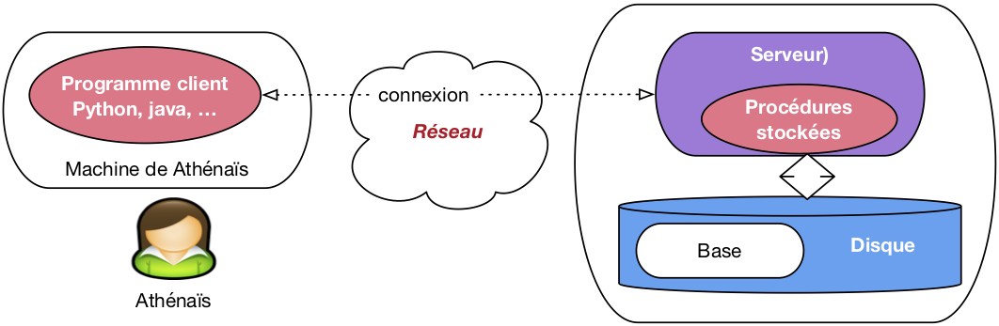

.. _chapprocedures:

##########################
Procédures et déclencheurs
##########################

Le langage SQL n'est pas un langage de programmation au sens courant du
terme. Il ne permet pas, par exemple, de définir des fonctions ou des
variables, d'effectuer des itérations ou des instructions conditionnelles. Il
ne s'agit pas d'un défaut dans la conception du langage, mais d'une orientation
délibérée de SQL vers les opérations de recherche de données dans une base
volumineuse, la priorité étant donnée à la *simplicité* et à 
*l'efficacité*. Ces deux termes ont une connotation forte dans le contexte d'un
langage d'interrogation, et correspondent à des critères (et à des contraintes)
précisément définis.  La simplicité d'un langage est essentiellement relative à
son caractère *déclaratif*, autrement dit à la capacité d'exprimer des
recherches en laissant au système le soin de déterminer le meilleur moyen de
les exécuter.  L'efficacité est, elle, définie par des caractéristiques liées
à la complexité d'évaluation sur lesquelles nous ne nous étendrons pas
ici. Signalons cependant que la terminaison d'une requête SQL est 
*toujours* garantie, ce qui n'est pas le cas d'un programme écrit dans un
langage plus puissant, .

Il est donc clair que SQL ne suffit pas pour le développement d'applications,
et tous les SGBD relationnels ont, dès l'origine, proposé des interfaces
permettant de l'associer à des langages plus classiques comme le C ou Java.
Ces interfaces de programmation permettent
d'utiliser SQL comme outil pour récupérer des données dans des programmes
réalisant des tâches très diverses : interfaces graphiques, traitements
"batch", production de rapports ou de sites web, etc. D'une certaine
manière, on peut alors considérer  SQL comme une interface d'accès à la base de
données, intégrée dans un langage de programmation généraliste. Il s'agit
d'ailleurs certainement de son utilisation la plus courante.

Pour certaines fonctionnalités, le recours à un langage de programmation
"externe" s'avère cependant inadapté ou insatisfaisant. Une évolution
des SGBD consiste donc à proposer, au sein même du système, des
primitives de programmation qui viennent pallier le manque relatif
d'expressivité des langages relationnnels. Le présent chapitre décrit ces
évolutions et leur application à la création de *procédures stockées* et de
déclencheurs (*triggers*). Les premières permettent d'enrichir un schéma de base de
données par des calculs ou des fonctions qui ne peuvent pas - parfois même
dans des cas très simples - être obtenus avec SQL ; les seconds étendent la
possibilité de définir des contraintes.

Parallèlement à ces applications pratiques, les procédures stockées illustrent
simplement les techniques d'intégration de SQL à un langage de programmation
classique, et soulignent les limites d'utilisation d'un langage
d'interrogation, et plus particulièrement du modèle relationnel. 

***********************
S1. Procédures stockées
***********************

.. admonition::  Supports complémentaires:

    * `Diapositives: PL/SQL <http://sql.bdpedia.fr/files/slplsql.pdf>`_
    * `Vidéo sur PL/SQL <https://mediaserver.cnam.fr/videos/principe-de-programmation-et-plsql/>`_ 

Comme mentionné ci-dessus, les procédures stockées constituent 
une alternative à l'écriture de programmes avec
une langage de programmation généraliste. Commençons par étudier plus en détail les avantages et 
inconvénients respectifs des deux solutions avant d'entrer
dans les détails techniques.

Rôle et fonctionnement des procédures stockées
==============================================

Une procédure stockée s'exécute au sein du SGBD, ce qui évite les échanges
réseaux qui sont nécessaires quand les mêmes fonctionnalités sont
implantées dans un programme externe communiquant en mode client/serveur avec
la base de données. La  :numref:`plsql` illustre la différence entre les
deux mécanismes. À gauche un programme externe, écrit par exemple en Java ou en Python, doit
tout d'abord se connecter au serveur du SGBD. Le programme s'exécute alors en
communiquant avec le serveur pour exécuter les requêtes et récupérer les
résultats. Dans cette architecture, chaque demande d'exécution d'un ordre SQL
implique une transmission sur le réseau, du programme vers le client, suivie
d'une analyse de la requête par le serveur, de sa compilation et de son
exécution (Dans certains cas les requêtes du programme client peuvent
être précompilées, ou "préparées"). Ensuite, chaque fois que le programme client
souhaite récupérer un n-uplet du résultat, il doit effectuer un appel externe,
via le réseau. Tous ces échanges interviennent de manière non négligeable dans
la performance de l'ensemble, et cet impact est d'autant plus élevé que les
communications réseaux sont lentes et/ou que le nombre d'appels nécessaires à
l'exécution du programme est important.

.. _plsql:

   Comparaison programmes externes/procédures stockées

Le recours à une procédure stockée permet de regrouper
du côté serveur l'ensemble des requêtes SQL et le traitement
des données récupérées. La procédure est compilée une fois
par le SGBD, au moment de sa création, ce qui permet 
de l'exécuter rapidement au moment de l'appel. De plus
les échanges réseaux ne sont plus nécessaires puisque
la logique de l'application est étroitement intégrée
aux requêtes SQL. Le rôle du programme externe se limite
alors à se connecter au serveur et à demander
l'exécution de la procédure, en lui passant au besoin les
paramètres nécessaires.

Bien entendu, en pratique, les situations ne sont pas aussi tranchées et le
programme externe est en général amené à appeler plusieurs procédures, jouant
en quelque sorte le rôle de coordinateur. Si les performances du système sont
en cause, un recours judicieux aux procédures stockées reste cependant un bon
moyen de réduire le trafic client-serveur.

L'utilisation de procédures stockées est par ailleurs justifiée,
même en l'absence de problèmes de performance, pour des fonctions très "sensibles", terme qui recouvre
(non exclusivement) les cas suivants :

  #. la fonction est basée sur des règles complexes
     qui doivent être implantées très soigneusement ;
  #. la fonction met à jour des données 
     dont la correction et  la cohérence sont indispensable
     au bon fonctionnement de l'application ; 
  #. la fonction évolue souvent.
  

On est souvent amené, quand on développe une application, à utiliser plusieurs
langages en fonction du contexte : le langage C ou Java pour les traitements
*batch*, PHP ou Python pour l'interface web, un générateur d'application propriétaire
pour la saisie et la consultation à l'écran, un langage de script pour la
production de rapports, etc. Il est important alors de pouvoir factoriser les
opérations de base de données partagées par ces différents contextes, de
manière à les rendre disponibles pour les différents langages utilisés. Par
exemple la réservation d'un billet d'avion, ou l'exécution d'un virement
bancaire, sont des opérations dont le fonctionnement correct (pas deux billets
pour le même siège ; pas de débit sans faire le crédit correspondant) et
cohérent (les mêmes règles doivent être appliquées, quel que soit le contexte
d'utilisation) doit toujours être assuré.

C'est facile avec une procédure stockée, et cela permet d'une part d'implanter
une seule fois des fonctions "sensibles", d'autre part de garantir la
correction, la cohérence et l'évolutivité en imposant l'utilisation
systématique de ces fonctions au lieu d'un accès direct aux données.  

Enfin, le dernier avantage des procédures stockées est la relative facilité de
programmation des opérations de bases de données, en grande partie à cause de
la très bonne intégration avec SQL.  Cet aspect est favorable à la qualité et à
la rapidité du développement, et aide également à la diffusion et à
l'installation du logiciel puisque les procédures sont compilées par les SGBD
et fonctionnent donc de manière identique sur toute les plateformes.

Il existe malheureusement une contrepartie à tous ces avantages : chaque
éditeur de SGBD propose sa propre extension procédurale pour créer des
procédures stockées, ce qui rend ces procédures incompatibles d'un système à un
autre. Cela peut être dissuasif si on souhaite produire un logiciel qui
fonctionne avec tous les SGBD relationnels.

La description qui suit se base sur le langage PL/SQL d'Oracle ("PL"
signifie *Procedural Language*) qui est sans doute le plus riche du
genre. Le même langage, simplifié, avec quelques variantes syntaxiques
mineures, est proposé par PostgreSQL, et les exemples que nous donnons peuvent
donc y être transposés sans trop de problème.  Les syntaxes des langages
utilisés par d'autres systèmes sont un peu différentes, mais tous partagent
cependant un ensemble de concepts et une proximité avec SQL qui font de PL/SQL
un exemple tout à fait représentatif de l'intérêt et de l'utilisation des
procédures stockées.

Introduction à PL/SQL
=====================

Nous allons commencer par quelques exemples très simples, appliqués à la base
*Films*, afin d'obtenir un premier aperçu du langage.  Le premier exemple
consiste en quelques lignes permettant d'afficher des statistiques sur la
base de données (nombre de films et nombre d'artistes). Il ne s'agit pas pour
l'instant d'une procédure stockée, mais d'un code qui est compilé et exécuté en
direct.

.. code-block:: sql

    -- Exemple de bloc PL/SQL donnant des informations sur la base

    DECLARE
      -- Quelques variables
      v_nbFilms   integer;
      v_nbArtistes integer;

    begin
      -- Compte le nombre de films
      select count(*) into v_nbFilms from Film;
      -- Compte le nombre d'artistes
      select count(*) into v_nbArtistes from Artiste;

      -- Affichage des résultats
      DBMS_outPUT.PUT_LinE ('Nombre de films: ' || v_nbFilms);
      DBMS_outPUT.PUT_LinE ('Nombre d''artistes: ' || v_nbArtistes);

      exception
        when others then 
          DBMS_outPUT.PUT_LinE ('Problème rencontré dans StatsFilms');

    end;
    /

Le code est structuré en trois parties
qui forment un "bloc" : déclarations des variables,
instructions (entre ``begin`` et ``end``) et gestion des exceptions.
La première remarque importante est que les variables sont typées, et que les
types sont exactement ceux de SQL (ou plus largement les types supportés par le
SGBD, qui peuvent différer légèrement de la norme).  Un autre aspect de
l'intégration forte avec SQL est la possibilité d'effectuer des requêtes,
d'utiliser dans cette requête des critères basés sur la valeur des variables de
la procédure, et de placer le résultat dans une (ou plusieurs) variables grâce à
la clause ``into``.  En d'autres termes on transfère directement des
données représentées selon le modèle relationnel et accessibles avec SQL,
dans des unités d'information manipulables avec les structures classiques (test
ou boucles) d'un langage impératif.

Les fonctions SQL fournies par le SGBD sont également utilisables, ainsi que
des librairies spécifiques à la programmation procédurale (des *packages*
chez orACLE). Dans l'exemple ci-dessus on utilise le *package*
``DBMS_outPUT`` qui permet de produire des messages sur la sortie
standard (l'écran en général).

La dernière section du programme est celle qui gère les "exceptions". Ce
terme désigne une erreur qui est soit définie par l'utilisateur en fonction de
l'application (par exemple l'absence d'un n-uplet, ou une valeur incorrecte
dans un attribut), soit engendrée par le système à l'exécution (par exemple une
division par zéro, ou l'absence d'une table).  Au moment où une erreur est
rencontrée, PL/SQL redirige le flux d'exécution vers la section
``exception`` où le programmeur doit définir les actions à entreprendre au
cas par cas.  Dans l'exemple précédent, on prend toutes les exceptions
indifféremment (mot-clé ``others`` qui désigne le choix par défaut) et on
affiche un message.

.. note:: Un programme Pl/SQL peut être placé dans un fichier 
   et executé avec la commande ``start``  sous l'utilitaire de commandes. 
   par exemple:
   
   .. code-block:: bash
  
       SQL>start StatsFilms

En cas d'erreur de compilation, la commande ``SHOW ERRorS`` donne la liste
des problèmes rencontrés. Sinon le code est exécuté.  Voici par exemple ce que
l'on obtient avec le code donné précédemment en exemple (La commande
``set serveroutput on`` assure que les messages sont bien affichés à
l'écran..

.. code-block:: text

    SQL> set serveroutput on
    SQL> start StatsFilms
    Nombre de films: 48
    Nombre d'artistes: 126

Voici maintenant un exemple de procédure stockée. On retrouve
la même structuration que précédemment (déclaractions, instructions,
exception), mais cette fois ce "bloc" 
est nommé, stocké dans la base au moment de la compilation,
et peut ensuite être appelé par son nom. 
La procédure implante la règle suivante : l'insertion d'un 
texte dans 
la table des genres s'effectue toujours en majuscules,
et on vérifie au préalable que ce code n'existe pas déjà.

.. code-block:: sql

    -- Insère un nouveau genre, en majuscules, et en vérifiant
    -- qu'il n'existe pas déjà                               

    create or replace procedure InsereGenre (p_genre varchar) as 

      -- Déclaration des variables
      v_genre_majuscules varchar(20);
      v_count integer;
      genre_existe exception;
    begin
      -- On met le paramètre en majuscules
      v_genre_majuscules := UPPER(p_genre);

      -- On vérifie que le genre n'existe pas déjà
      select count(*) into v_count 
      from Genre where code = v_genre_majuscules;
      
      -- Si on n'a rien trouvé: on insère
      if (v_count = 0) then
       insert into Genre (code) VALUES (v_genre_majuscules);
      else
       RAisE genre_existe;
     end if;
  
      exception
        when genre_existe then
         DBMS_outPUT.PUT_LinE('Le genre existe déjà en ' ||
                             v_count || ' exemplaire(s).');

    end;
    /

La procédure accepte des paramètres qui, comme les variables, sont typées.  Le
corps de la procédure montre un exemple d'utilisation d'une fonction SQL
fournie par le système, ici la fonction ``UPPER`` qui prend une chaîne de
caractères en entrée et la renvoie mise en majuscules.

La requête SQL garantit que l'on obtient un et un seul n-uplet.  Nous verrons
plus loin comment traiter le cas où le résultat de la requête est une table
contenant un nombre quelconque de n-uplets.  Dans l'exemple ci-dessus on obtient toujours un
attribut donnant le nombre de n-uplets existants dans la table pour le code
que l'on veut insérer.  Si ce nombre n'est pas nul, c'est que le genre existe
déjà dans la table, et on produit une "exception" avec la clause
``RAisE exception``, sinon c'est que le genre n'existe pas et on peut
effectuer la clause d'insertion, en indiquant comme valeurs à insérer celles
contenues dans les variables appropriées.

On peut appeler cette procédure à partir de n'importe quelle
application connectée au SGBD. Sous SQL*Plus
on utilise l'instruction ``execute``.
Voici par
exemple ce que l'on obtient avec deux appels successifs.

.. code-block:: sql

    SQL>  execute InsereGenre('Policier');
    
    SQL>  execute InsereGenre('Policier');
    Le genre existe déjà en 1 exemplaire(s).
    
Le premier appel s'est correctement déroulé puisque
le genre "Policier" n'existait pas encore dans la table.
Le second en revanche a échoué, ce qui a déclenché 
l'exception et l'affichage du message d'erreur. 

On peut appeler ``InsereGenre()`` depuis un programme C,
Java, ou tout autre outil. Si on se fixe comme règle de toujours
passer par cette procédure pour insérer dans la table ``Genre``,
on est donc sûr que les contraintes implantées dans la procédure
seront toujours vérifiées.

.. note:: Pour forcer les développeurs à toujours passer par
   la procédure, on peut fixer les droits d'accès de telle
   sorte que les utilisateurs orACLE aient le droit
   d'exécuter ``InsereGenre()``, mais pas de droit
   de mise à jour sur la table ``Genre`` elle-même.

Voici un troisième exemple qui complète ce premier tour d'horizon
rapide du langage. Il s'agit cette fois d'une *fonction*,
la différence avec une procédure étant qu'elle renvoie 
une valeur, instance de l'un des types SQL. Dans l'exemple
qui suit, la fonction prend en entrée l'identifiant d'un film
et renvoie une chaîne de caractères contenant la liste des prénom
et nom des acteurs du film, séparés par des virgules. 

.. code-block:: sql

    -- Fonction retournant la liste des acteurs pour un film donné

    create or replace FUNCTIon MesActeurs(v_idFilm integer) RETURN varchar is
      -- Le résultat    
      resultat varchar(255);

    begin
      -- Boucle prenant tous les acteurs du films 

      for art in 
        (select Artiste.* from Role, Artiste  
        where idFilm = v_idFilm  and idActeur=idArtiste)
      loop

        if (resultat is NOT NULL) then
          resultat := resultat || ', ' || art.prenom || ' ' || art.nom;
        else   
          resultat := art.prenom || ' ' || art.nom;
       end if;

      end loop;

     return resultat;
    end;
    /

La fonction effectue une requête SQL pour rechercher tous les acteurs du film
dont l'identifiant est passé en paramètre. Contrairement à l'exemple précédent,
cette requête renvoie en général plusieurs n-uplets. Une des caractéristiques
principales des techniques d'accès à une base de données avec un langage
procédural est que l'on ne récupère pas d'un seul coup le résultat d'un ordre
SQL. Il existe au moins deux raisons à cela :

  #. le résultat de la requête peut être extrêmement volumineux,
     ce qui poserait des problèmes d'occupation mémoire 
     si on devait tout charger dans l'espace du programme client ;
  #. les langages de programmation ne sont en général pas 
     équipés nativement des types nécessaires à la représentation 
     d'un ensemble de n-uplets.

Le concept utilisé, plus ou moins implicitement, dans toutes les interfaces
permettant aux langages procéduraux d'accéder aux bases de données est celui de
*curseur*.  Un curseur permet de parcourir, à l'aide d'une boucle,
l'ensemble des n-uplets du résultat d'une requête, en traitant le n-uplet
courant à chaque passage dans la boucle.  Ici nous avons affaire à la version
la plus simple qui soit d'un curseur, mais nous reviendrons plus loin
sur ce mécanisme.

Une fonction renvoie une valeur, ce qui permet de l'utiliser dans une requête
SQL comme n'importe quelle fonction native du système.  Voici par exemple une
requête qui sélectionne le titre et la liste des acteurs du film dont
l'identifiant est 5.

.. code-block:: sql

    SQL> select titre, MesActeurs(idFilm)  from Film where idFilm=5;
    
    TITRE        MESACTEURS(IDFILM)
    ------------ -----------------------------
    Volte/Face   John Travolta, Nicolas Cage

On peut noter que le résultat de la fonction ``MesActeurs()`` ne peut pas être
obtenu avec une requête SQL. Il est d'ailleurs intéressant de se demander
pourquoi, et d'en tirer quelques conclusions sur certaines limites de SQL.
Il est important de mentionner également qu'orACLE ne permet
pas l'appel, dans un ordre ``select`` de fonctions
effectuant des mises  à jour dans la base : une requête
n'est pas censée entraîner des modifications, surtout
si elles s'effectuent de manière transparente pour l'utilisateur.

Syntaxe de PL/SQL
=================

Voici maintenant une présentation plus systématique du langage PL/SQL. Elle
vise à expliquer et illustrer ses principes les plus intéressants et à donner
les éléments nécessaires à une expérimentation sur machine mais ne couvre
cependant pas toutes ses possibilités, très étendues. 

Types et variables
------------------

PL/SQL reconnaît tous les types standard de SQL,
plus quelques autres dont le type ``Boolean``
qui peut prendre les valeurs ``TRUE``
ou ``FALSE``. Il propose également deux constructeurs permettant de créer des types
composés :

  #. le constructeur ``RECORD`` est comparable au schéma
     d'une table ; il décrit  un 
     ensemble d'attributs typés et nommés ;
  #. le constructeur ``TABLE`` correspond 
     aux classiques tableaux unidimensionnels.

Le constructeur ``RECORD`` est particulièrement
intéressant pour représenter un n-uplet d'une table,
et donc pour définir des variables servant 
à stocker le résultat d'une requête SQL. On peut
définir soit-même un type avec ``RECORD``,
avec une syntaxe très similaire à celle du
``create TABLE``.

.. code-block:: sql

    DECLARE
      -- Déclaration d'un nouveau type
      TYPE adresse is RECORD
       (no         integer,
        rue        varchar(40),
        ville      varchar(40),
        codePostal varchar(10) 
       );

Mais PL/SQL offre également un mécanisme extrêmement utile consistant à dériver
automatiquement un type ``RECORD`` en fonction d'une table ou d'un
attribut d'une table. On utilise alors le nom de la table ou de l'attribut,
associées respectivement au qualificateur ``%ROWTYPE`` ou à
``%TYPE`` pour désigner le type dérivé. Voici
quelques exemples :

  #. ``Film.titre%TYPE`` est le type de l'attribut
     ``titre`` de la table ``Film`` ;

  #. ``Artiste%ROWTYPE`` est  un type ``RECORD`` correspondant aux attributs de la table ``Artiste``.

Le même principe de dérivation automatique d'un type s'applique également aux
requêtes SQL définies dans le cadre des curseurs. Nous y reviendrons au moment
de la présentation de ces derniers.

La déclaration d'une variable consiste à donner son nom, son type, à indiquer si
elle peut être ``NULL``  et a donner éventuellement
une valeur initiale. Elle est de la forme :

.. code-block:: sql

    <nomVariable> <typeVariable> [NOT NULL] [:= <valeurDéfaut>]

Il est possible de définir également des constantes, avec
la syntaxe :

.. code-block:: sql

    <nomConstante> ConSTANT <typeConstante> := <valeur>
    
Toutes les déclarations de variables ou de constantes doivent être comprises dans
la section ``DECLARE``. Toute variable non initialisée est à  ``NULL``.
Voici  quelques exemples de déclarations. Tous
les noms de variables sont systématiquement
préfixés par ``v_``. Ce n'est pas
une obligation mais ce type
de convention permet de distinguer plus
facilement les variables de PL/SQL des attributs
des tables dans les ordres SQL.

.. code-block:: sql

    DECLARE
      -- Constantes
      v_aujourdhui  ConSTANT DATE  := SYSDATE;
      v_pi          ConSTANT NUMBER(7,5) := 3.14116;

      -- Variables scalaires 
      v_compteur    integer NOT NULL := 1;
      v_nom         varchar(30);

      -- Variables pour un n-uplet de la table Film et pour le résumé
      v_film Film%ROWTYPE;
      v_resume Film.resume%TYPE;

Structures de contrôle
----------------------

L'affectation d'une variable est effectuée par l'opérateur
``:=`` avec la syntaxe :

.. code-block:: sql

    <nomVariable> := <expression>;

où ``expression`` est toute expression valide retournant
une valeur de même type que celle de la variable. Rappelons
que tous les opérateurs SQL (arithmétiques, concaténation
de chaînes, manipulation de dates) et toutes les fonctions
du SGBD sont utilisables en PL/SQL. Un autre manière
d'affecter une variable est d'y transférer
tout ou partie d'un n-uplet provenant d'une
requête SQL avec la syntaxe :

.. code-block:: sql

    select <nomAttribut1>, [<nomAttribut2>, ...]
    into   <nomVariable1>, [<nomVariable2>, ... ]
    from   [...]

La variable doit être du même type que l'attribut  correspondant de la clause ``select``, ce
qui incite fortement à utiliser le type dérivé avec ``%TYPE``.  Dès que l'on veut transférer
plusieurs valeurs d'attributs  dans des variables, on a sans doute intérêt à utiliser un type
dérivé ``%ROWTYPE`` qui limite le
nombre de déclarations à effectuer. L'exemple suivant
illustre l'utilisation de  la clause ``select ... into``
associée à des types dérivés. La fonction renvoie le titre
du film concaténé avec le nom du réalisateur.

.. code-block:: sql

    -- Retourne une chaîne avec le titre du film et sont réalisateur   

    create or replace FUNCTIon TitreEtMES(v_idFilm integer) RETURN varchar is

      -- Déclaration des variables
      v_titre Film.titre%TYPE;
      v_idMES Film.idMES%TYPE;
      v_mes  Artiste%ROWTYPE;

    begin
      -- Recherche du film
      select  titre, idMES 
      into v_titre, v_idMES  
      from Film  
      where idFilm=v_idFilm;
  
      -- Recherche du metteur en scène
      select * into v_mes from Artiste where idArtiste = v_idMES;

      return v_titre  || ', réalisé par ' || v_mes.prenom 
                      || ' ' || v_mes.nom;
    end;
    /

L'association dans la requête SQL de noms d'attributs et
de noms de variables peut parfois s'avérer ambiguë
d'où l'utilité d'une convention
permettant de distinguer clairement ces derniers.

Les structures de test et de boucles sont tout à fait standard.  La structure
conditionnelle est le ``if`` dont la syntaxe est la suivante :

.. code-block:: sql

    if <condition> then
      <instructions1>;
    else
     <instruction2>;
    end if;

Les conditions sont exprimées comme dans une clause ``where``
de SQL, avec notamment la possibilité de tester si une valeur est à ``NULL``, des opérateurs
comme ``LIKE`` et les connecteurs usuels ``and``, ``or`` et ``NOT``.
Le ``else`` est optionnel, et peut éventuellement
être associé à un autre ``if``, selon la syntaxe généralisée suivante :

.. code-block:: sql

    if <condition 1> then
      <instructions 1>;
    ELSif <condition 2> then
     <instruction 2>;
      [...]
    ELSif <condition n> then
     <instruction n>;
    else
     <instruction n+1>;
    end if;

Il existe trois formes de boucles : ``loop``,
``for`` et ``while``. Seules les deux dernières sont
présentées ici car elles suffisent à tous les besoins
et sont semblables aux structures habituelles.

La boucle ``while`` répète un ensemble d'instructions
tant qu'une condition est vérifiée. La condition
est testée à chaque entrée dans la boucle. Voici la
syntaxe :

.. code-block:: sql

    while <condition> loop
      <instructions>;
    end loop;

Rappelons que les expressions booléennes en SQL  peuvent prendre trois  valeurs :
``TRUE``, ``FALSE`` et ``UNKNOWN`` quand l'évaluation de l'expression rencontre une
valeur à ``NULL``. Une condition est donc vérifiée quand elle prend la valeur ``TRUE``,
et une boucle ``while`` s'arrête  en cas de ``FALSE`` ou ``UNKNOWN``.

La boucle ``for`` permet de répéter un ensemble
d'instructions pour chaque valeur d'un intervalle de nombres entiers.
La syntaxe est donnée ci-dessous. Notez les deux points
entre les deux bornes de l'intervalle, et la
possibilité de parcourir cet intervalle de haut en bas
avec l'option ``REVERSE``.

.. code-block:: sql

    for <variableCompteur> in [REVERSE] <min>..<max> loop
      <instructions>;
    end loop;

Des itérations couramment utilisées en PL/SQL 
consistent à parcourir le résultat d'une requête SQL
avec un curseur.  

Structure du langage
--------------------

Le code PL/SQL est structuré en *blocs*.  Un bloc comprend trois sections
explicitement délimitées : les déclarations, les
instructions (encadrée par ``begin`` et ``end``) et les exceptions,
placées en général à la fin de la section d'instruction. On peut partout
mettre des commentaires, avec deux formes possibles :
soit une ligne commençant par deux tirets ``--``,
soit, comme en C/C++, un texte de longueur quelconque 
compris entre ``/*`` et ``*/``. La structure générale d'un bloc
est donc la suivante :

.. code-block:: sql

    [DECLARE]
      -- Déclaration des variables, constantes, curseurs et exceptions

    begin
      -- Instructions, requêtes SQL, structures de contrôle

    exception
      -- Traitement des erreurs
    end;

Le bloc est l'unité de traitement de PL/SQL. Un bloc peut être  anonyme. Il commence alors
par l'instruction ``DECLARE``, et orACLE le compile et l'exécute dans la foulée au moment où
il est rencontré. Le premier exemple que nous avons donné est un  bloc anonyme.

Un bloc peut également être nommé  (cas des procédures et fonctions) et stocké.
Dans ce cas le ``DECLARE`` est remplacé par l'instruction ``create``.
Le SGBD stocke la procédure ou la fonction et l'exécute quand on
l'appelle dans le cadre d'un langage de programmation.
La syntaxe de création d'une procédure stockée est donnée ci-dessous.

.. code-block:: sql

    create [or replace] procedure <nomProcédure>
      [(<paramètre 1>, ... <paramètre n>)] as
     [<déclarations<]
    begin
     <instructions>;

     [exception
        <gestionExceptions>;
     ] 
    end;

La syntaxe des fonctions est identique, à l'exception
d'un ``RETURN <type>``  précédant le  ``as``
et indiquant le type de la valeur renvoyée. 
Procédures et fonctions prennent en entrée
des *paramètres* selon la syntaxe suivante :

.. code-block:: sql

    <nomParamètre> [in | out | in out] <type> [:= <valeurDéfaut>]

La déclaration des paramètres ressemble à celle des variables. Tous les types
PL/SQL sont acceptés pour les paramètres,  notamment les types dérivés avec
``%TYPE`` et ``%ROWTYPE``, et on peut définir des valeurs par défaut. Cependant la longueur
des chaînes de caractères (``CHAR`` ou ``varchar``)
ne doit pas être précisée pour les paramètres.  La principale différence avec la déclaration
des variables est le mode d'utilisation des paramètres
qui peut être ``in``, ``out`` ou ``in out``. Le mode détermine la manière dont les paramètres
servent à communiquer avec le programme appelant :

  #. ``in`` indique que la valeur du paramètre peut être lue
     mais pas être modifiée ; c'est le mode par
     défaut ;
  #. ``out`` indique que la valeur du paramètre peut
     être modifée mais ne peut pas être lue;
  #. ``in out`` indique que la valeur du paramètre peut être lue et modifiée.

En d'autres termes les paramètres ``in`` permettent au programme appelant de passer des valeurs
à la procédure, les paramètres ``out``  permettent à la procédure de renvoyer des valeurs
au programme appelant, et les paramètres ``in out`` peuvent jouer les deux rôles.
L'utilisation des paramètres ``out`` permet à une fonction
ou une procédure de renvoyer plusieurs valeurs.

Gestion des erreurs
-------------------

Les *exceptions* en PL/SQL peuvent être soit des erreurs renvoyées par le SGBD lui-même en cas
de manipulation incorrecte des données, soit des erreurs définies par le programmeur lui-même.
Le principe est que toute erreur rencontrée à l'exécution
entraîne la levée} (``RAisE``) d'une exception, ce qui amène  le flux de l'exécution
à se dérouter vers la section ``exception`` du bloc courant. Cette section rassemble les
actions (*exception handlers*) à effectuer pour chaque type d'exception rencontrée.
Voici quelques-unes des exceptions les plus communes
levées par le SGBD.

  #. ``inVALID_NUMBER``, indique une conversion
     impossible d'une chaîne de caractères vers un numérique ;
  #. ``inVALID_cursor``, indique une tentative d'utiliser un nom de curseur inconnu ;
  #. ``NO_DATA_found``, indique une  requête SQL qui ne ramène aucun n-uplet ;
  #. ``TOO_MANY_ROWS``, indique une 
     requête ``select ... into`` qui n'est pas
     traitée par un curseur alors qu'elle ramène plusieurs
     n-uplets.
      
Les exceptions utilisateurs doivent être définies 
dans la section de déclaration avec la syntaxe suivante.

.. code-block:: sql

    <nomException> exception;

On peut ensuite lever, au cours de l'exécution d'un bloc PL/SQL, les
exceptions, systèmes ou utilisateurs, avec l'instruction ``RAisE``.

.. code-block:: sql
  
    RAisE <nomException>;

Quand une instruction ``RAisE`` est rencontrée, l'exécution PL/SQL est dirigée vers la section
des exceptions, et recherche si l'exception levée fait l'objet d'un traitement particulier. 
Cette section elle-même consiste en une liste de conditions de le forme :

.. code-block:: sql

    when <nomException> then
       <traitementException>;

Si le nom de l'exception levée correspond à l'une des conditions de la liste,
alors le traitement correspondant est exécuté.  Sinon c'est la section
``others`` qui est utilisée. S'il n'y a pas de section gérant les
exceptions, l'exception est passée au programme appelant.  La procédure
suivante montre quelques exemples d'exceptions.

.. code-block:: sql

    -- Illustration des exceptions. La procédure prend un
    -- identifiant de film, et met le titre en majuscules.
    -- Les exceptions suivantes sont levées:
    --   Exception système: NO_DATA_found si le film n'existe pas
    --   Exception utilisateur: DEJA_FAIT si le titre
    --            est déjà en majuscule

    create or replace procedure TitreEnMajuscules (p_idFilm inT) as

      -- Déclaration des variables
      v_titre Film.titre%TYPE;
      deja_fait exception;
    begin
      -- Recherche du film. Une exception est levée si on ne trouve rien
      select titre into v_titre 
      from Film where idFilm = p_idFilm;
  
      -- Si le titre est déjà en majuscule, on lève une autre
      -- exception
      if (v_titre = UPPER(v_titre)) then
          RAisE deja_fait;
      end if;

      -- Mise à jour du titre
       update Film set titre=UPPER(v_titre) where idFilm=p_idFilm;
  
      exception
        when NO_DATA_found then
         DBMS_outPUT.PUT_LinE('Ce film n''existe pas');

        when deja_fait then
         DBMS_outPUT.PUT_LinE('Le titre est déjà en majuscules');

        when others then
         DBMS_outPUT.PUT_LinE('Autre erreur...');
    end;
    /

Voici quelques exécutions de cette procédure qui montrent comment les exceptions sont
levées selon le cas. On peut noter qu'orACLE considère comme une erreur 
le fait un ordre ``select`` ne ramène aucun n-uplet,
et lève alors l'exception ``NO_DATA_found``.

.. code-block:: text

    SQL> execute TitreEnMajuscules(900);
    Le film n'existe pas
    
    SQL> execute TitreEnMajuscules(5);
    
    SQL> execute TitreEnMajuscules(5);
    Le titre est déjà en majuscules
    

Quiz
====

.. eqt:: prog1-1

    Qu'est-ce qu'une procédure stockée?
   
    A) :eqt:`I`  Une procédure dont le code est sauvegardé dans la base de données
       avant d'être chargée et exécutée dans une application cliente
    #) :eqt:`C`  Une procédure stockée et exécutée par le serveur de données
    #) :eqt:`I` Une procédure dont le code est placé sur le disque

.. eqt:: prog1-2

    Quelle affirmation ci-dessous vous semble exacte?
   
    A) :eqt:`I` Les procédures stockées étendent et remplacent SQL car elles offrent toute la puissance
       d'un langage de programmation
    #) :eqt:`I`  Les procédures stockées sont utilisées par SQL pour évaluer les requêtes
    #) :eqt:`C` Les procédures stockées complètent SQL avec les primitives (boucles, tests)
       d'un langage de programmation 

.. eqt:: prog1-3

    Le cours parle d'une "intégration forte" entre SQL et le langage procédural. Concrètement,
    quelle forme prend cette intégration?
   
    A) :eqt:`C` Les variables et structures du langage sont identiques à celles de la base
    #) :eqt:`I` Le langage s'appuie sur les opérateurs de l'algèbre relationnelle
    #) :eqt:`I` Le langage permet de construire une interface de saisie et visualisation

.. eqt:: prog1-4

    Quelle est la différence entre une procédure et une fonction
   
    A) :eqt:`I`  Seule une procédure peut effectuer des mises à jour
    #) :eqt:`C` Seules les fonctions peuvent renvoyer une valeur
    #) :eqt:`I`  Seules les fonctions peuvent recevoir des paramètres

.. eqt:: prog1-5

    Parmi les actions décrites ci-dessous, lesquelles nécessitent une procédure parce
    qu'elles ne peuvent pas d'écrire en SQL?
   
    A) :eqt:`I`  Une mise à jour dans une table dépendant d'une condition sur une autre table
    #) :eqt:`I` Une sélection dans deux tables
    #) :eqt:`C`  Une insertion dans deux tables

.. eqt:: prog1-6

    Qu'est-ce qu'un ``RECORD`` en PL/SQL
   
    A) :eqt:`C`  Une structure du langage correspondant à celle d'un nuplet relationnel
    #) :eqt:`I` Une structure du langage correspondant à celle d'une table relationnelle
    #) :eqt:`I`  Une structure du langage correspondant à la colonne d'une table relationnelle

****************
S2. Les curseurs
****************

.. admonition::  Supports complémentaires:

    * `Diapositives: les curseurs <http://sql.bdpedia.fr/files/slcurseurs.pdf>`_
    * `Vidéo sur les curseurs <https://mediaserver.cnam.fr/videos/les-curseurs/>`_ 

Comme nous l'avons indiqué précédemment, les *curseurs*
constituent un mécanisme de base dans les programmes
accèdant aux bases de données. Ce mécanisme repose
sur l'idée de traiter *un n-uplet à la fois* dans
le résultat d'une requête, ce qui permet notamment
d'éviter le chargement, dans l'espace mémoire du
client, d'un ensemble qui peut être très volumineux.

Le traitement d'une requête par un curseur a un impact sur le style de
programmation et l'intégration avec un langage procédural, sur les techniques
d'évaluation de requêtes, et sur la gestion de la concurrence d'accès.  Ces
derniers aspects sont traités dans d'autres chapitres. La
présentation qui suit est générale pour ce qui concerne les concepts,
et s'appuie sur PL/SQL pour les exemples concrets. L'avantage
de PL/SQL est de proposer une syntaxe très claire et un ensemble
d'options qui mettent bien en valeur les points importants.

Déclaration d'un curseur
========================

Un curseur doit être déclaré dans la section  ``DECLARE`` du bloc PL/SQL. En général on
déclare également une variable dont le type est dérivé de la définition du curseur. Voici un exemple
de ces deux déclarations associées : 

.. code-block:: sql

      -- Déclaration d'un curseur
      cursor MonCurseur is
      select * from Film, Artiste
      where idMES = idArtiste;
   
      -- Déclaration de la variable 
      v_monCurseur MonCurseur%ROWTYPE;

Le type de la variable, ``MonCurseur%ROWTYPE``, est le type automatiquement calculé par PL/SQL pour
représenter un n-uplet du résultat de la requête  définie par le curseur ``MonCurseur``. Ce typage
permet, sans avoir besoin d'effectuer des déclarations et d'énumérer de longues listes de variables
réceptrices au moment de l'exécution de la requête, de transférer très simplement chaque n-uplet du résultat
dans une structure du langage procédural. Nous verrons que les choses sont beaucoup plus laborieuses avec
un langage, comme le C, dont l'intégration avec SQL n'est pas du tout naturelle.

En général on utilise des curseurs *paramétrés* qui, comme leur nom
l'indique, intègrent dans la requête SQL une ou plusieurs variables dont les
valeurs, au moment de l'exécution, déterminent le résultat et donc l'ensemble
de n-uplets à parcourir. Enfin on peut, optionnellement, déclarer l'intention
de *modifier* les n-uplets traités par le curseur avec un ``update``,
ce qui entraîne au moment de l'exécution quelques conséquences importantes sur
lesquelles nous allons revenir.  La syntaxe générale d'un curseur est donc la
suivante :

.. code-block:: sql

    cursor <nomCurseur> [(<listeParamètres>)]
    is <requête>
    [for update]

Les paramètres sont indiqués comme pour une procédure, mais le mode doit toujours être ``in``
(cela n'a pas de sens de modifier le paramètre d'un curseur). Le
curseur suivant effectue la même jointure que précédemment, mais les films sont sélectionnés
sur l'année de parution grâce à un paramètre.

.. code-block:: sql

      -- Déclaration d'un curseur paramétré
      cursor MonCurseur (p_annee integer) is
       select * from Film, Artiste
       where idMES = idArtiste
       and   annee = p_annee;

Une déclaration complémentaire est celle des variables
qui vont permettre de recevoir les n-uplets au fur et à
mesure de leur parcours.  Le *type dérivé* d'un curseur 
est obtenu avec la syntaxe ``<nomCurseur>%ROWTYPE``.
Il s'agit d'un type ``RECORD`` avec un champ
par correspondant à expression de la clause ``select``.
Le type de chaque champ est aisément déterminé par le système. Déterminer le nom du champ 
est un peu plus délicat car la clause ``select`` peut contenir des attributs (c'est le plus courant)
mais aussi des expressions construites sur ces attributs comme, par exemple, ``AVG(annee)``.
Il est indispensable dans ce dernier cas de donner
un alias à l'expression, qui deviendra le nom du champ dans le type dérivé. Voici un exemple
de cette situation :

.. code-block:: sql

      -- Déclaration du curseur
      cursor MonCurseur  is
       select prenom || nom as nomRéalisateur, anneeNaiss, count(*) as nbFilms 
       from Film, Artiste
       where idMES = idArtiste
      -- Déclaration d'une variable associée
      v_realisateur MonCurseur%ROWTYPE;

Le type dérivé a trois champs, nommés respectivement ``nomRealisateur``,
``anneeNaiss`` et ``nbFilms``.

Exécution d'un curseur
======================

Un curseur est toujours exécuté en trois phases :

  #. ouverture du curseur (ordre ``open``) ;
  #. parcours du résultat en itérant des ordres ``fetch``
     autant de fois que nécessaire ;
  #. fermeture  du curseur (``close``).

Il faut bien être conscient de la signification de ces trois  phases. Au moment du ``open``, le SGBD va analyser
la requête, construire un plan d'exécution (un programme d'accès aux fichiers) pour calculer le résultat, et initialiser
ce programme de manière à être en mesure de produire un n-uplet dès qu'un ``fetch`` est reçu. Ensuite,
à chaque ``fetch``, le n-uplet courant est envoyé par le SGBD au  curseur, et le plan d'exécution se prépare
à produire le n-uplet suivant.

En d'autres termes le résultat est déterminé au moment du ``open``, puis
exploité au fur est à mesure de l'appel des ``fetch``. Quelle que soit la
période sur laquelle se déroule cette exploitation (10 secondes, 1 heure ou une
journée entière), le SGBD doit assurer que les données lues par le curseur
refléteront l'état de la base au moment de l'ouverture du curseur. Cela
signifie notamment que les modifications effectuées par
d'autres utilisateurs, ou par le programme client (c'est-à-dire celui qui exécute le curseur) lui-même,
ne doivent pas être visibles au moment du parcours du résultat.

Les systèmes relationnels proposent différents niveaux d'isolation
pour assurer ce type de comportement (pour en savoir plus, voir
le chapitre sur la concurrence d'accès dans http://sys.bdpedia.fr). Il suffit d'imaginer ce qui se passerait si le curseur était
sensible à des insertions, mises à jour ou suppressions effectuées pendant le
parcours du résultat. Voici par exemple un pseudo-code montrant une situation
où le parcours du curseur ne finirait jamais !

.. code-block:: sql

    -- Un curseur qui s'exécute indéfiniment
    open du curseur sur la table T;
    while (fetch du curseur ramène un n-upletdans T) loop
      Insérer un nouveau n-uplet dans T;
    end loop;
    close du curseur;

Chaque passage dans le ``where`` entraîne l'insertion d'un nouveau
n-uplet, et on se sortirait donc jamais de la boucle
si le curseur prenait en compte ce dernier.

D'autres situations, moins caricaturales, et résultant
d'actions effectuées par d'autres utilisateurs, poseraient des problèmes également. Le 
SGBD assure que le résultat est figé au moment du ``open`` puisque c'est à ce moment-là que la requête est constituée
et -- au moins conceptuellement -- exécutée. On dit que le résultat d'un curseur est *immuable*
(*immutable* en anglais).

Une solution triviale pour satisfaire cette contrainte est le
calcul complet du résultat au moment du ``open``,
et son stockage dans une table temporaire.
Cette technique présente cependant de nombreux
inconvénients :

  #. il faut stocker le résultat quelque part, 
     ce qui est pénalisant s'il est volumineux ;
  #. le programme client doit attendre que l'intégralité
     du résultat soit calculé avant d'obtenir
     le premièr n-uplet ;
  #. si le programme client souhaite effectuer des mises à jour,
     il faut réserver des n-uplets qui ne seront
     peut-être traités que dans plusieurs minutes voire
     plusieurs heures.

Dire que le résultat est immuable  
ne signifie par forcément qu'il est calculé et matérialisé quelque part.
Les chapitres consacrés à l'évaluation de requêtes et à la concurrence d'accès dans http://sys.bdpedia.fr
décrivent en détail 
les techniques plus sophistiquées pour gérer les curseurs.
Ce qu'il faut retenir ici (et partout où nous parlerons de curseur), c'est que
le résultat d'une requête n'est pas forcément pré-calculé dans son intégralité
mais peut être construit, utilisé puis détruit au fur et à mesure de
l'itération sur les ordres ``fetch``.

Ce mode d'exécution explique certaines restrictions qui semblent étranges si on
n'en est pas averti.  Par exemple un curseur ne fournit pas d'information sur
le nombre de n-uplets du résultat, puisque ces n-uplets, parcourus un à un, ne
permettent pas de savoir à l'avance combien on va en rencontrer. De même, on ne
sait pas revenir en arrière dans le parcours d'un résultat puisque les n-uplets
produits ne sont parfois pas conservés.

Il existe dans la norme  une option ``SCROLL`` indiquant que l'on peut
choisir d'aller en avançant ou en reculant sur l'ensemble des n-uplets.  Cette
option n'est disponible dans aucun système, du moins à l'heure où ces lignes
sont écrites. Le ``SCROLL`` est problématique puisqu'il impose de
conserver au SGBD le résultat complet pendant toute la durée de vie du curseur,
l'utilisateur pouvant choisir de se déplacer d'avant en arrière sur l'ensemble
des n-uplets. Le ``SCROLL`` est difficilement compatible avec la technique
d'exécution employés dans tous les SGBD, et qui ne permet qu'un seul parcours
séquentiel sur l'ensemble du résultat. 

Les curseurs PL/SQL
===================

La gestion des curseurs dans PL/SQL s'appuie sur une syntaxe
très simple et permet, dans un grand nombre de cas, de limiter au maximum les déclarations et instructions
nécessaires. La manière la plus générale de traiter un curseur, une fois sa déclaration effectuée,
et de s'appuyer sur les trois instructions ``open``, ``fetch`` et ``close`` dont
la syntaxe est donnée ci-dessous.

.. code-block:: sql

    open <nomCurseur>[(<valeursParamètres>)];
    fetch <nomCurseur> into <variableRéceptrice>;
    close <nomCurseur>;

La (ou les) variable(s) qui suivent le ``into`` doivent correspondre au type d'un n-uplet du résultat.
En général on utilise une variable déclarée avec le type dérivé du curseur, ``<nomCurseur>%ROWTYPE``.

Une remarque importante est que les curseurs ont l'inconvénient d'une part de consommer de la mémoire du côté serveur, et
d'autre part de bloquer d'autres utilisateurs si des n-uplets doivent être réservés
en vue d'une mise à jour (option ``for update``). Une bonne habitude
consiste à effectuer le ``open`` le plus tard possible, et le ``close`` le plus
tôt possible après le dernier ``fetch``.

Au cours de l'accès au résultat (c'est-à-dire après le premier ``fetch`` 
et avant le ``close``), on peut obtenir les informations 
suivantes sur le statut du curseur.

  #. ``<nomCurseur>%found`` est un booléen 
     qui vaut ``TRUE`` si le dernier ``fetch``
     a ramené un n-uplet ;
  #. ``<nomCurseur>%NOTfound`` est un booléen 
     qui vaut ``TRUE`` si le dernier ``fetch``
     n'a pas ramené de n-uplet ;
  #. ``<nomCurseur>%ROWcount`` est le nombre
     de n-uplets parcourus jusqu'à
     l'état courant (en d'autres termes c'est le
     nombre d'appels ``fetch``) ;
  #. ``<nomCurseur>%isopen`` est un boolén qui indique si
     un curseur a été ouvert.

Cela étant dit, le parcours d'un curseur consiste à l'ouvrir, à effectuer une boucle en effectuant
des ``fetch`` tant que l'on trouve des n-uplets (et qu'on souhaite continuer le traitement), enfin
à fermer le curseur. Voici un exemple assez complet qui utilise un curseur paramétré pour parcourir 
un ensemble de films et leurs metteur en scène pour une année donnée, en afichant à chaque ``fetch``
le titre, le nom du metteur en scène et la liste des acteurs.
Remarquez que cette liste est elle-même obtenu par
un appel à la fonction PL/SQL ``MesActeurs``.

.. code-block:: sql

   -- Exemple d'un curseur pour rechercher les films
   -- et leur metteur en scène pour une année donnée

   create or replace procedure CurseurFilms (p_annee inT) as 

     -- Déclaration d'un curseur paramétré   
     cursor MonCurseur (v_annee integer) is
      select idFilm, titre, prenom, nom
      from Film, Artiste
      where idMES = idArtiste
      and   annee = v_annee;

     -- Déclaration de la variable associée au curseur
     v_monCurseur MonCurseur%ROWTYPE;
     -- Déclaration de la variable pour la liste des acteurs
     v_mesActeurs varchar(255);
   begin
     -- Ouverture du curseur
     open MonCurseur(p_annee);
  
     -- On prend le premier n-uplet
     fetch MonCurseur into v_monCurseur;
     -- Boucle sur les n-uplets
     while (MonCurseur%found) loop
       -- Recherche des acteurs avec la fonction MesActeurs
       v_mesActeurs := MesActeurs (v_monCurseur.idFilm);

       DBMS_outPUT.PUT_LinE('Ligne ' || MonCurseur%ROWcount ||
              ' Film:  ' || v_monCurseur.titre || 
              ', de ' || v_monCurseur.prenom || ' ' ||
              v_monCurseur.nom || ', avec ' || v_mesActeurs); 
       -- Passage au n-uplet suivant 
       fetch MonCurseur into v_monCurseur;
     end loop;
     -- Fermeture du curseur
     close MonCurseur;
 
     exception
       when others then
        DBMS_outPUT.PUT_LinE('Problème dans CurseurFilms : ' ||
                                sqlerrm);

   end;
   /

Le petit extrait d'une session sous SQL*Plus
donné ci-dessous montre le résultat d'un appel à cette procédure
pour l'année 1992.

.. code-block:: sql

   SQL> set serveroutput on
   SQL> execute CurseurFilms(1992);
   Ligne 1 Film:  Impitoyable, de Clint Eastwood, avec 
            Clint Eastwood, Gene Hackman, Morgan Freeman
   Ligne 2 Film:  Reservoir dogs, de Quentin Tarantino, avec 
             Quentin Tarantino, Harvey Keitel, Tim Roth, Chris Penn

La séquence des instructions ``open``, ``fetch`` et ``close`` et la plus générale, notamment
parce qu'elle permet de s'arrêter à tout moment en interrompant la boucle.
On retrouve cette structure dans les langages de programmations
comme  C, Java
et PHP. Elle a cependant l'inconvénient d'obliger à écrire deux instructions
``fetch``, l'une avant l'entrée dans la boucle, l'autre à l'intérieur. PL/SQL propose une syntaxe
plus concise, basée sur la boucle ``for``, en tirant partie de sa forte intégration avec SQL qui permet
d'inférer le type manipulé en fonction de la définition
d'un curseur. Cette variante de ``for`` se base sur la syntaxe suivante :

.. code-block:: sql

   for <variableCurseur> in <nomCurseur> loop
     <instructions;
   end loop;

L'économie de cette construction vient du fait qu'il n'est nécessaire ni de
déclarer la variable ``variableCurseur``, ni d'effectuer un ``open``,
un ``close`` ou des ``fetch``. Tout est fait automatiquement
par PL/SQL, la variable étant définie uniquement dans le contexte
de la boucle. Voici un exemple qui montre également
comment traiter des mises sur les n-uplets sélectionnés.

.. code-block:: sql

   -- Exemple d'un curseur effectuant des mises à jour
   -- On parcourt la liste des genres, et on les met en majuscules,
   -- on détruit ceux qui sont à NULL

   create or replace procedure CurseurMAJ  as 

     -- Déclaration du curseur
     cursor CurseurGenre is
      select * from Genre  for update;
   begin
     -- Boucle for directe: pas de open, pas de close
     
     for v_genre in CurseurGenre loop
      if (v_genre.code is NULL) then
        delete from Genre where current of CurseurGenre;
      else
        update Genre set code=UPPER(code) 
        where current of CurseurGenre;
      end if;
     end loop;
   end;
   /
   
Notez que la variable ``v_genre`` n'est pas déclarée explicitement.
Le curseur est défini avec une clause ``for update``
qui indique au SGBD qu'une mise à jour peut être effectuée
sur chaque n-uplet. Dans ce cas -- et dans ce cas seulement --
il est possible de faire référence au n-uplet courant,
au sein de la boucle ``for``, avec
la syntaxe ``where current of <nomCurseur>``.

Si on n'a pas utilisé la clause ``for update``,  il est possible de modifier (ou détruire) le n-uplet courant, mais
en indiquant dans le ``where`` de la clause ``update`` la valeur de la clé. Outre la
syntaxe légèrement moins concise, cette désynchronisation
entre la lecture par le curseur, et la modification
par SQL, entraîne des risques d'incohérence (mise
à jour par un autre utilisateur entre le
``open`` et le ``fetch``)
qui sont développés dans le chapitre consacré
à la concurrence d'accès (http://sys.bdpedia.fr).
 
Il existe une syntaxe encore plus simple pour parcourir un curseur en PL/SQL. Elle consiste à ne
pas déclarer explicitement de curseur, mais à placer la requête SQL directement
dans la boucle ``for``, comme par exemple :

.. code-block:: sql

   for v_genre in (select * from Genre) loop
     <instructions;
   end loop;

Signalons pour conclure que PL/SQL traite *toutes* les requêtes SQL par des curseurs, que ce soit
des ordres ``update``, ``insert``, ``delete`` ou des requêtes ``select``
ne ramenant qu'une seule ligne. Ces curseurs sont
"implicites" car non déclarés par le programmeur,
et tous portent le même nom conventionnel,
``SQL``. Concrètement, cela signifie que
les valeurs suivantes sont définies
après une mise à jour par ``update``, ``insert``,
``delete`` :

  #. ``SQL%found``        vaut ``TRUE`` si la mise à jour a affecté au moins un n-uplet ;
  #. ``SQL%NOTfound`` vaut ``TRUE`` si la  mise à jour n'a affecté aucun n-uplet ;
  #. ``SQL%ROWcount`` est le nombre de n-uplets affecté par la mise à jour ;
  #. ``SQL%isopen`` renvoie systématiquement ``FALSE`` puisque les trois phases
     (ouverture, parcours et fermeture) sont effectuées
     solidairement. 

Le cas du ``select`` est un peu différent : une exception
est toujours levée quand une recherche sans curseur
ne ramène pas de n-uplet (exception ``NO_DATA_found``)
ou en ramène plusieurs (exception ``TOO_MANY_ROWS``).
Il faut donc être prêt à traiter ces exceptions pour ce type de requête. Par exemple, la recherche :

.. code-block:: sql

   select * into v_film
   from Film
   where titre LIKE 'V%';
   
devrait être traitée par un curseur car il y n'y a
pas de raison qu'elle ramène un seul n-uplet.

Quiz
====

.. eqt:: prog2-1

    Qu'est-ce qu'un curseur ?
       
    A) :eqt:`I`  Un tableau contenant le résultat d'une requête
    #) :eqt:`C` Un mécanisme permettant de parcourir le résultat d'une requête
    #) :eqt:`I`  Une variable indiquant combien de nuplets on souhaite récupérer après
       exécution d'une requête

.. eqt:: prog2-2

    Dire qu'un curseur est *immuable*, c'est dire que
       
    A) :eqt:`I`  l'on ne peut pas modifier les nuplets sélectionnés
    #) :eqt:`C` le contenu parcouru par le curseur n'est pas affecté par des mises à jour
       des autres sessions, tant que le curseur n'est pas fermé
    #) :eqt:`I`  le résultat est toujours le même à chaque exécution du curseur

.. eqt:: prog2-3

    Combien de temps peut-on utiliser un curseur?
       
    A) :eqt:`C`  jusqu'à ce qu'il soit fermé
    #) :eqt:`I` tant que personne ne modifie les nuplets sélectionnés
    #) :eqt:`I`  le résultat d'un curseur est figé et toujours disponible 

.. eqt:: prog2-4

    Quelle affirmation est correcte?
       
    A) :eqt:`I`  On ne peut ouvrir qu'un curseur à la fois
    #) :eqt:`C`  On peut ouvrir autant de curseurs simultanés que l'on veut
    #) :eqt:`I`  On ne peut ouvrir un second curseur que dans le corps de la 
       boucle d'un premier curseur, car les curseurs ne peuvent pas être indépendants
       les uns des autres

********************
S3. Les déclencheurs
********************

.. admonition::  Supports complémentaires:

    * `Diapositives: les déclencheurs <http://sql.bdpedia.fr/files/sltriggers.pdf>`_
    * `Vidéo sur les déclencheurs <https://mediaserver.cnam.fr/videos/les-triggers//>`_ 

Le mécanisme de *triggers* (que l'on peut traduire par "déclencheur" ou "réflexe") 
est implanté dans les SGBD depuis de nombreuses années, et a été normalisé
par SQL99. Un *trigger* est simplement une procédure
stockée dont la particularité principale est de se déclencher 
automatiquement  sur certains événements 
mise à jour *spécifiés par le créateur du trigger*.

On peut considérer les *triggers* comme une extension
du système de contraintes proposé par la clause
``CHECK``: à la différence de cette dernière, l'événement déclencheur est explicitement indiqué,
et l'action n'est pas limitée à la simple alternative acceptation/rejet. Les possibilités 
offertes par les *triggers*
sont très intéressantes. Citons:

 - la gestion des redondances; l'enregistrement automatique de certains
   évèvenements (*auditing*);
 - la spécification de contraintes complexes liées à l'évolution des données (exemple:
   le prix d'une séance ne peut qu'augmenter);    
 - toute règle  liée à l'environnement d'exécution (restrictions
   sur les horaires, les utilisateurs, etc.).

Les *triggers* sont discutés dans ce qui suit de manière générale, et illustrés par
des exemples orACLE. Il faut mentionner que
la syntaxe de déclaration des *triggers* est suivie
par la plupart des SGBD, les principales
variantes se situant au niveau du langage
permettant d'implanter la partie procédurale.
Dans ce qui suit, ce langage sera bien entendu PL/SQL.
 
Principes des *triggers*
========================

Le modèle d'exécution des *triggers*
est basé sur la séquence *Evénement-Condition-Action* (ECA)
que l'on peut décrire ainsi:

 -  un *trigger* est déclenché par un *événement*, spécifié
    par le programmeur, qui est en général
    une insertion, destruction ou modification  sur une table;
 - la première action d'un *trigger* est  de tester une *condition*: si cette
   condition ne s'évalue pas à ``TRUE``,  l'exécution s'arrête;
 - enfin *l'action* proprement dite peut consister en toute ensemble d'opérations
   sur la base de données, effectuée si nécessaire à l'aide du langage procédural
   supporté par le SGBD.

Une caractéristique importante de cette procédure (action) est de
pouvoir manipuler simultanément les valeurs ancienne et nouvelle
de la donnée modifiée, ce qui permet de faire des tests sur
l'évolution de la base.

Parmi les autres caractéristiques importantes, citons les deux suivantes. Tout d'abord 
un *trigger* peut être exécuté au choix une fois pour un seul ordre SQL, ou à chaque n-uplet concerné
par cet ordre. Ensuite l'action déclenchée
peut intervenir *avant* l'événement, ou *après*.

L'utilisation des *triggers* permet de rendre
une base de données *dynamique*: une opération
sur la base peut en déclencher d'autres, qui elles-mêmes
peuvent entraîner en cascade d'autres réflexes. 
Ce mécanisme n'est pas sans danger à cause des risques de boucle
infinie.

Prenons l'exemple suivant: on souhaite conserver au niveau de la
table ``Cinéma`` le nombre total de places (soit la
somme des capacités des salles). Il s'agit en principe
d'une redondance à éviter, mais que l'on
peut gérer avec les *triggers*. 
On peut en effet  implanter un *trigger* au niveau ``Salle``
qui, pour toute mise à jour, va aller modifier la
donnée au niveau ``Cinéma``.

Maintenant il est facile d'imaginer une situation
où on se retrouve avec des *triggers* en cascade.
Prenons le cas d'une table ``Ville (nom, capacité)``
donnant le nombre de places de cinéma dans la ville. 

Maintenant, supposons que la ville gère l'heure de
la première séance d'une salle: on aboutit à un cycle infini!

Syntaxe
=======

La syntaxe générale de création d'un *trigger*
est donnée ci-dessous.

.. code-block:: text 

    create [or replace] trigger <nomTrigger>
     {before | after}
     {delete | insert | update [of column, [, column] ...]}
        [ or {delete | insert | update [of column, [, column] ...]}] ...
     on <nomTable> [for each row]
   [when <condition]
      <blocPLSQL>

On peut distinguer trois parties dans cette construction
syntaxique. La partie *événement*
est spécifiée après ``before`` ou ``after``,
la partie *condition* après ``when``
et la partie *action* correspond au bloc PL/SQL.
Voici quelques explications complémentaires sur ces trois
parties.

 - "Evénement", peut être ` before`` ou ``after``,
   suivi de  ``delete``, ``update`` ou ``insert`` séparés
   par des ``or``.
 - "Condition",  ``for each row`` est optionnel. En son
   absence le *trigger* est déclenché
   une fois pour toute requête modifiant
   la table, *et ce sans condition*.
         
   Sinon ``<condition>`` est toute condition
   booléenne SQL. De plus on peut rérférencer
   les anciennes et nouvelles valeurs du tuple
   courant avec la syntaxe ``new.attribut``
   et ``old.attribut``  respectivement.
 - "Action" est une procédure qui peut être
   implantée, sous Oracle, avec le langage PL/SQL.
   Elle peut contenir des ordres SQL *mais
   pas de mise à jour de la table courante*.

   Les anciennes et nouvelles valeurs du tuple
   courant sont référencées par ``:new.attr``
   et ``:old.attr``. 

   Il est possible de modifier ``new`` et ``old``.
   Par exemple ``:new.prix=500;`` forcera
   l'attribut ``prix`` à 500 dans un ``before``
   *trigger*.

La disponibilité de ``new`` et ``old``
dépend du contexte. Par exemple ``new`` est
à ``NULL`` dans un *trigger* déclenché
par ``delete``.

Quelques exemples
=================

Voici tout d'abord un exemple de *trigger* qui maintient
la capacité d'un cinéma à chaque mise à jour
sur la table ``Salle``.

.. code-block:: sql

    create trigger CumulCapacite
    after update on Salle
    for each row
    when (new.capacite != old.capacite)
    begin
      update Cinema
      set capacite = capacite - :old.capacite  + :new.capacite   
      where  nom = :new.nomCinema;
    end;
    
Pour garantir la validité du cumul, il
faudrait créer des *triggers* sur les événements
``update`` et ``insert``. Une solution plus
concise (mais plus coûteuse) est de recalculer
systématiquement le cumul: dans ce cas
on peut utiliser un *trigger* qui se déclenche
globalement pour la requête:

.. code-block:: sql

     create trigger CumulCapaciteGlobal
     after update or insert or delete on Salle
     begin
       update Cinema C 
       set capacite = (select sum (capacite) 
                       from   Salle S
                       where  C.nom = S.nomCinema);
     end;

Quiz
====

.. eqt:: prog3-1

    Quand se déclenche un *trigger*?
       
    A) :eqt:`I`  Périodiquement, en fonction d'une configuration 
    #) :eqt:`C` En fonction d'événements affectant la base de données
    #) :eqt:`I`  À la demande d'un utilisateur 

.. eqt:: prog3-2

    Parmi les actions suivantes, laquelle ne peut pas être effectuée par un *trigger*?
       
    A) :eqt:`I`  Comparer un nuplet avant et après une mise à jour
    #) :eqt:`I` Effectuer une insertion ou mise à jour dans une table autre que celle affectée
       par l'événement déclencheur
    #) :eqt:`I`  Annuler l'effet d'une mise à jour ou d'une destruction
    #) :eqt:`C`  Corriger une erreur de syntaxe dans la requête 

.. eqt:: prog3-3

    À votre avis que se passe-t-il si un *trigger* duplique un nuplet à chaque
    fois que ce nuplet est lu?

    A) :eqt:`I`  Tout curseur accédant à la table ne terminera jamais puisqu'à
       chaque lecture il y aura un nouvel nuplet à lire
    #) :eqt:`C`  Si j'exécute plusieurs fois un curseur, la taille du résultat double à chaque fois
    #) :eqt:`I`  Tout lecture entraîne une erreur puisque le résultat devient incohérent

*************************
Atelier: JDBC (optionnel)
*************************

.. important:: Cet atelier propose une découverte de l'interface normalisée JDBC d'accès 
   à une base relationnelle. C'est du Java: si vous ne connaissez (un peu) pas le langage
   et si vous ne souhaitez pas l'apprendre, contentez-vous de lire.
   
   Ceux qui sont éauipés sont encouragés à metre en pratique ce qui suit et à compléter les exercices
   proposés. 

.. admonition::  Supports complémentaires:

    * `Le driver MySQL <http://sql.bdpedia.fr/files/mysql-connector-java-5.1.15-bin.jar>`_ Vous pouvez récupérer
      une version plus récentes sur le site d'Oracle ou de MySQL. Pour les *drivers* des autres SGBD, à vous de trouver,
      ils sont tous en accès libre.
    * `Le programme de lecture des voyageurs <http://sql.bdpedia.fr/files/ListeVoyageurs.java>`_ 

JDBC (acronyme qui signifie probablement "Java Database
Connectivity" par analogie avec ODBC), est une API (*Application Programming Interface* = 
description d'une interface fonctionnelle)  Java qui permet de
se connecter à une base de données, d'interroger cette base
afin d'en extraire des données, ou effectuer des mises à jour. 

JDBC est complètement indépendant de tout SGBD: la même
application peut être utilisée pour accéder
à une base Oracle, Postgres, MySQL, etc. Conséquences: pas besoin d'apprendre 
une nouvelle API quand on change de SGBD,
et réutilisation totale du code.

La présentation qui suit ne couvre pas tous les
aspects de JDBC. Vous trouverez de très nombreux tutoriels surt le Web,
de bonne qualité dans l'ensemble.  Dans la suite
de ce texte vous trouverez une description des principes
de JDBC, et une introduction à ses fonctionnalités, 
essentiellement basée sur des exemples simples. 

Principes de JDBC
=================

L'utilisation de JDBC se fait dans le cadre
d'une application Java que nous appellerons *le client*. L'application
communique avec le serveur du SGBD via le réseau. Je vous renvoie à 
la  :numref:`plsql` et aux explications qui l'accompagnent.

Le dialogue avec la base distante se fait par l'intermédiaire d'une *connexion*,
qui elle-même utilise les services
d'un *driver*. Chaque SGBD propose son  *driver*: tous sont conformes à l'API JDBC,
et chacun a la spécificité de savoir dialoguer avec le serveur dans  son protocole particulier.
Pour se connecter a MySQL il faut le *driver* de MySQL, pour Postgres le *driver* de Postgres et ainsi 
de suite.  Ce n'est pas en contradiction avec la généricité 
du code Java. Tous les drivers ont la même interface et s'utilisent de la même façon.
Pour passer d'un SGBD à un autre, notre code reste le même, il suffit d'utiliser
de *driver* adapté.

Quand une requête doit être exécutée, elle le fait par l'intermédiaire d'une *connexion*.
Une connexion est un objet Java de la classe
*Connection* qui est chargé de dialoguer
avec une base de données. Pour créer un objet ``Connection``, il faut disposer d'un droit
d'accès (c'est une différence avec nos exemple PL/SQL: pour exécuter sur PL/SQL,il faut *déjà* être
connecté au serveur).

Dans ce qui suit, je suppose que le serveur est MySQL, en écoute sur le port 3306 de la machine ``localhost``
(la même que celle où s'exécute l'application donc). Le compte d'accès est le suivant:

.. code-block:: sql

      grant all privileges on Voyageurs.* to moi identified by 'motdepasse'

Le *driver* est donc celui de MySQL. Vous vous faciliter les choses j'en ai mis un en téléchargement ci=dessus.
Le fichier *jar* doit faire partie de ceux mentionnés par votre varible ``CLASSPATH``. Je n'en dis
pas plus: vous trouverez beaucoup de ressources sur le Web pour configurer votre environnement si vous avez des difficultés.

.. note:: Si vous avez Postgres ou n'importe quel autre SGBD, le code doit fonctionner aussi,
   il faut juste installer le *driver* correspondant et modifier l'URL de connexion, voir ci-dessous.

Premier exemple
===============

Voici un premier programme JDBC 
Il se connecte à la base, recherche l'ensemble des
voyageurs, et  affiche les nom et prénom à l'écran.

.. code-block:: java

   // Import de tous les packages JDBC
   import java.sql.*;

   // Une classe qui affiche les noms des voyageurs
   class ListeVoyageurs {
      // Méthode "main", celle qui s'exécute quand on lance le programme
      public static void main(String args[]) throws SQLException {
         // Paramètres de connexion
         String url = "jdbc:mysql://localhost:3306/Voyageurs";
         String utilisateur = "moi";
         String motdepasse = "motdepasse";

         try {
            // Connection à la base
            Connection conn = DriverManager.getConnection(url, utilisateur, motdepasse);

            // Création d'un Statement,autrement dit un curseur
            Statement stmt = conn.createStatement();
            // Exécution de la requête qui ramène les voyageurs
            ResultSet rset = stmt.executeQuery("select * from Voyageur");

            // Affichage du résultat = parcours du curseur
            while (rset.next()) {
               System.out.println(rset.getString("prénom") + " " + rset.getString("nom"));
            }
            // On libère proprement les ressources
            rset.close();
            stmt.close();
         } catch (SQLException e) {
            // Oups, quelque chose s'est mal passé
            System.out.println("Problème quelque part !!!");
            System.out.println(e.getMessage());
         }
      }
   }

Les commentaires dans le programme vous disent à peu près tout ce qu'il faut savoir. Notez

   - les paramètres de connexion: l'URL est spécifique à MySQL, elle indique
     l'hôte (``localhost``), le port (3306) et la base.
   - l'interrogation se fait classiquement par curseur, avec un ``open`` (``execute`` en JDBC)
     et une série de ``next()``. Enfin, on libère les ressources avec ``close()`` (qu'il faut appeler deux
     fois, ne me demandez pas pourquoi).
   - les nuplets ramenés par ``next()``  sont accessibles via l'interface de la classe ``ResultSet``;
     pour accéder aux champs, il faut connaître leur nom et leur type (pour choisir entre ``getString()``,
     ``getInt()``, etc..
   
Voilà. Premier exercice: récupérer le code (lien en début de section) et compilez-le

.. code-block:: bash

      javac ListeVoyageurs
      
Vous pouvez alors l'exécuter

.. code-block:: bash

      java ListeVoyageurs

Et vous devriez obtenir la liste des voyageurs. Sinon, il faut chercher ce qui cloche.

Exercices
=========

Voici une suggestion d'exercices pour améliorer notre premier exemple et découvrir JDBC. 

Requêtes préparées
==================

La classe ``PreparedStatement`` permet de soumettre des requêtes dites "préparées" dans lesquelles
on peut introduire des paramètres.

Etudiez cette classe (faites une requête Google pour trouver une description sur le Web) et écrivez
une version du programme de lecture qui prend en paramètre la région des voyageurs. 

Pour tester les mises à jour, vous pouvez également écrire un programme qui insère un nouveau
voyageur. Pour bien faire, il faudrait 
 
   - vérifier que le voyageur n'existe pas, avant d'effectuer l'insertion
   - trouver une valeur d'identifiant non utilisée (astuce: cherchez l'identifiant maximal, et ajoutez 1)

.. note:: Idéalement, les paramètres seraient fournis au programme au moment de l'appel. 

L'interface ``ResultSet``
=========================

Avec ``ResultSet`` vous pouvez obtenir des métadonnées sur le résultat d'une requête: le nombre
de nuplets, et les noms et types des attributs. 

Modifiez le programme pour afficher en entête les noms des champs. En utilisant des tabulations
vous devriez pouvoir obtenir un joli affichage, bien aligné.

Vous devriez finalement être capable d'obtenir un programme auquel on passe n'importe quelle requête SQL, qui
l'exécute et qui affiche le résultat avec les noms des attributs en entête. Autrement dit
l'équivalent de l'interface que vous avez sans doute utilisée pour tester vos requêtes SQL.
À vous de jouer.

