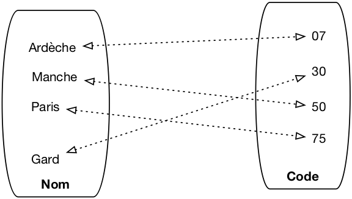
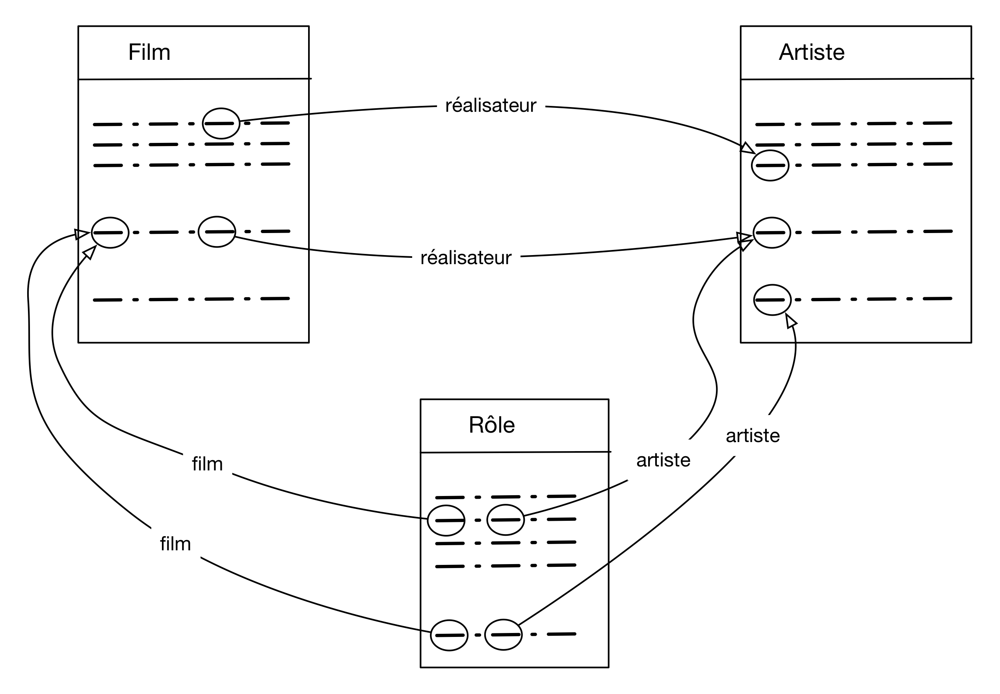

.. _chap-modrel:

#####################
Le modèle relationnel
#####################

Qu'est-ce donc que ce fameux "modèle relationnel"? En bref, c'est un ensemble de résultats scientifiques,
qui ont en commun de s'appuyer sur une représentation tabulaire des données. 
Beaucoup de ces résultats ont débouché sur des mises en œuvre pratique.
Ils concernent essentiellement deux problématiques complémentaires:

  - *La structuration des données*. Comme nous allons le voir dans ce chapitre, on ne peut
    pas se contenter de  placer toute une base de données dans une seule table, sous peine de rencontrer rapidement
    des problèmes insurmontables. Une base de données relationnelle, c'est un ensemble de tables
    associées les unes aux autres. La conception du schéma (structures des tables, contraintes
    sur leur contenu, liens entre tables) doit obéir à certaines règles
    et satisfaire certaines proprietés. Une théorie solide, la *normalisation* a été développée qui permet de s'assurer
    que l'on a construit un schéma correct.
    
  - *Les langages d'interrogation.* Le langage SQL que nous connaissons maintenant est issu d'efforts
    intenses de recherche menés dans les années 70-80. Deux approches se sont dégagées: la principale
    est une conception *déclarative* des langages de requêtes, basées sur la logique mathématique.
    Avec cette approche on formule (c'est le mot) ce que l'on souhaite, et le système décide
    comment calculer le résultat. La seconde est de nature plus procédurale, et identifie l'ensemble
    minimal des opérateurs dont le système doit disposer pour évaluer une requête. C'est cette seconde
    approche qui est utilisée en interne pour construire des programmes d'évaluation 
    
Dans ce chapitre nous étudions la structure du modèle relationnel, soit essentiellement 
la représentation des données, les contraintes, et les règles de normalisation qui définissent
la structuration correcte d'une base de données. Deux exemples de bases, commentés, sont donnés en fin de chapitre. 
Les chapitres suivants seront consacrés aux différents aspects du langage SQL.

************************
S1: relations et nuplets
************************

.. admonition::  Supports complémentaires:

    * `Diapositives: modèle relationnel <http://sql.bdpedia.fr/files/slmodrel.pdf>`_
    * `Vidéo sur le modèle relationnel <https://mdcvideos.cnam.fr/videos/?video=MEDIA180904073122820>`_ 


L'expression  "modèle relationnel" a pour origine (surprise!)  la notion de relation, 
un des fondements mathématiques sur lesquels s'appuie la théorie relationnelle. Dans le modèle
relationnel, la seule structure acceptée pour représenter les données est la relation.

Qu'est-ce qu'une relation?
==========================

Etant donné un ensemble d'objets :math:`O`, une *relation* (binaire)
sur :math:`O` est un sous-ensemble du produit cartésien :math:`O \times O`. Au cas où
vous l'auriez oublié, le produit cartésien entre deux ensembles :math:`A \times B`
est l'ensemble de toutes les paires possibles constituées d'un élément de :math:`A`
et d'un élément de :math:`B`.

Dans le contexte des bases de données, les objets auxquels on s'intéresse sont 
des valeurs élémentaires comme les entiers :math:`I`, les réels (ou plus précisément les nombres
en virgule flottante puisqu'on ne sait pas représenter une précision infinie) :math:`F`, les
chaînes de caractères :math:`S`, les dates, etc. La notion de
valeur *élémentaire* s'oppose à celle de valeur *structurée*:
il n'est pas possible en relationnel de placer dans une
cellule un graphe, une liste,  un enregistrement. 

On introduit de plus une restriction importante: 
les relations sont *finies* (on ne peut pas représenter en extension un ensemble infini avec une machine). 

L'ensemble des paires constituées des noms de département et 
et de leur numéro de code  est par exemple une relation en base de données: c'est un ensemble fini,
sous-ensemble du produit cartésien :math:`S \times I`. 

La notion de relation binaire se généralise
facilement. Une relation ternaire sur :math:`A`, :math:`B`, :math:`C` est un
sous-ensemble fini du produit cartésien  :math:`A \times B \times C`, qui lui
même s'obtient par :math:`(A \times B) \times C`. On peut ainsi créer des relations de
dimension quelconque. 

.. admonition:: Définition: relation 

    Une relation de degré *n* sur les domaines :math:`D_1, D_2, \cdots, D_n`
    est un sous-ensemble fini du produit cartésien  :math:`D_1 \times D_2 \times  \cdots \times D_n`

.. _graphe-relation:

   
      Une relation binaire représentée comme un graphe

Une relation est un objet abstrait, on peut la représenter de différentes manières. Une représentation
naturelle est le graphe comme le montre la :numref:`graphe-relation`. Une autre structure possible
est la table, qui s'avère beaucoup plus pratique quand la relation n'est plus binaire mais
ternaire et au-delà.

.. csv-table:: 
   :header:  "nom", "code"
   :widths: 15, 10
   
   "Ardèche", 07
   "Gard", 30
   "Manche", 50
   "Paris", 75

Dans une base relationnelle, on utilise toujours la représentation d'une relation sous forme
de table. À partir de maintenant nous pourrons nous permettre d'utiliser les deux termes
comme synonymes.

Les nuplets
===========

Un élément d'une relation de dimension *n* est un *nuplet* 
:math:`(a_1, a_2, \cdots, a_n)`. 
Dans la représentation par table, 
un nuplet est une ligne. Là encore nous assimilerons les deux termes, 
en privilégiant toutefois *nuplet* qui indique plus précisément la structure constituée d'une liste de valeurs.

La définition d'une relation comme un ensemble
(au sens mathématique) a quelques conséquences importantes:

 * *L'ordre des nuplets est indifférent*
   car il n'y a pas d'ordre dans un ensemble; conséquence pratique:
   le résultat d'une requête appliquée à une relation  
   ne dépend pas de l'ordre des lignes dans la relation.
 * *On ne peut pas  trouver deux fois le même
   nuplet* car il n'y a pas de doublons dans un ensemble.
 * Il n'y a pas (en théorie) de "cellule vide" dans la relation; toutes
   les valeurs de tous les attributs de chaque nuplet sont toujours connues.

Dans la pratique les choses sont un peu différentes pour les doublons
et les cellules vides, comme nous le verrons

Le schéma
=========

Et, finalement, on notera qu'aussi bien la représentation par graphe que celle par table
incluent un  nommage de chaque dimension (le ``nom`` du département, son ``code``, dans notre
exemple). Ce nommage n'est pas strictement indispensable (on pourrait utiliser la position
par exemple), mais s'avère très pratique et sera
donc utilisé systématiquement.

On peut donc *décrire* une relation par 

  #. Le nom de la relation.
  #. Un nom (distinct) pour chaque dimension, dit *nom d'attribut*, noté :math:`A_i`.
  #. Le domaine de valeur (type) de chaque dimension, noté :math:`D_i`.

Cette description s'écrit de manière concise :math:`R (A_1: D_1, D_2: T_2, \cdots, A_n: D_n)`,
et on l'appelle le *schéma* de la relation. Tous les :math:`A_i` sont distincts, 
mais on peut bien entendu utiliser plusieurs fois le même type. Le schéma de notre table
des départements est donc ``Département (nom: string, code: string)``. Le domaine
de valeur ayant relativement peu d'importance, on pourra souvent l'omettre et écrire
le schéma ``Département (nom, code)``. Il est d'aileurs relativement facile de changer le type
d'un attribut sur une base existante.

Et c'est tout ! Donc en résumé,

.. admonition:: Définition: relation, nuplet et schéma

      #. Une *relation* de degré *n* sur les domaines :math:`D_1, D_2, \cdots, D_n`
         est un sous-ensemble fini du produit cartésien  :math:`D_1 \times D_2 \times  \cdots \times D_n`.
      #. Le schéma d'une relation s'écrit :math:`R (A_1: D_1, A_2: D_2, \cdots, A_n: D_n)`,
         *R* étant le nom de la relation et les :math:`A_i`, deux à deux distincts,  les noms d'attributs.    
      #. Un élément de cette relation est un *nuplet* :math:`(a_1, a_2, \cdots, a_n)`,
         les :math:`a_i` étant les valeurs  des attributs.

Et en ce qui concerne le vocabulaire, le tableau suivant montre celui, rigoureux, issu
de la modélisation mathématique et celui, plus vague, correspondant à la représentation
par table. Les termes de chaque ligne seront considérés comme équivalents, mais on privilégiera les 
premiers qui sont plus précis.

.. csv-table:: 
   :header:  "Terme du modèle", "Terme de la représentation par table"
   :widths: 12, 12
   
   Relation, Table
   nuplet, ligne
   Nom d'attribut, Nom de colonne
   Valeur d'attribut, Cellule
   Domaine, Type

Attention à utiliser ce vocabulaire soigneusement, sous peine de confusion. Ne pas confondre par exemple le nom d'attribut
(qui est commun à toute la table) et la valeur d'attribut (qui est spécifique à un nuplet).


La structure utilisée pour représenter les données est donc extrêmement simple. Il faut insister
sur le fait que les valeurs des attributs, celles que l'on trouve dans chaque cellule
de la table, sont élémentaires: entiers, chaînes de caractères, etc. On *ne peut
pas* avoir une valeur d'attribut qui soit un tant soit peu construite, comme par
exemple une liste, ou une sous-relation. Les valeurs dans une base de données
sont dites *atomiques* (pour signifier qu'elles sont non-décomposables, rien de toxique à priori).
Cette contrainte conditionne tous les autres
aspects du modèle relationnel, et notamment la conception, et l'interrogation.

Une base bien formée suit des règles dites de normalisation. La forme normale minimale
est définie ci-dessous.

.. admonition:: Définition: première forme normale

      Une relation est en première forme normale si toutes les valeurs d'attribut sont 
      connues et atomiques et si elle ne contient aucun doublon.

Un doublon n'apporte aucune information supplémentaire et on les évite donc. En pratique,
on le fait en ajoutant des critères d'unicité sur certains attributs, la *clé*.

On considère pour l'instant que *toutes* les valeurs d'un nuplet sont connues. En pratique, c'est
une contrainte trop forte que l'on sera amené à lever avec SQL, au prix de quelques 
difficultés supplémentaires.

Mais que représente une relation?
=================================

En première approche, une relation est simplement un ensemble de nuplets. On peut donc lui appliquer
des opérations ensemblistes: intersection, union, produit cartésien, projection, etc. Cette vision
se soucie peu de la signification de ce qui est représenté, et peut mener à des manipulations dont la finalité
reste obscure. Ce n'est pas forcément le meilleur choix pour un utilisateur humain, mais ça l'est
pour un système qui ne se soucie que de la description opérationnelle.

Dans une seconde  approche, plus "sémantique", une relation est un mécanisme permettant d'énoncer des
faits sur le monde réel. Chaque nuplet correspond à un tel énoncé. Si
un nuplet est présent dans la relation, le fait est considéré comme vrai, sinon il
est faux.

La table des départements sera ainsi interprétée comme un ensemble d'énoncés: "Le département de l'Ardèche a pour code 07",
"Le département du Gard a pour code 30", et ainsi de suite. Si un nuplet, par exemple, ``(Gers  32)``, n'est 
pas dans la base, on considère que l'énoncé "Le département du Gers a pour code 32" est faux. 

Cette approche mène directement à une manipulation des données fondée sur 
des raisonnements s'appuyant sur les valeurs de vérité énoncées par les faits de la base.
On a alors  recours à la logique formelle
pour exprimer ces raisonnements de manière rigoureuse. Dans cette approche, qui est à la base de SQL,
interroger une base, c'est déduire un ensemble de faits qui satisfont un 
énoncé logique (une "formule").  Selon ce point de vue, SQL est un langage pour 
écrire des formules logiques, et un système relationnel est (entre autres) une machine
qui effectue des démonstrations.

Quiz
====

.. eqt:: modrel1

    Une relation binaire très utilisée est la relation :math:`<` sur l'ensemble des entiers. La paire
    (1,2) par exemple appartient à cette relation.
    Pourquoi n'est-ce
    pas une relation de base de données?
    
    A) :eqt:`I` Parce qu'elle ne représente rien d'intéressant
    #) :eqt:`I` Parce qu'elle est trop grosse
    #) :eqt:`C` Parce qu'elle est infinie

.. eqt:: modrel2

    Quels schémas de  relation ci-dessous sont corrects?
    
    A) :eqt:`I` :math:`Immeuble (code: string, nom: string, adresse: coordonnéesGPS)`
    #) :eqt:`I` :math:`Personne (id: string, nom: string, téléphone: string, téléphone: string)`
    #) :eqt:`C` :math:`Appartement (id: string, occupant: string, immeuble: string)`


.. eqt:: modrel3

    Voici une table représentant des auteurs et leurs livres.
    
    .. csv-table:: 
        :header:  "auteur", "livre", "année"
        :widths: 8, 8, 8
   
        Orwell, 1984, 1949
        Montaigne, "Essais", "(1580, 1582, 1588)"
        Pascal, Pensées,
 
    Pourquoi n'est pas une relation correcte?

    A) :eqt:`I` Parce que les nuplets n'ont pas tous la même structure
    #) :eqt:`C` Parce que certaines valeurs d'attribut ne sont pas atomiques
    #) :eqt:`C` Parce qu'il manque certaines valeurs


.. eqt:: modrel4

    Nous avons vu que l'ordre des nuplets dans une relation ne compte pas. Qu'est-ce
    que cela implique pour le langage d'interrogation?  

    A) :eqt:`I` On ne peut pas compter les nuplets
    #) :eqt:`C` Si on demande le premier nuplet on n'a pas la garantie
       d'obtenir toujours le même.
    #) :eqt:`I` Je ne peux pas trier une relation

.. eqt:: modrel5

    Qu'en est-il de l'ordre sur les colonnes? 

    A) :eqt:`I` Il compte car sinon on ne saurait pas, par exemple, comparer
       les valeurs de deux nuplets.
    #) :eqt:`C` Il n'a aucune importance car les colonnes sont nommées et toutes
       les opérations sur les nuplets sont donc possibles.

**************************************
S2: clés, dépendances et normalisation
**************************************

.. admonition::  Supports complémentaires:

    * `Diapositives: clés/dépendances <http://sql.bdpedia.fr/files/slcles.pdf>`_
    * `Vidéo sur les clés/dépendances  <https://mdcvideos.cnam.fr/videos/?video=MEDIA180915114611494>`_ 


Comme nous l'avons vu ci-dessus, le schéma d'une relation consiste -- pour l'essentiel -- en un
nom (de relation) et un ensemble de noms d'attributs. On pourrait naïvement penser
qu'il suffit de créer une unique relation et de tout mettre dedans pour avoir une base
de données. En fait, une telle approche est inapplicable et il est indispensable de
créer plusieurs relations, associées les unes aux autres.

Le *schéma d'une base de données* est donc constitué d'un ensemble de schéma
de relations. Pourquoi en arrive-t-on là et quels sont les problèmes
que l'on souhaite éviter? C'est ce que nous étudions dans cette session. La notion
centrale introduite ici est celle de *clé* d'une relation. 

Qualité d'un schéma relationnel
===============================

Voici un exemple de schéma,
avec une notation très simplifiée, que nous allons utiliser pour discuter
de la notion centrale de "bon" et "mauvais" schéma. On veut créer une base
de données représentant des films, avec des informations comme le titre,
l'année, le metteur en scène, etc. On part d'un schéma rassemblant
ces informations dans une unique table:

.. code-block:: sql

    Film(titre, année, prénomRéalisateur, nomRéalisateur, annéeNaiss)

Un tel schéma permet-il de gérer correctement les données? Regardons un exemple
de contenu de la table.

.. csv-table:: 
   :header:  "titre",  "année", "prénomRéalisateur",  "nomRéalisateur",  "annéeNais"
   :widths: 10, 6, 10, 10, 4
            
   Alien, 1979, Ridley, Scott,  1943
   Vertigo , 1958,  Alfred, Hitchcock, 1899
   Psychose, 1960, Alfred, Hitchcock,  1899
   Kagemusha, 1980, Akira, Kurosawa,  1910
   Volte-face, 1997, John,  Woo, 1946
   Pulp Fiction, 1995, Quentin, Tarantino,  1963 
   Titanic, 1997, James,  Cameron, 1954
   Sacrifice, 1986, Andrei, Tarkovski, 1932

Même pour une information aussi simple, il est facile d'énumérer tout un
ensemble de problèmes potentiels.  Tous ou presque découlent
d'un grave défaut de la table ci-dessus : *il est possible de
représenter la même information plusieurs fois*, ou, pour employer
un mot que nous retrouverons souvent, *il y a redondance de l'information*.

**Anomalies lors d'une insertion**

Rien n'empêche de représenter plusieurs fois le même film.
Pire : il est possible d'insérer plusieurs fois le film
*Vertigo* en le décrivant à chaque fois de manière
différente, par exemple en lui attribuant une fois comme
réalisateur Alfred Hitchcock, puis une autre fois John Woo, etc.

La bonne question consiste d'ailleurs à se demander ce qui
distingue deux films l'un de l'autre, et à quel moment on peut dire
que la même information a été répétée.  Peut-il y
avoir deux films différents avec le même titre par exemple ? Si
la réponse est non (?), alors on devrait pouvoir assurer qu'il n'y a
pas deux lignes dans la table avec la même valeur pour l'attribut
*titre*.  Si la réponse est oui (ce qui semble raisonnable), il reste à déterminer
quel est l'ensemble des attributs qui permet de caractériser de
manière unique un film ou, à défaut, de créer un tel *identifiant*
artificiellement. C'est une notion centrale et délicate sur laquelle nous revenons
de manière approfondie ultérieurement.

Autre anomalie liées aux insertions: on ne peut pas insérer un film si on ne connaît
pas son metteur en scène et réciproquement.

**Anomalies lors d'une modification**

La redondance d'information entraîne également des anomalies de
mise à jour. Supposons que l'on modifie l'année de naissance de
Hitchcock pour la ligne *Vertigo* et pas pour la ligne
*Psychose*.  On se retrouve alors avec des informations
incohérentes. Les mêmes questions que précédemment se posent d'ailleurs.
Jusqu'à quel point peut-on dire qu'il n'y a qu'un seul
réalisateur nommé Hitchcock, et qu'il ne doit donc y avoir
qu'une seule année de naissance pour un réalisateur de ce nom ?

**Anomalies lors d'une destruction**

On ne peut pas supprimer un film sans supprimer
du même coup son metteur en scène. Si on souhaite,
par exemple, ne plus voir le film *Titanic* figurer
dans la base de données, on va effacer du même
coup les informations sur James Cameron.

Schémas normalisés
==================

Que déduire de ce qui précède ? Tout d'abord qu'il existe des schémas
avec de bonnes propriétés, et d'autres qui souffrent de défauts de conception,
lesquels entraînent de sérieux problèmes de gestion de la base. 
Ensuite, que nous avons besoin d'aller plus loin qu'une simple
énumération d'attributs et énoncer des *contraintes* et des *règles* qui
nous indiquent plus précisément les liens qui caractérisent les données.

Le modèle relationnel nous propose un outil précieux pour répondre
à ces questions: la *normalisation*. Un schéma normalisé présente
des caractéristiques formelles qu'il est possible d'évaluer. La normalisation
nous garantit l'absence de défaut (et notamment de redondance) tout en préservant
l'intégralité de l'information représentée.

La théorie du modèle relationnel a développé une construction formelle
solide pour qualifier les propriétés d'un schéma d'une part,
et décomposer un schéma dénormalisé en schéma normalisé
d'autre part.  Le premier, détaillé ci-dessous, donne un éclairage très  précis
sur ce qu'est un bon schéma relationnel. 
Le second aspect fait l'objet du chapitre :ref:`chap-ea`.


La notion de dépendance fonctionnelle
=====================================

Le principal concept est celui de dépendance fonctionnelle, qui fournit
une construction de base pour élaborer les contraintes dont nous avons
besoin pour caractériser nos données et leurs liens. Il
s'énonce comme suit. 

.. admonition:: Définition: dépendance fonctionnelle

    Soit un schéma de relation *R*, *S*  un *sous-ensemble*
    d'attributs de *R*, et *A* un attribut quelconque de *R*.
    
    On dit que *A* *dépend fonctionnellement* de *S*
    (ce que l'on note :math:`S \to A`) quand,  pour toute paire 
    :math:`(l_1, l_2)` de lignes de *R*, l'égalité de :math:`l_1`
    et de :math:`l_2` sur *S* implique l'égalité sur *A*.

    
Informellement, on peut raisonner ainsi: "la valeur de *S* détermine la valeur de
*A*", ou encore "Si
je connais *S*, alors je connais *A*". Tout se passe comme s'il existait
une fonction qui, étant donnée une valeur de *S*, produit la valeur de *A* (toujours
la même, par définition d'une fonction). Par, exemple, si je
prends la relation ``Personne`` avec l'ensemble des attributs suivants

.. code-block:: sql
     
     (nom, prénom, noSS, dateNaissance, adresse, email)

je peux considérer  les dépendances fonctionnelles suivantes:

 * :math:`email \to nom, prénom, noSS, dateNaissance, adresse` 
 * :math:`noSS \to  email, nom, prénom, dateNaissance, adresse` 

J'ai donc considéré que la connaisance d'une adresse électronique détermine la connaissance
des valeurs des autres attributs, et de même pour le numéro de sécurité sociale.

.. note:: La notation :math:`S \to A, B` est un racourci pour :math:`S \to A` et :math:`S \to B`


On peut avoir des dépendances fonctionnelles où la partie gauche comprend
plusieurs attributs. Par exemple, pour les attributs suivants:

.. code-block:: sql
     
     noEtudiant, noCours, année, note, titreCours

on peut énoncer la dépendance fonctionnelle suivante:

.. math::

       noEtudiant, noCours, année \to note, titreCours

La connaissance d'un étudiant, d'un cours et d'une année détermine la note obtenue
et le titre du cours.

Prenons quelques exemples. Le tableau suivant montre une relation ``R(A1, A2, A3, A4)``.

.. csv-table:: 
   :header:  "A1", "A2",  "A3", "A4"
   :widths: 4, 4, 4, 4

   1, 2, 3, 4
   1, 2, 3, 5
   6, 7, 8, 2
   2, 1, 3, 4
   
Les dépendances fonctionnelles suivantes sont respectées:

  - :math:`A_1 \to A_3`
  - :math:`A_2, A_3 \to A_1`
  - :math:`A_4 \to A_3`

En revanche les suivantes sont violées:  :math:`A_4 \to A_1`,  :math:`A_2, A_3 \to A_4`. 

Certaines propriétés fondamentales des DFs (les axiomes d'Armstrong)
sont importantes à connaître.

.. admonition:: Axiomes d'Armstrong

     - Réflexivité: si :math:`A \subseteq X`, alors :math:`X \to A`. C'est une
       propriété assez triviale: si je connais :math:`X`, alors je connais toute partie de :math:`X`.
     - Augmentation: si :math:`X \to Y`, alors :math:`XZ \to Y` pour tout :math:`Z`. 
       Là aussi, c'est assez trivial: si la connaissance de :math:`X` détermine :math:`Y`, 
       alors la connaissance d'un sur-ensemble de :math:`X` détermine *à plus forte raison* :math:`Y`.
     - Transitivité:  si :math:`X \to Y` et  si :math:`Y \to Z`, alors  :math:`X \to Z`. 
       Si :math:`X` détermine :math:`Y` et :math:`Y` détermine :math:`Z`, alors :math:`X` détermine :math:`Z`.

Reprenons l'exemple suivant:

.. math::

       noEtudiant, noCours, année \to note, titreCours

Nous avons ici l'illustration d'une dépendance fonctionnelle
obtenue par transitivité. En effet, on peut admettre la dépendance suivante:

.. math::

       noCours \to titreCours
       
Dans ce cas, connaissant les 3 valeurs du nuplet  ``(noEtudiant, noCours, année)``, je connais
la valeur de ``noCours`` (réflexivité) , et connaissant le numéro du 
cours je connais le titre du cours.
La connaissance du titre à partir de la clé est obtenue par transitivité.

On se restreint pour l'étude de la normalisation aux DF *minimales* et *directes*.

.. admonition:: Définition: dépendances minimales et directes

    Une dépendance fonctionnelle :math:`A \to X` est *minimale* s'il
    n'existe pas d'ensemble d'attributs :math:`B \subset A`
    tel que :math:`B \to X`.

    Une dépendance fonctionnelle :math:`A \to X` est *directe* si elle n'est pas obtenue 
    par transitivité.


Les dépendances fonctionnelles fournissent un outil pour analyser la
qualité d'un schéma relationnel. Prenons le cas d'un système permettant d'évaluer des manuscrits
soumis à un éditeur.  Voici deux schémas possibles pour représenter les
rapports produits par des experts.


 - **Schéma 1**
    * Manuscrit (id_manuscrit, auteur, titre, id_expert, nom, commentaire)
 - **Schéma 2**
    * Manuscrit (id_manuscrit, auteur, titre, id_expert, commentaire)  
    * Expert (id_expert, nom)

Et on donne les dépendances fonctionnelles minimales et directes suivantes:

  - :math:`id\_manuscrit \to auteur, titre, id\_expert, commentaire`
  - :math:`id\_expert \to nom`
  
On suppose donc qu'il existe un seul
expert par manuscrit. 
Ces dépendances nous donnent un moyen de caractériser précisément
les redondances et incohérences potentielles. Voici un exemple de relation
pour le schéma 1.

.. csv-table:: 
   :header:  "id_manuscrit", "auteur",  "titre", "id_expert", "nom", "commentaire"
   :widths: 4, 5, 15, 4, 10, 15

   10, Serge,  "L'arpète", 2, "Philippe", "Une réussite, on tourne les pages avec frénésie"
   20, Cécile,   "Un art du chant grégorien sous Louis XIV", 2, "Sophie", "Un livre qui fait date sur le sujet. Bravo"
   10, Serge,  "L'arpète", 2, "Philippe", "Une réussite, on tourne les pages avec frénésie"
   10, Philippe,  "SQL", 1, "Sophie", "la référence"

En nous basant sur les dépendances fonctionnelles associées à ce schéma on peut 
énumérer les anomalies suivantes:

  - La DF  :math:`id\_expert \to nom` n'est pas respectée par le premier et deuxième
    nuplet. Pour le même ``id_expert``, on trouve une fois le nom "Philippe", une fois
    le nom "Sophie". 
    
    En revanche cette DF est respectée si on ne considère que le premier, 
    le troisième et le quatrième  nuplet.

  - La DF :math:`id\_manuscrit \to auteur, titre, id\_expert, commentaire` n'est pas respectée 
    par le premier et quatrième nuplet. Pour le même ``id_manuscrit``, on trouve
    des valeurs complètement différentes.

    En revanche cette DF est respectée par le premier et troisième nuplet, et on constate
    une totale redondance: ces nuplets sont des doublons.

En résumé, on a soit des redondances, soit des incohérences. *Il est impératif
d'éviter toutes ces anomalies*.

On pourrait envisager de demander à un SGBD de considérer les DFs 
comme des *contraintes* sur le contenu de la base de données et d'assurer
leur préservation. On éliminerait les incohérences mais pas les redondances. 
De plus le contrôle de ces contraintes serait, d'évidence, très coûteux.
Il existe une bien meilleure solution, basée sur les clés et la décomposition
des schémas.

Clés
====

Commençons par définir la notion essentielle de *clé*.

.. admonition:: Définition: clé

    Une clé d'une relation *R* est un sous-ensemble *minimal* *C* 
    des attributs tel que tout attribut de *R* dépend  
    fonctionnellement de *C*. 
    
L'attribut ``id_expert`` est une clé de la relation
*Expert* dans le schéma 2. Dans le schéma 1,
l'attribut ``id_manuscrit`` est une clé
de *Manuscrit*. Notez que tout attribut de la relation dépend *aussi* de
la paire ``(id_manuscrit, auteur)``, sans que cette paire
soit une clé puisqu'elle n'est pas *minimale* (il
existe un sous-ensemble strict qui est lui-même clé).

.. note:: Comme le montre l'exemple de la relation ``Personne`` ci-dessus, on
   peut en principe trouver plusieurs clés dans une relation. On en choisit alors
   une comme *clé primaire*. 
   
Et maintenant nous pouvons définir ce qu'est un schéma de relation normalisé.

.. admonition:: Définition: schéma normalisé (troisième forme normale)

   Un schéma de relation *R* est *normalisé* quand, dans
   toute dépendance fonctionnelle :math:`S \to A` sur
   les attributs de *R*, *S* est une clé. 
   
.. admonition:: Remarque

   Cette définition est celle de la forme normale dite "de Boyce-Codd". 
   La définition standard de la troisième forme normale est 
   un peu moins stricte (et un peu plus difficile à saisir intuitivement):
   elle demande que tout attribut non-clé soit dépendant fonctionnellement d'une clé.
   
   La différence est subtile et très rarement rencontrée en pratique:
   la troisième forme normale autorise une DF d'un attribut non-clé
   vers *une partie* de la clé, alors que la version de Boyce-Codd exclut ce cas.
   
   En toute rigueur, il faudrait connaître et discuter des deux versions de la définition
   mais, le gain pratique étant négligeable, j'assume de vous demander de comprendre et de retenir
   la définition la plus simple et la plus intuitive.


La relation ``Manuscrit`` dans le schéma 1 ci-dessus n'est pas normalisée à cause 
de la dépendance fonctionelle
``id_expert`` :math:`\to` ``nom``, alors que l'attribut
``id_expert`` n'est pas une clé.  Il existe une version intuitive de
cette constatation abstraite:  la relation ``Manuscrit`` contient
des informations qui ne sont pas *directement* liées à la notion
de manuscrit. La présence d'informations indirectes est une source de redondance
et donc d'anomalies.

L'essentiel de ce qu'il faut comprendre est énoncé 
dans ce qui précède.  On veut obtenir des relations normalisées car
il et facile de montrer que la dénormalisation entraîne toutes sortes
d'anomalies au moment où la base est mise à jour. De plus, si *R* est une
relation  de clé *C*, deux lignes de *R* ayant les même valeurs pour *C* auront
par définition les mêmes valeurs pour les autres attributs et seront donc
parfaitement identiques. Il est donc inutile (et nuisible) d'autoriser cette
situation : on fera en sorte que la valeur d'une clé soit *unique* pour
l'ensemble des lignes d'une relation. En résumé on veut des schémas de relation
normalisés et dotés d'une clé unique bien identifiée. Cette combinaison
interdit toute redondance.

.. note:: Plusieurs formes de normalisation ont été proposées. Celle présentée ici est dite "troisième
   forme normale" (3FN). Il est toujours possible de se ramener à des relations en 3FN.

Clés étrangères
===============

Un bon schéma relationnel est donc un schéma où toutes les tables sont normalisées. Cela signifie que, par rapport
à notre approche initiale naïve où toutes les données étaient placées dans une seule table,
nous devons *décomposer* cette unique table en fonction des clés. 

Prenons notre second schéma. 

    - Manuscrit (id_manuscrit, auteur, titre, id_expert, commentaire)  
    - Expert (id_expert, nom)

Ces deux relations sont normalisées, avec pour clés respectives ``id_manuscrit``
et ``id_expert``. 
On constate que ``id_expert``
est présent dans les *deux* schémas. Ce n'est pas une clé de  la relation ``Manuscrit``, mais c'est 
la duplication de la clé  de ``Expert`` dans ``Manuscrit``. Quelle est son rôle? Le raisonnement
est exactement le suivant:

   - ``id_expert`` est la clé de ``Expert``: connaissant ``id_expert``, je connais donc aussi (par définition)
     toutes les autres informations sur l'expert.
   - ``id_manuscrit`` est la clé de ``Manuscrit``: connaissant ``id_manuscrit``, je connais donc aussi (par définition)
     toutes les autres informations sur le manuscrit, et notamment ``id_expert``.
   - Et donc, par transitivité, connaissant ``id_manuscrit``, je  connais ``id_expert``,
     et connaissant ``id_expert``, je connais toutes les autres informations sur l'expert: je 
     n'ai perdu aucune information en effectuant la décomposition puisque les dépendances
     me permettent de reconstituer la situation initiale.
    
L'attribut ``id_expert`` dans la relation ``Manuscrit`` est une *clé étrangère*. Une clé étrangère permet, par transitivité,
de tout savoir sur le nuplet identifié par sa valeur, ce nuplet étant en général (pas toujours)
placé dans une autre table. 

.. admonition:: Définition: clé étrangère

    Soit :math:`R` et :math:`S` deux relations de clés (primaires) respectives ``idR`` et ``idS``. 
    Une *clé étrangère* de :math:`S` dans :math:`R` est un attribut ``ce`` de :math:`R` dont la valeur est *toujours*
    identique à (exactement) une des valeurs de  ``idS``.
    
    Intuitivement, ``ce`` "référence" un (et un seul) nuplet de :math:`S`.

Voici une illustration du mécanisme de clé primaire et de clé étrangère, toujours sur notre 
exemple de manuscrit et d'expert.
Prenons tout d'abord la table des experts.

.. csv-table:: 
   :header:  "id_expert", "nom",  "adresse"
   :widths: 4, 5, 8

   1, Sophie,  "rue Montorgueil, Paris"
   2, Philippe,   "rue des Martyrs, Paris"

Et voici la table des manuscrits. Rappelons que ``id_expert``  est 
la clé étrangère  de ``Expert`` dans ``Manuscrit``.

.. csv-table:: 
   :header:  "id_manuscrit", "auteur",  "titre", "id_expert", "commentaire"
   :widths: 4, 5, 15, 4, 15

   10, Serge,  "L'arpète", 2, "Une réussite, on tourne les pages avec frénésie"
   20, Cécile,   "Un art du chant grégorien sous Louis XIV", 1, "Un livre qui fait date sur le sujet. Bravo"

Voyez-vous quel(le) expert(e) a évalué quel manuscrit? Etes-vous d'accord que connaissant
la valeur de clé d'un manuscrit, je connais sans ambiguité le nom de l'expert qui l'a évalué?
Constatez-vous que ces relations sont bien normalisées?

Une clé étrangère ne peut prendre ses valeurs que dans l'ensemble des valeurs de la clé
référencée. Dans notre exemple, la valeur de la clé étrangère ``id_expert`` 
dans ``Manuscrit``  est impérativement l'une des valeurs de clé de ``id_expert``. Si ce n'était
pas le cas, on ferait référence à un expert qui n'existe pas.

Dans un schéma normalisé, un système doit donc gérer deux types de contraintes, toutes deux
liées aux clés.

.. admonition:: Définition: contraintes d'unicité, contrainte d'intégrité référentielle.

   *Contrainte d'unicité*: une valeur de clé ne peut apparaître qu'une fois dans une relation. 
   
   *Contrainte d'intégrité référentielle* : la valeur d'une clé étrangère doit *toujours*
   être également une des valeurs de la clé référencée.

Ces deux contraintes garantissent l'absence totale de redondances et d'incohérences. 
La session suivante va commenter deux exemples complets. Quant à la démarche complète de conception, elle sera développée dans
le chapitre :ref:`chap-ea`.


Quiz
====


.. eqt:: depfonc1

    Voici une relation R(A, B, C, D)

    .. csv-table:: 
        :header:  "A", "B",  "C", "D"
        :widths: 4, 4, 4, 4
    
        f, 2, V, 10
        r, 2, U, 10
        f, 3, V, 10
        g, 3, U, 10

    Quelles affirmations parmi les suivantes sont exactes?

    A) :eqt:`C` Les nuplets 1 et 3 violent la dépendance :math:`A \to B`
    #) :eqt:`I` Les  nuplets 1 et 4 violent la dépendance :math:`D, C \to A`
    #) :eqt:`I` Les  nuplets 1 et 2 violent la dépendance :math:`A \to D`
    #) :eqt:`I` Les  nuplets 1 et 3 violent la dépendance :math:`D, C \to A`
    #) :eqt:`C` Les  nuplets 2 et 4 violent la dépendance :math:`D, C \to A`
    #) :eqt:`C` La dépendance :math:`A \to D` est toujours respectée

.. eqt:: depfonc2

    On veut représenter des logements touristiques et les activités qu'ils proposent. Voici
    un exemple de table. 
    
    ..  csv-table::
        :header: code, nom, capacité, type, lieu, activité

        ca  , Causses   , 45    , Auberge   , Cévennes  , Randonnée
        ge  , Génépi    , 134   , Hôtel , Alpes , Piscine
        ge  , Génépi    , 134   , Hôtel , Alpes , Ski
        pi  , U Pinzutu , 10    , Gîte  , Corse , Plongée
        pi  , U Pinzutu , 10    , Gîte  , Corse , Voile

    Parmi les dépendances fonctionnelles suivantes, lesquelles  à votre avis sont respectées
    par cette table?
   
    A) :eqt:`C` :math:`code \to type`
    #) :eqt:`C` :math:`type \to lieu`
    #) :eqt:`I` :math:`lieu  \to activit\acute{e}`
    #) :eqt:`I` :math:`code  \to activit\acute{e}`
    #) :eqt:`C` :math:`code, activit\acute{e} \to nom`
    
.. eqt:: depfonc3

    On reprend le schéma ci-dessous. 
    
    .. code-block:: text 
    
          Manuscrit (id_manuscrit, auteur, titre, id_expert, nom, commentaire)

    Avec les dépendances fonctionnelles  suivantes:

      - :math:`id\_manuscrit \to auteur, titre, id\_expert, commentaire`
      - :math:`id\_expert \to nom`
   
    En supposant que les dépendances fonctionnelles sont respectées, quelles
    affirmations ci-dessous sont vraies?
   
    A) :eqt:`I` Un même expert peut apparaître avec deux noms différents
    #) :eqt:`I` Un même manuscrit peut avoir deux titres différents.
    #) :eqt:`C` Je ne peux pas connaître d'expert s'il n'a pas évalué au moins un manuscrit.
    #) :eqt:`C` Si je détruis un manuscrit je peux perdre toutes les informations sur l'expert qui l'a évalué.
    #) :eqt:`C` Si je détruis un expert je perd toutes les informations sur un manuscrit qu'il a évalué.

.. eqt:: depfonc4

    Reprenons le schéma initial sur les films, auquel on a ajouté des identifiants (MES est
    l'acronyme de Metteur En Scène).

    .. code-block:: text

        Film(idFilm, titre, année, idRéalisateur, prénom, nom, annéeNaiss)

    On vous donne les dépendances suivantes:
    
      #. :math:`idFilm \to titre, année, idRéalisateur`
      #. :math:`idRéalisateur \to prénom, nom, annéeNaiss`

    Quelle est la clé?
    
    A) :eqt:`I` ``(idFilm, idRéalisateur)`` 
    #) :eqt:`C` ``idFilm`` 
    #) :eqt:`I` ``idRéalisateur`` 


.. eqt:: depfonc5

    Sur une table de schéma (ABCD), on donne les dépendances 
    :math:`A \to B` et :math:`B \to C, D`. Quelle est la clé?

    A) :eqt:`I` ``B`` 
    #) :eqt:`I` ``(C,D)`` 
    #) :eqt:`C` ``A`` 


.. eqt:: depfonc5bis

    Sur une table de schéma (ABCD), on donne les dépendances 
    :math:`A \to B` et :math:`C \to D`. Quelle est la clé?

    A) :eqt:`I` ``A`` 
    #) :eqt:`C` ``(A, C)``  
    #) :eqt:`I` ``C`` 


.. eqt:: depfonc5ter

   Quelle affirmation est vraie?
   
   A) :eqt:`I` Tout attribut qui apparaît à droite mais jamais à gauche d’une DF doit faire partie des clés
   #) :eqt:`C` Tout attribut qui apparaît à gauche mais jamais à droite d’une DF doit faire partie des clés
   #) :eqt:`I` Un attribut qui n’apparaît ni à gauche ni à droite d’une DF ne peut pas faire partie  d'une clé


.. eqt:: depfonc6

   La relation Film précédente est-elle en troisième forme normale?
       
   A) :eqt:`I`  Oui
   #) :eqt:`C` Non

.. eqt:: depfonc7

   Une relation R(A, B, C, D) a pour clé A. 
   Quelles sont les solutions possibles pour garantir que la DF :math:`A \to B, C, D` est respectée. 
        
   A) :eqt:`I`  On interdit toute mise à jour d'un nuplet après son insertion
   #) :eqt:`C` Quand on insère un nuplet (a, b, c, d), on détruit au préalable
      tous les nuplets existants tels que A=a.
   #) :eqt:`C` Quand on insère ou modifie un nuplet (a, b, c, d) on vérifie qu'il
      cohérent avec les nuplets existants tels que A=a.
   #) :eqt:`C` On interdit l'insertion d'un nuplet s'il existe déjà un nuplet
      tel que  A=a.
 
   Quelle est à votre avis la solution appliquée par un système relationnel?


.. eqt:: depfonc8

    Dans une relation  en troisième forme normale, quelle affirmation est *fausse*
    
    A) :eqt:`I`  Si un attribut ne fait pas partie d’une clé, alors il dépend d’une clé
    #) :eqt:`C` Pour toute dépendance fonctionnelle A -> B, B est une clé
    #) :eqt:`I` Pour toute dépendance fonctionnelle A -> B, A est une clé

***************************************
S3: deux exemples de schémas normalisés
***************************************

.. admonition::  Supports complémentaires:

    * `Diapositives: deux schémas normalisés <http://sql.bdpedia.fr/files/slexemples.pdf>`_
    * `Vidéo sur les schémas normalisés <https://mdcvideos.cnam.fr/videos/?video=MEDIA180904081955112>`_ 
    * `Schéma de la base des voyageurs <http://sql.bdpedia.fr/files/SchemaVoyageurs.sql>`_ et 
      `base des voyageurs <http://sql.bdpedia.fr/files/BaseVoyageurs.sql>`_ (si vous souhaitez les installer dans
      votre environnement).
    * `Schéma de la base des films <http://sql.bdpedia.fr/files/SchemaFilms.sql>`_ et 
      `base des films <http://sql.bdpedia.fr/files/BaseFilms.sql>`_ (si vous souhaitez les installer dans
      votre environnement).

Dans l'ensemble du cours nous allons utiliser quelques bases de données, petites, simples,
à des fins d'illustration, pour les langages d'interrogation notamment. 
Elles sont présentées ci-dessous, avec quelques commentaires sur le schéma, que nous considérons
comme donné pour l'instant. Si vous vous demandez par quelle méthode on en est arrivé à ces schémas,
reportez-vous au chapitre :ref:`chap-ea`.

La base des voyageurs
=====================

Notre  première base de
données décrit les pérégrinations de quelques voyageurs plus ou moins célèbres. 
Ces voyageurs occupent occasionnellement des logements pendant des périodes plus ou moins longues,
et y exercent (ou pas) quelques activités.

Voici le schéma de la base. Les clés primaires sont en **gras**, les
clés étrangères en *italiques*. Essayez de vous figurer les dépendances fonctionnelles et la
manière dont elles permettent de rassembler des informations réparties dans plusieurs tables.

  * Voyageur (**idVoyageur**, nom, prénom, ville, région)
  * Séjour (**idSéjour**, *idVoyageur*, *codeLogement*, début, fin)
  * Logement (**code**, nom, capacité, type, lieu) 
  * Activité (**codeLogement, codeActivité**, description)


**La table  des voyageurs**

La table ``Voyageur`` ne comprend aucune clé étrangère. 
Les voyageurs sont identifiés par un numéro séquentiel nommé ``idVoyageur``, 
incrémenté de 10 en 10
(on aurait pu incrémenter de 5, ou de 100, ou changer à chaque fois: la seule chose
qui compte est que chaque identifiant soit unique). 
On indique la ville et la région de résidence. 

.. csv-table:: 
   :header:  "idVoyageur",  "nom", "prénom", "ville", "région"
   :widths: 4, 15, 15, 10, 10
   
   10, Fogg, Phileas, Ajaccio, Corse
   20, Bouvier, Nicolas, Aurillac, Auvergne
   30, David-Néel, Alexandra , Lhassa, Tibet
   40, Stevenson, Robert Louis , Vannes, Bretagne
   
Remarquez que nos régions ne sont pas des régions administratives au sens strict: cette base
va nous  permettre d'illustrer l'interrogation de bases relationnelles,
elle n'a aucune prétention à l'exatitude. 

**La table Logement**

La table ``Logement`` est également très simple, son schéma ne contient pas de clé étrangère.
La clé est un code synthétisant le nom
du logement. Voici son contenu.  

.. csv-table:: 
   :header:  "code",  "nom", "capacité", "type", "lieu"
   :widths: 4, 15, 5, 10, 15

   pi, U Pinzutu,  10,  Gîte, Corse
   ta, Tabriz,  34,  Hôtel, Bretagne
   ca, Causses,  45,  Auberge, Cévennes
   ge, Génépi,  134, Hôtel, Alpes

L'information nommée ``région`` dans la table des voyageurs d'appelle maintenant ``lieu``
dans la table
``Logement``. Ce n'est pas tout à fait cohérent, mais corrrespond à des situations couramment rencontrées
où la même information apparaît sous des noms différents. Nous verrons que le modèle relationnel
est équipé pour y faire face.

**La table  des séjours**

Les séjours sont identifiés par un numéro séquentiel incrémenté par unités. Le début
et la fin sont des numéros de semaine dans l'année (on fait simple, ce n'est 
pas une base pour de vrai).

..   csv-table::
    :header: idSéjour, idVoyageur, codeLogement, début, fin

    1   , 10    , pi    , 20    , 20
    2   , 20    , ta    , 21    , 22
    3   , 30    , ge    , 2 , 3
    4   , 20    , pi    , 19    , 23
    5   , 20    , ge    , 22    , 24
    6   , 10    , pi    , 10    , 12
    7   , 30    , ca    , 13    , 18
    8   , 20    , ca    , 21    , 22

``Séjour`` contient deux clés étrangères: l'une référençant le logement, l'autre le voyageur. 
On peut que la valeur de ``idVoyageur``  (ou ``codeLogement``)  dans cette relation est *toujours*
la valeur de l'une des clés primaire de ``Voyageur`` (respectivement  ``Logement``). Si 
ce n'est pas clair, 
vus pouvez revoir la définition des clés étrangères et méditer dessus le temps qu'il faudra.

.. note:: La clé étrangère ``codeLogement``  n'a pas la même nom que la clé primaire
   dont elle reprend les valeurs (``code``  dans ``logrement``). Au contraire, ``idVoyageur```
   est aussi bien le nom de la clé primaire (dans ``Voyageur``) que  de la clé étrangère
   (dans ``Séjour``). Les deux situations sont parfaitement correctes et acceptables. Nous verrons
   comment spécifier avec SQL le rôle des attributs, indépendamment du nommage.

Connaissant un séjour, je connais donc les valeurs de clé du logement et du voyageur, et
je peux trouver la description complète de ces derniers dans leur table respective. ce
schéma, comme tous les bons schémas, élimine donc les redondances sans perte d'information.

**La table  Activité**
 
Cette table contient les activités associées aux logements. La clé est la
paire constituée de ``(codeLogement, codeActivité)``.

.. csv-table:: 
   :header:  "codeLogement",  "codeActivité", "description"
   :widths: 4, 6, 15
   
   pi, Voile, "Pratique du dériveur et du catamaran"
   pi, Plongée, "Baptèmes et préparation des brevets"
   ca, Randonnée, "Sorties d'une journée en groupe"
   ge, Ski, "Sur piste uniquement"
   ge, Piscine, "Nage loisir non encadrée"

Le schéma de cette table a une petite particularité: la clé étrangère ``codeLogement``
fait partie de la clé primaire. Tout se passe dans ce cas comme si on identifiait les
activités relativant au logement auquel elle sont associées. Il s'agit encore une fois
d'une situation normale, issue d'un de choix de conception assez courant.

Réflechissez bien à ce schéma, nous allons l'utiliser intensivement par la suite pour l'interrogation.


La base des films
=================

La seconde base représente des films, leur metteur en scène, leurs acteurs. Les films sont
produit dans un pays, avec une table représentant la liste des pays. De plus des internautes
peuvent noter des films. Le schéma est le suivant:

  - Film (**idFilm**, titre, année, genre, résumé, *idRéalisateur*, *codePays*)
  - Pays (**code**, nom, langue)
  - Artiste (**idArtiste**, nom, prénom, annéeNaissance)
  - Rôle (**idFilm, idActeur**, nomRôle)
  - Internaute (**email**, nom, prénom, région)
  - Notation (**email, idFilm**, note)

Quelques choix simplifiateurs ont été faits qui demanderaient sans doute à être reconsidérés
pour une base réelle. La clé étrangère ``idRéalisateur``  dans ``Film``  par exemple implique
que connaissant le film, je connais son réalisateur (dépendance fonctionnelle), ce qui exclut 
donc d'avoir deux réalisateurs ou plus pour un même film. C'est vrai la plupart du temps, mais pas toujours.

La clé primaire de la table ``Rôle`` est la paire ``(idFilm, idActeur)``, ce qui interdirait à un même
acteur de jouer plusieurs rôles dans un même film. Là aussi, on pourrait trouver des exceptions
qui rendraient ce schéma impropre à représenter tous les cas de figure. 
On peut donc remarquer  que chaque partie de la clé de la table *Rôle* est elle-même
une clé étrangère qui fait référence à une ligne dans une autre table:
 
  * l'attribut ``idFilm`` fait référence
    à une ligne de la table *Film* (un film);
  * l'attribut ``idActeur`` fait référence
    à une ligne de la table *Artiste* (un acteur);
    
Un même acteur peut figurer plusieurs fois dans la table ``Rôle``
(mais pas associé au même film),
ainsi qu'un même film (mais pas associé au même acteur).
Voici un exemple concis de 
contenu de cette base montrant les liens établis par les associations (clé primaire, clé étrangère).
Commençons par la table des films.

.. csv-table:: 
   :header:  "id",  "titre", "année", "genre", "idRéalisateur", "codePays"
   :widths: 4, 10, 6, 4, 4, 4
            
    20, Impitoyable, 1992, Western, 130, USA
    21, Ennemi d'état, 1998, Action, 132, USA
 
Puis la table des artistes.

.. csv-table:: 
       :header:  "id",  "nom", "prénom", "annéeNaissance"
       :widths: 4, 10, 10, 6
            
        130,  Eastwood,  Clint ,  1930 
        131,  Hackman,  Gene ,  1930 
        132,  Scott,  Tony ,  1930 
        133,  Smith ,  Will ,  1968 

En voici enfin la table des rôles, qui consiste ensentiellement en identifiants établissant
des liens avec les deux tables précédentes. À vous de les décrypter pour comprendre
comment toute l'information est représentée. Que peut-on dire de l'artiste 130 par exemple? Peut-on
savoir dans quels films joue Gene Hackman? Qui a mis en scène *Impitoyable*?

.. csv-table::
   :header:  "idFilm",  "idArtiste", "nomRôle"
   :widths: 4, 4, 10
   
   20, 130, William Munny
   20, 131, Little Bill
   21, 131, Bril
   21, 133, Robert Dean


La compréhension du schéma relationnel de la base sur laquelle nous travaillons est indispensable
car elle sert de support à l'expression des requêtes SQL. Il est impossible d'interroger correctement
une base si l'on ne sait pas comment elle est conçue, et notamment si l'on n'a pas en tête
les liens définis par les clés étrangères. Comme nous le verrons, la conception d'une requête 
SQL s'appuie sur cette connaissance, qui peut être représenté graphique comme le montre
la :numref:`construireSQL1`. Les tables y sont visualisées, et les liens entre nuplets représentés
par des arêtes. On y voit par exemple qu'un rôle est lié à un film et un artiste, qu'un même
film peut être lié à plusieurs rôles, qu'un artiste peut être réalisateur dans un film  et  acteur
dans un autre, etc.

.. _construireSQL1:

   
      La base des films "vue" comme un graphe dont les arêtes sont les liens
      clé étrangère - clé primaire.

Nous nous appuierons sur cette représentation pour expliquer le raisonnement à mettre en 
œuvre quand on conçoit une requête SQL.

Cette base est disponible en ligne à http://deptfod.cnam.fr/bd/tp.


 

Quiz
====

Dans un système qui respecte la contrainte d'unicité et la contrainte d'intégrité 
référentielle, que pensez-vous des affirmations suivantes?

    
.. eqt:: schvoyage2

    Un même séjour peut-il avoir lieu dans plusieurs logements?
    
    A) :eqt:`I` Oui
    #) :eqt:`C` Non

.. eqt:: schvoyage1

    Peut-on avoir plusieurs voyageurs dans un même séjour?
    
    A) :eqt:`I` Oui
    #) :eqt:`C` Non

.. eqt:: schvoyage3

    Puis-je avoir plusieurs activités dans un même logement?
    
    A) :eqt:`C` Oui
    #) :eqt:`I` Non

.. eqt:: schvoyage3

    Puis-je n'avoir aucune activité dans un logement?
    
    A) :eqt:`C` Oui
    #) :eqt:`I` Non


.. eqt:: schvoyage4

    Connaissant une activité, puis-je toujours savoir dans quel logement elle est proposée?
    
    A) :eqt:`C` Oui
    #) :eqt:`I` Non


.. eqt:: schvoyage5

    Connaissant un séjour, puis-je toujours savoir de quel voyageur il s'agit?
    
    A) :eqt:`C` Oui
    #) :eqt:`I` Non
      
.. eqt:: schvoyage6

    Connaissant une activité, puis-je savoir quels voyageurs ont eu l'occasion de la pratiquer?
    
    A) :eqt:`C` Oui
    #) :eqt:`I` Non


*********
Exercices
*********

.. _Ex-relationnel-1: 
.. admonition:: Exercice `Ex-relationnel-1`_:  calculs de transitivité

   Parmi les axiomes d'Armstrong figure la transitivité. Considérons la 
   relation ``R(ABCDEFGH)`` qui satisfait les
   dépendances fonctionnelles suivantes:
   
     - :math:`A \to B`
     - :math:`CH \to A`
     - :math:`B \to E`
     - :math:`BD \to C`
     - :math:`A \to E`
     - :math:`EG \to H`
     - :math:`DE \to F`

   Lesquelles des DFs suivantes sont également satisfaites?
   
     - :math:`BFG \to AE`
     - :math:`ACG \to DH`
     - :math:`CEG \to AB`

    Aide: prenez la partie gauche de la dépendance fonctionnelle et 
    calculez par réflexivité et transitivité tous les attributs qui en sont déterminés.
    On appelle *clôture transitive* cet ensemble d'attributs et on le note S+, S
    étant l'ensemble des attributs de départ.
    
    Exemple: prenons ACD. 
    
      - Première étape: on ajoute B car :math:`A \to B`; 
        E car :math:`A \to E`
         
        On arrive à ACDBE pour cette première étape
        
      - On continue en ajoutant F car :math:`DE \to F`. On regarde
        les parties gauches pour savoir si on peut déterminer
        d'autres attributs. :math:`BD \to C` n'apporte rien.
        
        On arrive à ACDBEF, et on ne peut pas aller plus loin
        donc (ACD)+ = ACDBEF. 

    .. ifconfig:: relationnel in ('public')

      .. admonition:: Correction

           - Non car BFG+ = BFGEH
           - Non car ACG+ = ACGBEH
           - Oui car CEG+ = CEGHAB

.. _Ex-relationnel-1bis: 
.. admonition:: Exercice `Ex-relationnel-1bis`_:  clôture transitive

   Soit la relation ``EmpDept (enum, nom, annéeNaiss, adresse, dnum, numDirecteur)`` et les DF  suivantes:
   
     - :math:`enum \to nom, annéeNaiss, adresse, dnum`
     - :math:`dnum \to numDirecteur`
   
   Calculer enum+ et dnum+.
   

    .. ifconfig:: relationnel in ('public')

      .. admonition:: Correction

           - À partir de ``enum`` je connais le nom, l'année, l'adresse et ``dnum``, et à partir de 
             ``dnum`` je connais ``numDirecteur``. Donc la clôture transitive
             de ``enum`` est l'ensemble de tous les attributs.
           - En revanche, à partir de ``dnum`` je connais ``numDirecteur``
             et je ne peux plus rien inférer d'autre. Donc, ``dnum+`` est {``dnum``, ``numDirecteur``}

.. _Ex-relationnel-2: 
.. admonition:: Exercice `Ex-relationnel-2`_:  dépendances directes

   Une dépendance est directe si elle ne peut pas être obtenue par transitivité.
   
     - Parmi les DF de l'exercice précédent, lesquelles sont indirectes?
     - Donnez une DF indirecte  sur le schéma de la relation Manuscrit
       vue en cours.

    .. ifconfig:: relationnel in ('public')

      .. admonition:: Correction

           - :math:`A \to E`  est indirecte. On peut 
             la supprimer, et l'information de dépendance
             est quand même préservée
             grâce à  :math:`A \to B`  et :math:`B \to E` 
             
           - :math:`id\_manuscrit \to nom`: on connaît le nom de l'expert
             indirectement car :math:`id\_manuscrit \to id\_expert` et :math:`id\_expert \to nom`

.. _Ex-relationnel-3: 
.. admonition:: Exercice `Ex-relationnel-3`_:  Augmentation et dépendances minimales

   L'augmentation est un autre des axiomes d'Armstrong. Une dépendance
   est *minimale* si elle ne peut pas être obtenue par augmentation.
   
   On considère la relation R(A, B, C, D) et la DF :math:`A \to B, C, D`. 
   
     - Enumérez toutes les dépendances possibles obtenus par augmentation.

    .. ifconfig:: relationnel in ('public')

       .. admonition:: Correction

           - :math:`A, B \to C, D`, :math:`A, C \to B, D`,
             :math:`A, D \to B, C`, :math:`A, B, C \to D`, :math:`A, B, D \to C`, 
             :math:`A, C, D \to B`.
              

.. _Ex-relationnel-4: 
.. admonition:: Exercice `Ex-relationnel-4`_:  Réflexion et clés

   Autre axiome d'Armstrong: la réflexion. 
   
   En l'absence de toute
   dépendance fonctionnelle, quelle est la clé d'une relation? 
   
   .. ifconfig:: relationnel in ('public')

      .. admonition:: Correction

         Pour toute relation R(A1, ... An) la DF :math:`A1, ... An \to A1, ... An` 
         est vraie par réflexion. Elle est minimale puisque c'est la seule, 
         et donc l'ensemble des attributs est la clé dans ce cas. 


.. _Ex-relationnel-5: 
.. admonition:: Exercice `Ex-relationnel-5`_:  calcul de clé

   Comment calculer les clés d'une relation à partir d'un ensemble de DF? 
   
     - Un attribut qui n'apparaît ni à gauche ni à droite d'une DF doit faire partie des clés
     - Tout attribut qui apparaît à gauche mais jamais à droite d'une DF doit
       faire partie des  clés!
     - Tout attribut qui apparaît à droite mais jamais à gauche d'une DF 
       ne peut pas faire partie d'une clé.  

    Donc on part des attributs qui doivent faire partie d'une clé et on vérifie
    qu'ils forment une clé. Si non
    on les *augmente* progressivement avec ceux  que l'on n'arrive pas à déterminer.
    
    Application: trouver les clés pour R (A, B, C, D, E), avec :math:`A \to B, C \to D`

      - A et C doivent faire partie de la clé
      - E doit en faire partie aussi
      - B et D e peuvent pas en faire partie !
      - Donc toute clé *contient* (A, C, E). On constate que :math:`A, C, E \to B, D` 
        donc c'est  une clé. C'est la seule car elle est minimale.

    Trouver les clés pour les relations suivantes:
      
      - R(A, B, C, D, E),  :math:`A \to B; D \to E; E \to C`
      - R(A, B, C, D, E),  :math:`A \to C, D; E \to C`
      - R(A, B, C, D, E),  :math:`A, D \to E; E, B \to C`
      - R(A, B, C, D, E),  :math:`A, B \to C; C,D \to E; D,E \to B`
      
   .. ifconfig:: relationnel in ('public')

       .. admonition:: Correction

           -  (A, D) doivent faire partie de la clé puisqu'ils n'apparaissent pas à droite
              d'une DF. On constate que c'est une clé  donc c'est la seule.
           -  (A, B, E) est la clé 
           -  (A, B, D) est la clé
           -  A et D font partie de la clé, mais (A,D) n'est pas une clé. On augmente
              donc pour étudier successivement ABD, ACD et ADE.
              
               - (A, B, D) est une clé car AB permet d'obtenir C, et CD permet d'obtenir E
               - (A, C, D) est aussi une clé car CD donne E et DE donne B.
               - (A, D, E) est une clé car DE donne B et AB donne C.
           
             Inutile d'aller plus loin car toute augmentation serait un sur-ensemble
             strict d'une clé connue, et ne pourrait donc pas être une clé.


.. _Ex-relationnel-6: 
.. admonition:: Exercice `Ex-relationnel-6`_:  argumenter sur la troisième forme normale

    Soit la relation R(ABCD) et les DF ``A -> B``  ; ``C-> D`` et ``B -> D``
    
    Donnez l'argument qui montre que cette relation n'est pas en troisième forme normale
   
   .. ifconfig:: relationnel in ('public')

       .. admonition:: Correction

            La clé est AC, mais dans la dépendance fonctionnelle ``B -> D``, B n'est pas une clé. 

.. _Ex-relationnel-7: 
.. admonition:: Exercice `Ex-relationnel-7`_:  logements et activités

    Reprenons une table sur des logements et des activités.

    ..  csv-table::
        :header: code, nom, capacité, type, lieu, codeActivité, description

        ca  , Causses   , 45    , Auberge   , Cévennes  , rando, Promenades faciles sur le plateau
        ge  , Génépi    , 134   , Hôtel , Alpes , pisc, Nage en piscine olympique couverte
        ge  , Génépi    , 134   , Hôtel , Alpes , ski, Toutes pratiques de glisse
        pi  , U Pinzutu , 10    , Gîte  , Corse , rando, Trek engagés en montagne
        pi  , U Pinzutu , 10    , Gîte  , Corse , pisc, Bassin à débordement face  à la mer

    On donne les dépendances suivantes:
    
      - :math:`code \to nom, capacité, type, lieu`
      - :math:`code, codeActivité \to description`

    Questions:
       
       - Quelle est la clé?
       - Cette relation est-elle en 3FN?
   
   .. ifconfig:: relationnel in ('public')

       .. admonition:: Correction

           -  La clé est la paire ``(code, codeActivité)``
           -  Elle n'est pas en 3FN à cause de la première DF: ``code`` n'est pas une clé


.. _Ex-relationnel-8: 
.. admonition:: Exercice `Ex-relationnel-8`_:  analyse des DF et clés

    Soit une relation ``R(A, B, C, D, E, F, H, I, J)`` et les dépendances fonctionnelles:
    
      - :math:`A,B \to C`
      - :math:`A  \to D, E`
      - :math:`B \to F`
      - :math:`F \to G, H`
      - :math:`D \to I, J`

    Questions: quelle est la clé, et cette relation est-elle en 3FN.

   .. ifconfig:: relationnel in ('public')
   
      (AB) est  la clé. La relation n'est évidemment pas en 3FN car dans la dépendance
      :math:`F \to G`, F n'est pas une clé. C'est vrai aussi d'autre DF, mais il suffit d'en trouver une.

.. _Ex-relationnel-9: 
.. admonition:: Exercice `Ex-relationnel-9`_:  séjours

    Regardons maintenant les séjours. Voici la table proposée

    ..   csv-table::
        :header:  idVoyageur, nom, code, nomLogement, lieu, début, fin

        10    , Phileas Fogg, pi,   U Pinzuttu , Corse, 20    , 20
        20    , Nicolas Bouvier, pi,   U Pinzuttu , Corse, 22    , 23
        10    , Phileas Fogg, ca,  Causses , Cévennes, 12    , 15
        40    , R-L Stevenson, ca,   Causses , Cévennes, 34    , 36

    Voici les dépendances fonctionnelles:
    
      - :math:`idVoyageur \to nom`
      - :math:`code \to nomLogement, lieu`
      - :math:`idVoyageur, code \to début, fin`

    Questions: quelle est la clé, et cette relation est-elle en 3FN.

   .. ifconfig:: relationnel in ('public')

       .. admonition:: Correction

           -  La clé est la paire ``(idVoyageur, code)``
           -  Elle n'est pas en 3FN à cause des deux  premières DF


.. _Ex-relationnel-10: 
.. admonition:: Exercice `Ex-relationnel-10`_:  analyse des DF et clés

   Soit la relation suivante, représentant des commandes d'un produit
   pour lequel on connaît le prix unitaire et le nombre (``nb``) 
   d'exemplaires commandés.
   
   .. code-block:: text
                 
       Commande (idProduit, nomProduit, prixUnit, idClient, nomClient, date, nb,  tauxTva, mtHT, mtTVA, mtTTC)
       
   Le montant HT de la commande est le produit du nombre d'exemplaires
   et du prix unitaire. On sait par ailleurs que 
   
     - Le taux de TVA dépend du produit
     - Le montant TTC est la somme du montant HT et du montant TVA
     - Les commandes d'un même produit sont groupées quotidiennement par client
     - Les attributs ``id`` désignent bien sûr les identifiants du produit et du client

   Donner toutes les DF et trouver la clé
   
   .. ifconfig:: relationnel in ('public')

       .. admonition:: Correction

           -  :math:`idProduit \to nomProduit, prixUnit, tauxTva`
           -  :math:`nb, prixUnit \to  mtHT`
           -  :math:`idClient \to nomClient`
           -  :math:`mtHT, tauxTva \to mtTVA`
           -  :math:`mtHT, mtTVA \to mtTTC`
           -  :math:`idProduit, idClient, date \to nb`

       On pourrait aussi énoncer les DF :math:`mtTTC, mtTVA \to mtHT`
       et :math:`mtTTC, mtHT \to mtTVA` et même :math:`mtHT, mtTVA \to tauxTva`.
       Ces montants résultent d'un calcul et introduisent donc de la
       redondance d'information.
       
       La clé est (idProduit, idClient, date)
       
       Elle n'est bien sûr pas en 3FN, il suffit de donner un exemple de
       DF dont la partie gauche n'est pas la clé, par exemple :math:`idClient \to nomClient`


.. _Ex-relationnel-11: 
.. admonition:: Exercice `Ex-relationnel-11`_:  relations binaires

   Démontrer que toute relation binaire est en troisième forme normale.
   
   .. ifconfig:: relationnel in ('public')

       .. admonition:: Correction
       
          Soit ``R(A,B)``. Alors:

           -  Soit il n'existe pas de DF, la clé est (AB) et ``R`` est en 3FN
           - Soit il existe une seule DF :math:`A \to B`, A est la clé
           - Soit il existe deux  DF :math:`A \to B` et :math:`B \to A`, 
             la relation a deux clés. 
             
           Raisonnement plus global: toute dépendance :math:`X \to Y` définit
           X comme clé puisqu'il n'y a pas d'autre attribut. La condition de la 3FN
           est donc toujours satisfaite.

*************************
Atelier: Une étude de cas
*************************

Dans l'ensemble des exercices qui suivent, on cherche
à spécifier le système d'information d'un zoo,
et on suppose que l'on
se trouve dans la situation suivante: une personne peu avertie (elle
n'a pas suivi les enseignements du Cnam\,!) a créé en tout et
pour tout une seule relation dans laquelle on trouve toutes les informations.
Voici le schéma de cette table.


.. code-block:: text

           Zoo (animal, nom, année_naissance, espèce, gardien,
                  prénom, salaire, classe, origine, emplacement, surface)

Chaque ligne corrrespond à un animal auquel on
attribue un nom propre, une année de naissance et une espèce
(Ours, Lion, Boa, etc.). Cet animal est pris en charge par
un gardien (avec prénom et salaire) et occupe un emplacement
dans le zoo dont on connaît la surface.  Enfin
chaque espèce appartient à une classe (les mammifères,
poissons, reptiles, batraciens ou oiseaux) et on considère pour
simplifier qu'elle provient d'une origine unique (Afrique, Europe, etc.).

Tout cela est évidemment très approximatif. Essayons
d'y mettre de l'ordre. Voici les dépendances fonctionnelles:

   - animal :math:`\to` nom, année_naissance, espèce, emplacement.
   - nom, espèce  :math:`\to` animal.
   - espèce  :math:`\to` origine, classe.
   - gardien :math:`\to` prénom, salaire.
   - emplacement :math:`\to` surface, gardien.

Le but pour l'instant est d'identifier les anomalies et de trouver les clés.

Interprétation des dépendances
==============================


Supposons que le contenu de la table  ``Zoo``  
respecte les dépendances fonctionnelles
ci-dessus. Répondez aux questions suivantes:

  - Deux animaux peuvent-ils avoir le même nom?
  - Le nom d'un animal suffit-il pour l'identifier?
  - Peut-on avoir deux animaux avec le même nom
    sur le même emplacement?
  - Connaissant un animal, est-ce que je connais
    son origine?
  - Connaissant un animal, est-ce que je sais quel
    est son gardien?        
  - Un gardien peut-il s'occuper de plusieurs emplacements?
  - Un emplacement peut-il  être pris en charge par plusieurs gardiens?
  - Deux gardiens peuvent-ils avoir le même salaire?  

  
   .. ifconfig:: relationnel in ('public')

       .. admonition:: Correction

           - Oui
           - Non
           - Oui
           - Oui, par transitivité.
           - Oui, par transitivité.
           - Oui, il n'y a pas de dépendance gardien :math:`\to` emplacement.
           - Non, à cause de la dépendance emplacement :math:`\to` gardien.
           - Bien sûr

Recherche d'anomalies
=====================

On peut  mettre n'importe quoi dans cette relation. Par exemple
on pourrait y trouver le contenu de la table ci-dessous
(on a simplifié le nombre de colonnes).


.. csv-table:: 
    :header: "animal",  "nom", "espèce", "gardien", "salaire", "classe", "origine", "emplacement"
    :widths: 7, 7, 7, 7, 7, 7, 7, 7
  
    10 , Zoé , Girafe , Marcel , 10 000 , Poisson , Afrique , A
    20 , Martin , Ours , Marcel , 9 000 , Insecte , Europe , B
    30 , Martin , Girafe  , Jules , 12 000 , Poisson , Afrique , A
    20 , Goupil , Renard , Marcel , 10 000 , Oiseau , Europe , B
    40 ,  Goupil , Renard , Jules , 12 000 , Insecte , Asie , A

Maintenant:

 - Citer (au moins)  5 anomalies qui rendent cette
   table incompatible avec les dépendances 
   fonctionnelles données précédemment.
 - Citer (au moins) 2 redondances qui pourraient être
   évitées.  

   .. ifconfig:: relationnel in ('public')

       .. admonition:: Correction

          Question 1:
          
          - Marcel a deux salaires différents; 
          - l'emplacement A a deux gardiens; 
          - deux animaux ont le numéro 20; 
          - le renard a deux origines et 2 classes; 
          - il y a deux renards nommés  Goupil.
          
          Question 2:
          
             - La girafe est un poison qui vient d'Afrique
             - Jules gagne 12 000 Frs

Calcul des clés
===============

  - Montrer que ``animal``  et ``nom, Espèce`` sont des clés de la relation ``Zoo`` 
  - Montrer que ce sont  les seules clés.
  - Montrer que la table n'est pas en troisième forme normale.

   .. ifconfig:: relationnel in ('public')

       .. admonition:: Correction

           - Il est clair que ce sont des clés.
           - Ce sont les seules qui permettent de déduire ``nom``, 
             donc elles appartiennent à toute clé.
           - Trivial: prendre n'importe quelle DF, par exemple :math:`esp\grave ece \to origine`.

