.. _chap-eval:
   
##########################  
Evaluation et optimisation
##########################

L'objectif de ce chapitre est de montrer comment un SGBD analyse,
optimise et exécute une requête. SQL étant un langage *déclaratif*
dans lequel on n'indique ni les algorithmes à appliquer, ni les
chemins d'accès aux données, le système a toute latitude pour
déterminer ces derniers et les combiner de manière à obtenir les
meilleures performances. 

Le module chargé de cette tâche, *l'optimiseur de requêtes*,
tient donc un rôle extrêmement
important puisque l'efficacité d'un SGBD est fonction, pour une grande
part, du temps d'exécution des requêtes. Ce module est 
complexe. Il applique d'une part des  techniques éprouvées, d'autre part des
*heuristiques* propres à chaque système. Il est en effet reconnu qu'il
est très difficile de trouver en un temps raisonnable l'algorithme 
*optimal* pour exécuter une requête donnée. Afin d'éviter de consacrer
des resources considérables à l'optimisation, ce qui se ferait au
détriment des autres tâches du système, les SGBD s'emploient donc à
trouver, en un temps limité, un algorithme raisonnablement bon.

La compréhension des mécanismes d'exécution et d'optimisation fournit
une aide très précieuse quand vient le moment d'analyser le
comportement d'une application et d'essayer de distinguer les goulots
d'étranglements. Comme nous l'avons vu dans les chapitres consacrés
au stockage des données et aux index, des modifications très simples
de l'organisation physique peuvent aboutir à des améliorations (ou des
dégradations) extrêmement spectaculaires des performances. Ces
constatations se transposent évidemment au niveau des algorithmes
d'évaluation : le choix d'utiliser ou non un index conditionne
fortement les temps de réponse, sans que ce choix soit d'ailleurs
évident dans toutes les circonsstances.

***************************************************
S1: Introduction à l'optimisation et à l'évaluation
***************************************************

.. admonition::  Supports complémentaires:

    * `Diapositives:  <http://sys.bdpedia.fr/files/slintroeval.pdf>`_
    * `Vidéo d'introduction à l'optimisation <https://mediaserver.cnam.fr/permalink/v125f35a421a3nizowc0/>`_

Commençons par situer le problème. Nous avons une requête, exprimée en SQL, soumise au système. Comme vous le savez, 
SQL permet de déclarer un besoin, mais ne dit pas comment calculer le résultat. 
C'est au système de produire une forme opératoire,
un programme, pour effectuer ce calcul (:numref:`exec-optim-1`), . Notez que cette approche a un double avantage. Pour l'utilisateur, elle permet de ne pas 
se soucier d'algorithmique d'exécution. Pour le système elle laisse la liberté du choix de la meilleure méthode. C'est 
ce qui fonde l'optimisation, la liberté de déterminer la manière de répondre a un besoin.

.. _exec-optim-1:
.. figure:: ../figures/exec-optim-1.png
   :width: 80%
   :align: center
   
   Les requêtes SQL sont *déclaratives*
   
   
En base de données, le programme qui évalue une requête a une forme très 
particulière. On l'appelle *plan d'exécution*. 
Il a la forme d'un arbre constitué d'opérateurs qui échangent des données
(:numref:`exec-optim-2`). 
Chaque opérateur effectue une tâche précise et 
restreinte: transformation, filtrage, combinaisons diverses. Comme nous le verrons, un petit nombre d'opérateurs suffit a évaluer 
des requêtes, même très complexes. Cela permet au système de construire très rapidement, a la volée, un plan et de commencer a 
l'exécuter. La question suivante est d'étudier comment le système passe de la requête au plan.

.. _exec-optim-2:
.. figure:: ../figures/exec-optim-2.png
   :width: 80%
   :align: center
   
   De la requête SQL au plan d'exécution.

Le passage de SQL a un plan s'effectue en deux étapes, que j'appellerai a) et b
(:numref:`exec-optim-3`). 
Dans l'étape a) on tire partie de l'équivalence 
entre SQL, ou une grande partie de SQL, avec l'algèbre. 
Pour toute requête on peut donc produire une expression de l'algèbre. 
Une telle expression  est déjà une forme opérationnelle, qui nous dit quelles opérations effectuer.  Nous l'appellerons plan d'execution 
logique. Une expression de l'algèbre peut se représenter comme un arbre, et 
nous sommes déjà proches d'un plan d'exécution. Il 
reste cependant assez abstrait.

.. _exec-optim-3:
.. figure:: ../figures/exec-optim-3.png
   :width: 80%
   :align: center
   
   Les deux phases de l'optimisation
   
Dans l'étape b) le système va choisir des opérateurs particulièrs, 
en fonction d'un 
contexte spécifique. Ce peut être là présence ou non d'index, la taille des tables, 
la mémoire disponible. Cette étape b) donne 
un plan d'exécution *physique*, applicable au contexte.

Reste la question de l'optimisation. Il faut ici élargir le schéma: 
à chaque étape, a) ou b), plusieurs options sont possibles. Pour l'étape 
a), c'est la capacité des opérateurs de l'algèbre
à fournir  plusieurs expressions équivalentes. La :numref:`exec-optim-4` montre par exemple deux combinaisons possibles 
issues de la même requête sql. Pour l'étape b) les options sont liées au 
choix de l'algorithmique, des opérateurs à exécuter.

.. _exec-optim-4:
.. figure:: ../figures/exec-optim-4.png
   :width: 80%
   :align: center
   
   Processus général d'optimisation et d'évaluation
   
   
La  :numref:`exec-optim-4` nous donne la perspective générale de cette partie du cours. Nous allons étudier les opérateurs, les plans 
d'exécution, les transformations depuis une requête SQL, et quelques critères de choix pour l'optimisation.

Quiz
====

  - Dire qu’une requête est *déclarative*, c’est dire que (indiquer les phrases correctes) :

    .. eqt:: optimReq1

        A) :eqt:`I` La requête ne définit pas précisément le résultat.
        #) :eqt:`C`  La requête ne dit pas comment calculer le résultat.
        #) :eqt:`C` La requête est indépendante de l’organisation des données.
        #) :eqt:`I`  La requête est une expression de besoin en langage naturel.

  - Un plan d’exécution, c’est

    .. eqt:: optimReq2

        A)  :eqt:`I` Un programme choisi parmi un ensemble fixe et pré-défini de programmes proposés par le système.
        #)  :eqt:`C` Un programme produit à la volée par le système pour chaque requête.
        #)  :eqt:`C` Un arbre d’opérateurs communicants entre eux.

  - L’optimisation de requêtes, c’est

    .. eqt:: optimReq3

       A)   :eqt:`I` Modifier une requête SQL pour qu’elle soit la plus efficace possible.
       #)   :eqt:`I` Structurer les données pour qu’elles soient adaptées aux requêtes soumises.
       #)  :eqt:`C` Choisir, pour chaque requête, la meilleure manière de l’exécuter.

  - Quelles sont les affirmations vraies parmi les suivantes? 

   .. eqt:: optimReq3

        A) :eqt:`C` Le choix d'un plan d'exécution dépend de la mémoire RAM disponible.
        #) :eqt:`I` Le choix d'un plan d'exécution dépend de la forme de la requête SQL
        #) :eqt:`C` Le choix d'un plan d'exécution dépend de l'existence d'index
        #) :eqt:`I` Le choix d'un plan d'exécution dépend du langage de programmation utilisé.

****************************
S2: traitement de la requête
****************************

.. admonition::  Supports complémentaires:

    * `Diapositives: traitement d'une requête <http://sys.bdpedia.fr/files/sltraitrequete.pdf>`_
    
Cette section est consacrée à la phase de traitement permettant de passer
d'une requête SQL à une forme "opérationnelle". Nous présentons successivement
la traduction de la requête SQL en langage algébrique
représentant les opérations nécessaires, puis
les réécritures symboliques qui organisent ces
opérations de la manière la plus efficace.

Décomposition en bloc
=====================

Une requête SQL est décomposée en une collection de
*blocs*. L'optimiseur se concentre sur l'optimisation d'un bloc
à la fois. Un bloc est une requête ``select-from-where``
sans imbrication. La décomposition en
blocs est nécessaire à cause des requêtes imbriquées. Toute requête
SQL ayant des imbrications peut être décomposée en une collection de
blocs. Considérons par exemple 
la requête suivante qui calcule le film le mieux
ancien:

.. code-block:: sql

    select titre
    from   Film
    where  annee = (select min (annee) from Film)

On peut décomposer cette requête en deux blocs: le premier calcule
l'année minimale :math:`A`. Le deuxième bloc calcule le(s) film(s) 
paru en :math:`A`  grâce à une référence au premier bloc.

.. code-block:: sql

    select titre
    from   Film
    where  annee = A

Cette méthode
peut s'avérer très inefficace et il est préférable de transformer la
requête avec imbrication en une requête équivalente sans imbrication
(un seul bloc) quand cette équivalence existe. Malheureusement, les 
systèmes relationnels ne sont pas toujours capables de déceler ce type 
d'équivalence. Le choix de la syntaxe de la requête SQL a donc une influence sur les
possibilités d'optimisation laissées au SGBD.

Prenons un exemple concret pour comprendre la subtilité de certaines
situations, et pourquoi le système à parfois besoin qu'on lui facilite
la tâche. Notre base de données est toujours la même, rappelons
le schéma de la table ``Rôle`` car il est important.

.. code-block:: sql

    create table Rôle (id_acteur integer not null,
                       id_film integer not null,
                       nom_rôle varchar(30) not null,
                       primary key (id_acteur, id_film),
                       foreign key (id_acteur) references Artiste(id),
                       foreign key (id_film) references Film(id),                            
                       );
                       
Le  système crée un index sur la clé primaire qui est composée de deux attributs.
Quelles requêtes peuvent tirer parti de cet index? Celles sur l'identifiant
de l'acteur, celles sur l'identifiant du film? Réfléchissez-y, réponse plus loin.
                          
Maintenant,  notre requête est la suivante: 
"Dans quel film paru en 1958 joue 
James Stewart" (vous avez sans doute deviné qu'il
s'agit de *Vertigo*)? Voici comment on peut
exprimer la requête SQL.

.. code-block:: sql

    select titre
    from   Film f, Rôle r, Artiste a
    where  a.nom = 'Stewart' and a.prénom='James'
    and    f.id_film = r.id_film
    and    r.id_acteur = a.idArtiste
    and    f.annee = 1958

Cette requête est en un seul "bloc", mais il
est tout à fait possible -- question de style ? -- de l'écrire
de la manière suivante:

.. code-block:: sql

    select titre
    from   Film f, Rôle r
    where  f.id_film = r.id_film
    and    f.annee = 1958
    and    r.id_acteur in (select id_acteur
                          from Artiste
                          where nom='Stewart' 
                          and prénom='James')
                    
Au lieu d'utiliser ``in``, on peut également
effectuer une requête *corrélée* avec ``exists``.

.. code-block:: sql

    select titre
    from   Film f, Rôle r
    where  f.id_film = r.id_film
    and    f.annee = 1958
    and    exists (select 'x'
                   from Artiste a
                   where nom='Stewart' 
                   and prénom='James'
                   and r.id_acteur = a.id_acteur)

Encore mieux (ou pire), on peut utiliser deux imbrications:

.. code-block:: sql

    select titre from Film
    where annee = 1958
    and  id_film in
           (select id_film from Rôle
            where id_acteur in 
                 (select id_acteur 
                  from Artiste
                  where nom='Stewart'
                  and prénom='James'))

Que l'on peut aussi formuler en:

.. code-block:: sql

    select titre from Film
    where annee = 1958
    and exists
           (select * from Rôle
            where id_film = Film.id
            and exists 
                 (select * 
                  from Artiste
                  where id = Rôle.id_acteur
                  and nom='Stewart'
                  and prénom='James'))
                  
Dans les deux dernier cas on a trois blocs. La requête est 
peut-être plus facile
à comprendre (vraiment?), mais le système a très peu de choix sur
l'exécution: on doit parcourir tous
les films parus en 1958, pour chacun on prend
tous les rôles, et pour chacun de ces rôles
on va voir s'il s'agit bien de James Stewart.

S'il n'y a pas d'index sur le champ ``annee``
de ``Film``, il faudra balayer *toute la table*,
puis pour chaque film, c'est la catastrophe:
il faut parcourir tous les rôles pour garder ceux
du film courant car aucun index n'est disponible. Enfin
pour chacun de ces rôles il faut utiliser l'index sur 
``Artiste``.  

.. admonition::  **Pourquoi ne peut-on pas utiliser l'index sur** ``Rôle``?

   La clé de ``Rôle`` est une clé composite ``(id_acteur, id_film)``. L'index
   est un arbre B construit sur la concaténation des deux identifiants *dans
   l'ordre où il sont spécifiés*. Souvenez-vous: un arbre B s'appuie sur
   l'ordre des clés, et on peut effectuer des recherches sur un *préfixe*
   de la clé.  En revanche il est impossible d'utiliser l'arbre B sur un
   *suffixe*. Ici, on peut utiliser l'index pour des requêtes sur ``id_acteur``,
   pas pour des requêtes sur ``id_film``. C.Q.F.D.
  
Telle quelle, cette  syntaxe basée sur l'imbrication
présente le risque d'être extrêmement coûteuse
à évaluer.   
Or il existe un plan bien meilleur (lequel?), mais
le système ne peut le trouver que s'il a des degrés
de liberté suffisants, autrement dit si la requête est
*à plat*, en un seul bloc. Il est donc recommandé
de limiter l'emploi des requêtes imbriquées à de petites
tables dont on est sûr qu'elles résident en mémoire.

Traduction et réécriture
========================

Nous nous concentrons maintenant sur le traitement d'un bloc,
étant entendu que ce traitement doit être effectué autant de fois
qu'il y a de blocs dans une requête. Il comprend
plusieurs phases. Tout d'abord une analyse syntaxique est effectuée,
puis une traduction algébrique permettant d'exprimer la
requête sous la forme d'un ensemble d'opérations sur
les tables. Enfin l'optimisation consiste
à trouver les meilleurs chemins d'accès aux données
et à choisir les meilleurs algorithmes possibles
pour effectuer ces opérations. 

L'analyse syntaxique vérifie la validité (syntaxique) de la
requête. On vérifie notamment l'existence des relations (arguments de
la clause ``from``) et des attributs (clauses ``select`` et
``where``). On vérifie également la correction grammaticale
(notamment de la clause ``where``). D'autres transformations
sémantiques simples sont faites au delà de l'analyse syntaxique. Par
exemple, on peut détecter des contradictions comme ``année = 1998
and année = 2003``. Enfin un certain nombre de simplifications sont
effectuées. À l'issue de cette phase, le système considère que la
requête est bien formée.

L'étape suivante  consiste à  traduire 
la requête :math:`q` en une expression algébrique :math:`e(q)`.
Nous allons prendre pour commencer
une requête un peu plus simple que la précédente: trouver
le titre du film paru en 1958, où l'un des acteurs joue
le rôle de John Ferguson (rassurez-vous c'est toujours *Vertigo*).
Voici la requête SQL:

.. code-block:: sql

    select titre
    from   Film f, Rôle r
    where  nom_rôle ='John Ferguson'
    and    f.id = r.id_ilm
    and    f.année = 1958

Cette requête correspond aux opérations suivantes:
une *jointure* entre les rôles et les films,
une *sélection* sur les films (année=1958),
une *sélection* sur les rôles ('John Ferguson),
enfin une *projection* pour éliminer les colonnes
non désirées.  La combinaison de ces opérations
donne l'expression algébrique suivante:

.. math::

    \pi_{titre}(\sigma_{annee=1958 \land nom\_rôle='\mathrm{John\ Ferguson}'}(Film \Join_{id=id\_film} Rôle)

Cette expression comprend des opérations unaires (un seul argument)
et des opérations binaires. On peut la représenter sous la
forme d'un arbre (:numref:`QTradAlg`), ou *Plan d'Exécution
Logique* (PEL), représentant l'expression algébrique 
équivalente à la requête SQL. Dans l'arbre, les feuilles correspondent
aux tables de l'expression algébrique, et les nœuds internes
aux opérateurs. Un arc entre un nœud :math:`n`  et
son nœud père :math:`p`  indique que l'"opération :math:`p` 
s'applique au résultat de  l'opération
:math:`n`". 

.. _QTradAlg:
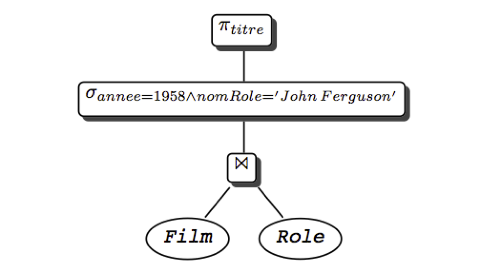
   
   Expression algébrique sous forme arborescente

L'interprétation de l'arbre est la suivante. On commence par exécuter
les opérations sur les feuilles (ici une jointure); sur le
résultat, on effectue les opérations correspondant aux nœuds de
plus haut niveau (ici une sélection), et ainsi de suite, jusqu`à ce
qu'on obtienne le résultat (ici après la projection).  Cette
interprétation est bien sûr rendue possible par le fait que tout
opérateur prend une table en entrée et produit une table en sortie.

Avec cette représentation de la requête sous une forme "opérationnelle",
nous sommes prêts pour la phase d'optimisation.

******************************
S3: optimisation de la requête
******************************

.. admonition::  Supports complémentaires:

    * `Diapositives: l'optimisation d'une requête <http://sys.bdpedia.fr/files/sloptim.pdf>`_
    * `Vidéo sur l'optimisation algébrique <https://mediaserver.cnam.fr/permalink/v125f35a4224c6w3cp17/>`_    
    * `Vidéo sur les plans d'exécution (1)  <https://mediaserver.cnam.fr/permalink/v125f35a42376acjqp1g/>`_    
    * `Vidéo sur les plans d'exécution (2)  <https://mediaserver.cnam.fr/permalink/v125f35a423cagaw4i9b//>`_    
    
La réécriture
=============

Nous disposons donc d'un plan d'exécution logique (PEL) présentant,
sous une forme normalisée (par exemple, les projections, puis les sélections, puis
les jointures) les opérations nécessaires à l'exécution
d'une requête donnée.

On peut reformuler le PEL  grâce
à l'existence de propriétés sur les expressions de l'algèbre
relationnelle. Ces propriétés appelées *lois algébriques* ou
encore *règles de réécriture* permettent de transformer
l'expression algébrique en une expression équivalente et donc de
réagencer l'arbre. Le PEL obtenu est équivalent, c'est-à-dire qu'il
conduit au même résultat. En transformant les PEL grâce à ces règles,
on peut ainsi obtenir des plans d'exécution alternatifs, et tenter d'évaluer
lequel est le meilleur.
Voici la liste des règles de réécriture les
plus importantes:

 - Commutativité des jointures.
 
   .. math::
   
        R \Join S  \equiv S \Join R
 - Associativité des jointures
 
   .. math::
      
       (R \Join S) \Join T \equiv R \Join (S \Join T)
     
 - Regroupement des sélections
 
   .. math::
   
        \sigma_{A='a' \wedge B='b'}(R) \equiv \sigma_{A='a'}(\sigma_{B='b'}(R))
        
 - Commutativité de la sélection et de la projection

   .. math::

        \pi_{A_1, A_2, ... A_p}(\sigma_{A_i='a} (R)) \equiv
            \sigma_{A_i='a}(\pi_{A_1, A_2, ... A_p}(R)), i \in \{1,...,p\}
            
 - Commutativité de la sélection et de la jointure
 
   .. math::

      \sigma_{A='a'} (R(...A...) \Join S) \equiv \sigma_{A='a'}(R) \Join S

 - Distributivité de la sélection sur l'union
 
   .. math::
   
      \sigma_{A='a'} (R \cup S) \equiv \sigma_{A='a'} (R) \cup \sigma_{A='a'} (S)
    
 - Commutativité de la projection et de la jointure
 
   .. math::
   
       \pi_{A_1 ... A_p}(R) \Join_{A_i=B_j}\pi_{B_1... B_q}(S))\; i \in \{1,..,p\}, j \in \{1,...,q\}

 - Distributivité de la projection sur l'union

   .. math::
      
        \pi_{A_1A_2...A_p} (R \cup S) \equiv \pi_{A_1A_2...A_p} (R) \cup \pi_{A_1A_2...A_p} (S)

Ces règles sont à la base du processus d'optimisation dont
le principe est *d'énumérer* tous les plans d'exécution possibles. 
Par exemple la règle 3 permet
de gérer finement l'affectation des sélections. En effet si la relation est 
indexée sur l'atttribut ``B``, la règle justifie de filter sur ``A``
seulement les enregistrements satisfaisant le critère :math:`B='b'`  obtenus par traversée
d'index. La commutatitivité de la projection avec la sélection et la
jointure (règles 4 et 7) d'une part et de la sélection et de la
jointure d'autre part (règle 5) permettent de faire les sélections et
les projections le plus tôt possible dans le plan (et donc le plus bas possible
dans l'arbre)  pour *réduire les tailles des relations
manipulées*, ce qui est l'idée de base pour le choix d'un 
*meilleur* PEL.
En effet nous avons vu
que l'efficacité des algorithmes implantant les opérations algébriques
est fonction de la taille des  relations en entrée. C'est 
particulièrement vrai pour la jointure qui est une opération
coûteuse. Quand une séquence comporte une jointure et une sélection,
il est  préférable de faire la sélection d'abord: on réduit ainsi la taille 
d'une ou des deux relations à joindre, ce qui peut avoir un impact
considérable sur le temps de traitement de la jointure. 

*Pousser* les sélections le plus bas possible dans l'arbre,
c'est-à-dire essayer de les appliquer le plus rapidement possible et
éliminer par projection les attributs non 
nécessaires pour obtenir le résultat de la requête sont donc  deux
heuristiques le plus souvent effectives pour transformer un PEL en un meilleur PEL (équivalent) .

Voici un algorithme simple résumant ces idées:

 - Séparer les sélections avec plusieurs prédicats 
   en plusieurs sélections à un prédicat (règle 3). 
 - Descendre les sélections le plus bas possible dans l'arbre (règles 4, 5, 6) 
 - Regrouper les sélections sur une même relation (règle 3). 
 - Descendre les projections le plus bas possible (règles 7 et 8). 
 - Regrouper les projections sur une même relation. 

Reprenons notre requête cherchant le film
paru en 1958 avec un rôle "John Ferguson". Voici l'expression
algébrique complète. 

.. math::

    \pi_{titre}(\sigma_{annee=1958 \land nom\_rôle='John\ Ferguson'}(Film \Join_{id=id\_film} (Rôle) )

L'expression est correcte, mais probablement pas optimale. 
Appliquons notre algorithme. La première étape
donne l'expression suivante:

.. math::

    \pi_{titre}(\sigma_{annee=1958} ( \sigma_{nom\_rôle='John\ Ferguson'}(Film \Join_{id=id\_film} (Rôle) ))

On a donc séparé les sélections. Maintenant on les descend
dans l'arbre:

.. math::

    \pi_{titre}( \sigma_{annee=1958} (Film) \Join_{id=id\_film} \sigma_{nom\_rôle='John\ Ferguson'}(Rôle) )

Finalement il reste à ajouter des projections pour limiter
la taille des enregistrements. À chaque étape du plan, les projections
consisteraient (nous ne les montrons pas) à supprimer les attributs inutiles. 
Pour conclure deux remarques sont nécessaires:

 - le principe "sélection avant jointure" conduit dans la plupart des cas à un PEL plus efficace;
   mais il peut arriver (très rarement) que la jointure soit plus réductrice en taille et
   que la stratégie "jointure d'abord, sélection ensuite", conduise à un
   meilleur PEL.

 - cette optimisation du PEL, si elle est nécessaire, est loin
   d'être suffisante: il faut ensuite choisir le "meilleur" algorithme
   pour chaque opération du PEL. Ce choix va dépendre des chemins d'accès
   et des statistiques sur les tables de la base et bien entendu des
   algorithmes d'évaluation implantés dans le noyau. Le PEL est alors
   transformé en un plan d'exécution physique du SGBD.

Cette transformation constitue la dernière étape de l'optimisation. Elle
fait l'objet de la section suivante.

Plans d'exécution
=================

Un plan d'exécution physique (PEP)
est un arbre d'opérateurs (on parle *d'algèbre physique*), issus
d'un "catalogue" propre à chaque SGBD. On retrouve, avec 
des variantes, les principaux opérateurs d'un SGBD à un autre. Nous
les avons étudiés dans le chapitre :ref:`chap-eval`, et nous
les reprenons maintenant pour étudier quelques exemples de plan d'exécution.

On peut distinguer tout d'abord les opérateurs *d'accès*:

  - le parcours séquentiel d'une table, ``FullScan``,
  - le parcours d'index, ``IndexScan``,
  - l'accès direct à un enregistrement par son adresse, ``DirectAccess``, nécessairement 
    combiné avec le précédent.

Puis, une second catégorie que nous appellerons opérateurs de *manipulation*:

  - la sélection, ``Filter``;
  - la projection, ``Project``;
  - le tri, ``Sort``;
  - la fusion de deux listes, ``Merge``;
  - la jointure par boucles imbriquées indexées, ``IndexedNestedLoop``, abrégée en ``inL``.
  
Cela nous suffira.   Nous reprenons notre requête cherchant les films
parus en 1958 avec un rôle "John Ferguson". Pour mémoire, le plan d'exécution logique auquel
nous étions parvenu est le suivant.

.. math::

    \pi_{titre}( \sigma_{annee=1958} (Film) \Join_{id=id\_film} \sigma_{nom\_rôle='John\ Ferguson'}(Rôle) )

Nous devons maintenant choisir des opérateurs physiques, choix qui   
dépend de nombreux facteurs: chemin d'accès, statistiques,
nombre de blocs en mémoire centrale. En fonction de ces
paramètres, l'optimiseur choisit, pour chaque nœud du PEL, un opérateur
physique ou une combinaison d'opérateurs. 

Une première difficulté vient du grand
nombre de critères à considérer: quelle mémoire allouer, comment la
partager entre opérateurs, doit-on privilégier temps de réponse ou
temps d'exécution, etc.  Une autre difficulté vient du fait que le
choix d'un algorithme pour un nœud du PEL peut avoir un impact sur le
choix d'un algorithme pour d'autres nœuds  (notamment concernant
l'utilisation de la mémoire). Tout cela mène à une procédure
d'optimisation complexe, mise au point et affinée par les concepteurs de chaque système,
dont il est bien difficile (et sans doute peu utile) de connaître les détails. 
Ce qui suit est donc plutôt une méthodologie générale, illustrée
par des exemples.

Prenons comme hypothèse directrice  que l'objectif principal de l'optimiseur
soit d'exécuter les jointures avec l'algorithme ``IndexNestedLoop`` (ce qui est raisonnable
pour obtenir un bon temps de réponse et limiter la mémoire nécessaire). 
Pour chaque jointure, il faut donc envisager les index disponibles. Ici, la jointure
s'effectue entre ``Film`` et ``Rôle``, ce dernier étant indexé sur la clé
primaire ``(id_acteur, id_film)``. La jointure est commutative (cf. les règles
de réécriture. On peut donc effectuer, de manière équivalente, 

.. math::

    Film \Join_{id=id\_film} Rôle
 
ou

 .. math::

   Rôle \Join_{id\_film=id} Film
   
Regardons pour quelle version nous pouvons utiliser un index avec l'algorithme
``IndexNestedLoop``.  Dans le premier cas, nous lisons des nuplets ``film`` (à gauche)
et pour chaque film nous cherchons les rôles (à droite). Peut-on utiliser l'index
sur rôle? Non, pour les raisons déjà expliquées dans la session 1: 
l'identifiant du film est un *suffixe*  de la clé de l'arbre B, et ce dernier
est donc inopérant.

Second cas: on lit des rôles (à gauche) et pour chaque rôle on cherche le film. Peut-on
utiliser l'index sur film? Oui, bien sûr: on est dans le cas où on lit les nuplets
de la table contenant la clé étrangère, et où on peut accéder par la clé primaire à la
seconde table (revoir le chapitre :ref:`chap-opalgo` pour réviser les algorithmes
de jointure si nécessaire). Nos règles de réécriture algébrique nous permettent 
de reformuler le plan d'exécution logique, en commutant la jointure.
   
.. math::

    \pi_{titre}(\sigma_{nom\_rôle='John\ Ferguson'}(Rôle)  \Join_{id\_film=id}  \sigma_{annee=1958} (Film) )

Et, plus important, nous pouvons maintenant implanter ce plan avec l'algorithme de jointures
imbriquées indexées, ce qui donne l'arbre de la  :numref:`planEx-full1`. 

.. _planEx-full1:
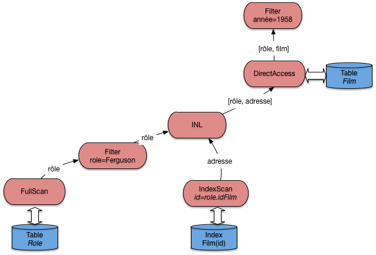
   
   Le plan d'exécution "standard"

.. note:: L'opérateur de projection n'est pas montré sur les figures.  Il intervient 
   de manière triviale comme racine du plan d'exécution complet.

Peut-on faire mieux? Oui, en créant des index. La première possibilité est de créer un index
pour éviter un parcours séquentiel de la table gauche. Ici, on peut créer un index sur le nom
du rôle, et remplacer l'opérateur de parcours séquentiel par la combinaison habituelle
(``IndexScan`` + ``DirectAccess``). Cela donne le plan de la  :numref:`planEx-full2`.

.. _planEx-full2:
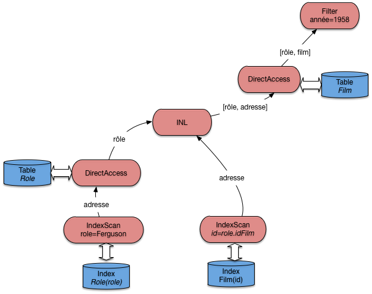
   
   Le plan d'exécution avec deux index
   
Ce plan est certainement le meilleur, du moins si on prend
comme critère la minimisation du temps de réponse et de la mémoire
utilisée. Cela ne signifie pas qu'il faut créer des index à tort et
à travers: la maintenance d'index a un coût, et ne se justifie que pour optimiser des requêtes
fréquentes et lentes.

Une autre possiblité pour faire mieux est de créer un index sur la *clé étrangère*, 
ce qui ouvre la possibilité d'effectuer les jointures dans n'importe quel ordre (pour
les jointures "naturelles", celles qui associent clé primaire et clé étrangère). Certains
systèmes (MySQL) le font d'ailleurs systématiquement.

Si, donc, la table ``Rôle`` est indexée sur la clé primaire ``(id_acteur, id_film)``  *et*
sur la clé étrangère ``id_film`` (ce n'est pas redondant), un plan d'exécution possible est 
celui de la  :numref:`planEx-full3`.

.. _planEx-full3:
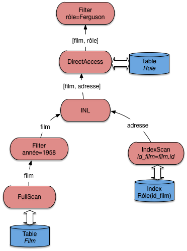
   
   Le plan d'exécution avec index sur les clés étrangères

Ce plan est comparable à celui de la :numref:`planEx-full1`. Lequel des deux
serait choisi par le système? En principe, on choisirait comme table de gauche
celle qui contient le *moins* de nuplets, pour minimiser le nombre de demandes
de lectures adressées à l'index. Mais il se peut d'un autre côté que cette table, tout
en contenant moins de nuplets, soit beaucoup plus volumineuse et que
sa lecture séquentielle soit considérée comme trop pénalisante. Ici, statistiques
et évaluation du coût entrent en jeu.

On pourrait finalement créer un index sur l'année sur film pour éviter
tout parcours séquentiel: à vous de déterminer
le plan d'exécution qui correspond à ce scénario.

Finalement, considérons le cas où aucun index n'est disponible. Pour notre exemple,
cela correspondrait à une sévère anomalie puisqu'il manquerait
un index sur la clé primaire. Toujours est-il que dans un tel cas le système
doit déterminer l'algorithme de jointure sans index qui convient. La  :numref:`planEx-full4`
illustre le cas où c'est l'agorithme de tri-fusion qui est choisi. 
La jointure par hachage est une alternative, sans doute préférable d'ailleurs
si la mémoire RAM est suffisante.

.. _planEx-full4:
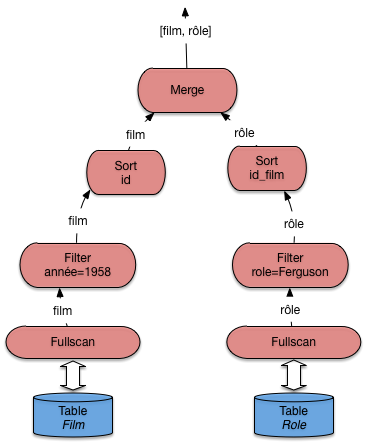
   
   Le plan d'exécution en l'absence d'index

La présence de l'algorithme de tri-fusion pour une jointure doit alerter sur l'absence d'index
et la probable nécessité d'en créer un.

Arbres en profondeur à gauche
=============================

Pour conclure cette section sur l'optimisation, on peut généraliser l'approche présentée
dans ce qui précède au cas des requêtes multi-jointures,
où de plus chaque jointure est "naturelle" et associe la clé primaire d'une table à la clé
étrangère de l'autre. Voici un exemple sur notre schéma: on cherche tous
les films dans lesquels figure un acteur islandais.

.. code-block:: sql

    select *
    from Film, Rôle, Artiste, Pays
    where Pays.nom='Islande'
    and   Film.id=Rôle.id_film
    and   Rôle.id_acteur=Artiste.id
    and   Artiste.pays = Pays.code
    
Ces requêtes comprenant beaucoup de jointures sont courantes, et le fait qu'elles
soient naturelles est également courant, pour des raisons déjà expliquées.

Quel est le plan d'exécution typique? Une stratégie assez standard de l'optimiseur va être d'éviter
les opérateurs bloquants et la consommation de mémoire. Cela mène à chercher, le plus
systématiquement possible, à appliquer l'opérateur de jointure par boucles imbriquées indexées.
Il se trouve que pour les requêtes considérées ici, c'est toujours possible. En fait, on 
peut représenter ce type de requête par une "chaîne" de jointures naturelles. Ici, on a
(en ne considérant pas les sélections):

.. math:: 
    
   Film \Join Rôle \Join Artiste \Join Pays
    
Il faut lire au moins une des tables séquentiellement pour "amorcer" la cascade des
jointures par boucles imbriquées. Mais, pour toutes les autres tables, un accès par
index devient possible. Sur notre exemple, le bon ordre des jointures est

.. math:: 
    
    Artiste \Join Pays \Join Rôle \Join Film

Le plan d'exécution consistant en une lecture séquentielle suivi de boucles imbriquées
indexées est donné sur la  :numref:`planEx-lefttree`. Il reste bien sûr à le compléter. Mais
l'aspect important est que ce plan fonctionne entièrement en mode pipelinage, sans latence
pour l'application.  Il exploite au maximum la possibilité d'utiliser les index, et minimise
la taille de la mémoire nécessaire.

.. _planEx-lefttree:
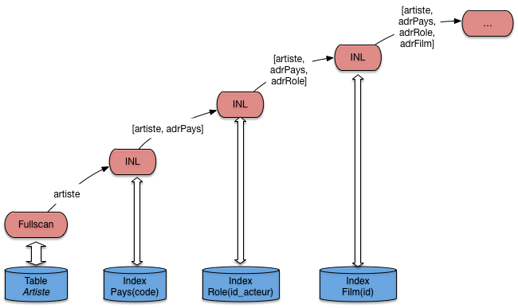
   
   Le plan d'exécution avec algorithme de jointure indexée généralisé
    
Ce plan a la forme caractéristique d'un *arbre en profondeur à gauche* ("*left-deep tree*"). C'est
celle qui est recherchée classiquement par un optimiseur, et la forme de base que vous
devriez retenir comme point de repère pour étudier un plan d'exécution. En 
présence d'une
requête présentant les caractéristiques d'une chaîne de jointure, c'est la forme
de référence, dont on ne devrait dévier que dans des cas explicables par la présence
d'index complémentaires, de tables très petites, etc.

Ce plan (le sous-plan de la    :numref:`planEx-lefttree`) fournit un nuplet, et autant 
*d'adresses* de nuplets qu'il y a de jointures et donc d'accès aux index. Il faut ensuite
ajouter autant d'opérateurs ``DirectAccess``, ainsi que les opérateurs de sélection nécessaires
(ici sur le nom du pays). Essayez par exemple, à titre d'exercice, de compléter le
plan de la  :numref:`planEx-lefttree` pour qu'il corresponde complètement
à la requête.

Quiz
====

  - La relation ``Rôle(id_acteur, id_film, nom_rôle)`` a pour clé primaire la paire 
    d’attributs ``(id_acteur, id_film)``. Sachant que le système construit un arbre B 
    sur cette clé, laquelle parmi les requêtes suivantes ne peut pas utiliser l’index ?

    .. eqt:: optimQ11

         A) :eqt:`I` ``select * from Rôle where id_acteur = x and id_film=y``
         #) :eqt:`I`  ``select * from Rôle where id_acteur = x``
         #) :eqt:`C`  ``select * from Rôle where id_film=y``

    En déduire pourquoi le bon ordre de jointure entre les tables Film et Rôle est celui exposé en cours.

  - Dans le plan d’exécution de la requête suivante, comment pourrait–on éviter tout parcours séquentiel ?

    .. code-block:: sql
    
          select titre
          from   Film f, Rôle r, Artiste a
          where  a.nom = 'Stewart' and a.prénom='James'
          and    f.id_film = r.id_film
          and    r.id_acteur = a.idArtiste
          and    f.annee = 1958

    .. eqt:: optimQ12

         A)  :eqt:`I`  En créant un index sur la clé étrangère ``id_film`` dans Rôle.
         #)  :eqt:`C` En créant un index sur le nom et le prénom des artistes
         #)  :eqt:`I`  En créant un index sur l’année de Film.

****************************
S4: illustration avec Oracle
****************************
    
Cette section présente l'application concrète des concepts,
structures et algorithmes présentés dans ce qui précède
avec le SGBD Oracle. Ce système est un  bon exemple
d'un optimiseur sophistiqué s'appuyant sur des structures
d'index et des algorithmes d'évaluation  complets.
Tous les algorithmes de jointure décrits dans ce cours
(boucles imbriquées, tri-fusion, hachage, boucles
imbriquées indexées) sont en effet implantés dans Oracle. 
De plus le système propose des outils simples et pratiques
(``explain`` notamment) pour analyser le plan d'exécution choisi
par l'optimiseur, et obtenir des statistiques sur les
performances (coût en E/S et coût CPU, entre autres).

Tous les GBD relationnel proposent un outil comparable 
d'exlication des plans d'exécution choisis. Les travaux
pratique nous permettrons d'utiliser celui d'oracle, mais aussi celui
de Postgres.

Paramètres et statistiques
==========================

L'optimiseur s'appuie sur des paramètres divers et sur 
des statistiques.
Parmi les plus paramètres les plus intéressants, citons:

 - ``OPTIMIZER_MODE``:  permet  d'indiquer si le coût
   considéré est le temps de réponse (temps
   pour obtenir la première ligne du résultat), 
   ``FIRST_ROW`` ou le temps d'exécution total ``ALL_ROWS``.

 - ``SORT_AREA_SIZE`` indique la taille de la  mémoire affectée à l'opérateur de tri. 

 - ``HASH_AREA_SIZE`` indique la taille de la  mémoire affectée à l'opérateur de hachage.

 - ``HASH_JOIN_ENABLED`` indique que l'optimiseur considère les jointures par hachage.

L'administrateur de la base est responsable
de la tenue à jour des statistiques.
Pour analyser une table on utilise la commande ``analyze table``
qui produit la taille de la
table (nombre de lignes) et le nombre
de blocs utilisés. Cette information est utile
par exemple au moment d'une jointure pour
utiliser comme table externe la plus petite des deux.
Voici un exemple de la commande.

.. code-block:: sql

    analyze table Film compute statistics for table;

On trouve alors des informations statistiques 
dans les vues ``dba_tables``, ``all_tables``, ``user_tables``.  Par exemple: 

 - ``NUM_ROWS``, le  nombre de lignes.
 - ``BLOCKS``, le nombre de blocs.
 - ``CHAin_CNT``, le nombre de blocs chaînés.
 - ``AVG_ROW_LEN``, la taille moyenne d'une ligne.

On peut également analyser les index d'une table, ou
un index en particulier. Voici les deux commandes
correspondantes. 

.. code-block:: sql

    analyze table Film compute statistics for all indexes;
    analyze index PKFilm compute statistics;

Les informations statistiques sont placées  dans les vues
``dba_index``, ``all_index`` et ``user_indexes``.

Pour finir on peut calculer des statistiques sur 
des colonnes. Oracle utilise des histogrammes en hauteur
pour représenter
la distribution des valeurs d'un champ.
Il est évidemment inutile d'analyser toutes les colonnes. Il faut
se contenter des colonnes qui ne sont pas des clés uniques,
et qui sont indexées. Voici un exemple
de la commande d'analyse pour créer des histogrammes
avec vingt groupes sur les colonnes ``titre``
et ``genre``.

.. code-block:: sql

    analyze table Film compute statistics for columns titre, genre size 20;

On peut remplacer ``compute`` par ``estimate`` pour
limiter le coût de l'analyse. Oracle prend alors un échantillon
de la table, en principe représentatif (on sait ce que valent les sondages!).
Les informations sont stockées 
dans les vues ``dba_tab_col_statistics`` et
``dba_part_col_statistics``. 

Plans d'exécution Oracle
========================

Nous en arrivons maintenant à la présentation des plans
d'exécution d'Oracle, tels qu'ils sont donnés par l'utilitaire ``explain``.
Ces plans ont classiquement la forme d'arbres en
profondeur à gauche (voir la section précédente), chaque nœud étant un opérateur,
les nœuds-feuille représentant les accès aux
structures de la base, tables, index, *cluster*, etc.

Le vocabulaire de l'optimiseur pour désigner les opérateurs est un peu différent
de celui utilisé jusqu'ici dans ce chapitre. La
liste ci-dessous donne les principaux, en commençant par
les chemins d'accès, puis les algorithmes de jointure,
et enfin des opérations diverses de manipulation
d'enregistrements.

 - ``FULL TABLE SCAN``, notre opérateur ``FullScan``.
 - ``ACCESS BY ROWID``, notre opérateur ``DirectAccess``.
 - ``INDEX SCAN``, notre opérateur ``IndexScan``.
 - ``NESTED LOOP``, notre opérateur ``inL`` de  boucles imbriquées indexées, utilisé quand il y a au moins un index.
 - ``SORT/MERGE``, algorithme de tri-fusion.
 - ``HASH JOIN``, jointure par hachage.
 - ``inTERSECTION``, intersection de deux ensembles d'enregistrements.
 - ``CONCATENATION``, union de deux ensembles.
 - ``FILTER``,  élimination d'enregistrements (utilisé dans un négation).
 - ``select``, opération de projection (et oui ...). 

Voici un petit échantillon de requêtes sur notre base
en donnant à chaque fois le plan
d'exécution choisi par Oracle. Les plans sont obtenus
en préfixant la requête à analyser par ``explain plan``
accompagné de l'identifiant à donner au plan d'exécution. La
description du plan d'exécution est alors stockée dans une table utilitaire et
le plan peut être affiché de différentes manières. Nous donnons
la représentation la plus courante, dans laquelle l'arborescence
est codée par l'indentation des lignes.

La première requête est une sélection sur un attribut 
non indexé.

.. code-block:: sql

     explain plan 
     set statement_id='SelSansInd' for
     select *
     from Film
     where titre = 'Vertigo'
     
On obtient le plan d'exécution nommé ``SelSansInd`` dont l'affichage est donné ci-dessous.

.. code-block:: sql
    
    0 SELECT STATEMENT
      1 TABLE ACCESS FULL FILM     

Oracle effectue donc un balayage complet de la table ``Film``.
L'affichage représente l'arborescence du plan d'exécution par une
indentation. Pour plus de clarté, nous donnons également l'arbre
complet (:numref:`planOra-selsansind`) avec les conventions utilisées
jusqu'à présent.

.. _planOra-selsansind:
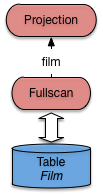
   
   Plan Oracle pour une requête sans index   
    
Le plan est trivial.
L'opérateur de parcours séquentiel extrait un à un les enregistrements
de la table ``Film``. Un filtre (jamais montré dans les plans
donnés par ``explain``, car intégré aux opérateurs d'accès aux données)
élimine tous ceux dont le titre n'est pas *Vertigo*. Pour ceux
qui passent le filtre, un opérateur de projection (malencontreusement
nommé  ``select`` dans Oracle ...)  ne conserve que les champs non
désirés.   

Voici maintenant une sélection avec index sur la table
``Film``. 

.. code-block:: sql

     explain plan 
     set statement_id='SelInd' for
     select *
     from Film
     where id=21;
     
Le plan d'exécution obtenu est:

.. code-block:: sql

    0 SELECT STATEMENT
     1 TABLE ACCESS BY ROWID FILM
      2 INDEX UNIQUE SCAN IDX-FILM-ID

L'optimiseur a détecté la présence d'un index unique sur la table
``Film``. La traversée de cet index donne un ``ROWID``
qui est ensuite utilisé pour un accès direct à
la table (:numref:`planOra-selind`).

.. _planOra-selind:
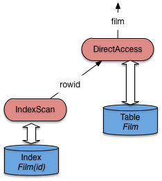
   
   Plan Oracle pour une requête avec index       

Passons maintenant aux jointures.  La requête donne
les titres des films avec les nom et prénom
de leur metteur en scène, ce qui implique
une jointure entre ``Film`` et ``Artiste``. 

.. code-block:: sql

    explain plan 
    set statement_id='JoinIndex' for
    select titre, nom, prénom
    from   Film f, Artiste a
    where f.id_realisateur = a.id;
    
Le plan d'exécution obtenu est le suivant: il s'agit d'une jointure
par boucles imbriquées indexées.

.. code-block:: sql

    0 SELECT STATEMENT
      1 NESTED LOOPS
        2 TABLE ACCESS FULL FILM
        3 TABLE ACCESS BY ROWID ARTISTE
          4 INDEX UNIQUE SCAN IDXARTISTE

Vous devriez pour décrypter ce plan est le reconnaître: c'est celui, discuté
assez longuement déjà, de la jointure imbriquée indexée. Pour mémoire, il
correspond à la figure suivante, très proche de celle
du chapitre  :ref:`chap-opalgo`.

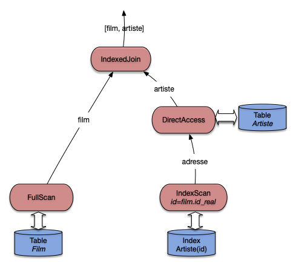
   
   Plan Oracle pour une requête avec index    

Ré-expliquons une nouvelle fois. Tout d'abord
la table qui n'est pas indexée sur l'attribut
de jointure (ici, ``Film``) est parcourue
séquentiellement. Le nœud ``IndexJoin`` (appelé ``NESTED LOOPS`` par Oracle)
récupère les enregistrements ``film`` un par
un du côté gauche. Pour chaque film on va
alors récupérer l'artiste correspondant avec
le sous-arbre du côté droit.

On efffectue alors une recherche par clé dans l'index avec
la valeur ``id_realisateur`` provenant du film courant. La recherche
renvoie un ``ROWID`` qui est  utilisé pour
prendre l'enregistrement complet dans la table ``Artiste``. Le nœud
de jointure récupère cet enregistrement et l'associe au film.

.. note:: Par rapport à la version de cet algorithme présenté précédemment,
   ORACLE choisit d'effectuer le ``DirectAccess`` immédiatement après le 
   parcours d'index (alors que nous avons montré une version où il avait lieu
   après la jointure). Cela reste fondamentalement le même algorithme.

Dans certains cas on peut éviter le parcours séquentiel à
gauche de la jointure par boucles imbriquées, si une sélection
supplémentaire sur un attribut indexé est exprimée. L'exemple
ci-dessous sélectionne tous les rôles jouées par Al Pacino, et suppose
qu'il existe un index sur les noms des artistes qui permet
d'optimiser la recherche par nom. L'index sur la
table ``Rôle`` est la concaténation des
champs ``id_acteur`` et ``id_film``, ce qui
permet de faire une recherche par intervalle
sur le préfixe constitué seulement de ``id_acteur``.
La requête est donnée ci-dessous.

.. code-block:: sql

    explain plan
    set statement_id='JoinSelIndex' for
    select nom_rôle
    from   Rôle r, Artiste a
    where  r.id_acteur = a.id
    and    nom = 'Pacino'; 

Et voici le plan d'exécution.

.. code-block::  sql

    0 SELECT STATEMENT
      1 NESTED LOOPS
        2 TABLE ACCESS BY ROWID ARTISTE
          3 INDEX RANGE SCAN IDX-NOM
        4 TABLE ACCESS BY ROWID ROLE
          5 INDEX RANGE SCAN IDX-ROLE

Notez bien que les deux recherches dans les index s'effectuent
par intervalle (``INDEX RANGE``), et peuvent donc ramener plusieurs ``ROWID``.
Dans les deux cas on utilise en effet seulement une
partie des champs définissant l'index (et cette partie
constitue un préfixe, ce qui est impératif). 
On peut donc envisager de trouver plusieurs
artistes nommé Pacino (avec des prénoms différents),
et pour un artiste, on peut trouver plusieurs rôles
(mais pas pour le même film). Tout cela résulte de la
conception de la base.

.. _planOra-joinselindex:
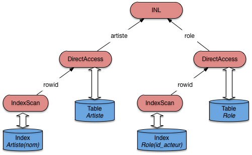
   
   Plan Oracle pour une jointure et sélection avec index
   
Pour finir voici une requête sans index. On veut trouver
tous les artistes nés l'année de parution de ``Vertigo``
(et pourquoi pas?). La requête est donnée ci-dessous:
elle effectue une jointure sur les années de parution
des films et l'année de naissance des artistes. 
 
.. code-block:: sql

    explain plan set 
    statement_id='JoinSansIndex' for
    select nom, prénom
    from Film f, Artiste a
    where f.annee  = a.annee_naissance
    and   titre = 'Vertigo';
    
Comme
il n'existe pas d'index sur ces champs, Oracle applique
un algorithme de tri-fusion, et on obtient le plan d'exécution
suivant.

.. code-block:: sql

   0 SELECT STATEMENT
     1 MERGE JOIN
       2 SORT JOIN
         3 TABLE ACCESS FULL ARTISTE
       4 SORT JOIN
         5 TABLE ACCESS FULL FILM
         
L'arbre de la :numref:`planOra-joinsansindex` montre
bien les deux tris, suivis de la fusion. Au moment du
parcours séquentiel, on va filtrer tous les films
dont le titre n'est pas ``Vertigo``, ce qui va
certainement beaucoup simplifier le calcul de ce côté-là.
En revanche le tri des artistes risque d'être beaucoup
plus coûteux.

.. _planOra-joinsansindex:
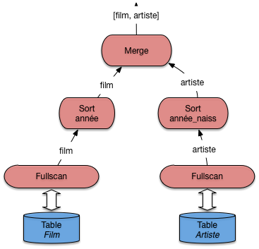
   
   Plan Oracle pour une jointure sans  index
   
Dans un cas comme celui-là, on peut envisager de créer un index
sur  les années de parution ou
sur les années de naissance. Un seul index suffira, puisqu'il
devient alors possible d'effectuer une jointure par boucles
imbriquées.

Outre l'absence d'index, il existe de nombreuses
raisons pour qu'Oracle ne puisse pas utiliser un index:
par exemple quand on applique une fonction au moment
de la comparaison. Il faut être attentif à ce genre
de détail, et utiliser ``explain`` pour vérifier 
le plan d'exécution quand une requête s'exécute sur un temps
anormalement long.

*********
Exercices
*********

Les exercices sont essentiellement des études de plan d'exécution, pour
lesquels nous utilisons la syntaxe expliquée dans le contexte d'Oracle.
Vous pouvez également produire des diagrammes assez facilement avec https://www.lucidchart.com
si vous préférez.

.. _ex-planex1:
.. admonition:: Exercice `ex-planex1`_: définir des plans d'exécution

    Donner le meilleur plan d'exécution pour les requêtes suivantes,
    en supposant qu'il existe un index sur la clé primaire de la table ``idFilm``.
    Essayez d'identifier les  requêtes qui peuvent s'évaluer uniquement
    avec l'index. Inversement, identifier celles pour lesquelles l'index est inutile.
    
    .. code-block:: sql
    
        select * from Film 
        where  idFilm = 20 and titre = 'Vertigo';

        select * from   Film 
        where  idFilm = 20 or titre = 'Vertigo';
        
        select COUNT(*) from Film;
        
        select MAX(idFilm) from Film;

  .. ifconfig:: optim in ('public')

      .. admonition:: Correction
 
          - Accès par index pour ``id=20``, 
            puis on applique la sélection ``titre='Vertigo'``
            au moment où on prend l'enregistrement par
            l'itérateur d'accès direct.
          - Rien ne sert d'utiliser l'index pour ``id=20`` puisqu'il
            faut de toute façon faire un parcours séquentiel.
            On effecte donc un seul parcours séquentiel pendant lequel
            on teste les deux critères.
          - Il suffit de compter le nombre d'entrées dans l'index.
          - On prend la valeur de l'entrée la plus à droite dans l'index.
          
.. _ex-planex2:
.. admonition:: Exercice `ex-planex2`_: encore des plans d'exécution

    Soit le schéma relationnel :

       - Journaliste (**jid**, nom, prénom)
       - Journal (**titre**, rédaction, id_rédacteur)
    
    La table ``Journaliste`` stocke les informations (nom, prénom) sur les
    journalistes (``jid``  est le numéro d'identification du journaliste). 
    La table ``Journal`` stocke pour chaque rédaction d'un journal 
    le titre du journal (titre), le nom de la rédaction (rédaction) et l'id
    de son rédacteur (``rédacteur_id``). Le titre du journal est une clé .
    On a un arbre B dense sur la table ``Journaliste`` sur l'attribut ``jid``, 
    nommé ``Idx-Journaliste-jid``.
    
    On  considère la requête suivante:

    .. code-block:: sql 
   
        select nom 
        from Journal, Journaliste 
        where titre='Le Monde' 
        and jid=id_redacteur
        and prénom='Jean'

    Questions:
    
      - Voici deux expressions algébriques:
      
         .. math:: \pi_{nom}(\sigma_{titre='Le\,Monde' \land prenom='Jean'}(Journaliste \Join_{jid=redacteur\_id} Journal)) 

        et
        
        .. math:: \pi_{nom}(\sigma_{prenom='Jean'}(Journaliste) \Join_{jid=redacteur\_id} \sigma_{titre='Le\,Monde'}(Journal))
        
        Les deux expressions retournent-elles le même résultat (sont-elles
        équivalentes)?  Justifiez votre réponse en indiquant les règles
        de réécriture que l'on peut appliquer.
      - Une expression vous semble-t-elle meilleure que 
        l'autre si on les  considère comme des plans d'exécution? 
      - Donner le plan d'exécution physique basé sur la jointure par
        boucles imbriquées indexées, sous forme
        arborescente ou sous forme d'une expression EXPLAin, et expliquez en détail ce plan.

  .. ifconfig:: optim in ('public')

      .. admonition:: Correction
 
          -  Oui les deux expressions sont équivalentes. Pour passer de la première
             à la seconde, on applique d'abord la règle de composition
             des sélections, puis la règle de commutativité entre sélection et
             jointure. 
          - En principe le second plan est le meilleur car il effectue
            les sélections le plus tôt possible et limite donc la taille
            des tables à joindre.
          - Par boucles imbriquées indexées, avec parcours  séquentiel de la table 
            ``Journal``.

.. _ex-planex3:
.. admonition:: Exercice `ex-planex3`_: toujours des plans d'exécution

    Soit la base d'une société d'informatique décrivant les clients, 
    les logiciels vendus, et les licences indiquant qu'un client a
    acquis un logiciel.

        - Société (**id**, intitulé)
        - Logiciel (**id**, nom)
        - Licence (**idLogiciel, idSociété**, durée)

    Bien entendu un index unique est créé  sur les clés primaires. 
    Pour chacune des requêtes suivantes, donner le plan d'exécution qui vous semble le meilleur.

    .. code-block:: sql
    
        select intitulé
        from  Société, Licence
        where durée = 15
        and   id = idSociete;

        select intitule
        from  Société, Licence, Logiciel
        where nom='EKIP'
        and   Société.id = idSociete 
        and   Logiciel.id = idLogiciel;

        select intitule
        from  Société, Licence
        where Société.id = idSociete 
        and   idLogiciel in (select id from Logiciel 
                            where nom='EKIP')

        select intitule
        from  Société s, Licence c
        where s.id = c.idSociete 
        and exists (select * from Logiciel l 
                    where nom='EKIP' and c.idLogiciel=l.idLogiciel)

  .. ifconfig:: optim in ('public')

      .. admonition:: Correction
 
          - Standard: boucles imbriquées indexées, avec balayage séquentiel 
            de la table ``Licence`` (on en profite pour
            effectuer la sélection sur la durée), et accès par l'index à ``Société``.
          - Il faut effectuer deux jointures par boucles imbriquées 
            indexées successives. Le parcours séquentiel peut 
            s'effectuer sur ``Licence`` ou ``Logiciel``, la plus petite
            des deux.
            Attention on ne peut pas commencer en parcourant séquentiellement
            la table ``Société`` car l'index sur ``Licence`` est inutilisable 
            dans ce cas.
          - Jointure par  boucle imbriquée indexée sur
            ``Société`` et ``Licence`` (avec parcours
            séquentiel sur ``Licence``). Pour chaque enregistrement,
            de la jointure, parcours séquentiel de la table ``Logiciel``. 
            Le système peut commencer par évaluer la sous-requête, et stocker le
            résultat (un nuplet) dans une table temporaire qui est alors
            parcourue répétitivement. Sinon, le résultat risque d'être sous-optimal.
            
            Leçon: méfiance dans l'utilisation des sous-requêtes 
            pour des tables importantes.
          - Encore la même requête, mais cette fois on donne la possibilité 
            au système d'utiliser l'index sur ``Logiciel``.
            
            On se ramène à deux boucles imbriquées indexées, mais 
            avec un ordre figé, ce qui est à éviter.

.. _ex-optim1:
.. admonition:: Exercice `ex-optim1`_:  plans d'exécution Oracle

    On prend les tables suivantes, abondamment utilisées
    par Oracle dans sa documentation:

       - ``Emp (empno, ename, sal, mgr, deptno)``
       - ``Dept (deptno, dname, loc)``
       
    La table ``Emp`` stocke des employés, la table ``Dept`` 
    stocke les départements d'une entreprise. La requête suivante
    affiche le nom des employés dont le salaire est égal 
    à 10000, et celui de leur département. 

    .. code-block:: sql
    
        select  e.ename, d.dname
        from    emp e, dept d
        where   e.deptno = d.deptno
        and     e.sal = 10000

    Voici des plans d'exécution donnés par Oracle, qui varient en 
    fonction de l'existence ou non de certains
    index. Dans chaque cas expliquez ce plan.

     - Index sur ``Dept(deptno)`` et sur ``Emp(Sal)``.

       .. code-block:: text
       
            0 SELECT STATEMENT
                1 NESTED LOOPS
                    2 TABLE ACCESS BY ROWID EMP
                        3 INDEX RANGE SCAN EMP_SAL
                    4 TABLE ACCESS BY ROWID DEPT
                        5 INDEX UNIQUE SCAN DEPT_DNO

     - Index sur ``Emp(sal)`` seulement.

      .. code-block:: text
       
            0 SELECT STATEMENT
                1 NESTED LOOPS
                    2 TABLE ACCESS FULL DEPT
                    3 TABLE ACCESS BY ROWID EMP
                        4 INDEX RANGE SCAN EMP_SAL

     - Index sur ``Emp(deptno)`` et sur ``Emp(sal)``.

      .. code-block:: text
       
            0 SELECT STATEMENT
                1 NESTED LOOPS
                    2 TABLE ACCESS FULL DEPT
                    3 TABLE ACCESS BY ROWID EMP
                        4 and-EQUAL
                            5 INDEX RANGE SCAN EMP_DNO
                            6 INDEX RANGE SCAN EMP_SAL

     - Voici une requête légèrement différente. 
     
       .. code-block:: sql

            select e.ename
            from emp e, dept d
            where  e.deptno = d.deptno
            and    d.loc = 'Paris'
 
       On suppose qu'il n'y a pas d'index. Voici le plan
       donné par Oracle.

       .. code-block:: text
       
            0 SELECT STATEMENT
                1 MERGE JOIN
                    2 SORT JOIN
                        3 TABLE ACCESS FULL DEPT
                    4 SORT JOIN
                        5 TABLE ACCESS FULL EMP

      Indiquer quel(s) index on peut créer pour obtenir de meilleures
      performances (donner le plan d'exécution correspondant).

    - Que pensez-vous de la requête suivante par rapport à la précédente?  
 
      .. code-block:: sql
    
            select e.ename
            from emp e
            where  e.deptno in (select d.deptno
                        from Dept d
                        where d.loc = 'Paris')

      Voici le plan d'exécution donné par Oracle\,:

      .. code-block:: text
       
            0 SELECT STATEMENT
                1 MERGE JOIN
                    2 SORT JOIN
                        3 TABLE ACCESS FULL EMP
                    4 SORT JOIN
                        5 VIEW
                            6 SORT UNIQUE
                                7 TABLE ACCESS FULL DEPT

      Qu'en dites vous? 

    - Sur le même schéma, voici maintenant la requête suivante.
     
      .. code-block:: sql

            select * 
            from Emp e1 where sal in (select salL 
                            from Emp e2
                            where e2.empno=e1.mgr) 

      Cette requête cherche les employés dont le salaire est égal
      à celui de leur patron. On donne le plan d'exécution avec
      Oracle (outil EXPLAin) pour cette requête dans deux cas: (i) pas
      d'index, (ii) un index sur le salaire et un index sur le numéro
      d'employé. 

      Expliquez dans les deux cas ce plan d'exécution
      (éventuellement en vous aidant d'une représentation arborescente de
      ce plan d'exécution).
       
        - Pas d'index.
        
          .. code-block:: text

                0 FILTER
                  1 TABLE ACCESS FULL EMP
                  2 TABLE ACCESS FULL EMP

        - Index sur ``empno`` et index sur ``sal``.

          .. code-block:: text

                0 FILTER
                    1 TABLE ACCESS FULL EMP
                        2 and-EQUAL
                            3 INDEX RANGE SCAN I-EMPNO 
                            4 INDEX RANGE SCAN I-SAL

     - Dans le cas où il y a les deux index (salaire et numéro
       d'employé), on a le plan d'exécution suivant:

       .. code-block:: text
       
            0 FILTER
                1 TABLE ACCESS FULL EMP
                2 TABLE ACCESS ROWID EMP 
                    3 INDEX RANGE SCAN I-EMPNO

       Expliquez-le.

  .. ifconfig:: optim in ('public')

      .. admonition:: Correction
      
         - Boucles imbriquées (``NESTED LOOP``): on choisit de parcourir un
           sous-ensemble de ``emp`` en utilisant l'index, puis on accède à 
           ``dept`` avec l'index sur ``deptno``.
         - Algorithme de SCAN-INDEX. Equivalent à une jointure par NESTED-LOOP
           brutal. On pourrait (i) changer l'ordre des tables sans modifier la
           complexité, et (ii) faire un tri-fusion.
            
         - Comme l'index sur ``Emp(deptno)`` n'est pas unique, on 
           a intérêt à limiter la liste des adresses en utilisant les deux index
           et en faisant l'intersection. L'algorithme utilisé pour 
           cette intersection n'est pas précisé par Oracle: il est possible
           qu'un tri sur les adresses soit nécessaire.
            
         - Algorithme de tri-fusion classique. On peut créer 
           un index sur ``deptno`` dans l'une ou l'autre table.
            
         - Création d'une table temporaire (``VIEW``) contenant les numéros
           des départements à Paris. On a éliminé les doublons (``SORT
           UNIQUE``). Ensuite on fait un tri-fusion. Donc exécution 
           différente  pour une requête équivalente.
            
         - Boucles imbriquées (``FILTER``): on parcourt la table 
           ``Emp`` (ligne 2); our chaque employé, on regarde le salaire 
           *SAL* et le numéro du patron *MGR* ; on parcourt alors la 
           table ``Emp`` (ligne 3) pour trouver
           l'employé dont le numéro est *MGR*  et on compare le salaire à *SAL*.
           Donc c'est une boucle imbriquée brutale: on aurait pu faire un
           tri-fusion.
            
         - Boucles imbriquées (FILTER) : on parcourt la table EMP (ligne 2).
           Pour chaque employé, le salaire SAL et le numéro EMPNO, valeur
           de l'attribut MGR servent de clé pour accéder à l'index (lignes 4
           et 5). L'intersection des listes de rowid (ligne 3) obtenues par
           les étapes 4 et 5 donne si elle est non vide un rowid de patron
           ayant même salaire que l'employé.
            
         - Dans ce cas, seul l'index sur les numéros d'employés est utilisé.
           Boucles imbriquées (FILTER); on parcourt la table ``Emp``: 
           pour chaque employé, l'attribut *MGR*  donne le numéro 
           d'employé de son patron.
           On accède à son patron par l'index sur les numéros d'employé (lignes
           4 puis 3): on vérifie alors si son salaire est égal à celui de
           l'employé.

.. _ex-optim2:
.. admonition:: Exercice `ex-optim2`_: encore des plans d'exécution Oracle

    Soit le schéma d'une base, et une requête 

    .. code-block:: sql

        create table TGV (
            NumTGV integer,
            NomTGV varchar(32),
            GareTerm varchar(32));

        create table Arret (
            NumTGV integer,
            NumArr integer,
            GareArr varchar(32),
            HeureArr varchar(32));

        select NomTGV
        from TGV, Arret
        where TGV.NumTGV = Arret.NumTGV
        and GareTerm = 'Aix';

    Voici le plan d'exécution obtenu:
    
    .. code-block:: text

        0 SELECT STATEMENT
            1 MERGE JOIN
                2 SORT JOIN
                    3 TABLE ACCESS FULL ARRET
                4 SORT JOIN
                    5 TABLE ACCESS FULL TGV    
    
    - Que calcule la requête?
    - Que pouvez-vous dire sur l'existence d'index pour les 
      tables  ``TGV`` et ``Arret``? Décrivez en détail le plan d'exécution: quel algorithme
      de jointure a été choisi, quelles opérations sont effectuées et
      dans quel ordre?

    - On fait la création d'index suivante:

      .. code-block::  sql
       
           CREATE INDEX  index arret_numtgv ON Arret(numtgv);
        
    - L'index créé est-il dense? unique? Quel est le plan d'exécution choisi
      par Oracle? Vous pouvez donner le plan avec la syntaxe ou sous forme
      arborescente. Expliquez en détail le plan choisi.
        
    - On ajoute encore un index:

      .. code-block::  sql
       
           CREATE INDEX tgv_gareterm on tgv(gareterm);
    
      Quel est le plan d'exécution choisi par Oracle?  Expliquez le en détail.

  .. ifconfig:: optim in ('public')

      .. admonition:: Correction

          - Solution: Noms des TGV dont le terminus est Aix et qui sont répertoriés dans la
            table Arret.
          - Solution: Il n'y a pas d'index ni sur la gare terminus ni sur le 
            numéro de TGV dans la table TGV. Il n'y a pas d'index sur le 
            numéro de TGV dans la table Arret. L'algo de jointure est le 
            tri-fusion. On parcourt séquentiellement la table TGV et on 
            sélectionne les TGV dont le terminus est Aix, on projette sur le
            numéro de TGV et le nom. On trie sur le numéro de TGV. On lit la 
            table Arret, on la projette sur le numéro de TGV et on trie 
            sur le numéro de TGV. On fusionne les deux tables triées et on projette 
            sur le nom de TGV.
          - Solution: L'index est dense et non unique.

            .. code-block::  text

                0 SELECT STATEMENT
                  1 NESTED LOOPS
                    2 TABLE ACCESS FULL TGV
                    3 INDEX RANGE SCAN ARRET_NUMTGV
                    
            On parcourt la table TGV et on sélectionne les nuplets (TGV) qui ont pour
            gare terminus 'Aix'. Pour chacun d'eux on utilise le numéro de TGV comme clé
            d'accès à l'index sur les numéros de TGV de la table 'Arret'. On vérifie en
            traversant l'index de la table 'Arret' que le TGV existe. C'est l'algorithme de
            boucles imbriquées en présence d'index, mais observez qu'il n'est pas
            nécessaire d'accéder à la table 'Arret' elle-même.
            
          - Solution:

            .. code-block:: text
            
                0 SELECT STATEMENT
                  1 NESTED LOOPS
                    2 TABLE ACCESS BY INDEX ROWID TGV
                        3 INDEX RANGE SCAN TGV_GARETERM
                    4 INDEX RANGE SCAN ARRET_NUMTGV
                    
            C'est presque le même plan, sauf que au lieu de balayer tous les TGV (toute la
            table TGV), on accède directement à ceux dont le terminus 
            est 'Aix' en traversant l'index sur les gares terminus.
